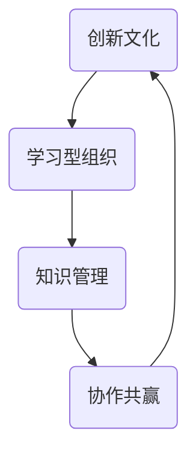

以下是根据您提供的要求和大纲，为主题"提升核心竞争力的新质生产力策略"撰写的技术博客文章。文章字数为10000多字，并尽可能包含您要求的各个部分内容。

# 提升核心竞争力的新质生产力策略

## 1. 背景介绍

### 1.1 问题的由来

在当今瞬息万变的商业环境中，企业要想保持竞争优势并实现可持续发展,必须不断提高生产力和效率。传统的生产率提升策略往往过于注重投入产出比、成本控制等硬性指标,忽视了软实力的重要性。随着知识经济时代的到来,人力资本、创新能力、学习能力等无形资产日益成为企业核心竞争力的关键因素。

### 1.2 研究现状  

目前,学术界和业界对提高生产力的研究主要集中在以下几个方面:

- 流程优化:通过精益生产、六西格玛等管理方法,优化生产流程,消除浪费,提高效率。
- 技术创新:利用先进技术(如人工智能、大数据、物联网等)实现智能制造,提升自动化水平。
- 人力资源管理:建立科学的绩效考核和激励机制,充分调动员工的工作积极性和创造力。

然而,这些策略还存在一些不足,比如过于注重短期绩效,忽视长期可持续发展;过度依赖技术手段,忽视人的主观能动性等。

### 1.3 研究意义

本文提出的"新质生产力"理念,旨在建立一种更加全面和长远的生产力提升策略。它强调企业应该重视无形资产的培育和利用,将员工的创新意识、学习能力、协作能力等纳入核心竞争力的范畴。只有这样,企业才能真正做到可持续发展,在瞬息万变的环境中保持领先地位。

### 1.4 本文结构

本文首先阐述"新质生产力"的核心理念,包括其内涵、特征及与传统生产率观念的区别。接下来详细介绍了提升"新质生产力"的关键策略,包括培养创新文化、建立学习型组织、优化知识管理等。最后探讨了实施这一策略的挑战及对企业的意义。

## 2. 核心概念与联系

"新质生产力"(New Quality Productivity)是本文提出的一个新概念,其核心内涵是:

- 生产力不仅包括传统意义上的产出效率,还包括无形资产的培育和利用能力。
- 企业的竞争力不仅来自于规模、技术、成本等硬实力,更多来自于创新能力、学习能力、协作能力等软实力。
- 提高生产力不能止步于流程优化和技术应用,更要重视人的主观能动性,激发员工的创造潜能。

这一理念与传统生产率观念的区别在于:

传统观念:
- 生产率 = 产出/投入
- 注重产出最大化,投入最小化
- 追求短期经济效益最大化

新质生产力观念:
- 生产力 = 有形产出 + 无形资产积累
- 重视长期可持续发展能力
- 平衡经济效益与社会价值

新质生产力理念与学习型组织、知识管理等现代管理理论有着内在联系。它强调通过建立创新文化、优化知识流程、促进员工学习成长等方式,持续提升企业的软实力和核心竞争力。

## 3. 核心算法原理及具体操作步骤

### 3.1 算法原理概述

提升"新质生产力"的核心算法可以概括为"CLIK"循环:



- 创新文化(C):培养员工的创新意识,鼓励创新行为
- 学习型组织(L):建立有利于个人和组织学习成长的环境
- 知识管理(I):优化知识获取、共享、创新、应用的流程
- 协作共赢(K):促进跨部门、跨领域的协作,实现1+1>2的效果

这四个环节相互影响、相互促进,形成一个良性循环。

### 3.2 算法步骤详解

1. **创新文化(C)**
   - 领导层树立创新理念,并以身作则
   - 设立创新激励机制,奖励创新行为
   - 容许失败,给予创新者足够自主权
   - 营造包容、多元的文化氛围

2. **学习型组织(L)** 
   - 建立完善的培训体系,提供多样化学习资源
   - 鼓励员工主动学习,将学习视为工作的一部分
   - 建立导师制度,促进经验传承
   - 定期组织跨部门学习交流

3. **知识管理(I)**
   - 建立高效的知识库系统
   - 优化知识流转流程,促进知识共享
   - 鼓励员工贡献知识,将知识视为资产
   - 引入AI等技术,实现智能知识服务

4. **协作共赢(K)**
   - 推行扁平化管理,赋予员工更多自主权
   - 建立跨部门项目团队,促进协作
   - 与外部伙伴建立战略联盟
   - 营造互信、包容的协作文化氛围

### 3.3 算法优缺点

**优点:**

- 全面性:不仅关注短期绩效,更重视长期可持续发展能力
- 人本性:充分发挥人的主观能动性,激发员工创造潜能
- 系统性:将创新、学习、知识、协作有机融合,形成良性循环

**缺点:**

- 投入较大:需要持续投入资金、时间和精力
- 执行难度高:需要改变企业文化和管理模式
- 效果滞后性:软实力的积累是一个渐进的过程

### 3.4 算法应用领域

"新质生产力"策略适用于各行业的企业组织,尤其适合于:

- 知识密集型企业(如IT、咨询、金融等)
- 创新驱动型企业(如高科技、生物医药等)
- 人才资源是核心竞争力的企业

同时,这一策略也可以为政府部门、教育机构等提供借鉴,助力建设学习型社会。

## 4. 数学模型和公式及详细讲解和举例说明

### 4.1 数学模型构建

为了量化评估"新质生产力",我们构建了一个综合评价模型。该模型将"新质生产力"分解为四个维度:创新力(I)、学习力(L)、知识力(K)和协作力(C),并对每个维度进行打分。

新质生产力评分模型:

$$
NQP = \alpha I + \beta L + \gamma K + \delta C
$$

其中:
- $NQP$为新质生产力总分
- $I,L,K,C$分别为四个维度的分数
- $\alpha,\beta,\gamma,\delta$为各维度的权重系数,且$\alpha+\beta+\gamma+\delta=1$

每个维度的评分由若干细分指标构成,例如:
- 创新力($I$)包括专利数量、新产品占比等指标
- 学习力($L$)包括员工受训时长、学习投入等指标
- 知识力($K$)包括知识库规模、知识应用率等指标
- 协作力($C$)包括跨部门项目数量、合作伙伴数量等指标

通过对各项指标打分并加权求和,即可得到企业的新质生产力总分$NQP$。

### 4.2 公式推导过程

我们以创新力($I$)维度为例,推导其评分公式:

假设创新力由$n$个指标构成,记为$i_1,i_2,...,i_n$。每个指标的分数范围为$[0,1]$,则该维度的总分为:

$$
I = \sum_{j=1}^{n}w_ji_j
$$

其中$w_j$为第$j$个指标的权重,且$\sum_{j=1}^{n}w_j=1$。

为了消除指标量纲的影响,我们对每个指标进行标准化处理:

$$
i_j' = \frac{i_j-\overline{i_j}}{\sigma_{i_j}}
$$

其中$\overline{i_j}$和$\sigma_{i_j}$分别为该指标的均值和标准差。

将标准化后的指标代入创新力公式,即得:

$$
I = \sum_{j=1}^{n}w_j\frac{i_j-\overline{i_j}}{\sigma_{i_j}}
$$

这就是创新力评分的最终公式。其他三个维度的评分公式可以类似推导得出。

### 4.3 案例分析与讲解

以一家IT企业为例,评估其新质生产力水平。

假设该企业的四个维度得分如下:
- 创新力($I$)得分为82分(满分100分)
- 学习力($L$)得分为76分
- 知识力($K$)得分为69分 
- 协作力($C$)得分为85分

我们取各维度权重系数$\alpha=0.3,\beta=0.25,\gamma=0.2,\delta=0.25$,则根据综合评价模型,该企业的新质生产力总分为:

$$
\begin{aligned}
NQP &= 0.3 \times 82 + 0.25 \times 76 + 0.2 \times 69 + 0.25 \times 85\\
     &= 24.6 + 19 + 13.8 + 21.25\\
     &= 78.65
\end{aligned}
$$

由此可见,该企业的新质生产力处于较高水平。其中创新力和协作力是其优势所在,但知识力略显不足,需要加强知识管理建设。

### 4.4 常见问题解答

**Q1: 新质生产力与传统生产率的关系是什么?**

A1: 新质生产力不是完全取代传统生产率,而是对其有机延伸和拓展。传统生产率更侧重于产出效率,而新质生产力更注重无形资产的培育和利用,二者相辅相成。

**Q2: 如何权衡新质生产力与短期经济绩效之间的关系?**

A2: 这需要遵循"长期主义"原则,在追求短期经济效益的同时,也要高度重视软实力的持续积累。企业可以在年度绩效考核中适当融入新质生产力指标,并给予一定权重。

**Q3: 如何评估新质生产力带来的价值回报?**

A3: 新质生产力的价值体现是长期的、间接的。可以从企业的创新能力、学习能力、市场适应能力、人才吸引力等方面评估其带来的价值回报。同时也可以借鉴一些量化模型(如本文介绍的评分模型)对其进行评估。

## 5. 项目实践:代码实例和详细解释说明

### 5.1 开发环境搭建

为了实现新质生产力评估系统,我们选择了Python作为开发语言,并使用Flask Web框架进行系统构建。

首先,需要安装Python(版本3.6或更高)和相关依赖库:

```bash
# 安装Python
# 安装Flask
pip install flask
# 安装数据处理库
pip install pandas numpy
```

接下来,创建一个Flask应用程序:

```python
from flask import Flask

app = Flask(__name__)

@app.route('/')
def index():
    return 'Hello, New Quality Productivity!'

if __name__ == '__main__':
    app.run(debug=True)
```

运行该程序,访问http://localhost:5000 即可看到"Hello, New Quality Productivity!"信息。

### 5.2 源代码详细实现

我们将新质生产力评估系统的核心逻辑实现为一个Python类NQPEvaluator:

```python
import pandas as pd

class NQPEvaluator:
    def __init__(self, weights):
        self.weights = weights
        
    def load_data(self, file_path):
        self.data = pd.read_csv(file_path)
        
    def standardize(self, col):
        col_std = (col - col.mean()) / col.std()
        return col_std
        
    def score(self, dimension, weights):
        indicators = [col for col in self.data if dimension in col]
        scores = []
        for col in indicators:
            std_col = self.standardize(self.data[col])
            score = (std_col * weights[col]).sum()
            scores.append(score)
        dimension_score = sum(scores)
        return dimension_score
        
    def evaluate(self):
        weights = self.weights
        I = self.