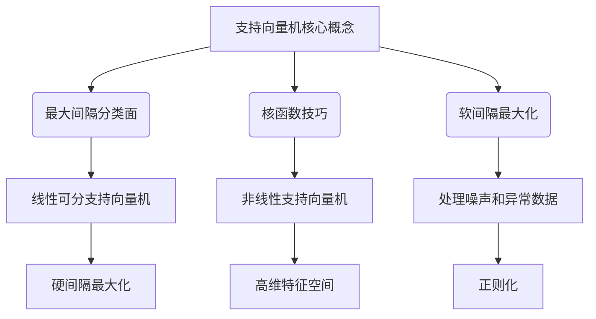

好的,我会按照您的要求,撰写一篇关于"支持向量机(SVM)原理与代码实例讲解"的技术博客文章。文章将遵循您提供的约束条件和结构模板,确保内容逻辑清晰、结构紧凑、专业深入,并包含核心概念原理、数学模型推导、代码实例讲解等部分。请稍等,我需要一些时间进行充分的研究和撰写。

# 支持向量机 (Support Vector Machines, SVM) 原理与代码实例讲解

## 1. 背景介绍

### 1.1 问题的由来

在机器学习和数据挖掘领域,分类问题是最常见和最基本的任务之一。分类的目标是根据输入数据的特征,将其划分到有限的几个类别中。常见的分类算法有逻辑回归、决策树、朴素贝叶斯、K近邻等。而支持向量机(Support Vector Machines, SVM)作为一种有监督的机器学习算法,在解决分类和回归问题方面表现出色,被公认为最好的监督式学习模型之一。

### 1.2 研究现状  

支持向量机最早由Vladimir Vapnik及其同事于1995年提出,是在统计学习理论的基础上发展起来的一种机器学习方法。最初的SVM主要用于线性可分数据的分类,后来通过核技巧(Kernel Trick)等方法拓展到非线性分类问题。SVM模型具有整体可行解、泛化能力强等优点,在小样本、高维、非线性等问题上表现良好,被广泛应用于模式识别、计算机视觉、生物信息学等领域。

### 1.3 研究意义

理解SVM原理对于掌握机器学习理论和算法至关重要。SVM模型建立在坚实的理论基础之上,其核心思想是通过构造最大间隔超平面将数据分开,从而达到结构风险最小化。SVM还引入了核函数等技巧,使其能够有效处理高维、非线性等复杂数据。掌握SVM不仅能提高分类和回归任务的性能,更能加深对监督学习的理解。

### 1.4 本文结构  

本文将全面介绍SVM的基本原理、数学模型推导、算法实现细节以及实际应用。内容安排如下:

1. 背景介绍部分阐述了SVM问题的由来、研究现状和意义。
2. 核心概念部分将介绍SVM的基本思想、模型构建、学习策略等关键概念。
3. 算法原理部分将详细推导SVM的数学模型,并解释算法的具体步骤。
4. 数学模型部分将深入讲解SVM的对偶形式、核函数、软间隔最大化等理论细节。
5. 代码实例部分将基于Python的scikit-learn库,提供SVM分类器的代码实现和案例分析。  
6. 应用场景部分将列举SVM在文本分类、图像识别等领域的实际应用案例。
7. 工具与资源部分将推荐相关的学习资料、开发工具和论文。
8. 总结部分将对SVM的发展历程、未来趋势和挑战进行展望。

## 2. 核心概念与联系

支持向量机(SVM)的核心思想是基于结构风险最小化原理,通过构造最大间隔超平面将数据分开,从而获得具有很好泛化能力的分类模型。SVM的关键概念包括:

1. **最大间隔分类面**: SVM试图找到一个能够正确划分两类数据的超平面,并使得该超平面与最近数据点之间的距离(即间隔)最大化。这种最大化间隔的策略可以提高分类器的稳健性和泛化能力。

2. **核函数技巧**: 对于非线性可分数据,SVM通过核函数技巧将数据从原始特征空间映射到更高维的特征空间,使得在高维空间中数据线性可分。常用的核函数包括线性核、多项式核、高斯核等。

3. **软间隔最大化**: 在实际数据中可能存在噪声或异常点,导致数据不完全线性可分。软间隔最大化允许有少量数据点位于间隔边界内,通过引入松弛变量和正则化参数,在最大化间隔和容忍少量误分类之间寻求平衡。

上述三个核心概念相互关联,共同构建了SVM的理论基础和算法框架。线性可分支持向量机通过硬间隔最大化实现,而非线性支持向量机则借助核函数技巧映射到高维特征空间。软间隔最大化则允许SVM处理噪声和异常数据,提高模型的鲁棒性,同时通过正则化避免过拟合。

## 3. 核心算法原理 & 具体操作步骤

### 3.1 算法原理概述

支持向量机的核心原理是基于结构风险最小化,构造一个最优分类超平面,将不同类别的数据点分开,并使得该超平面与最近数据点之间的距离(即间隔)最大化。具体来说:

1. 对于线性可分数据,SVM试图找到一个能够正确划分两类数据的超平面,并使得该超平面与最近数据点之间的距离(即间隔)最大化。这种最大化间隔的策略可以提高分类器的稳健性和泛化能力。

2. 对于非线性可分数据,SVM通过核函数技巧将数据从原始特征空间映射到更高维的特征空间,使得在高维空间中数据线性可分,然后再在高维空间中寻找最大间隔超平面。

3. 为了处理噪声和异常数据,SVM引入了软间隔最大化的概念,允许有少量数据点位于间隔边界内,通过引入松弛变量和正则化参数,在最大化间隔和容忍少量误分类之间寻求平衡。

4. SVM的求解过程可以通过构造拉格朗日函数转化为对偶形式,从而将原始的非凸二次规划问题转化为求解对偶问题的二次规划问题,大大降低了计算复杂度。

5. 在对偶问题的求解过程中,只有部分数据点对应的拉格朗日乘子非零,这些数据点被称为支持向量,它们决定了最终的分类超平面。

总的来说,SVM通过寻找最优分类超平面、利用核函数技巧、软间隔最大化等策略,实现了对线性和非线性数据的有效分类,并具有很好的泛化能力。

### 3.2 算法步骤详解

支持向量机算法的具体步骤如下:

1. **数据预处理**: 对输入数据进行标准化或归一化处理,使特征处于相同的数量级,避免某些特征对结果产生过大影响。

2. **选择核函数和参数**: 根据数据的特征,选择合适的核函数(如线性核、多项式核、高斯核等)及其相关参数(如高斯核的带宽参数)。

3. **构造并求解对偶问题**: 将原始的最大化间隔问题转化为对偶形式的二次规划问题,利用序列最小优化算法(SMO)等方法高效求解。

4. **确定支持向量**: 在对偶问题的解中,只有部分数据点对应的拉格朗日乘子非零,这些数据点即为支持向量。

5. **计算分类超平面系数**: 利用支持向量及其对应的拉格朗日乘子,计算出分类超平面的法向量 $\mathbf{w}$ 和位移项 $b$,从而确定最终的分类决策函数 $f(\mathbf{x}) = \text{sign}(\mathbf{w}^T\mathbf{x} + b)$。

6. **模型评估**: 在测试集上评估分类器的性能,计算准确率、精确率、召回率、F1分数等指标。

7. **模型调优(可选)**: 如果模型性能不理想,可以通过调整核函数参数、正则化参数、交叉验证等方式优化模型。

需要注意的是,在算法的实际实现中,还需要考虑一些细节问题,如处理异常值、缓存核函数值以提高计算效率等。此外,对于非线性和高维数据,核函数的选择和参数设置对模型性能影响很大,需要结合具体问题进行调优。

### 3.3 算法优缺点

**优点**:

1. **泛化能力强**: SVM基于结构风险最小化原理,通过构造最大间隔超平面,可以获得很好的泛化能力,避免过拟合。

2. **可解释性好**: SVM模型依赖于支持向量,这些支持向量直观地反映了分类边界,有助于理解模型。

3. **有效处理高维数据**: 通过核函数技巧,SVM能够有效处理高维甚至无限维的特征空间,克服"维数灾难"问题。

4. **可处理非线性问题**: 利用核函数,SVM可以很好地拟合非线性决策边界。

5. **唯一解**: 对于线性可分数据,SVM的解是唯一的全局最优解。

**缺点**:

1. **计算开销大**: 当训练样本量很大时,SVM的训练过程计算量较大,速度较慢。

2. **对缺失数据敏感**: SVM无法直接处理缺失数据,需要先对缺失值进行估计或者删除。

3. **对outlier敏感**: SVM对异常点较为敏感,需要引入软间隔等方法来提高鲁棒性。

4. **核函数选择困难**: 对于给定的数据,选择合适的核函数是一个挑战,需要一定的经验和尝试。

5. **不直接给出概率输出**: SVM的原始输出是函数间隔值,需要进行后处理才能获得概率估计值。

总的来说,SVM在分类性能和泛化能力方面表现卓越,但在计算效率、参数选择和异常数据处理等方面仍有一些不足,需要根据具体问题加以权衡。

### 3.4 算法应用领域

支持向量机在许多领域得到了广泛应用,主要包括:

1. **文本分类**: 将文本文档划分到预定义的类别,如新闻分类、垃圾邮件过滤、情感分析等。

2. **图像识别**: 将图像数据分类到不同的类别,如人脸识别、手写字符识别、图像分类等。

3. **生物信息学**: 用于基因表达数据分析、蛋白质结构预测、疾病诊断等。

4. **信号处理**: 应用于语音识别、故障诊断、模式检测等领域。

5. **金融风险管理**: 用于信用评分、欺诈检测、风险建模等。

6. **工业自动化**: 应用于故障检测、产品缺陷检测、工艺优化等。

7. **网络安全**: 用于入侵检测、垃圾邮件过滤、恶意软件检测等。

8. **推荐系统**: 将用户或商品划分到不同的类别,为用户推荐感兴趣的内容。

总的来说,SVM因其优秀的泛化能力、鲁棒性和可解释性,在涉及分类和回归任务的各个领域都有广泛应用。随着数据量和维度的不断增加,SVM在处理高维、非线性数据方面的优势也将得到进一步体现。

## 4. 数学模型和公式 & 详细讲解 & 举例说明

### 4.1 数学模型构建

支持向量机的数学模型建立在函数间隔的基础之上。对于给定的训练数据集 $\mathcal{D} = \{(\mathbf{x}_1, y_1), (\mathbf{x}_2, y_2), \ldots, (\mathbf{x}_n, y_n)\}$,其中 $\mathbf{x}_i \in \mathbb{R}^d$ 是 $d$ 维特征向量, $y_i \in \{-1, +1\}$ 是类别标记,我们希