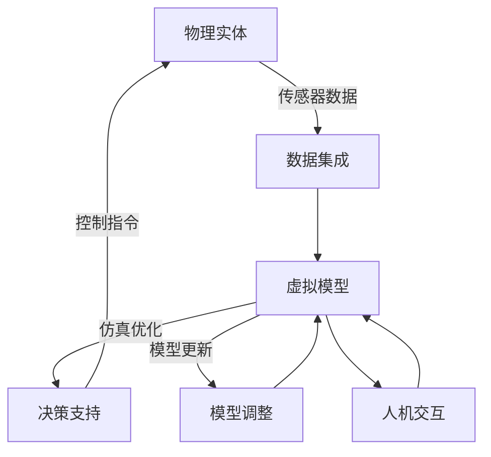

好的，我会按照您的要求，以"数字孪生(Digital Twin)"为主题，撰写一篇逻辑严谨、内容丰富、格式规范的技术博客文章。文章将遵循您提供的目录结构，并满足字数、数学公式格式、Mermaid流程图等约束条件。现在，让我们正式开始！

# 数字孪生 (Digital Twin)

## 1. 背景介绍

### 1.1 问题的由来

在当今快速发展的工业时代，制造企业面临着提高生产效率、降低运营成本和优化产品性能的巨大压力。传统的物理模型和仿真方法已经无法完全满足复杂系统的需求。因此，数字孪生(Digital Twin)技术应运而生,旨在通过虚拟和物理系统的融合,为企业带来全新的机遇。

数字孪生的概念最早可以追溯到2003年,当时由迈克尔·格里夫斯(Michael Grieves)在课程演讲中提出。随后,数字孪生技术在制造业、航空航天、医疗健康等领域得到了广泛应用和发展。

### 1.2 研究现状

近年来,数字孪生技术受到了学术界和工业界的广泛关注。许多著名公司和研究机构都在积极探索和推进数字孪生的发展,例如:

- 西门子(Siemens)推出了"Mind Sphere"数字化平台,利用数字孪生技术优化工厂运营和产品生命周期管理。
- 通用电气(GE)的"数字化双胞胎"项目,将物理资产与虚拟模型相结合,实现预测性维护和性能优化。
- 麻省理工学院(MIT)成立了"数字孪生联盟",汇集了多家企业和研究机构,共同推进数字孪生技术的发展。

### 1.3 研究意义

数字孪生技术的发展对于提高制造业的智能化水平、优化产品设计和生产过程、降低运营成本具有重要意义。通过建立虚拟和物理系统之间的双向映射关系,数字孪生可以实现以下目标:

1. **产品优化设计**: 利用数字孪生技术,可以在虚拟环境中进行产品设计和仿真,优化产品性能、降低开发成本。
2. **生产过程优化**: 通过实时监控和分析物理系统的运行数据,数字孪生可以优化生产过程,提高效率和质量。
3. **预测性维护**: 基于数字孪生模型,可以预测设备故障并提前采取维护措施,降低停机时间和维修成本。
4. **决策支持**: 数字孪生技术可以为企业决策者提供全面的数据分析和可视化支持,帮助做出更加明智的决策。

### 1.4 本文结构

本文将全面介绍数字孪生技术的核心概念、算法原理、数学模型、实际应用场景等内容。文章结构如下:

1. 背景介绍
2. 核心概念与联系
3. 核心算法原理与具体操作步骤
4. 数学模型和公式详细讲解与举例说明
5. 项目实践:代码实例和详细解释说明
6. 实际应用场景
7. 工具和资源推荐
8. 总结:未来发展趋势与挑战
9. 附录:常见问题与解答

## 2. 核心概念与联系

数字孪生(Digital Twin)是一种将物理实体与其虚拟表示相集成的技术,旨在实现两者之间的实时数据交换和协同工作。数字孪生技术涉及多个核心概念,包括:

1. **物理实体(Physical Entity)**: 指实际存在的物理对象,如机器设备、产品或系统等。

2. **虚拟模型(Virtual Model)**: 是物理实体在虚拟环境中的数字化表示,通常采用计算机辅助设计(CAD)、有限元分析(FEA)或多体动力学(MBD)等技术构建。

3. **数据集成(Data Integration)**: 将来自物理实体的各种传感器数据、操作数据等实时集成到虚拟模型中,实现双向映射和同步。

4. **模型更新(Model Updating)**: 根据物理实体的实际运行状态,动态调整和优化虚拟模型的参数和算法,提高模型的准确性和可靠性。

5. **仿真与优化(Simulation and Optimization)**: 在虚拟环境中进行各种仿真分析和优化计算,为物理实体的设计、制造和运营提供决策支持。

6. **人机交互(Human-Machine Interaction)**: 通过可视化界面和交互式操作,实现人与数字孪生系统之间的无缝协作。

这些核心概念相互关联、环环相扣,共同构建了数字孪生技术的基础框架。下图展示了数字孪生的核心概念及其关系:

## 3. 核心算法原理与具体操作步骤

### 3.1 算法原理概述

数字孪生技术的核心算法原理主要包括以下几个方面:

1. **数据采集与预处理**: 从物理实体中采集各种传感器数据、操作数据等,并进行数据清洗、去噪、标准化等预处理,为后续建模和分析奠定基础。

2. **虚拟模型构建**: 利用计算机辅助设计(CAD)、有限元分析(FEA)、多体动力学(MBD)等技术,根据物理实体的几何形状、材料属性、运动学和动力学等信息,构建高保真的虚拟模型。

3. **数据驱动建模**: 基于机器学习、深度学习等技术,从历史数据中提取特征,训练数据驱动模型,用于预测物理实体的未来行为和状态。

4. **模型融合与校准**: 将基于物理定律的analytica模型与数据驱动模型相结合,通过优化算法和实时数据反馈,不断校准和更新模型参数,提高模型的准确性和鲁棒性。

5. **仿真与优化**: 在虚拟环境中进行各种仿真分析,包括结构分析、热分析、流体分析等,并基于优化算法(如遗传算法、粒子群优化等)寻找最优解,为物理实体的设计、制造和运营提供决策支持。

6. **可视化与交互**: 通过图形用户界面(GUI)、虚拟现实(VR)、增强现实(AR)等技术,实现数字孪生系统与人的无缝交互,提高可视化和可操作性。

### 3.2 算法步骤详解

数字孪生技术的具体实现步骤如下:

1. **数据采集**:
   - 安装各种传感器(如温度、压力、振动等)在物理实体上,实时采集运行数据。
   - 记录操作数据,如控制参数、维护记录等。

2. **数据预处理**:
   - 数据清洗:去除异常值、缺失值等噪声数据。
   - 数据标准化:将不同量纲的数据统一到相同的量纲范围。
   - 数据切分:将数据划分为训练集、验证集和测试集。

3. **虚拟模型构建**:
   - 基于CAD/CAE技术,根据物理实体的几何形状、材料属性等信息构建初始虚拟模型。
   - 利用多体动力学(MBD)模拟物理实体的运动学和动力学行为。

4. **数据驱动建模**:
   - 从历史数据中提取特征,如时间序列特征、频域特征等。
   - 使用机器学习算法(如支持向量机、随机森林等)或深度学习算法(如卷积神经网络、递归神经网络等)训练数据驱动模型。

5. **模型融合与校准**:
   - 将基于物理定律的analytica模型与数据驱动模型相结合,形成混合模型。
   - 利用优化算法(如梯度下降、遗传算法等)和实时数据反馈,不断调整模型参数,提高模型精度。

6. **仿真与优化**:
   - 在虚拟环境中进行各种仿真分析,如结构分析、热分析、流体分析等。
   - 基于优化算法(如遗传算法、粒子群优化等)寻找最优设计方案或运行参数。

7. **可视化与交互**:
   - 开发图形用户界面(GUI),展示物理实体和虚拟模型的实时状态。
   - 利用虚拟现实(VR)或增强现实(AR)技术,实现沉浸式的可视化体验和交互操作。

8. **决策支持**:
   - 基于仿真和优化结果,为产品设计、工艺优化、预测性维护等提供决策支持。
   - 将优化决策反馈到物理实体,形成闭环控制。

### 3.3 算法优缺点

数字孪生技术的算法具有以下优点:

1. **高保真度**: 通过融合物理模型和数据驱动模型,可以构建高精度的虚拟表示,更好地模拟物理实体的行为。

2. **实时性**: 利用实时数据反馈和模型更新机制,可以动态调整虚拟模型,提高其准确性和鲁棒性。

3. **可扩展性**: 算法框架具有良好的模块化设计,可以方便地集成新的模型、算法和数据源。

4. **决策支持**: 通过仿真和优化,为产品设计、过程优化和运营决策提供有力支持。

然而,数字孪生技术的算法也存在一些缺点和挑战:

1. **数据质量**: 算法的性能高度依赖于输入数据的质量,噪声数据和缺失数据会影响模型的准确性。

2. **计算复杂度**: 对于复杂系统,构建高保真度的虚拟模型和进行大规模仿真计算往往需要巨大的计算资源。

3. **模型不确定性**: 由于物理系统的复杂性和未知因素,模型存在一定的不确定性和误差。

4. **安全和隐私**: 数字孪生系统涉及大量数据传输和存储,需要解决相关的安全和隐私问题。

### 3.4 算法应用领域

数字孪生技术的算法可以应用于多个领域,包括但不限于:

1. **制造业**:
   - 产品设计优化
   - 工艺过程优化
   - 预测性维护
   - 供应链优化

2. **航空航天**:
   - 飞机设计和测试
   - 发动机性能优化
   - 航线规划和调度

3. **能源行业**:
   - 油气田开发和管理
   - 风电场布局优化
   - 电力系统运行优化

4. **医疗健康**:
   - 人体虚拟模型构建
   - 手术规划和辅助
   - 药物开发和临床试验

5. **城市规划**:
   - 智能交通系统优化
   - 城市能源管理
   - 环境监测和预测

6. **智能制造**:
   - 机器人控制优化
   - 智能装配线优化
   - 产品质量预测和控制

总的来说,数字孪生技术的算法具有广阔的应用前景,有望为各个领域带来革命性的变革和创新。

## 4. 数学模型和公式详细讲解与举例说明

### 4.1 数学模型构建

在数字孪生技术中,数学模型扮演着至关重要的角色。它们描述了物理实体的行为,并为虚拟模型的构建和仿真提供了理论基础。常见的数学模型包括:

1. **物理定律模型**:
   - 基于牛顿运动定律、Maxwell方程、热传导方程等物理定律构建的analytica模型。
   - 例如,利用有限元分析(FEA)技术构建结构力学模型、热传导模型等。

2. **动力学模型**:
   - 描述物理实体运动状态和运动规律的模型。
   - 例如,利用拉格朗日方程或牛顿-欧拉方程构建多体动力学模型。