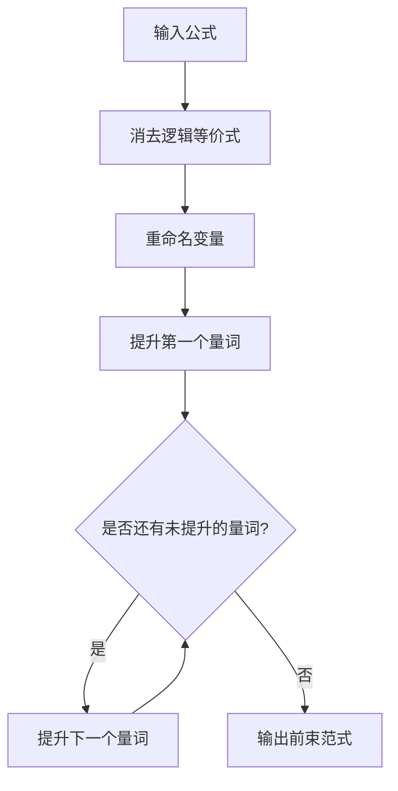
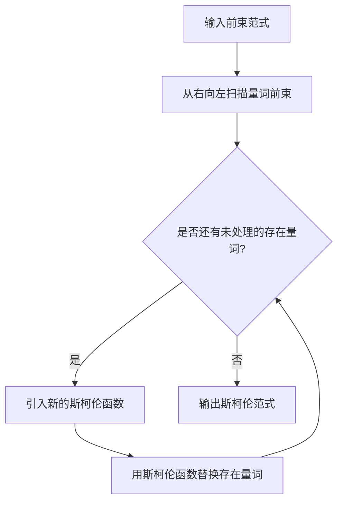

# 数理逻辑：前束范式和斯柯伦范式

## 1. 背景介绍

### 1.1 问题的由来

在数理逻辑和计算机科学领域中,将命题逻辑公式化为一种标准形式是一个重要的问题。这种标准形式不仅有助于简化逻辑表达式,而且对于推理和自动定理证明等应用也具有重要意义。前束范式(Prenex Normal Form)和斯柯伦范式(Skolem Normal Form)就是这样两种标准形式。

### 1.2 研究现状

前束范式和斯柯伦范式的研究可以追溯到20世纪初,当时数理逻辑学家们致力于将命题逻辑和谓词逻辑形式化。前束范式由罗素(Bertrand Russell)和怀特海德(Alfred North Whitehead)在他们的著作《数理原理》(Principia Mathematica)中首次提出,而斯柯伦范式则是由挪威逻辑学家斯柯伦(Thoralf Skolem)在1920年提出的。

近年来,随着计算机科学的发展,前束范式和斯柯伦范式在自动定理证明、知识表示和推理等领域得到了广泛应用。许多研究人员致力于优化这些范式的算法,以提高计算效率和应用范围。

### 1.3 研究意义

将逻辑公式化为标准范式具有以下重要意义:

1. **简化逻辑表达式**: 标准范式可以将复杂的逻辑表达式转化为更简单、更规范的形式,从而方便进行后续的处理和分析。

2. **推理和自动定理证明**: 标准范式在自动定理证明系统中扮演着关键角色,它们可以帮助系统更高效地进行推理和证明。

3. **知识表示和推理**: 在人工智能领域,标准范式可用于表示和推理知识库中的逻辑信息。

4. **计算复杂性分析**: 将逻辑公式转换为标准范式有助于分析和比较不同逻辑表达式的计算复杂性。

### 1.4 本文结构

本文将详细介绍前束范式和斯柯伦范式的概念、原理和应用。首先,我们将探讨这两种范式的核心概念及它们之间的联系。然后,我们将深入分析它们的算法原理和具体操作步骤。接下来,我们将介绍与这些范式相关的数学模型和公式,并通过案例分析和常见问题解答来加深理解。此外,我们还将提供一个实际项目的代码实例,并对其进行详细解释和分析。最后,我们将讨论这些范式在实际应用场景中的作用,并探讨未来的发展趋势和挑战。

## 2. 核心概念与联系

前束范式(Prenex Normal Form)和斯柯伦范式(Skolem Normal Form)是两种标准化的逻辑公式形式,它们在谓词逻辑中扮演着重要角色。

**前束范式**是一种将所有量词移至公式前端的形式。在前束范式中,公式被分为两部分:量词前束和矩阵。量词前束是指所有的量词(全称量词∀和存在量词∃)按照一定顺序排列在公式的最前面,而矩阵是指不含任何量词的公式部分。

例如,下面的公式就是一个前束范式:

$$\forall x \exists y (P(x,y) \vee \neg Q(x))$$

其中,`∀x ∃y`是量词前束,而`(P(x,y) ∨ ¬Q(x))`是矩阵部分。

**斯柯伦范式**则是在前束范式的基础上进一步标准化的形式。在斯柯伦范式中,存在量词都被消去,取而代之的是一个新的函数符号,称为斯柯伦函数(Skolem function)。这些函数符号取决于公式中的全称量词,并用于替换原来的存在量词。

例如,上面的前束范式公式可以转换为以下斯柯伦范式:

$$\forall x (P(x,f(x)) \vee \neg Q(x))$$

其中,`f(x)`是一个斯柯伦函数,用于替换原来的存在量词`∃y`。

前束范式和斯柯伦范式之间存在着密切的联系。事实上,任何一个前束范式都可以通过消去存在量词的方式转换为对应的斯柯伦范式。这种转换过程被称为"斯柯伦化"(Skolemization)。

斯柯伦范式的引入使得逻辑公式更加规范化,从而有利于后续的处理和分析。例如,在自动定理证明系统中,斯柯伦范式可以简化推理过程,提高计算效率。

## 3. 核心算法原理 & 具体操作步骤

### 3.1 算法原理概述

将逻辑公式转换为前束范式和斯柯伦范式的算法原理可以概括为以下几个步骤:

1. **消去逻辑等价式**: 首先,需要将公式中的逻辑等价式(如`p ⇔ q`等)消去,转换为只包含基本逻辑连接词(如`∧`、`∨`、`¬`等)的形式。

2. **重命名变量**: 为了避免变量名称冲突,需要对公式中的变量进行重命名,确保每个变量名称在整个公式中是唯一的。

3. **前束化**: 将所有的量词移至公式的最前面,形成量词前束和矩阵两部分,从而得到前束范式。

4. **斯柯伦化**: 在前束范式的基础上,消去存在量词,并引入斯柯伦函数来替代它们,从而得到斯柯伦范式。

这些步骤中,前束化和斯柯伦化是最关键的两个步骤,它们的具体操作步骤将在下一小节详细介绍。

### 3.2 算法步骤详解

#### 3.2.1 前束化算法

将逻辑公式转换为前束范式的算法步骤如下:

1. 对于每个量词,将其提升到公式的最外层,使所有量词都位于公式的最前面。

2. 在提升量词的过程中,需要注意量词的作用域。如果一个量词的作用域跨越了其他量词,则需要使用重命名技术来避免变量名称冲突。

3. 重复上述步骤,直到所有量词都被提升到公式的最前面,形成量词前束。

4. 将不含量词的公式部分作为矩阵。

下面是一个具体的前束化算法示例:

#### 3.2.2 斯柯伦化算法

在得到前束范式后,将其转换为斯柯伦范式的算法步骤如下:

1. 从右向左扫描公式的量词前束,对于每个存在量词`∃x`,执行以下操作:
   a. 引入一个新的斯柯伦函数`f`,其参数是该存在量词`∃x`所有的外层全称量词的变量。
   b. 用`f`的函数调用`f(y1, y2, ..., yn)`替换`∃x`。

2. 重复上述步骤,直到所有存在量词都被消去,得到只包含全称量词和斯柯伦函数的公式,即斯柯伦范式。

下面是一个具体的斯柯伦化算法示例:

### 3.3 算法优缺点

前束化和斯柯伦化算法的优点包括:

1. **规范化**: 这些算法可以将任意逻辑公式转换为标准的前束范式或斯柯伦范式,从而简化后续的处理和分析。

2. **自动化**: 这些算法可以自动执行转换过程,无需人工干预,提高了效率和可靠性。

3. **广泛应用**: 前束范式和斯柯伦范式在自动定理证明、知识表示和推理等领域都有广泛应用。

然而,这些算法也存在一些缺点:

1. **指数级复杂度**: 在最坏情况下,前束化和斯柯伦化算法的时间复杂度可能达到指数级,这对于大型公式来说可能会导致计算效率低下。

2. **公式膨胀**: 转换过程中,公式的长度可能会显著增加,导致占用更多的存储空间和计算资源。

3. **可读性降低**: 转换后的前束范式和斯柯伦范式可读性较差,难以直观地理解公式的含义。

因此,在实际应用中,需要权衡算法的效率和公式的可读性,并根据具体情况选择合适的范式和优化策略。

### 3.4 算法应用领域

前束范式和斯柯伦范式的算法在以下领域有着广泛的应用:

1. **自动定理证明系统**: 这些范式在自动定理证明系统中扮演着关键角色,可以简化推理过程,提高证明效率。

2. **知识表示和推理**: 在人工智能领域,前束范式和斯柯伦范式可用于表示和推理知识库中的逻辑信息。

3. **程序验证**: 这些范式在程序验证和形式化方法中也有应用,可用于表示和分析程序的逻辑特性。

4. **数据库查询优化**: 在数据库系统中,前束范式和斯柯伦范式可用于优化查询语句,提高查询效率。

5. **符号计算**: 这些范式在符号计算和计算机代数系统中也有应用,可用于简化和操作符号表达式。

6. **逻辑编程语言**: 一些基于逻辑的编程语言,如Prolog,也使用了前束范式和斯柯伦范式的概念。

总的来说,前束范式和斯柯伦范式的算法为处理和分析逻辑公式提供了有力的工具,在多个领域发挥着重要作用。

## 4. 数学模型和公式 & 详细讲解 & 举例说明

### 4.1 数学模型构建

为了更好地理解前束范式和斯柯伦范式,我们可以构建一个数学模型来形式化描述它们。

首先,我们定义一个命题逻辑语言$\mathcal{L}$,它包含以下符号:

- 一个可数无穷的命题符号集合$\mathcal{P} = \{p_1, p_2, p_3, \ldots\}$
- 逻辑连接词$\neg$（否定）、$\wedge$（合取）、$\vee$（析取）、$\rightarrow$（条件）、$\leftrightarrow$（双条件）
- 全称量词符号$\forall$
- 存在量词符号$\exists$
- 一个可数无穷的变量集合$\mathcal{V} = \{x_1, x_2, x_3, \ldots\}$
- 辅助符号,如左右括号`()`

基于这个语言$\mathcal{L}$,我们可以递归地定义命题逻辑公式$\varphi$的集合$\mathcal{F}$:

1. 如果$p \in \mathcal{P}$,则$p \in \mathcal{F}$
2. 如果$\varphi \in \mathcal{F}$,则$\neg \varphi \in \mathcal{F}$
3. 如果$\varphi, \psi \in \mathcal{F}$,则$(\varphi \wedge \psi), (\varphi \vee \psi), (\varphi \rightarrow \psi), (\varphi \leftrightarrow \psi) \in \mathcal{F}$
4. 如果$\varphi \in \mathcal{F}$且$x \in \mathcal{V}$,则$\forall x \varphi, \exists x \varphi \in \mathcal{F}$

在这个模型中,我们可以定义前束范式和