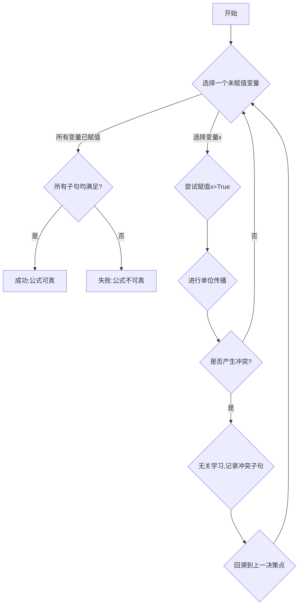

# 数理逻辑：恒真性和可真性

## 1. 背景介绍

### 1.1 问题的由来

在数理逻辑和计算机科学领域中,恒真性(tautology)和可真性(satisfiability)是两个重要的概念。它们源于对逻辑公式真值的探讨,并在许多应用场景中扮演着关键角色。

逻辑公式的真值取决于其中命题变量的赋值情况。一个恒真公式指的是不论如何赋值,该公式始终为真值"真"。而可真公式则指存在某些赋值情况使得该公式为"真"。

确定一个给定的逻辑公式是否恒真或可真,对于验证硬件和软件系统的正确性、自动推理、约束求解等领域都有重要意义。然而,随着公式规模和复杂度的增加,判定恒真性和可真性的计算复杂度也会急剧上升,这使得高效解决此类问题成为一大挑战。

### 1.2 研究现状  

对于恒真性和可真性问题的研究可以追溯到20世纪60年代。当时,科学家们提出了诸如Davis-Putnam算法、DPLL算法等经典算法,为解决这一问题奠定了基础。

近年来,با算法(SAT Solvers)取得了长足进步,使得越来越大规模的可满足性问题可以在有限时间内得到解决。現代SAT Solvers通常采用在DPLL算法基础上的启发式改进算法,并融合了诸如无关学习、相位选择、核心辅助等多种优化策略。

与此同时,判定恒真性问题也有了新的突破。基于BDD(二进制决策图)、ITP(内部真值传播)、AIG(And-Inverter图)等数据结构和算法,现代工具可以高效处理大规模的组合逻辑电路验证问题。

### 1.3 研究意义

能够高效解决恒真性和可真性问题,对于计算机科学和数学逻辑领域都有着深远的影响:

- 硬件设计验证:现代芯片设计中,需要验证逻辑电路在所有可能输入情况下的正确性,这就需要判断电路对应的逻辑公式是否恒真。
- 软件正确性验证:软件的规格说明通常用逻辑公式表示,验证软件实现是否满足规格即是判断公式的可满足性问题。
- 自动推理:在人工智能自动推理系统中,恒真性和可真性判定是核心任务之一。
- 组合优化:许多组合优化问题(如规划、调度等)都可以转化为求解可满足性问题的实例。
- 数学探索:恒真性和可真性问题的研究也推动了相关数学理论的发展,如自动定理证明、模型检测等。

因此,研究高效的恒真性和可真性判定算法和求解技术,对于提升计算机系统的质量和智能水平至关重要。

### 1.4 本文结构

本文将全面介绍恒真性和可真性问题的核心概念、算法原理、数学模型以及实际应用。

首先阐述两个概念的内涵及相互联系,并介绍相关的基本理论知识。接下来重点讲解经典算法DPLL及其改进算法的工作原理和具体步骤。然后构建并推导相关的数学模型,并结合实例进行详细说明。

在此基础上,我们将展示在实际项目中的代码实现细节,并分析运行结果。之后探讨恒真性和可真性问题在不同领域的应用场景,并总结未来的发展趋势和面临的挑战。最后,我们还将推荐相关的学习资源、开发工具和论文,以供读者进一步研究。

## 2. 核心概念与联系

恒真性(Tautology)和可真性(Satisfiability)是数理逻辑和计算机科学中两个密切相关的核心概念。它们都源于对逻辑公式真值的探讨,但关注的角度和应用场景有所不同。

**恒真性(Tautology)**

一个逻辑公式被称为恒真的,是指不论如何赋值其中的命题变量,该公式始终为真值"真"。形式上,如果一个逻辑公式 $\varphi$ 在所有可能的赋值情况下都为真,即:

$$
\forall \omega \in \Omega, \omega \models \varphi
$$

其中 $\Omega$ 表示所有可能的赋值情况的集合,那么我们就说公式 $\varphi$ 是一个恒真公式(Tautology)。

**可真性(Satisfiability)**

与恒真性相对应,一个逻辑公式被称为可真的,是指存在某些赋值情况使得该公式为真值"真"。形式上,如果存在一个赋值 $\omega^*$,使得:

$$
\omega^* \models \varphi  
$$

那么我们就说公式 $\varphi$ 是一个可真公式(Satisfiable formula)。

可以看出,恒真性要求在所有情况下都为真,而可真性只需要在至少一种情况下为真。一个逻辑公式要么是恒真的,要么是可真的,要么是全都为假(矛盾公式)。因此,恒真性和可真性问题实际上是一个问题的两个方面。

判定一个给定的逻辑公式是否恒真或可真,对于验证硬件和软件系统的正确性、自动推理、约束求解等领域都有重要应用。然而,随着公式规模和复杂度的增加,判定的计算复杂度也会急剧上升,这使得高效解决此类问题成为一大挑战。

接下来,我们将详细介绍判定恒真性和可真性的经典算法及其改进版本。

## 3. 核心算法原理 & 具体操作步骤

### 3.1 算法原理概述

判定一个逻辑公式的恒真性和可真性问题,本质上都可以转化为求解一个约束满足性问题(Constraint Satisfaction Problem,CSP)。CSP是一类重要的组合优化问题,广泛应用于人工智能、操作研究等领域。

对于一个给定的逻辑公式 $\varphi$,我们可以将其视为对命题变量的一系列约束条件。那么判定 $\varphi$ 的恒真性,就等价于检查是否存在一种变量赋值,使得所有约束条件都被满足。而判定 $\varphi$ 的可真性,则是检查是否存在一种赋值使得至少有一个约束条件被满足。

最著名和最广泛使用的CSP求解算法就是DPLL算法及其改进版本。DPLL算法基于系统的反证法(Proof by Refutation),通过不断地搜索和剪枝,试图找到一种满足所有约束的赋值,或者证明这样的赋值不存在。

算法的核心思想是:

1. 选择一个未赋值的变量,尝试用真值"真"和"假"去赋值。
2. 利用单位传播规则,根据当前的部分赋值推导出其他变量的值。
3. 如果遇到冲突,就回溯到上一个决策点,并记录下导致冲突的原因(学习子句)。
4. 重复上述步骤,直到找到一个解或证明无解。

DPLL算法使用了一种高效的回溯搜索框架,并通过无关学习、相位选择等策略进行了优化,使其能够在合理的时间内解决大规模的CSP实例。我们将在下一节详细介绍算法的具体步骤。

### 3.2 算法步骤详解

DPLL算法的核心步骤如下:

1. **选择未赋值变量(Choose)**: 从当前的部分赋值出发,选择一个未赋值的变量作为决策变量。变量选择策略对算法性能影响很大,通常采用动态最大规则(DLIS)或其变种。

2. **尝试赋值(Assign)**: 将选定的变量赋予一个真值(通常先尝试"真"),并将其加入当前的部分赋值集合中。

3. **单位传播(Propagate)**: 根据当前的部分赋值,利用单位传播规则推导出其他变量的值。单位传播是一种简单但高效的逻辑约简方法。

4. **检测冲突(Conflict)**: 检查当前的部分赋值是否会导致任何子句被违反(冲突)。如果没有冲突,则继续选择下一个未赋值变量。

5. **无关学习(Learn)**: 如果产生冲突,则需要分析冲突的根源,并从中学习一个新的子句(无关子句),记录下导致冲突的原因。这一步是现代SAT Solver的关键所在。

6. **回溯(Backtrack)**: 撤销之前的决策,回溯到上一个决策点,并基于新学习的无关子句继续搜索。

7. **结果判断(Satisfy/Fail)**: 如果所有变量均被成功赋值且没有冲突,则公式可真;如果在搜索的所有分支中都产生冲突,则公式不可真。

算法的正确性和完备性由下面的性质保证:

- 如果找到一个解,则公式必然可真
- 如果没找到解,并且所有分支都被彻底搜索过,则公式必然不可真

通过无关学习、相位选择等优化策略,DPLL算法的性能可以得到极大提升,使其能够解决大规模的实例。下面我们将介绍算法的优缺点。

### 3.3 算法优缺点

**优点**:

1. **高效性**: DPLL算法采用了高效的回溯搜索框架,并使用了无关学习、相位选择等多种优化策略,使其能够在合理时间内解决大规模的CSP实例。

2. **完备性**: 算法总是能给出正确的解或证明无解,从理论上保证了正确性和完备性。

3. **通用性**: DPLL算法适用于任何形式的命题逻辑公式,可以作为通用的CSP求解器。

4. **可扩展性**: 算法框架简单,易于引入新的优化策略和启发式规则,以进一步提高性能。

**缺点**:

1. **最坏情况指数复杂度**: 尽管平均情况下DPLL算法表现良好,但在最坏情况下,其时间复杂度仍为指数级。这使得算法在处理一些特殊难例时效率低下。

2. **内存占用较高**: 由于需要维护大量的中间数据结构,DPLL算法对内存的占用往往较大,限制了它处理超大规模实例的能力。

3. **参数敏感**: 算法的行为和性能在很大程度上依赖于诸如决策变量选择、重启策略等参数的设置,需要专家经验进行精细调优。

4. **缺乏并行性**: 传统的DPLL算法框架由于大量的分支回溯,很难有效地并行化以充分利用现代多核计算资源。

总的来说,DPLL算法是一种非常实用和有效的CSP求解算法,但在一些特殊情况下仍有待进一步改进和优化。研究人员正在不断探索新的算法框架和技术,以期在效率、可扩展性和并行性等方面有突破性进展。

### 3.4 算法应用领域

DPLL算法及其改进版本被广泛应用于以下领域:

1. **硬件设计验证**: 现代芯片设计中,需要验证数字电路在所有可能输入情况下的正确性,这就需要判断电路对应的逻辑公式是否恒真。DPLL算法可以高效地解决这一问题。

2. **软件验证**: 软件的规格说明通常用逻辑公式表示,验证软件实现是否满足规格即是判断公式的可满足性问题,可以使用DPLL算法求解。