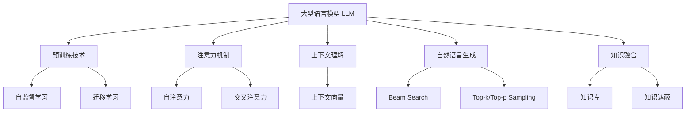

# 智能对话系统中的AI LLM：突破交互的界限

## 1. 背景介绍

### 1.1 问题的由来

在当今信息时代,人机交互已经成为不可或缺的一部分。传统的人机交互方式,如键盘、鼠标等,虽然方便高效,但存在一定的局限性。为了实现更自然、更人性化的交互体验,智能对话系统应运而生。

智能对话系统旨在模拟人类的交谈方式,通过自然语言处理技术实现人机对话交互。然而,早期的对话系统存在一些明显的缺陷,如缺乏上下文理解能力、回复生硬缺乏情感等,导致用户体验不佳。为了解决这些问题,大型语言模型(Large Language Model,LLM)被引入到智能对话系统中,成为实现高质量对话交互的关键技术。

### 1.2 研究现状

近年来,随着深度学习技术的快速发展,LLM取得了长足的进步。以GPT(Generative Pre-trained Transformer)为代表的大型语言模型,通过在海量文本数据上进行预训练,获得了强大的自然语言理解和生成能力。这些模型不仅能够生成流畅、连贯的自然语言文本,还能够捕捉上下文信息,理解和回答复杂的问题。

目前,LLM已经广泛应用于智能对话系统、问答系统、机器翻译等多个领域,展现出了巨大的潜力。但同时,LLM也面临着一些挑战,如数据隐私、模型偏差、计算资源需求等,这些问题仍需要进一步的研究和探索。

### 1.3 研究意义

将LLM引入智能对话系统,能够极大地提升对话交互的质量和用户体验。准确理解上下文信息、生成情感丰富的自然语言回复,是LLM在对话系统中的核心价值。此外,LLM还能够帮助对话系统实现多轮对话、主题切换、知识推理等高级功能,进一步增强人机交互的自然性和智能性。

随着人工智能技术的不断发展,LLM在智能对话系统中的应用前景将更加广阔。研究LLM在对话系统中的应用,不仅有助于推动人机交互技术的进步,还能为智能助手、客服机器人等场景带来全新的体验,对提高生产效率和服务质量具有重要意义。

### 1.4 本文结构

本文将全面探讨LLM在智能对话系统中的应用。首先介绍LLM的核心概念和原理,包括预训练技术、注意力机制等。接着详细阐述LLM在对话系统中的具体应用,如上下文理解、响应生成、知识融合等。然后分析LLM在对话系统中面临的挑战,如偏差问题、计算资源需求等,并探讨相应的解决方案。最后,本文将总结LLM在智能对话系统中的未来发展趋势,并对其前景进行展望。

## 2. 核心概念与联系

大型语言模型(LLM)是实现高质量智能对话系统的核心技术,它包含以下几个关键概念:

1. **预训练技术**:LLM通过在大规模文本数据上进行预训练,获得初始的语言理解和生成能力。常用的预训练技术包括自监督学习和迁移学习。
   - 自监督学习:利用大量未标注数据,通过设计预训练任务(如掩码语言模型、下一句预测等)进行预训练。
   - 迁移学习:将在大规模数据上预训练的模型,迁移到下游任务上进行微调,提高任务性能。

2. **注意力机制**:注意力机制是LLM的核心组成部分,它能够捕捉输入序列中的长程依赖关系,提高模型的表达能力。
   - 自注意力:计算输入序列中每个位置与其他位置的关系,捕捉序列内部的依赖关系。
   - 交叉注意力:计算输入序列与另一输入序列(如查询)的关系,用于序列到序列的映射任务。

3. **上下文理解**:LLM能够理解对话的上下文信息,捕捉上下文向量,从而生成与上下文相关的响应。

4. **自然语言生成**:LLM通过解码器生成自然语言响应。常用的解码策略包括Beam Search、Top-k/Top-p Sampling等。

5. **知识融合**:LLM可以与外部知识库相结合,融合知识信息,提高对话系统的知识理解和推理能力。知识融合可通过知识库查询或知识遮蔽等方式实现。

上述核心概念相互关联,共同构建了LLM在智能对话系统中的应用框架。预训练技术和注意力机制为LLM提供了强大的语言理解和生成能力;上下文理解和自然语言生成则是LLM在对话系统中的具体应用;知识融合进一步增强了LLM的知识推理能力,使对话系统更加智能化。

## 3. 核心算法原理 & 具体操作步骤

### 3.1 算法原理概述

LLM在智能对话系统中的核心算法原理,可以概括为三个关键步骤:

1. **上下文编码**:将对话历史和当前查询编码为上下文向量表示。
2. **响应生成**:根据上下文向量,生成相应的自然语言响应。
3. **知识融合**:融合外部知识信息,增强响应的知识性和准确性。

这三个步骤相互关联,共同构建了LLM在对话系统中的应用框架。下面将详细介绍每个步骤的具体算法原理和操作步骤。

### 3.2 算法步骤详解

#### 3.2.1 上下文编码

上下文编码的目标是将对话历史和当前查询映射为上下文向量表示,以捕捉对话的语义信息和上下文依赖关系。常用的编码方法是基于Transformer的自注意力机制。

1. 将对话历史和当前查询拼接为一个序列,添加特殊标记(如[CLS]、[SEP])。
2. 将拼接序列输入到Transformer的编码器中,进行字词嵌入和位置编码。
3. 通过多层自注意力和前馈神经网络,捕捉序列内部的长程依赖关系。
4. 取最后一层编码器输出的[CLS]标记对应的向量,作为整个序列的上下文向量表示。

#### 3.2.2 响应生成

响应生成的目标是根据上下文向量,生成与当前对话相关的自然语言响应。常用的生成方法是基于Transformer的解码器和Beam Search/Sampling解码策略。

1. 将上下文向量作为初始输入,输入到Transformer的解码器中。
2. 通过多层自注意力和交叉注意力机制,捕捉响应内部的依赖关系和与上下文向量的关系。
3. 在每个时间步,计算下一个词的概率分布,并采用Beam Search或Sampling策略生成下一个词。
4. 重复步骤3,直到生成终止标记或达到最大长度,得到完整的响应序列。

#### 3.2.3 知识融合

知识融合的目标是将外部知识信息融合到对话系统中,增强响应的知识性和准确性。常用的知识融合方法包括知识库查询和知识遮蔽。

**知识库查询**:

1. 构建结构化的知识库,存储相关领域的知识信息。
2. 在生成响应时,将上下文向量和知识库中的知识向量进行相似度计算。
3. 根据相似度得分,从知识库中检索出与当前对话相关的知识信息。
4. 将检索到的知识信息融合到响应生成过程中,生成知识丰富的响应。

**知识遮蔽**:

1. 在预训练阶段,对训练数据中的某些词进行遮蔽(用特殊标记替换)。
2. 在微调阶段,将外部知识信息编码为知识向量,并将其拼接到输入序列中。
3. 通过交叉注意力机制,模型可以关注并融合知识向量,生成包含知识信息的响应。

### 3.3 算法优缺点

#### 优点:

1. **自然语言理解能力强**:LLM通过预训练和注意力机制,能够捕捉长程依赖关系,准确理解上下文信息。
2. **响应质量高**:LLM可以生成流畅、连贯、情感丰富的自然语言响应,提升对话交互体验。
3. **知识融合能力强**:LLM能够与外部知识库相结合,生成知识丰富的响应,增强对话系统的智能性。
4. **泛化能力好**:LLM具有强大的语言理解和生成能力,可以较好地泛化到不同领域的对话任务。

#### 缺点:

1. **计算资源需求高**:LLM通常包含数十亿甚至上千亿参数,对计算资源需求巨大,部署和推理成本高。
2. **数据隐私风险**:LLM在预训练阶段需要大量的文本数据,可能会引入隐私和版权问题。
3. **偏差问题**:LLM可能会继承训练数据中存在的偏差,产生不公平或有害的输出。
4. **解释性差**:LLM是一种黑盒模型,其内部工作机制难以解释,缺乏可解释性。

### 3.4 算法应用领域

LLM在智能对话系统中的应用前景广阔,可以覆盖多个领域:

1. **智能助手**:LLM可以作为智能助手的核心技术,提供自然语言交互界面,帮助用户完成各种任务。
2. **客服机器人**:LLM能够生成人性化的响应,可以应用于客服机器人,提高客户服务质量。
3. **教育辅导**:LLM可以作为智能辅导系统,与学生进行对话交互,解答疑问并提供个性化学习建议。
4. **心理咨询**:LLM能够捕捉情感信息,可以应用于心理咨询领域,为用户提供情感支持和建议。
5. **医疗问诊**:LLM可以融合医疗知识库,与患者进行对话问诊,协助医生进行初步诊断和建议。

总的来说,LLM在智能对话系统中的应用前景广阔,有望为多个领域带来全新的人机交互体验。

## 4. 数学模型和公式 & 详细讲解 & 举例说明

### 4.1 数学模型构建

LLM通常基于Transformer架构,其核心是自注意力机制和交叉注意力机制。下面将详细介绍这两种注意力机制的数学模型。

#### 4.1.1 自注意力机制

自注意力机制用于捕捉输入序列内部的长程依赖关系。给定一个长度为$n$的输入序列$X = (x_1, x_2, \dots, x_n)$,自注意力机制计算每个位置$i$与其他位置$j$的关系,得到注意力权重$\alpha_{ij}$,然后根据权重对输入进行加权求和,得到注意力向量$a_i$:

$$a_i = \sum_{j=1}^{n} \alpha_{ij}(x_jW^V)$$

其中,$W^V$是一个可学习的值向量映射矩阵。注意力权重$\alpha_{ij}$通过以下公式计算:

$$\alpha_{ij} = \frac{exp(e_{ij})}{\sum_{k=1}^{n}exp(e_{ik})}$$

$$e_{ij} = \frac{(x_iW^Q)(x_jW^K)^T}{\sqrt{d_k}}$$

这里,$W^Q$和$W^K$分别是查询