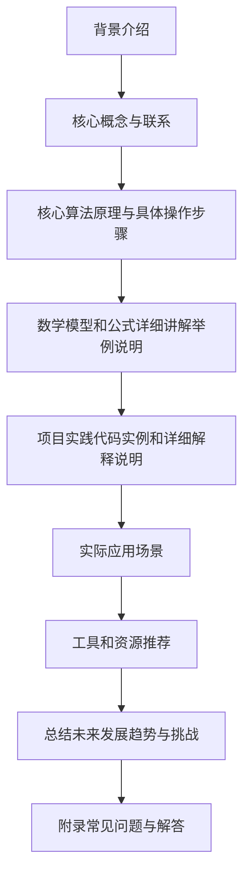
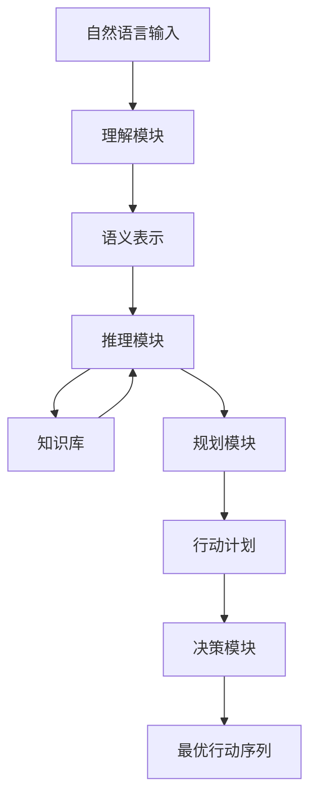

# 最重要的是理解输入给Agent的内容、进行推理、规划、做出准确决策

## 1. 背景介绍

### 1.1 问题的由来

在当今快节奏的数字时代,人工智能(AI)系统已经无处不在,从个人助理到自动驾驶汽车,再到医疗诊断和金融交易。这些系统需要能够准确理解输入数据、进行逻辑推理并做出明智决策。然而,构建这种能力是一个极具挑战性的任务,需要综合多种技术和算法。

传统的规则based系统虽然可以处理一些特定场景,但缺乏灵活性和通用性。而现代的机器学习技术虽然在特定领域表现出色,但对于复杂的推理和决策任务仍然力有未逮。我们需要一种新的范式,将符号推理、知识表示与机器学习相结合,以构建能够理解、推理和决策的智能Agent。

### 1.2 研究现状

近年来,研究人员一直在努力开发能够理解自然语言、推理和规划的人工智能系统。一些突破性的工作包括:

- **语义解析**: 将自然语言转换为形式化的语义表示,例如lambda逻辑等。
- **知识库构建**: 构建包含大量事实和常识的知识库,如ConceptNet、WordNet等。
- **推理引擎**: 基于形式逻辑和规则的推理引擎,如Prolog、Answer Set Programming等。
- **规划算法**: 自动化规划和决策算法,如STRIPS、Hierarchical Task Network (HTN)等。
- **神经符号系统**: 结合神经网络和符号系统的混合模型,如神经张量网络、神经模糊逻辑等。

然而,这些系统往往只关注理解、推理或规划中的某一个方面,缺乏统一的框架将它们无缝集成。

### 1.3 研究意义 

构建能够全面理解、推理和决策的人工智能系统,对于实现通用人工智能(AGI)至关重要。这不仅可以推动人工智能技术在各个领域的应用,还有助于我们更好地理解人类智能的本质。具有这种能力的智能Agent,可以在复杂动态环境中做出明智决策,为人类提供有力支持。

此外,研究这一问题也将推动相关技术的发展,包括自然语言处理、知识表示与推理、机器学习、自动规划等,为这些领域带来新的见解和突破。

### 1.4 本文结构

本文将全面探讨如何构建能够理解输入、推理和做出准确决策的智能Agent。我们将首先介绍相关的核心概念,然后深入探讨算法原理、数学模型和实现细节。最后,我们将讨论实际应用场景、未来趋势和面临的挑战。文章结构如下:

## 2. 核心概念与联系

要构建能够理解、推理和决策的智能Agent,我们需要整合多种技术和概念,包括:

1. **自然语言理解 (NLU)**: 将自然语言输入转换为形式化的语义表示。
2. **知识表示**: 使用逻辑或结构化的方式表示事实和常识知识。
3. **推理引擎**: 基于逻辑规则和知识库进行符号推理。
4. **规划算法**: 根据当前状态和目标生成行动序列。
5. **决策理论**: 在不确定环境下做出最优决策。
6. **机器学习**: 从数据中学习模式和知识。

我们需要将这些概念紧密结合,构建一个统一的框架。下图展示了它们之间的关系:

1. 首先,自然语言输入经过 **自然语言理解(NLU)** 模块转换为形式化的 **语义表示**。
2. 语义表示与 **知识库** 中的知识相结合,输入到 **推理引擎**。
3. 推理引擎基于逻辑规则对知识进行推理,产生新的知识。
4. **规划算法** 根据当前状态、目标和推理出的知识生成行动计划。
5. **决策理论** 模块评估每个可能的行动序列,选择最优方案。
6. **机器学习** 模块可以从经验中学习,不断优化各个模块。
7. 最终,系统输出行动序列,用于指导Agent与环境交互。

通过有机结合这些概念,我们可以构建出综合能力强大的智能Agent。

## 3. 核心算法原理与具体操作步骤

### 3.1 算法原理概述

我们提出了一种名为"理解-推理-规划-决策(URPD)"的综合算法框架,用于指导智能Agent的行为。该算法由以下四个核心模块组成:

1. **理解(Understanding)模块**: 将自然语言输入转换为形式化的语义表示。
2. **推理(Reasoning)模块**: 基于知识库和规则进行符号推理,获得新知识。
3. **规划(Planning)模块**: 根据当前状态、目标和推理结果生成行动计划。
4. **决策(Decision Making)模块**: 评估可能的行动序列,选择最优方案。

该算法的工作流程如下:

1. 自然语言输入被送入 **理解模块**,产生对应的 **语义表示**。
2. 语义表示与 **知识库** 中的知识一起送入 **推理模块**,通过逻辑规则进行推理,获得新知识。
3. 推理结果与当前状态、目标等信息一起送入 **规划模块**,生成一系列 **行动计划**。
4. 所有可能的行动计划被送入 **决策模块**,根据一定的决策理论(如期望最大化)选择 **最优行动序列**。
5. Agent根据输出的行动序列与环境交互,同时记录交互过程中获得的新知识,不断优化知识库、推理规则和决策策略。

该算法的关键在于模块间的紧密结合和反馈循环,确保了理解、推理、规划和决策的高效协同,产生明智的行为输出。

### 3.2 算法步骤详解

我们将详细解释URPD算法的每一个步骤:

**1. 理解模块**

输入: 自然语言命令/查询
输出: 语义表示(如lambda逻辑表示)

该模块的主要任务是将自然语言转换为形式化的语义表示,以便后续的推理和规划。主要步骤包括:

1) **词法分析**: 将输入文本分割为词元(token)序列。
2) **句法分析**: 根据语法规则构建句子的语法树(parse tree)。
3) **语义分析**: 将语法树映射为语义表示,捕获输入的核心意图和概念。

这一模块通常采用基于规则的方法或基于数据的方法(如序列到序列模型)。值得注意的是,语义表示需要能够无缝地与知识库和推理引擎集成。

**2. 推理模块**

输入: 语义表示、知识库
输出: 新知识

推理模块负责基于已有的知识和规则,推导出新的知识。主要分为以下步骤:

1) **选择推理引擎**: 如Prolog、Answer Set Programming等。
2) **构建知识库**: 将领域知识形式化,构建事实库和规则库。
3) **与语义表示集成**: 将语义表示映射为推理引擎可处理的形式。
4) **推理过程**: 应用推理规则,从已知知识推导出新知识。
5) **知识库更新**: 将新推导出的知识加入知识库。

推理过程可以是前向推理(从已知推导未知)或后向推理(从目标推导前提)。推理的深度和策略也需要根据任务需求进行调整。

**3. 规划模块**  

输入: 当前状态、目标、推理结果
输出: 行动计划序列

规划模块的任务是根据当前状态、目标和已有知识,生成一系列行动以达成目标。主要步骤包括:

1) **建模问题**: 将问题形式化为规划模型,确定初始状态、目标状态和可执行操作。
2) **选择规划算法**: 如STRIPS、HTN、基于时间或基于资源的规划等。
3) **规划过程**: 应用搜索或约束求解等方法,生成满足目标的行动序列。
4) **约束处理**: 根据环境限制和已有知识,修剪无效的行动计划。
5) **计划优化**: 根据一定启发式,优化行动序列的长度、成本等。

规划算法需要与推理模块紧密集成,以利用已推导出的知识约束和指导规划过程。

**4. 决策模块**

输入: 行动计划序列
输出: 最优行动序列

决策模块的作用是在所有可能的行动计划中,选择最优的一个执行。主要步骤如下:

1) **定义效用函数**: 根据任务目标,设计衡量行动序列"好坏"的效用函数。
2) **建立决策模型**: 如马尔可夫决策过程(MDP)、部分可观测马尔可夫决策过程(POMDP)等。
3) **选择决策算法**: 如价值迭代、策略迭代、蒙特卡罗树搜索等。
4) **决策过程**: 应用所选算法,计算每个行动序列的期望效用值。
5) **输出最优序列**: 选择期望效用值最大的行动序列作为输出。

决策模块需要与规划模块密切配合,并利用推理模块获得的知识来指导决策过程。同时,它也可以从经验中学习,不断优化效用函数和决策策略。

通过上述四个模块的紧密协作,URPD算法可以高效地从自然语言输入到行动输出,实现理解、推理、规划和决策的全流程。

### 3.3 算法优缺点

**优点:**

1. **通用性强**: 该算法可以应用于各种需要自然语言理解、推理和规划的任务,如问答系统、智能助手、机器人控制等。
2. **模块化设计**: 将复杂的任务分解为多个模块,有利于系统的可解释性、可扩展性和可维护性。
3. **知识驱动**: 算法利用了领域知识和规则,能够产生更加可解释和可靠的输出。
4. **机器学习增强**: 各个模块均可利用机器学习技术进行优化,提升整体性能。
5. **反馈循环**: 通过持续学习,算法可以不断优化知识库、推理规则和决策策略。

**缺点:**

1. **知识获取成本高**: 构建高质量的知识库和推理规则是一个艰巨的工程,需要大量的人力和时间投入。
2. **推理和规划效率**: 符号推理和规划过程的计算复杂度较高,可能在大规模问题上遇到效率瓶颈。
3. **模块集成复杂**: 将多个模块无缝集成是一个巨大的挑战,需要处理好模块间的接口和数据流。
4. **缺乏通用基准**: 目前还缺乏针对该类综合系统的标准评测基准,难以客观评估系统性能。
5. **可解释性挑战**: 虽然算法的各个模块是可解释的,但整体决策的可解释性仍然是一个挑战。