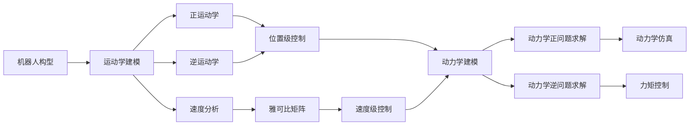

# 机器人学(Robotics)原理与代码实战案例讲解

关键词：机器人学、机器人控制、机器人运动学、机器人动力学、机器人感知、机器人导航、ROS、机器人操作系统

## 1. 背景介绍
### 1.1  问题的由来
机器人学是一门融合了机械、电子、控制、计算机、人工智能等多学科知识的综合性学科。随着科技的不断发展,机器人在工业生产、医疗服务、家庭服务、军事国防、太空探索等领域得到了广泛应用。机器人学研究如何设计和控制机器人,使其能够自主地完成各种复杂任务,这对推动人类社会进步具有重要意义。

### 1.2  研究现状
目前,机器人学的研究主要集中在机器人机构设计、运动学与动力学建模、控制算法、传感器融合、路径规划与导航等方面。各国政府和企业都在大力投入机器人研发,不断涌现出新的机器人产品和应用。但机器人的智能化水平还有待进一步提高,在非结构化环境下的自主作业能力还比较有限。

### 1.3  研究意义
深入研究机器人学理论和技术,对于发展智能制造、智慧医疗、智能家居等战略性新兴产业,提升国家科技创新能力,具有十分重要的意义。通过机器人学的学习和实践,可以培养学生的创新意识、工程能力和跨学科解决问题的综合素质。

### 1.4  本文结构
本文将全面系统地介绍机器人学的基本概念、理论基础和关键技术,重点讲解机器人运动学、动力学建模与控制等核心内容,并通过代码实例演示ROS机器人操作系统的使用方法。全文分为9个章节,内容涵盖了机器人学的方方面面。

## 2. 核心概念与联系
机器人学涉及的核心概念包括:
- 机器人(Robot):由机械、电子、控制、传感、人工智能等部件组成的自动执行工作的机器,它能接收人的指令,也可以根据自身状态进行自主地操作和反应。
- 自由度(Degree of Freedom,DOF):描述机器人机构的活动能力,即机器人末端执行器实现运动所需要的独立变量的个数。
- 正运动学(Forward Kinematics):在已知机器人关节变量的情况下,求解机器人末端位姿的过程。
- 逆运动学(Inverse Kinematics):在已知机器人末端位姿的情况下,求解机器人关节变量的过程。
- 雅可比矩阵(Jacobian Matrix):机器人末端速度和关节速度之间的映射矩阵。
- 动力学(Dynamics):研究机器人的运动与所受力和力矩之间关系的学科。
- 轨迹规划(Trajectory Planning):根据任务要求,合理地规划机器人运动轨迹的过程。

这些概念之间有着紧密的内在联系,共同构成了机器人学的理论基础。以运动学和动力学为例,二者联系如下图所示:



从图中可以看出,运动学和动力学是机器人学的两大支柱,二者相辅相成,运动学为动力学奠定了基础,而动力学则进一步揭示了机器人的动态特性。二者的结合研究,可以实现对机器人的精确控制。

## 3. 核心算法原理 & 具体操作步骤
### 3.1  算法原理概述
机器人学的核心算法包括运动学算法、动力学算法和控制算法。
- 运动学算法:通过求解运动学方程,实现机器人关节空间和笛卡尔空间之间的映射。常用的运动学算法有D-H参数法、几何法、矢量法等。
- 动力学算法:通过求解动力学方程,分析机器人的受力情况。常用的动力学算法有牛顿-欧拉法、拉格朗日法、凯恩法等。
- 控制算法:根据系统的数学模型,利用反馈控制理论,实现对机器人的准确控制。常用的控制算法有PID控制、自适应控制、鲁棒控制、智能控制等。

### 3.2  算法步骤详解
以机器人运动学中的D-H参数法为例,其具体步骤如下:
1. 建立机器人坐标系:为机器人的每个关节和连杆建立坐标系,使相邻坐标系的变换满足D-H规则。
2. 确定D-H参数:测量机器人连杆的长度、关节的偏移和转角等参数,得到D-H参数表。
3. 求解变换矩阵:根据D-H参数,列写相邻坐标系之间的齐次变换矩阵。
4. 位置正解:将所有变换矩阵连乘,得到机器人末端相对于基座标系的位姿。
5. 速度正解:对位置方程求导,得到雅可比矩阵,进而解出末端速度。
6. 逆解:根据几何关系,列写逆运动学方程,求解关节角度。

### 3.3  算法优缺点
D-H参数法的优点是:
- 计算简单,适用于各种机器人机构
- 变换矩阵形式统一,易于编程实现
- 可以同时求解位置和姿态

其缺点是:
- 参数测量误差会影响计算精度
- 奇异位形下雅可比矩阵不可逆
- 逆解方程求解较为复杂

### 3.4  算法应用领域
运动学算法广泛应用于工业机器人、服务机器人、仿人机器人等领域,是机器人控制系统的基础。通过运动学算法,可以实现机器人关节空间和操作空间的映射,从而控制机器人按照预定轨迹运动。同时,运动学算法也是机器人运动仿真和轨迹规划的重要工具。

## 4. 数学模型和公式 & 详细讲解 & 举例说明 
### 4.1  数学模型构建
以二连杆平面机器人为例,其数学模型可以用D-H参数表和齐次变换矩阵来描述。设连杆长度为$a_1$和$a_2$,关节角度为$\theta_1$和$\theta_2$,则D-H参数表为:

| 连杆i | $a_{i-1}$ | $\alpha_{i-1}$ | $d_i$ | $\theta_i$ |
| :---: | :---: | :---: | :---: | :---: |
| 1 | 0 | 0 | 0 | $\theta_1$ |
| 2 | $a_1$ | 0 | 0 | $\theta_2$ |

相邻坐标系之间的齐次变换矩阵为:

$$
^{i-1}_{i}T=\begin{bmatrix} 
\cos\theta_i & -\sin\theta_i & 0 & a_{i-1} \\
\sin\theta_i & \cos\theta_i & 0 & 0 \\
0 & 0 & 1 & 0 \\
0 & 0 & 0 & 1
\end{bmatrix}
$$

### 4.2  公式推导过程
由D-H参数表和齐次变换矩阵,可以列写出两个变换矩阵:

$$
^0_1T=\begin{bmatrix}
\cos\theta_1 & -\sin\theta_1 & 0 & 0 \\ 
\sin\theta_1 & \cos\theta_1 & 0 & 0 \\
0 & 0 & 1 & 0 \\
0 & 0 & 0 & 1
\end{bmatrix}
$$

$$
^1_2T=\begin{bmatrix}
\cos\theta_2 & -\sin\theta_2 & 0 & a_1 \\
\sin\theta_2 & \cos\theta_2 & 0 & 0 \\
0 & 0 & 1 & 0 \\
0 & 0 & 0 & 1
\end{bmatrix}
$$

两个矩阵相乘,得到末端位姿:

$$
^0_2T=^0_1T\cdot^1_2T=\begin{bmatrix}
\cos(\theta_1+\theta_2) & -\sin(\theta_1+\theta_2) & 0 & a_1\cos\theta_1 \\
\sin(\theta_1+\theta_2) & \cos(\theta_1+\theta_2) & 0 & a_1\sin\theta_1 \\ 
0 & 0 & 1 & 0 \\
0 & 0 & 0 & 1
\end{bmatrix}
$$

由此可得末端位置为:

$$
\begin{cases}
x=a_1\cos\theta_1+a_2\cos(\theta_1+\theta_2) \\
y=a_1\sin\theta_1+a_2\sin(\theta_1+\theta_2)
\end{cases}
$$

进一步求导,得到雅可比矩阵:

$$
J=\begin{bmatrix}
-a_1\sin\theta_1-a_2\sin(\theta_1+\theta_2) & -a_2\sin(\theta_1+\theta_2) \\
a_1\cos\theta_1+a_2\cos(\theta_1+\theta_2) & a_2\cos(\theta_1+\theta_2)
\end{bmatrix}
$$

### 4.3  案例分析与讲解
设二连杆机器人的两个连杆长度分别为0.5m和0.3m,当前两个关节角度分别为$\frac{\pi}{3}$和$\frac{\pi}{6}$,求解此时末端位置。

代入数据,得:

$$
\begin{aligned}
x &= 0.5\cos\frac{\pi}{3}+0.3\cos(\frac{\pi}{3}+\frac{\pi}{6}) \\
&= 0.25+0.15\sqrt{3} \\
&\approx 0.51 \\
y &= 0.5\sin\frac{\pi}{3}+0.3\sin(\frac{\pi}{3}+\frac{\pi}{6}) \\ 
&= 0.25\sqrt{3}+0.15 \\
&\approx 0.58
\end{aligned}
$$

因此,当前末端位置坐标为(0.51, 0.58)。

### 4.4  常见问题解答
Q:机器人运动学和动力学有什么区别?
A:运动学研究机器人的运动几何关系,如位置、速度、加速度等,不考虑机器人所受的力和力矩。动力学则进一步分析机器人的受力情况,研究运动与力之间的关系。二者侧重点不同,但又相互联系。

Q:雅可比矩阵的物理意义是什么?
A:雅可比矩阵描述了机器人关节速度和末端速度之间的映射关系。它的每一列表示一个关节速度对末端速度的贡献。雅可比矩阵的秩反映了机器人的灵活性,秩不满时会出现奇异位形。

Q:机器人逆运动学为什么比正运动学求解困难?
A:机器人正运动学是从关节空间到笛卡尔空间的映射,其方程形式相对简单,解唯一。而逆运动学是从笛卡尔空间到关节空间的映射,其方程形式复杂,可能有多解、无解或无数解。求解逆运动学需要解复杂的非线性方程组,因此比正运动学困难得多。

## 5. 项目实践：代码实例和详细解释说明
### 5.1  开发环境搭建
本项目使用ROS(Robot Operating System)作为开发平台。ROS是一个开源的机器人软件框架,提供了大量的工具和库,可以方便地进行机器人系统的开发和仿真。

首先需要安装ROS,可以参考ROS官网的安装教程。本项目使用的是ROS Noetic版本,建议在Ubuntu 20.04系统下进行开发。

安装完ROS后,新建一个工作空间,并初始化:

```bash
mkdir -p ~/catkin_ws/src
cd ~/catkin_ws
catkin_make
```

然后创建一个功能包,用于存放项目代码:

```bash
cd ~/catkin_ws/src
catkin_create_pkg robot_kinematics roscpp rospy