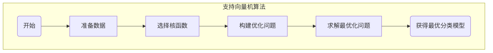
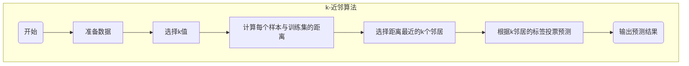
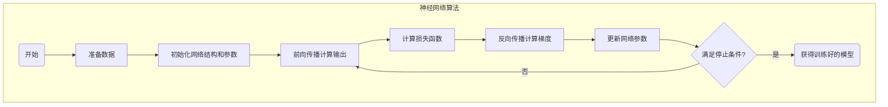

# 机器学习原理与代码实战案例讲解

## 1. 背景介绍

### 1.1 问题的由来

在当今数据爆炸的时代，海量的数据无时无刻不在产生。如何从这些原始数据中发现隐藏的规律和知识,从而指导决策和预测未来,成为了一个迫切需要解决的问题。传统的基于规则的方法已经无法满足现实需求,因为人工制定规则的成本太高,且难以应对复杂多变的数据。

机器学习(Machine Learning)作为人工智能的一个重要分支,它通过构建算法模型,使计算机具备从数据中自动分析获取规律的能力,为解决上述问题提供了有力的工具。机器学习的核心思想是:利用数据,通过优化算法模型的参数,使模型达到期望的目标。

### 1.2 研究现状

机器学习理论和应用研究已经取得了长足的进展,涌现出了众多优秀的算法模型,如决策树、支持向量机、神经网络等,并广泛应用于图像识别、自然语言处理、推荐系统等诸多领域。随着深度学习的兴起,机器学习的能力得到了极大的提升,在语音识别、无人驾驶等领域取得了突破性的进展。

然而,机器学习也面临着一些挑战,例如算法的可解释性、隐私保护、算力需求等问题,仍有待进一步研究和突破。此外,如何将机器学习算法应用于实际场景,也是一个值得关注的课题。

### 1.3 研究意义

机器学习作为一门交叉学科,它融合了计算机科学、统计学、优化理论等多个领域的知识,对于推动人工智能的发展具有重要意义。研究机器学习原理和算法,不仅可以拓展人类认知的边界,还能为解决现实世界中的各种问题提供有力的工具。

通过学习机器学习,我们可以掌握数据驱动的分析思维,提高解决复杂问题的能力。同时,机器学习技术的广泛应用,也将为社会的各个领域带来巨大的变革,提高生产效率,优化资源配置,改善人类的生活质量。

### 1.4 本文结构

本文将全面介绍机器学习的核心概念、算法原理、数学模型、代码实现和实际应用。内容安排如下:

- 第2章介绍机器学习的核心概念和基本流程
- 第3章详细讲解常用机器学习算法的原理和步骤 
- 第4章阐述机器学习算法背后的数学基础和模型
- 第5章提供算法的Python代码实现和案例分析
- 第6章探讨机器学习在实际场景中的应用
- 第7章推荐相关的学习资源和开发工具
- 第8章总结机器学习的发展趋势和面临的挑战
- 第9章列举常见的问题并给出解答

## 2. 核心概念与联系

机器学习的核心概念主要包括:

1. **数据集(Dataset)**: 机器学习算法的训练和测试依赖于大量标记良好的数据集。数据集通常分为训练集、验证集和测试集。

2. **特征(Feature)**: 特征是描述数据样本的属性,是构建机器学习模型的基础。特征工程对模型的性能有着重要影响。

3. **标签(Label)**: 对于监督学习任务,每个数据样本都有对应的标签,标签是我们希望模型预测的目标值。

4. **模型(Model)**: 机器学习模型是一个数学函数或者统计算法,它对输入的数据特征进行处理,得到预测的输出值。

5. **训练(Training)**: 训练是指使用训练数据集,通过优化算法不断调整模型参数,使模型在训练数据上达到最优性能的过程。

6. **评估(Evaluation)**: 使用验证集或测试集评估模型在新数据上的泛化能力,常用的评估指标如准确率、精确率、召回率等。

7. **过拟合(Overfitting)**: 模型在训练数据上表现很好,但在新数据上表现很差,这种现象称为过拟合。防止过拟合是机器学习中的一个重要问题。

8. **欠拟合(Underfitting)**: 模型无法很好地捕捉数据中的规律,在训练数据和新数据上都表现很差,这种现象称为欠拟合。

9. **监督学习(Supervised Learning)**: 利用标记好的训练数据,学习出一个模型,对新的数据进行预测,如分类和回归任务。

10. **无监督学习(Unsupervised Learning)**: 在没有标记数据的情况下,从数据中发现潜在的规律和结构,如聚类和降维任务。

11. **强化学习(Reinforcement Learning)**: 通过与环境的交互,学习如何获取最大的累积奖励,常用于决策和控制领域。

12. **深度学习(Deep Learning)**: 基于多层神经网络模型的一种机器学习方法,在图像、语音等领域表现出色。

这些核心概念相互关联、环环相扣,共同构成了机器学习的理论体系和实践框架。掌握这些概念对于深入理解和应用机器学习至关重要。

## 3. 核心算法原理与具体操作步骤

机器学习涉及众多算法模型,本章将重点介绍几种经典且广泛应用的算法,包括决策树、支持向量机、k-近邻算法和神经网络等。

### 3.1 算法原理概述

#### 3.1.1 决策树

```mermaid
flowchart TD
    subgraph 决策树算法
    start(开始)-->data[准备数据]
    data-->split[选择最优特征划分]
    split-->decision[构建决策树节点]
    decision-->check{满足停止条件?}
    check--否-->split
    check--是-->stop(生成决策树)
    end
    end
```

决策树是一种树形结构的监督学习算法,通过递归地对数据进行特征划分,构建一棵决策树模型。决策树算法的优点是模型可解释性强、训练速度快,但也存在过拟合的风险。常用的决策树算法包括ID3、C4.5和CART等。

#### 3.1.2 支持向量机



支持向量机(Support Vector Machine, SVM)是一种基于统计学习理论的监督学习算法,其目标是找到一个最优超平面,将不同类别的数据样本分隔开来。SVM具有很好的泛化能力,适用于高维数据,但对于非线性问题需要引入核函数。

#### 3.1.3 k-近邻算法



k-近邻算法(k-Nearest Neighbor, kNN)是一种基于实例的监督学习算法,它通过计算测试数据与训练集中每个样本的距离,选择距离最近的k个邻居,根据这k个邻居的标签投票决定测试数据的类别。kNN算法简单直观,但对于高维数据的计算代价较高。

#### 3.1.4 神经网络



神经网络(Neural Network)是一种模仿生物神经网络的机器学习模型,由多层神经元组成。神经网络通过前向传播计算输出,反向传播调整参数,经过多次迭代训练得到最终模型。随着深度学习的发展,神经网络在计算机视觉、自然语言处理等领域取得了突破性进展。

### 3.2 算法步骤详解

接下来,我们将详细讲解上述算法的具体操作步骤。

#### 3.2.1 决策树算法步骤

1. **准备数据集**: 收集并预处理数据,将其划分为训练集和测试集。
2. **计算信息增益或信息增益比**: 对于每个特征,计算其信息增益或信息增益比,选择增益最大的特征作为当前节点。
3. **生成决策树节点**: 根据选择的特征,将数据集划分为多个子集,创建相应的决策树分支节点。
4. **递归构建子树**: 对于每个子集,重复步骤2和3,构建子树,直到满足停止条件。
5. **决策树生成**: 所有分支构建完成后,生成完整的决策树。
6. **决策树预测**: 对于新的测试数据,根据决策树的特征节点,递归地走完整个树,得到最终的预测结果。

#### 3.2.2 支持向量机算法步骤

1. **准备数据集**: 收集并预处理数据,将其划分为训练集和测试集。
2. **选择核函数**: 根据数据的特征,选择合适的核函数,如线性核、多项式核或高斯核等。
3. **构建优化问题**: 将SVM模型转化为一个约束优化问题,其目标是最大化分类间隔。
4. **求解最优化问题**: 使用优化算法如序列最小优化(SMO)等,求解最优化问题,得到支持向量和其他参数。
5. **构建SVM模型**: 利用获得的支持向量和参数,构建最终的SVM分类模型。
6. **SVM预测**: 对于新的测试数据,将其代入SVM模型,计算其与超平面的距离和符号,得到预测结果。

#### 3.2.3 k-近邻算法步骤

1. **准备数据集**: 收集并预处理数据,将其划分为训练集和测试集。
2. **选择k值**: 选择一个合适的k值,通常可以通过交叉验证等方法确定最优k值。
3. **计算距离**: 对于每个测试样本,计算其与训练集中所有样本的距离,常用的距离度量有欧氏距离、曼哈顿距离等。
4. **选择k个邻居**: 根据距离从小到大排序,选择距离最近的k个训练样本。
5. **投票预测**: 统计这k个邻居中各类别的数量,选择数量最多的类别作为测试样本的预测类别。

#### 3.2.4 神经网络算法步骤

1. **准备数据集**: 收集并预处理数据,将其划分为训练集、验证集和测试集。
2. **初始化网络结构和参数**: 确定神经网络的层数、每层神经元数量,并初始化网络参数(权重和偏置)。
3. **前向传播计算输出**: 将输入数据传入网络,通过激活函数层层计算,得到网络的输出。
4. **计算损失函数**: 将网络输出与真实标签进行比较,计算损失函数的值,如均方误差、交叉熵等。
5. **反向传播计算梯度**: 利用链式法则,从输出层反向传播,计算每个参数相对于损失函数的梯度。
6. **更新网络参数**: 使用优化算法如梯度下降,根据梯度值更新网络参数。
7. **重复训练**: 重复步骤3-6,直到满足停止条件(如损失函数收敛或达到最大迭代次数)。
8. **模型预测**: 使用训练好的神经网络模型对新的测试数据进行预测。

### 3.3 算法优缺点

每种算法都有其适用场景和局限性,下面我们总结一下各算法的优缺点:

- **决策树**
  - 优点: 模型可解释性强、训练速度快、能够处理数值型和