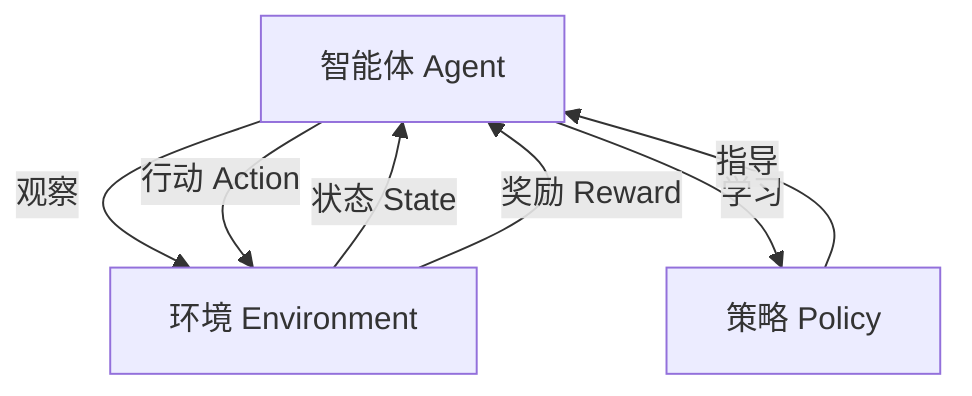

# 构建AI Agent的核心技术

## 1. 背景介绍

### 1.1 问题的由来

在当今科技飞速发展的时代，人工智能(AI)已经渗透到了我们生活的方方面面。从语音助手到自动驾驶汽车，从推荐系统到医疗诊断，AI技术正在彻底改变着我们的生活方式。然而，要构建一个真正智能的AI Agent,能够像人一样思考、学习和行动,仍然是一个巨大的挑战。

传统的AI系统往往是专门为特定任务设计的,缺乏通用性和自主学习能力。它们无法像人一样灵活地适应不同的环境和情况,也无法像人一样不断学习和进化。因此,构建一个具有通用智能的AI Agent成为了人工智能领域的终极目标之一。

### 1.2 研究现状

近年来,随着深度学习、强化学习等技术的飞速发展,人工智能取得了令人瞩目的进展。像AlphaGo、GPT-3和DALL-E等系统展示了AI在特定领域的卓越表现。然而,这些系统仍然局限于特定的任务或领域,无法真正实现通用人工智能(Artificial General Intelligence,AGI)。

构建AGI需要解决诸多挑战,包括知识表示、推理、规划、学习、交互等方面的问题。目前,研究人员正在探索各种新颖的方法和架构,试图突破现有的局限性。例如,基于神经符号架构(Neural Symbolic Architecture)的方法,试图将深度学习与符号推理相结合,以实现更强大的推理和学习能力。

### 1.3 研究意义

构建通用智能的AI Agent具有重大的理论和实践意义。从理论层面上,它将推动我们对智能本质的理解,帮助我们揭示人类智能的奥秘。从实践层面上,一个真正智能的AI Agent将能够协助人类解决各种复杂的问题,推动科技、经济和社会的发展。

此外,通用AI Agent的研究也将促进相关技术的发展,如机器学习、知识表示、自然语言处理、计算机视觉等,这些技术本身也有广泛的应用前景。

### 1.4 本文结构

本文将全面探讨构建AI Agent的核心技术。我们将首先介绍相关的核心概念和理论基础,然后深入探讨核心算法原理和数学模型,并通过实际项目实践来加深理解。最后,我们将讨论AI Agent的实际应用场景、未来发展趋势和面临的挑战。

## 2. 核心概念与联系

构建AI Agent涉及多个关键概念,包括智能体(Agent)、环境(Environment)、状态(State)、奖励(Reward)和策略(Policy)等。这些概念相互关联,共同构成了AI Agent系统的基础框架。

- **智能体(Agent)**: 指能够感知环境、做出决策并采取行动的实体。在AI Agent系统中,智能体是系统的核心,负责与环境交互并学习优化策略。

- **环境(Environment)**: 指智能体所处的外部世界,包括各种物体、事件和规则。环境会根据智能体的行为产生新的状态和奖惩反馈。

- **状态(State)**: 描述环境在某个时刻的具体情况,是智能体做出决策的依据。状态可以是离散的或连续的,也可以是部分可观测的。

- **奖励(Reward)**: 是环境对智能体行为的反馈,用于指导智能体学习过程。奖励可以是即时的或延迟的,也可以是稀疏的或密集的。

- **策略(Policy)**: 指智能体在各种状态下采取行动的规则或映射函数。策略的目标是最大化预期的累积奖励。

这些核心概念相互作用,构成了一个闭环系统。智能体根据当前状态选择行动,环境根据行动产生新的状态和奖惩反馈,智能体据此学习和优化策略,循环往复。通过不断的交互和学习,智能体可以逐步提高其决策能力,最终实现高效智能的行为。

## 3. 核心算法原理与具体操作步骤

### 3.1 算法原理概述

构建AI Agent的核心算法主要基于强化学习(Reinforcement Learning)和深度学习(Deep Learning)等技术。强化学习是一种基于奖惩机制的学习范式,旨在通过与环境的交互来学习最优策略。而深度学习则提供了强大的函数拟合能力,能够从大量数据中自动学习特征表示。

将强化学习与深度学习相结合,就形成了深度强化学习(Deep Reinforcement Learning)。深度强化学习算法通常由两个主要组件构成:策略网络(Policy Network)和值函数网络(Value Network)。

- **策略网络**:基于当前状态,输出智能体应采取的行动概率分布。策略网络的目标是找到一个能够最大化预期累积奖励的最优策略。

- **值函数网络**:评估当前状态的价值,即按照当前策略继续执行时,预期能获得的累积奖励。值函数网络为策略网络提供了学习信号,指导其朝着更优的策略方向优化。

在训练过程中,智能体与环境交互,根据获得的奖惩信号不断调整策略网络和值函数网络的参数,最终converge到一个近似最优的策略。

### 3.2 算法步骤详解

以下是一个典型的深度强化学习算法(如Deep Q-Network)的训练步骤:

1. **初始化**:初始化策略网络和值函数网络的参数,通常使用随机初始化或预训练模型。

2. **观测状态**:从环境中获取当前状态$s_t$。

3. **选择行动**:基于当前状态$s_t$,通过策略网络输出各个行动的概率分布$\pi(a|s_t)$,并从中采样选择一个行动$a_t$。

4. **执行行动**:在环境中执行选择的行动$a_t$,获得新的状态$s_{t+1}$和奖励$r_t$。

5. **存储转换**:将转换$(s_t, a_t, r_t, s_{t+1})$存储到经验回放池(Experience Replay Buffer)中。

6. **采样批次**:从经验回放池中随机采样一个批次的转换$(s_j, a_j, r_j, s_{j+1})$。

7. **计算目标值**:使用值函数网络计算每个转换的目标值$y_j$,例如对于Q-Learning,目标值为:

$$y_j = r_j + \gamma \max_{a'} Q(s_{j+1}, a'; \theta^-)$$

其中$\gamma$是折现因子,用于权衡即时奖励和长期奖励,$\theta^-$是值函数网络的旧参数。

8. **更新网络**:使用优化算法(如梯度下降)最小化值函数网络的损失函数,更新网络参数$\theta$:

$$\theta \leftarrow \theta - \alpha \nabla_\theta \frac{1}{N} \sum_j \left( y_j - Q(s_j, a_j; \theta) \right)^2$$

其中$\alpha$是学习率,$N$是批次大小。

9. **更新目标网络**:定期将值函数网络的参数复制到目标网络,以稳定训练过程。

10. **回到步骤2**:重复上述过程,直至策略收敛。

通过上述过程,智能体可以不断从经验中学习,逐步优化其策略,最终达到高水平的决策能力。

### 3.3 算法优缺点

深度强化学习算法具有以下优点:

- **端到端学习**:无需手工设计特征,算法可以直接从原始数据(如像素级输入)中自动学习特征表示。

- **通用性强**:同一算法框架可以应用于不同的任务和环境,展现出良好的通用性。

- **高效决策**:经过充分训练,算法可以快速做出近乎最优的决策。

然而,深度强化学习也存在一些缺点和挑战:

- **样本效率低**:训练过程需要大量的环境交互数据,数据效率较低。

- **收敛性差**:由于奖励信号的延迟性和稀疏性,训练过程往往收敛缓慢。

- **过度依赖经验**:算法很大程度上依赖于已经探索过的经验,难以泛化到新的状态。

- **超参数敏感**:算法的性能对超参数(如学习率、折现因子等)非常敏感,调参困难。

### 3.4 算法应用领域

深度强化学习算法已经在多个领域取得了卓越的成就,例如:

- **游戏AI**: DeepMind的AlphaGo/AlphaZero在国际象棋、围棋等游戏中展现出超人水平的表现。

- **机器人控制**: 通过与模拟环境交互,算法可以学习高效的机器人控制策略。

- **自动驾驶**: 深度强化学习可用于训练自动驾驶系统,学习安全有效的驾驶策略。

- **智能系统优化**: 在数据中心负载均衡、网络路由优化等领域有广泛应用。

- **自动化交易**: 可用于设计智能交易策略,在金融市场中进行高频交易。

总的来说,深度强化学习为解决序列决策问题提供了一种通用而强大的方法,在人工智能的诸多领域都有广阔的应用前景。

## 4. 数学模型和公式详细讲解与举例说明

### 4.1 数学模型构建

在构建AI Agent的数学模型时,我们通常将问题形式化为一个**马尔可夫决策过程(Markov Decision Process, MDP)**。MDP是一种离散时间随机控制过程,用于描述智能体与环境的交互过程。

一个MDP可以用一个五元组$(S, A, P, R, \gamma)$来表示,其中:

- $S$是状态空间的集合,表示环境可能的状态。
- $A$是行动空间的集合,表示智能体可执行的行动。
- $P(s' | s, a)$是状态转移概率,表示在状态$s$执行行动$a$后,转移到状态$s'$的概率。
- $R(s, a, s')$是奖励函数,表示在状态$s$执行行动$a$并转移到状态$s'$时获得的即时奖励。
- $\gamma \in [0, 1)$是折现因子,用于权衡即时奖励和长期奖励。

在MDP框架下,智能体的目标是找到一个策略$\pi: S \rightarrow A$,使得按照该策略执行时,预期的累积折现奖励最大化:

$$\max_\pi \mathbb{E}_\pi \left[ \sum_{t=0}^\infty \gamma^t R(s_t, a_t, s_{t+1}) \right]$$

其中$s_0$是初始状态,$a_t \sim \pi(s_t)$是根据策略$\pi$在状态$s_t$选择的行动。

### 4.2 公式推导过程

在强化学习中,我们通常使用**值函数(Value Function)**和**Q函数(Q-Function)**来评估一个策略的好坏。值函数$V^\pi(s)$表示在状态$s$下,按照策略$\pi$执行时,预期能获得的累积折现奖励:

$$V^\pi(s) = \mathbb{E}_\pi \left[ \sum_{t=0}^\infty \gamma^t R(s_t, a_t, s_{t+1}) | s_0 = s \right]$$

而Q函数$Q^\pi(s, a)$表示在状态$s$下执行行动$a$,之后按照策略$\pi$执行时,预期能获得的累积折现奖励:

$$Q^\pi(s, a) = \mathbb{E}_\pi \left[ \sum_{t=0}^\infty \gamma^t R(s_t, a_t, s_{t+1}) | s_0 = s, a_0 = a \right]$$

值函数和Q函数之间存在着如下关系,称为**贝尔曼方程(Bellman Equation)**:

$$\begin{aligned}
V^\pi(s) &= \sum_{a \in A} \pi(a|s) Q^\pi(s, a) \\
Q^\pi(s, a) &= R(s, a) + \gamma \sum_{s' \in S