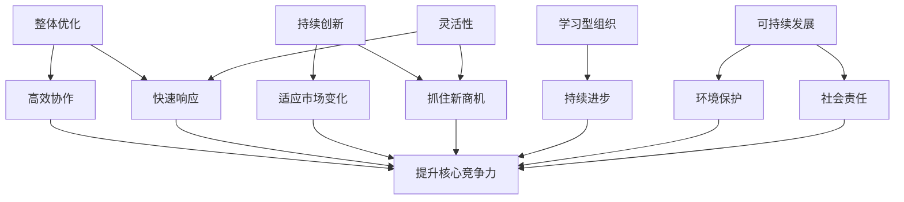

以下是题为《核心竞争力提升的新质生产力策略》的技术博客文章正文内容：

# 核心竞争力提升的新质生产力策略

## 1. 背景介绍

### 1.1 问题的由来

在当今瞬息万变的商业环境中，企业要想保持持久的竞争优势,单纯依赖传统的生产力策略是远远不够的。随着技术的不断进步和市场需求的快速变化,企业必须采取创新的方法来提高核心竞争力,以确保可持续发展。

传统的生产力策略往往过于注重降低成本和提高效率,忽视了企业的创新能力和快速响应市场变化的能力。因此,企业亟需一种新型的生产力策略,将注意力集中在提升核心竞争力上,从而在激烈的市场竞争中占据优势地位。

### 1.2 研究现状

目前,学术界和业界对于提升企业核心竞争力的研究主要集中在以下几个方面:

1. **人力资本管理**:通过优化人力资源配置、培养人才和建立高效的激励机制,提高员工的创新能力和工作效率。
2. **技术创新**:投资研发,加强自主创新能力,开发具有自主知识产权的新产品和新技术,增强企业的技术领先优势。
3. **商业模式创新**:根据市场变化及时调整商业模式,开拓新的收入来源和利润增长点。
4. **供应链优化**:优化供应链流程,提高供应链灵活性和响应速度,降低运营成本。

然而,这些研究大多局限于单一领域,缺乏系统性和整体性,难以真正解决企业核心竞争力提升的根本问题。

### 1.3 研究意义

本文提出了一种新型的"新质生产力"策略,旨在从整体上提升企业的核心竞争力。该策略将创新、灵活性和可持续发展作为核心目标,通过优化企业的资源配置、流程管理和组织架构,实现高效协作、快速响应和持续创新。

采用"新质生产力"策略,企业可以:

1. 提高创新能力,快速响应市场变化
2. 优化资源配置,降低运营成本
3. 建立高效的协作机制,促进跨部门协同
4. 培养学习型组织文化,推动持续改进
5. 实现可持续发展,在激烈的市场竞争中占据优势

### 1.4 本文结构

本文将首先介绍"新质生产力"策略的核心概念和理论基础,然后详细阐述其核心算法原理和具体实施步骤。接下来,我们将构建相关的数学模型,并通过公式推导和案例分析加以说明。在此基础上,我们将给出一个实际项目的代码实现,并对其进行详细解释。最后,我们将探讨"新质生产力"策略在实际应用场景中的作用,并对未来的发展趋势和挑战进行展望。

## 2. 核心概念与联系

"新质生产力"策略的核心概念包括:

1. **整体优化**:从整体上优化企业的资源配置、流程管理和组织架构,实现高效协作和快速响应。
2. **持续创新**:通过建立创新机制和培养创新文化,推动企业持续创新,快速适应市场变化。
3. **学习型组织**:构建学习型组织,鼓励员工不断学习和提高,促进组织的持续进步。
4. **灵活性**:提高企业的灵活性,快速响应市场变化,抓住新的商机。
5. **可持续发展**:在追求经济效益的同时,注重环境保护和社会责任,实现可持续发展。

这些核心概念相互关联、相互促进,共同构成了"新质生产力"策略的理论框架。

上图展示了"新质生产力"策略中各个核心概念之间的关系。通过整体优化、持续创新、学习型组织、灵活性和可持续发展等策略,企业可以实现高效协作、快速响应市场变化、持续进步、抓住新商机、环境保护和承担社会责任,从而提升核心竞争力。

## 3. 核心算法原理 & 具体操作步骤

### 3.1 算法原理概述

"新质生产力"策略的核心算法原理是基于系统思维和整体优化理论,通过对企业的资源、流程和组织架构进行全面优化,实现高效协作、快速响应和持续创新。

该算法的主要思路如下:

1. **建模**:首先,通过数据收集和分析,构建企业的资源模型、流程模型和组织架构模型。
2. **优化**:在建模的基础上,运用优化算法(如遗传算法、蚁群算法等),对企业的资源配置、流程设计和组织架构进行优化,以实现整体最优。
3. **模拟**:使用离散事件模拟等技术,模拟优化后的企业运营情况,评估优化效果。
4. **实施**:根据模拟结果,制定实施计划,并在实际运营中逐步执行优化方案。
5. **监控**:持续监控优化效果,并根据市场变化和反馈信息进行动态调整。

该算法的核心在于将企业视为一个复杂的系统,通过整体优化和动态调整,实现企业各个要素之间的高效协同,从而提高整体生产力和核心竞争力。

### 3.2 算法步骤详解

1. **建模阶段**

   - 资源模型:识别和量化企业的各种资源,包括人力资源、财务资源、设备资源等。
   - 流程模型:绘制企业的各种业务流程,包括生产流程、销售流程、采购流程等。
   - 组织架构模型:描述企业的组织结构、部门职责和报告关系。

2. **优化阶段**

   - 资源优化:运用优化算法(如整数规划、动态规划等),优化资源配置,实现资源的高效利用。
   - 流程优化:应用流程挖掘和优化技术,简化和重构业务流程,提高流程效率。
   - 组织架构优化:根据企业战略和目标,调整组织架构,明确部门职责,促进跨部门协作。

3. **模拟阶段**

   - 构建模拟模型:基于优化后的资源模型、流程模型和组织架构模型,构建企业运营的离散事件模拟模型。
   - 模拟运行:运行模拟模型,评估优化方案的效果,包括生产率、成本、响应时间等指标。
   - 方案调整:根据模拟结果,对优化方案进行必要的调整和完善。

4. **实施阶段**

   - 制定实施计划:制定详细的实施计划,包括时间表、责任分工、培训安排等。
   - 分阶段实施:分阶段逐步实施优化方案,并持续监控实施效果。
   - 员工培训:针对新的流程和组织架构,对员工进行全面培训。

5. **监控与调整阶段**

   - 建立监控机制:建立持续监控机制,收集优化实施的反馈信息。
   - 动态调整:根据市场变化和反馈信息,对优化方案进行动态调整和完善。
   - 持续改进:形成闭环反馈机制,推动企业持续改进和创新。

### 3.3 算法优缺点

**优点**:

1. 整体优化:将企业视为一个复杂系统,从整体上优化资源配置、流程设计和组织架构,实现高效协作和快速响应。
2. 动态调整:通过持续监控和动态调整,使优化方案能够适应市场变化,保持竞争力。
3. 可量化评估:使用模拟技术,可以量化评估优化方案的效果,为决策提供依据。
4. 促进创新:优化后的流程和组织架构有利于推动企业持续创新,抓住新的商机。

**缺点**:

1. 复杂性:涉及建模、优化、模拟等多个环节,算法实现较为复杂。
2. 数据需求:需要大量的企业数据作为输入,数据收集和处理工作量大。
3. 实施难度:优化方案的实施需要全员参与,改变企业文化,存在一定的阻力。
4. 计算开销:对于大型企业,优化计算的时间和空间开销可能较大。

### 3.4 算法应用领域

"新质生产力"策略的核心算法可以广泛应用于各个行业和领域,包括但不限于:

1. 制造业:优化生产流程、供应链管理和资源配置。
2. 服务业:优化服务流程、人力资源配置和客户响应。
3. 金融业:优化风险管理流程、投资组合优化和组织架构。
4. 医疗卫生:优化医疗服务流程、资源调度和医院管理。
5. 政府机构:优化行政流程、资源分配和组织结构。
6. 教育机构:优化教学流程、资源利用和学校管理。

总的来说,任何需要提高整体效率、响应能力和创新能力的组织,都可以考虑采用"新质生产力"策略的核心算法。

## 4. 数学模型和公式 & 详细讲解 & 举例说明

### 4.1 数学模型构建

为了量化描述和优化"新质生产力"策略,我们构建了以下数学模型:

**决策变量**:
- $x_i$: 第 $i$ 种资源的分配量
- $y_j$: 第 $j$ 个流程的优化程度 (0-1 连续变量)
- $z_k$: 第 $k$ 个部门的组织架构调整程度 (0-1 连续变量)

**目标函数**:
最大化企业的总体生产力 $P$:

$$\max P = \alpha \sum_{i} f_i(x_i) + \beta \sum_{j} g_j(y_j) + \gamma \sum_{k} h_k(z_k)$$

其中:
- $f_i(x_i)$ 表示第 $i$ 种资源的生产力贡献
- $g_j(y_j)$ 表示第 $j$ 个流程优化后的效率提升
- $h_k(z_k)$ 表示第 $k$ 个部门架构调整后的协作效率
- $\alpha, \beta, \gamma$ 为权重系数,反映不同因素的重要性

**约束条件**:
1. 资源约束:
$$\sum_{i} c_i x_i \leq B$$
其中 $c_i$ 为第 $i$ 种资源的单位成本, $B$ 为总预算。

2. 流程约束:
$$y_j \in [0, 1], \forall j$$
即流程优化程度在 0-1 范围内。

3. 组织架构约束:
$$z_k \in [0, 1], \forall k$$
即组织架构调整程度在 0-1 范围内。

4. 其他约束:
可根据实际情况添加其他约束条件,如人力资源限制、法规要求等。

该数学模型的目标是在给定约束条件下,通过优化资源配置、流程设计和组织架构,最大化企业的总体生产力。

### 4.2 公式推导过程

下面我们将推导目标函数中各项的具体形式:

1. 资源生产力贡献 $f_i(x_i)$

我们假设资源的生产力贡献遵循 Cobb-Douglas 生产函数:

$$f_i(x_i) = A_i x_i^{\alpha_i}$$

其中 $A_i$ 为技术水平系数, $\alpha_i$ 为资源弹性系数 $(0 < \alpha_i < 1)$。

2. 流程效率提升 $g_j(y_j)$

我们假设流程优化程度 $y_j$ 与效率提升之间存在 Logistic 函