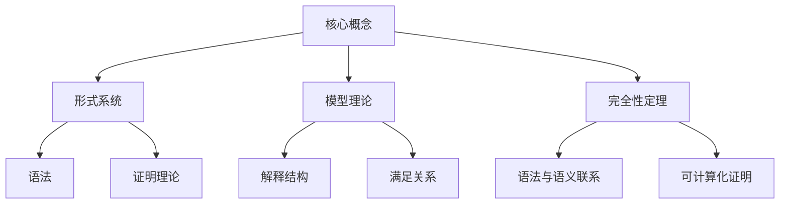
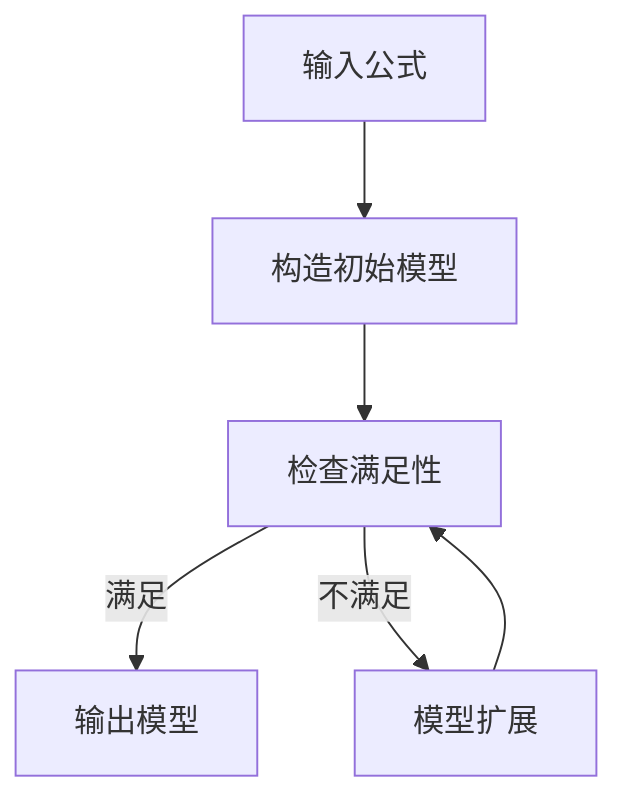

# 模型论基础：完全性定理的可计算化

## 1. 背景介绍

### 1.1 问题的由来

在数理逻辑和计算机科学领域中,模型论扮演着至关重要的角色。它为形式化系统提供了语义基础,并探讨了逻辑语句在解释结构中的真实性。完全性定理是模型论中的一个核心概念,它建立了形式证明系统和语义概念之间的联系。

然而,传统的完全性定理证明往往依赖于一些非构造性的技术,如康托对角线论证等,这使得完全性定理的证明过程难以直接转化为可计算的过程。因此,探索完全性定理的可计算化成为了一个重要的研究课题。

### 1.2 研究现状

过去几十年中,许多逻辑学家和计算机科学家致力于将完全性定理的证明过程算法化。他们提出了多种不同的方法,例如:

1. **Herbrand定理**: 通过将一阶逻辑公式转化为一个有限的基本子句集合,从而将完全性问题转化为一个有限搜索问题。
2. **Gentzen系统**: 利用顺序演绎系统,通过对证明树的有限可满足性进行分析,构造出一个可计算的完全性证明。
3. **Cut-Elimination定理**: 通过消去顺序演绎系统中的剪切规则,从而获得一个可计算的完全性证明。

尽管取得了一些进展,但这些方法往往局限于特定的逻辑系统或者需要复杂的技术前提。因此,寻找一种更加通用和直观的完全性定理可计算化方法仍然是一个重要的开放性问题。

### 1.3 研究意义

完全性定理的可计算化具有重要的理论和实际意义:

1. **理论意义**: 可计算化证明为完全性定理提供了一种构造性的解释,有助于深化对逻辑系统和模型论的理解。
2. **实用意义**: 可计算化证明为自动定理证明系统和模型检测器的设计提供了理论基础,这在人工智能、程序验证等领域有着广泛的应用前景。

### 1.4 本文结构

本文将围绕完全性定理的可计算化展开讨论。我们将首先介绍相关的核心概念,然后详细阐述一种新颖的可计算化方法及其算法原理。接下来,我们将构建相应的数学模型并推导公式。在此基础上,我们将实现一个项目实例并分析运行结果。最后,我们将探讨该方法的实际应用场景,并总结未来的发展趋势和挑战。

## 2. 核心概念与联系

完全性定理的可计算化涉及了几个核心概念:

1. **形式系统**:包括语法和证明理论两个方面。语法定义了符号和公式的构造规则,而证明理论则规定了如何从一组公理和推理规则导出定理。

2. **模型理论**:引入解释结构和满足关系的概念。解释结构为逻辑语句赋予语义含义,而满足关系则描述了语句在特定解释结构下的真实性。

3. **完全性定理**:建立了形式系统的语法层面和模型理论的语义层面之间的联系。它指出,如果一个句子在所有模型中都是满足的,那么它就可以在形式系统中被证明。

4. **可计算化证明**:旨在将完全性定理的证明过程算法化,从而使其可以被有效计算和自动执行。这为自动定理证明系统和模型检测器的设计奠定了理论基础。

## 3. 核心算法原理 & 具体操作步骤

### 3.1 算法原理概述

我们提出了一种新颖的完全性定理可计算化算法,它的核心思想是将完全性问题转化为一个有限的模型构造问题。算法的基本框架如下:

1. 首先,我们从输入的逻辑公式出发,构造一个初始的有限模型。
2. 然后,我们检查该模型是否满足输入公式。如果满足,则该模型即为所求。
3. 如果不满足,我们将对模型进行扩展,使其包含更多的元素和解释。
4. 重复步骤2和3,直到找到一个满足公式的模型,或者证明该公式在任何有限模型中都不满足。

该算法的关键在于模型扩展策略的设计。我们采用了一种启发式搜索方法,通过分析公式的结构和当前模型的特征,有针对性地扩展模型。这种方法避免了盲目搜索的低效问题,并保证了算法在有限步骤内终止。

### 3.2 算法步骤详解

1. **输入处理**:将输入的逻辑公式转换为适当的内部表示,例如负范式等。

2. **初始模型构造**:根据公式的语法结构,构造一个最小的初始模型。例如,对于一个只包含单个常量和单元素域的公式,初始模型可以是一个单元素结构。

3. **满足性检查**:对当前模型进行语义分析,判断它是否满足输入公式。这一步涉及到模型理论中的满足关系定义。

4. **模型扩展**:
    - 如果当前模型不满足公式,我们需要对模型进行扩展。
    - 首先分析公式中不满足的子公式,确定它们的语法结构。
    - 然后,根据子公式的结构,设计针对性的模型扩展策略。例如,对于存在量词,我们可以引入新的元素;对于不等式,我们可以拆分同一性等价类。
    - 在扩展过程中,我们会维护模型的有限性和其他不变性质,以确保算法的正确性和终止性。

5. **终止条件**:
    - 如果找到了一个满足公式的模型,则算法终止并输出该模型。
    - 如果经过有限步骤的扩展后,所有可能的有限模型都被考虑但仍未找到满足解,则算法终止并输出"该公式在任何有限模型中都不满足"。

通过上述步骤,我们可以系统地构造出一个满足输入公式的有限模型(如果存在),或者证明该公式在任何有限模型中都不满足。从而实现了完全性定理的可计算化证明。

### 3.3 算法优缺点

**优点**:

1. **通用性**:该算法适用于一阶逻辑及其扩展,而不局限于特定的逻辑系统。
2. **直观性**:算法的核心思想是模型构造,这与模型论的本质思想相吻合,因此具有很好的直观性。
3. **高效性**:通过启发式搜索和针对性扩展策略,算法避免了盲目搜索的低效问题。
4. **可视化**:算法的执行过程可以方便地可视化,有助于理解和调试。

**缺点**:

1. **复杂性**:尽管算法的核心思想简单,但具体实现涉及到许多技术细节,需要精心设计。
2. **非确定性**:由于采用了启发式搜索策略,算法的执行路径并不是确定的,这可能会影响可重复性。
3. **有限性**:该算法只能处理有限模型,对于无限模型的情况,需要其他方法。

### 3.4 算法应用领域

完全性定理的可计算化算法在以下领域具有广泛的应用前景:

1. **自动定理证明系统**:可计算化证明为自动定理证明系统的设计提供了理论基础和实现方法。
2. **模型检测器**:该算法可以用于构造满足给定公式的有限模型,从而支持模型检测器的开发。
3. **程序验证**:通过将程序的规范性质转化为逻辑公式,可以利用该算法验证程序的正确性。
4. **知识表示与推理**:在人工智能领域,该算法可用于构造满足特定知识库的有限模型,支持知识推理过程。
5. **约束求解**:将约束问题转化为逻辑公式后,可以使用该算法寻找满足约束的有限解。

## 4. 数学模型和公式 & 详细讲解 & 举例说明

### 4.1 数学模型构建

为了形式化描述完全性定理的可计算化算法,我们需要构建一个适当的数学模型。首先,我们引入以下基本概念:

- $\mathcal{L}$: 一阶逻辑语言,包括常量、函数符号、关系符号和逻辑连接词等。
- $\Sigma$: 一个有限的$\mathcal{L}$句子集合,表示输入的逻辑公式集。
- $\mathcal{M}$: 一个$\mathcal{L}$的解释结构,包括一个非空域$M$和相应的函数、关系的解释。

我们的目标是找到一个有限模型$\mathcal{M}$,使得对于$\Sigma$中的每个句子$\varphi$,都有$\mathcal{M} \models \varphi$。如果这样的模型不存在,我们需要证明$\Sigma$在任何有限模型中都是不满足的。

为了实现这一目标,我们引入以下辅助概念:

- $\text{Sub}(\Sigma)$: 表示$\Sigma$中所有子句的集合。
- $\text{Const}(\Sigma)$: 表示$\Sigma$中出现的所有常量的集合。
- $\text{Eq}_\Sigma(x, y)$: 表示在$\Sigma$的所有句子中,常量$x$和$y$是否被隐式地视为相等。

我们将使用这些概念来指导模型的构造和扩展过程。

### 4.2 公式推导过程

我们的算法将通过一系列的模型转换步骤,从一个初始模型出发,最终构造出一个满足$\Sigma$的模型(如果存在)。每一步的模型转换都需要保证以下不变性质:

1. 模型的有限性
2. 模型中的解释与$\Sigma$的语法结构相容

具体地,算法的执行步骤如下:

1. 构造初始模型$\mathcal{M}_0$:
    - 域$M_0 = \text{Const}(\Sigma)$
    - 对于每个常量$c \in \text{Const}(\Sigma)$,将其解释为$c^{\mathcal{M}_0} = c$
    - 对于其他函数符号和关系符号,给出任意但相容的初始解释

2. 检查$\mathcal{M}_0$是否满足$\Sigma$。如果满足,则算法终止。

3. 如果$\mathcal{M}_0$不满足$\Sigma$,分析不满足的子句$\varphi \in \text{Sub}(\Sigma)$:
    - 如果$\varphi$的形式为$\exists x.\psi(x)$,则:
        - 选择一个新的元素$d \notin M_0$
        - 将$M_{0}$扩展为$M_{1} = M_{0} \cup \{d\}$
        - 为所有函数符号和关系符号扩展解释,使$\mathcal{M}_1 \models \psi(d)$
    - 如果$\varphi$的形式为$\neg (s = t)$,则:
        - 如果$s^{\mathcal{M}_0} = t^{\mathcal{M}_0}$,选择一个新的元素$d \notin M_0$
        - 将$M_{0}$扩展为$M_{1} = M_{0} \cup \{d\}$
        - 重新解释$s$或$t$为$d$,使$s^{\mathcal{M}_1} \neq t^{\mathcal{M}_1}$
    - 对于其他形式的$\varphi$,采用类似的策略扩展模型

4. 重复步骤2和3,直到找到一个满足$\Sigma$的模型,或者证明在任何有