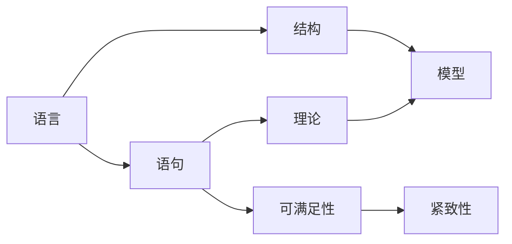

# 模型论基础：紧致性定理与LST定理

作者：禅与计算机程序设计艺术 / Zen and the Art of Computer Programming

## 1. 背景介绍
### 1.1 问题的由来
模型论作为数理逻辑的重要分支,在现代数学、计算机科学等领域有着广泛的应用。它主要研究数学结构及其性质,揭示了形式语言与其模型之间的深刻联系。在模型论的发展历程中,紧致性定理和Löwenheim-Skolem-Tarski定理(简称LST定理)是两个里程碑式的成果,对后续模型论的发展产生了深远影响。
### 1.2 研究现状
目前,国内外学者对紧致性定理和LST定理的研究已经取得了丰硕成果。一方面,人们不断深化对这两个定理内涵的理解,挖掘其中蕴含的深刻思想;另一方面,研究者们致力于将其应用到数学、计算机科学等领域,取得了一系列原创性成果。但是,对于这两个定理的研究依然存在一些问题,如如何进一步拓展其应用范围、如何将其与其他数学分支相结合等,有待进一步探索。
### 1.3 研究意义
深入研究紧致性定理和LST定理,对于丰富和发展模型论具有重要意义。一方面,这有助于我们更好地理解形式语言与其模型之间的关系,加深对数学结构的认识;另一方面,这两个定理在计算机科学尤其是形式化验证、程序分析等领域有着广泛应用,深化相关研究可以促进这些领域的进一步发展。此外,这两个定理蕴含了丰富的数学思想,对于拓展我们的数学视野、开拓创新思路也有重要启示。
### 1.4 本文结构
本文将重点探讨模型论中的两大基础定理:紧致性定理和LST定理。第2部分介绍模型论的核心概念,厘清基本术语和记号。第3部分详细讨论紧致性定理的内容、证明思路和应用。第4部分重点探讨LST定理,给出其数学模型、证明过程和一些推论。第5部分通过具体实例来展示这两个定理的应用。第6部分讨论其在数学和计算机科学中的应用场景。第7部分介绍相关的学习资源和工具。第8部分总结全文,展望模型论未来的发展方向和挑战。

## 2. 核心概念与联系
在探讨紧致性定理和LST定理之前,我们先来回顾一下模型论的一些核心概念。

**语言**: 在模型论中,语言是指一阶逻辑语言,它由逻辑符号(如量词$\forall$,$\exists$,逻辑连接词$\wedge$,$\vee$,$\neg$,$\rightarrow$,$\leftrightarrow$等)和非逻辑符号(如常元、函数、谓词等)组成。通常用$\mathcal{L}$表示。

**结构**: $\mathcal{L}$-结构$\mathcal{M}$由一个非空集合$M$(称为论域)和$\mathcal{L}$中的非逻辑符号在$M$上的解释组成。即$\mathcal{M}=<M,\{c^{\mathcal{M}}\}_{c常元},\{f^{\mathcal{M}}\}_{f函数},\{R^{\mathcal{M}}\}_{R谓词}>$

**语句**: 由一阶逻辑语言$\mathcal{L}$构造的合式公式称为$\mathcal{L}$-语句。如果语句中不含自由变元,则称为闭语句。

**理论**: 给定一阶语言$\mathcal{L}$,由一些$\mathcal{L}$-语句组成的集合$T$称为$\mathcal{L}$-理论。通常要求$T$是可演绎闭包的,即$T\vdash \varphi \Rightarrow \varphi \in T$。

**模型**: 如果$\mathcal{L}$-结构$\mathcal{M}$满足理论$T$中的所有语句,即对任意$\varphi \in T$,都有$\mathcal{M} \vDash \varphi$,则称$\mathcal{M}$是$T$的一个模型,记为$\mathcal{M} \vDash T$。

**可满足性**: 给定一阶语言$\mathcal{L}$和语句集$\Sigma$,如果存在$\mathcal{L}$-结构$\mathcal{M}$,使得对任意$\varphi \in \Sigma$,都有$\mathcal{M} \vDash \varphi$,则称$\Sigma$是可满足的。

**紧致性**: 设$\mathcal{L}$为一阶语言,$\Sigma$为$\mathcal{L}$-语句集。如果$\Sigma$的任意有限子集都是可满足的,则称$\Sigma$是紧致的。

下图展示了这些核心概念之间的联系:

理解这些概念之间的联系,是掌握紧致性定理和LST定理的基础。在后续章节中,我们将基于这些概念来详细讨论这两大定理。

## 3. 核心算法原理 & 具体操作步骤
### 3.1 算法原理概述
紧致性定理和LST定理虽然描述的是语句集的性质,但其证明过程往往需要用到一些重要的模型论算法,如Henkin构造法、基本嵌入法等。这些算法巧妙地利用了语句集的特点,通过构造新的结构或嵌入已有结构,最终得到所需的模型。
### 3.2 算法步骤详解
下面我们以Henkin构造法为例,来详细讲解其步骤:

1) 设$\Sigma$为给定的$\mathcal{L}$-语句集,令$\Sigma_0=\Sigma$。

2) 枚举$\mathcal{L}$中的全称语句$\{\forall x \varphi_i(x)|i<\omega\}$。

3) 对每个$i<\omega$,引入新的常元$c_i$,令$\Sigma_{i+1}=\Sigma_i \cup \{\varphi_i(c_i)\}$。

4) 令$\Sigma^*=\bigcup_{i<\omega}\Sigma_i$,则$\Sigma^*$为$\Sigma$的Henkin扩张。可证明:$\Sigma$在$\mathcal{L}$中可满足$\Leftrightarrow$ $\Sigma^*$在$\mathcal{L}\cup\{c_i|i<\omega\}$中可满足。

5) 令$\mathcal{C}=\{c_i|i<\omega\}$,定义等价关系$\equiv$:$c_i \equiv c_j \Leftrightarrow \Sigma^* \vdash c_i=c_j$。

6) 令$M=\mathcal{C}/\equiv$,定义$\mathcal{L}$-结构$\mathcal{M}$如下:

   $c^{\mathcal{M}}=[c]_{\equiv}$, 其中$c$是$\mathcal{L}$中的常元
   
   $f^{\mathcal{M}}([a_1]_{\equiv},...,[a_n]_{\equiv})=[f(a_1,...,a_n)]_{\equiv}$,其中$f$是$\mathcal{L}$中的$n$元函数
   
   $R^{\mathcal{M}}=\{([a_1]_{\equiv},...,[a_n]_{\equiv})|\Sigma^* \vdash R(a_1,...,a_n)\}$,其中$R$是$\mathcal{L}$中的$n$元谓词

7) 可证明:$\mathcal{M} \vDash \Sigma^*$,从而$\mathcal{M} \vDash \Sigma$。

### 3.3 算法优缺点
Henkin构造法的优点在于,它提供了一种构造可满足性模型的一般方法,在许多定理的证明中都发挥了重要作用。特别地,它保证了从语法层面构造出语义模型,揭示了语法与语义之间的紧密联系。

但Henkin构造法也存在一定局限性。首先,它构造出的模型往往是非标准的,可能包含了原语言$\mathcal{L}$以外的元素。其次,对无穷语句集,Henkin构造法未必能终止,因此只能作为存在性证明,而无法给出具体的构造过程。

### 3.4 算法应用领域
Henkin构造法作为一种通用的模型构造技术,在数理逻辑、模型论等领域有广泛应用。除了用于证明紧致性定理和LST定理,它还可以用来证明其他重要结论,如Gödel完全性定理、Robinson一致性定理等。同时,在计算机科学领域,Henkin构造法也启发了一些自动定理证明和程序验证方面的研究。

## 4. 数学模型和公式 & 详细讲解 & 举例说明
### 4.1 数学模型构建
在形式化描述紧致性定理和LST定理之前,我们先引入一些记号。设$\mathcal{L}$为一阶语言,$\Sigma$为$\mathcal{L}$-语句集。记:

- $\Sigma \vDash \varphi$ :表示$\varphi$是$\Sigma$的语义结论,即从$\Sigma$出发可以推出$\varphi$。

- $\Sigma \vdash \varphi$ :表示$\varphi$是$\Sigma$的语法结论,即存在从$\Sigma$到$\varphi$的形式证明。

- $\Sigma$一致:表示$\Sigma$没有矛盾,即不存在语句$\varphi$使得$\Sigma \vdash \varphi$且$\Sigma \vdash \neg \varphi$。

- $\Sigma$可满足:表示存在$\mathcal{L}$-结构$\mathcal{M}$使得$\mathcal{M} \vDash \Sigma$。

- $Th(\mathcal{M})$:表示$\mathcal{L}$-结构$\mathcal{M}$的全体有效语句组成的集合,即$Th(\mathcal{M})=\{\varphi|\mathcal{M} \vDash \varphi\}$。

有了这些记号,我们就可以给出紧致性定理的严格表述:

**定理(紧致性定理)** 设$\mathcal{L}$为一阶语言,$\Sigma$为$\mathcal{L}$-语句集,则以下三条等价:

1) $\Sigma$是一致的;

2) $\Sigma$是可满足的;

3) $\Sigma$的任意有限子集都是可满足的。

LST定理刻画了语句集的可满足性模型的基数性质,可表述为:

**定理(Löwenheim-Skolem-Tarski定理)** 设$\mathcal{L}$为一阶语言,$\Sigma$为$\mathcal{L}$-语句集,则:

1) 如果$\Sigma$有无穷模型,则它有任意大的无穷模型;

2) 如果$\Sigma$有无穷模型,则它有最多与$\mathcal{L}$同基数的模型;

3) 如果$\mathcal{M} \vDash \Sigma$,则对任意$X \subseteq M$,存在$\mathcal{N} \vDash \Sigma$,使得$X \subseteq N$且$|N| \leq |X|+|\mathcal{L}|$。

### 4.2 公式推导过程
以下是紧致性定理的一个简要证明:

$(1) \Rightarrow (2)$: 设$\Sigma$一致,利用Henkin构造法,可构造$\mathcal{L}$-结构$\mathcal{M}$使得$\mathcal{M} \vDash \Sigma$,从而$\Sigma$可满足。

$(2) \Rightarrow (3)$: 设$\Sigma$可满足,则存在$\mathcal{M} \vDash \Sigma$。任取$\Sigma$的有限子集$\Sigma_0$,显然也有$\mathcal{M} \vDash \Sigma_0$,故$\Sigma_0$可满足。

$(3) \Rightarrow (1)$: 反设$\Sigma$不一致,则存在$\varphi$使得$\Sigma \vdash \varphi$且$\Sigma \vdash \neg \varphi$。由压缩定理,存在$\Sigma$的有限子集$\Sigma_0$使得$\Sigma_0 \vdash \varphi$且$\Sigma_0 \vdash \neg \varphi$,从而