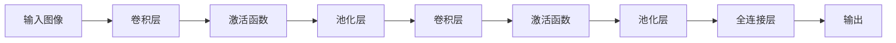

# 池化层 (Pooling Layer) 原理与代码实例讲解

关键词：池化层, 卷积神经网络, 下采样, 最大池化, 平均池化, 特征提取

## 1. 背景介绍

### 1.1 问题的由来

在卷积神经网络(CNN)中,卷积层通过卷积操作提取图像的局部特征。但是,直接将卷积层的输出传递给下一层会导致参数量过大,计算复杂度高,并且容易出现过拟合的问题。为了解决这些问题,需要在卷积层之后引入池化层(Pooling Layer)对卷积层的输出进行下采样(downsampling),减少特征图的空间维度,同时保留重要的特征信息。

### 1.2 研究现状

池化层作为卷积神经网络中的重要组成部分,已经在图像分类、目标检测、语义分割等领域得到了广泛应用。目前常用的池化方式包括最大池化(Max Pooling)和平均池化(Average Pooling)。一些研究者也提出了其他变体,如空间金字塔池化(Spatial Pyramid Pooling)、多尺度订制池化(Multi-scale Orderless Pooling)等,以进一步提高池化层的性能。

### 1.3 研究意义

深入理解池化层的原理和实现对于设计高效的卷积神经网络架构具有重要意义。通过合理设置池化层的类型、核大小、步长等参数,可以在降低计算复杂度的同时保留关键特征,提高模型的泛化能力。此外,池化层的引入还具有一定的平移不变性(translation invariance),使得模型对目标位置的微小变化具有鲁棒性。

### 1.4 本文结构

本文将从以下几个方面对池化层进行详细讲解:

1. 介绍池化层的核心概念与作用
2. 详细阐述最大池化和平均池化的算法原理与操作步骤 
3. 给出池化层的数学模型与公式推导
4. 通过代码实例演示池化层的具体实现
5. 讨论池化层在实际应用场景中的使用
6. 推荐池化层相关的学习资源与开发工具
7. 总结池化层的研究现状,展望未来发展趋势与挑战
8. 附录中列出常见问题与解答

## 2. 核心概念与联系

池化层的核心作用是对输入特征图进行下采样,减小特征图的空间尺寸,从而减少网络的参数量和计算量。同时,池化层还具有提取显著特征、引入平移不变性等重要功能。

在卷积神经网络中,池化层通常紧跟在卷积层之后。卷积层通过卷积核在输入特征图上滑动,提取局部特征。而池化层则对卷积层输出的特征图进行压缩,保留显著特征的同时降低维度。池化层和卷积层的结合使得网络能够逐层提取图像的层次化特征表示。

常见的池化操作包括最大池化和平均池化:
- 最大池化:在池化窗口内选取最大值作为输出,提取显著特征
- 平均池化:在池化窗口内计算元素的平均值作为输出,平滑特征

除了最大池化和平均池化,还有一些其他的池化变体,如空间金字塔池化、多尺度订制池化等,它们在特定任务中能够取得更好的效果。

池化层的引入带来了以下几点好处:
1. 减少参数量和计算复杂度,降低过拟合风险
2. 提取显著特征,增强特征的鲁棒性
3. 引入平移不变性,提高模型对目标位置变化的鲁棒性
4. 扩大感受野,使网络能够捕捉更大尺度的特征

下图展示了池化层在卷积神经网络中的位置以及与其他层的联系:



## 3. 核心算法原理 & 具体操作步骤

### 3.1 算法原理概述

池化层的核心思想是对输入特征图进行下采样,减小特征图的空间尺寸。通过在特征图上滑动固定大小的池化窗口,并对窗口内的元素进行某种操作(如取最大值或平均值),得到输出特征图。

设输入特征图的大小为 $H \times W \times C$,其中 $H$ 为高度,$W$ 为宽度,$C$ 为通道数。定义池化窗口的大小为 $K \times K$,步长为 $S$。则输出特征图的大小为 $H' \times W' \times C$,其中:

$$
H' = \lfloor \frac{H - K}{S} \rfloor + 1 \\
W' = \lfloor \frac{W - K}{S} \rfloor + 1
$$

其中 $\lfloor \cdot \rfloor$ 表示向下取整。

### 3.2 算法步骤详解

以最大池化为例,详细介绍池化层的操作步骤:

1. 在输入特征图上滑动大小为 $K \times K$ 的池化窗口,步长为 $S$。
2. 对于池化窗口覆盖的区域,取其中的最大值作为输出特征图上对应位置的值。
3. 重复步骤 1 和 2,直到遍历完整个输入特征图。

举例说明,假设输入特征图大小为 $4 \times 4$,池化窗口大小为 $2 \times 2$,步长为 2,则最大池化的过程如下:

```
输入特征图:
1 3 5 7
2 4 6 8
1 2 3 4
5 6 7 8

输出特征图:
4 8
6 8
```

对于平均池化,操作步骤与最大池化类似,只是将步骤 2 中的取最大值改为计算平均值。

### 3.3 算法优缺点

最大池化和平均池化各有优缺点:

- 最大池化:
  - 优点:提取显著特征,对噪声具有鲁棒性
  - 缺点:可能丢失一些细节信息
- 平均池化:  
  - 优点:考虑了池化窗口内所有元素的贡献,保留更多信息
  - 缺点:对噪声敏感,可能削弱显著特征

在实践中,最大池化更为常用,因为其能够提取显著特征,且具有更强的平移不变性。但在某些任务中,平均池化也能取得不错的效果。

### 3.4 算法应用领域

池化层广泛应用于各种卷积神经网络架构中,如 LeNet、AlexNet、VGGNet、GoogLeNet、ResNet 等。它在以下领域发挥着重要作用:

- 图像分类:通过池化层降低特征图尺寸,减少参数量,提高分类精度。
- 目标检测:利用池化层提取显著特征,增强对目标位置变化的鲁棒性。
- 语义分割:通过池化层扩大感受野,捕捉更大尺度的上下文信息。
- 人脸识别:使用池化层提取人脸的关键特征,如眼睛、鼻子、嘴巴等。

除了以上领域,池化层在医学图像分析、遥感图像处理、视频理解等方面也有广泛应用。

## 4. 数学模型和公式 & 详细讲解 & 举例说明

### 4.1 数学模型构建

对于最大池化,假设输入特征图为 $\mathbf{X} \in \mathbb{R}^{H \times W \times C}$,池化窗口大小为 $K \times K$,步长为 $S$。定义池化窗口的位置为 $(i, j)$,则输出特征图 $\mathbf{Y} \in \mathbb{R}^{H' \times W' \times C}$ 上对应位置 $(i', j')$ 的值为:

$$
\mathbf{Y}_{i',j',c} = \max_{0 \leq m,n < K} \mathbf{X}_{i'+m,j'+n,c}
$$

其中 $0 \leq i' < H', 0 \leq j' < W', 0 \leq c < C$。

对于平均池化,输出特征图上对应位置的值为:

$$
\mathbf{Y}_{i',j',c} = \frac{1}{K^2} \sum_{m=0}^{K-1} \sum_{n=0}^{K-1} \mathbf{X}_{i'+m,j'+n,c}
$$

### 4.2 公式推导过程

以最大池化为例,推导输出特征图的大小。

设输入特征图大小为 $H \times W$,池化窗口大小为 $K \times K$,步长为 $S$。

在