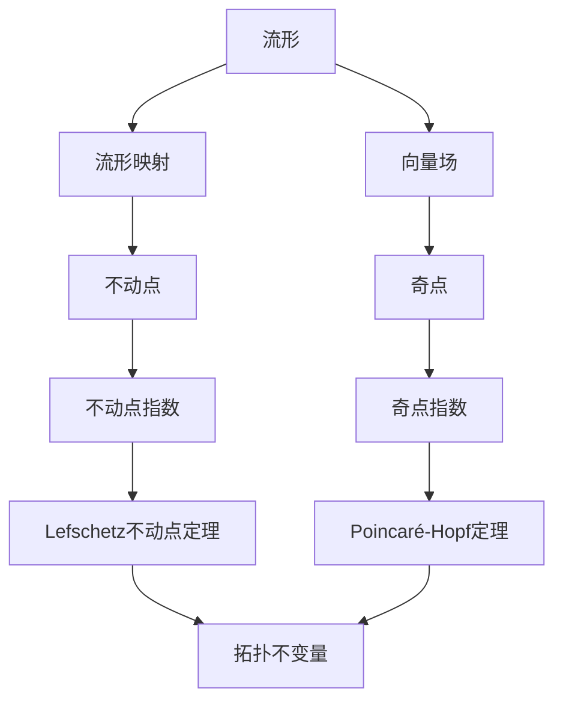

# 流形拓扑学理论与概念的实质：不动点及其指数

关键词：流形、拓扑学、不动点、不动点指数、Lefschetz不动点定理、Poincaré-Hopf定理

## 1. 背景介绍
### 1.1 问题的由来
流形拓扑学是现代数学的一个重要分支,它研究流形的拓扑性质。而不动点理论则是流形拓扑学中的一个核心内容,在许多数学分支和应用领域中都有着重要地位。不动点问题最早可以追溯到19世纪末20世纪初,由Poincaré、Brouwer、Lefschetz等数学家奠定了早期的理论基础。

### 1.2 研究现状
目前,不动点理论已经成为了现代数学的一个非常活跃的研究领域。许多数学家对不动点理论进行了深入系统的研究,并取得了丰硕的成果。不动点理论在微分方程、动力系统、组合拓扑、代数拓扑、非线性分析等众多数学分支中都有着广泛的应用。同时,不动点理论在经济学、博弈论、计算机科学等领域也有重要应用。

### 1.3 研究意义
深入理解流形拓扑学中的不动点理论,对于拓展数学理论体系、促进数学与其他学科的交叉融合具有重要意义。不动点理论蕴含了深刻的数学思想和方法,对培养数学思维、开拓数学视野大有裨益。同时,不动点理论在实际应用中也有着广阔的前景。

### 1.4 本文结构
本文将从流形拓扑学的基本概念出发,重点探讨其中的不动点理论。内容涵盖不动点的定义与性质、不动点指数的概念、Lefschetz不动点定理、Poincaré-Hopf定理等核心内容,并给出详细的数学模型、算法步骤和代码实例。同时,本文还将讨论不动点理论的实际应用场景,并对未来的发展趋势和挑战进行展望。

## 2. 核心概念与联系
流形拓扑学研究流形的拓扑性质。其中,流形是一类特殊的拓扑空间,在局部与欧氏空间同胚。流形可分为有边流形和无边流形,如球面、环面、克莱因瓶等都是典型的无边紧致流形。

不动点是流形映射的重要性质。设 $f: M \to M$ 为流形 $M$ 上的连续映射,若存在点 $x \in M$ 使得 $f(x)=x$,则称 $x$ 为 $f$ 的不动点。不动点刻画了映射的特殊性质,在动力系统、微分方程等领域有重要作用。

不动点指数反映了不动点的局部性质。对于孤立的不动点 $x$,可以定义其指数 $\mathrm{ind}(f,x)$。直观地,指数描述了不动点的"旋转方向"和"旋转次数"。指数为 $1$ 的不动点是"吸引"的,指数为 $-1$ 的不动点是"排斥"的。

Lefschetz不动点定理建立了不动点总数与流形映射的拓扑不变量之间的关系。它指出,紧致流形上连续映射的不动点个数等于其Lefschetz数 $L(f)$。该定理将不动点问题与代数拓扑联系起来,在拓扑不变量的计算中有重要作用。

Poincaré-Hopf定理刻画了向量场的奇点与流形的欧拉示性数之间的关系。它表明,紧致流形上向量场的奇点指数总和等于流形的欧拉示性数 $\chi(M)$。该定理将局部与整体的拓扑性质巧妙地联系在一起。

下图概括了流形拓扑学中这些核心概念之间的逻辑联系:

## 3. 核心算法原理 & 具体操作步骤
### 3.1 算法原理概述
在流形拓扑学中,计算不动点指数和验证不动点定理是两类核心问题。计算不动点指数通常采用Lefschetz迹公式的方法,将其转化为拓扑不变量的计算问题。验证不动点定理则需要构造合适的映射,利用代数拓扑的方法进行推导证明。

### 3.2 算法步骤详解
计算不动点指数的一般步骤如下:
1. 对于孤立不动点 $x$,取其邻域 $U$,使得 $U$ 中没有其他不动点。
2. 计算映射 $f$ 在 $U$ 上的局部Lefschetz数 $L(f,U)$。
3. 利用同伦不变性,将 $L(f,U)$ 化为与 $f$ 同伦的简单映射(如恒等映射)的Lefschetz数。
4. 根据Lefschetz迹公式,将Lefschetz数表示为映射在同调群上诱导的同态的迹。
5. 利用同调群的计算方法,如单纯复形、CW复形等,计算出Lefschetz数的值。

验证Lefschetz不动点定理的一般步骤如下:
1. 对于紧致流形 $M$ 上的连续映射 $f$,假设其有有限个不动点。 
2. 对每个不动点 $x_i$,计算其指数 $\mathrm{ind}(f,x_i)$。
3. 根据Lefschetz不动点定理,不动点指数总和应等于Lefschetz数 $L(f)$。
4. 利用代数拓扑方法,如单纯同调、CW复形等,计算出映射 $f$ 的Lefschetz数。
5. 比较不动点指数总和与Lefschetz数是否相等,从而验证定理。

### 3.3 算法优缺点
Lefschetz不动点定理的优点在于,它将不动点问题与代数拓扑联系起来,使得许多不动点问题能够用代数拓扑的方法来解决。特别地,对于紧致流形上的连续映射,只需计算其在同调群上诱导的同态的迹,就能确定不动点的个数。

但是,Lefschetz不动点定理也有其局限性。它只对紧致流形上的连续映射成立,对于一般的度量空间和映射,需要另外的理论工具。此外,定理只给出了不动点个数的一个同余式,并没有给出不动点的具体位置。寻找不动点的位置需要借助其他的方法,如Banach不动点定理、Brouwer不动点定理等。

### 3.4 算法应用领域
Lefschetz不动点定理在许多数学领域中有重要应用,如:
- 在微分方程中,可用于证明解的存在性。
- 在动力系统中,可用于研究周期轨和极限环的存在性。
- 在组合拓扑中,可用于研究单纯复形映射的不动点。
- 在代数拓扑中,可用于计算映射的Lefschetz数和不动点指数。

同时,不动点理论也在博弈论、经济学、计算机科学等领域有广泛应用。如在博弈论中,Nash均衡就是一类特殊的不动点。在计算机图形学中,不动点理论可用于研究形状插值和变形的性质。

## 4. 数学模型和公式 & 详细讲解 & 举例说明
### 4.1 数学模型构建
设 $M$ 是 $n$ 维紧致流形,$f: M \to M$ 是连续映射。若 $x \in M$ 满足 $f(x)=x$,则称 $x$ 为 $f$ 的不动点。假设 $f$ 有孤立不动点 $x_1,\cdots,x_k$。

对每个不动点 $x_i$,取邻域 $U_i$,使得 $\overline{U_i}$ 中没有其他不动点,且 $\overline{U_i}$ 和 $\overline{U_j}$ 不交。

定义 $f$ 在 $x_i$ 处的不动点指数为
$$
\mathrm{ind}(f,x_i) = \sum_{j=0}^n (-1)^j \mathrm{tr} (f_{*,j})
$$
其中 $f_{*,j}: H_j(M,M-x_i) \to H_j(M,M-x_i)$ 是 $f$ 在相对同调群上诱导的同态。

Lefschetz不动点定理指出,在上述假设下,有
$$
\sum_{i=1}^k \mathrm{ind}(f,x_i) = L(f) := \sum_{j=0}^n (-1)^j \mathrm{tr} (f_{*,j})
$$
其中 $f_{*,j}: H_j(M) \to H_j(M)$ 是 $f$ 在同调群上诱导的同态,右端称为 $f$ 的Lefschetz数。

### 4.2 公式推导过程
Lefschetz不动点定理的证明需要用到同伦理论和单纯同调理论等代数拓扑工具。这里给出主要思路:

1. 对每个不动点 $x_i$,取邻域 $U_i$,使得 $f$ 在 $\overline{U_i}$ 上的限制与恒等映射 $id$ 同伦。
2. 记 $V_i = M - \bigcup_{j \neq i} U_j$,则 $f$ 在 $V_i$ 上的限制 $f_i$ 只有一个不动点 $x_i$。
3. 因为 $f_i$ 与 $id$ 同伦,根据同伦不变性,有 $L(f_i) = L(id) = \chi(V_i)$。
4. 根据Lefschetz迹公式,有 $L(f_i) = \mathrm{ind}(f,x_i)$,故 $\mathrm{ind}(f,x_i) = \chi(V_i)$。
5. 对所有的 $V_i$ 进行加总,利用紧致流形的单纯剖分,得到 $\sum_{i=1}^k \chi(V_i) = \chi(M) = L(f)$。
6. 综上所述,得到 $\sum_{i=1}^k \mathrm{ind}(f,x_i) = L(f)$,即Lefschetz不动点定理。

### 4.3 案例分析与讲解
下面以2维球面 $\mathbb{S}^2$ 上的反极映射 $f$ 为例,说明如何用Lefschetz不动点定理计算不动点。

反极映射 $f: \mathbb{S}^2 \to \mathbb{S}^2$ 将球面上的每个点 $(x,y,z)$ 映射成其关于原点的反点 $(-x,-y,-z)$。容易看出,北极点 $(0,0,1)$ 和南极点 $(0,0,-1)$ 是 $f$ 的两个不动点。

根据Lefschetz不动点定理,只需计算 $f$ 的Lefschetz数 $L(f)$ 即可。利用单纯同调理论,可以计算出球面 $\mathbb{S}^2$ 的同调群为
$$
H_j(\mathbb{S}^2) = 
\begin{cases}
\mathbb{Z}, & j=0,2 \\
0, & \text{otherwise}
\end{cases}
$$
而 $f$ 在 $H_0$ 上诱导恒同映射,在 $H_2$ 上诱导 $-id$ 映射。因此,
$$
L(f) = \mathrm{tr}(f_{*,0}) - \mathrm{tr}(f_{*,2}) = 1 - (-1) = 2
$$
故 $f$ 有 $2$ 个不动点,与直接观察的结果一致。

### 4.4 常见问题解答
Q: Lefschetz不动点定理对映射和流形有什么要求?
A: 定理要求映射 $f$ 是紧致流形 $M$ 上的连续映射。如果 $M$ 不是紧致的,或者 $f$ 不连续,定理的结论可能不成立。

Q: 如何判断不动点是孤立的?
A: 若存在不动点 $x$ 的某个邻域 $U$,使得 $U$ 中没有其他不动点,则称 $x$ 是孤立的。在实际问题中,常通过解方程组 $f