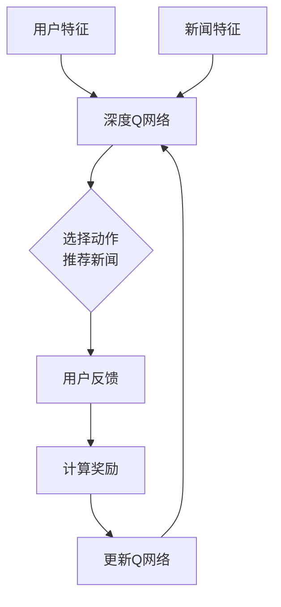

好的,我会按照您提供的要求和结构,以专业的技术语言撰写这篇文章。

# 深度 Q-learning:在新闻推荐中的应用

## 1. 背景介绍

### 1.1 问题的由来

在当今信息时代,新闻媒体面临着前所未有的挑战。用户可以从多种渠道获取海量的新闻信息,但同时也面临着信息过载的困扰。有效地为用户推荐感兴趣的新闻内容,不仅能提升用户体验,也是新闻媒体保持竞争力的关键。

传统的新闻推荐系统主要依赖编辑人员的主观判断或基于用户历史浏览记录的协同过滤算法。然而,这些方法存在一些固有的局限性:

1. 编辑推荐无法完全满足每个用户的个性化需求
2. 协同过滤算法难以处理新闻的时效性和用户兴趣的动态变化
3. 无法充分利用新闻内容的语义信息

因此,需要一种更加智能和个性化的新闻推荐系统,能够根据用户的实时反馈动态调整推荐策略,并充分利用新闻内容信息。

### 1.2 研究现状  

近年来,强化学习(Reinforcement Learning)作为一种有效的序列决策优化方法,受到了广泛关注。其中,Q-learning是强化学习中最成熟和应用最广泛的算法之一。传统的Q-learning算法主要应用于有限状态空间的决策问题,但在复杂问题(如新闻推荐)中,状态空间往往是连续的高维空间,传统算法难以高效求解。

为解决这一难题,研究人员提出了深度Q网络(Deep Q-Network,DQN),将深度神经网络引入Q-learning,用于估计Q值函数。DQN可以直接从原始的高维输入(如图像、文本等)中学习策略,显著提高了Q-learning在复杂问题上的应用能力,取得了卓越的成就。

### 1.3 研究意义

将DQN应用于新闻推荐系统,可以带来如下重要意义:

1. **个性化推荐**:DQN能够基于用户的历史行为,自动学习用户的个性化兴趣偏好,实现精准推荐。
2. **时效性**:DQN可根据用户的实时反馈(点击、停留时间等),动态调整推荐策略,确保推荐的新鲜度。
3. **语义理解**:DQN可从新闻文本中自动提取语义特征,理解新闻主题,提高推荐的针对性。
4. **可解释性**:与其他黑盒模型相比,DQN决策过程有较好的可解释性,有助于系统优化。

总之,DQN有望为新闻推荐系统带来全新的个性化和智能化体验。

### 1.4 本文结构

本文将首先介绍DQN在新闻推荐中的核心概念,包括Q-learning、深度神经网络等。然后详细阐述DQN的算法原理、数学模型及实现细节。接着通过实际案例,解析DQN在新闻推荐系统中的应用,并对未来发展趋势和面临的挑战进行展望。最后,列出常见问题解答,并推荐相关资源,以帮助读者深入学习该领域。

## 2. 核心概念与联系

在介绍DQN在新闻推荐中的应用之前,我们先来了解一些核心概念。

### 2.1 强化学习(Reinforcement Learning)

强化学习是一种基于环境交互的机器学习范式。不同于监督学习需要大量标注数据,强化学习的目标是通过与环境的互动,自主学习获取最大化累积奖励的策略。

强化学习系统通常由以下几个要素组成:

- **Agent(智能体)**: 在环境中执行动作的主体
- **Environment(环境)**: 智能体所处的外部世界
- **State(状态)**: 环境的当前状况
- **Action(动作)**: 智能体对环境的操作
- **Reward(奖励)**: 环境对智能体动作的反馈

智能体的目标是学习一个策略(Policy),通过观测当前状态,选择合适的动作序列,从而最大化未来的累积奖励。

在新闻推荐场景中,智能体可以是推荐系统,环境是用户、新闻库等,状态可以是用户特征、新闻特征等,动作是推荐新闻给用户,奖励则可以是用户对推荐新闻的反馈(点击、停留时间等)。

### 2.2 Q-learning

Q-learning是强化学习中一种常用的基于价值的算法,它试图直接估计一个动作价值函数Q(s,a),表示在状态s下执行动作a可获得的期望累积奖励。

Q-learning的核心是一个迭代更新规则,用于不断改进Q值的估计:

$$Q(s_t,a_t) \leftarrow Q(s_t,a_t) + \alpha[r_t + \gamma\max_aQ(s_{t+1},a) - Q(s_t,a_t)]$$

其中:
- $\alpha$是学习率
- $\gamma$是折现因子  
- $r_t$是立即奖励
- $\max_aQ(s_{t+1},a)$是下一状态的最大Q值

通过不断观测、执行动作并更新Q值,最终Q函数会收敛到最优策略。

然而,在高维连续状态空间中,Q-learning的表格形式难以高效求解,这时需要借助深度神经网络来拟合Q函数,这就是深度Q网络(DQN)的基本思路。

### 2.3 深度神经网络(Deep Neural Network)

深度神经网络是一种有强大的函数拟合能力的机器学习模型,常用于解决复杂的模式识别和回归问题。它由多个隐含层组成,每层对上一层的输出进行非线性变换,逐层提取输入数据的高阶特征。

在新闻推荐系统中,深度神经网络可以从用户特征(如年龄、地理位置等)和新闻特征(如标题、正文等)中自动提取高阶语义特征,作为Q网络的输入,从而拟合出准确的Q值函数。

### 2.4 深度Q网络(Deep Q-Network, DQN)

DQN是将深度神经网络引入Q-learning的创新,用于解决高维复杂问题。它的基本思路是:

1. 使用一个深度神经网络拟合Q值函数: $Q(s,a;\theta) \approx Q^*(s,a)$
2. 在每个时间步,选择Q值最大的动作执行: $a_t = \arg\max_aQ(s_t,a;\theta)$  
3. 获得奖励后,根据Q-learning更新规则优化网络参数$\theta$

DQN的优势在于:
1. 可直接从原始高维输入(如图像、文本等)中学习,无需人工设计特征
2. 通过神经网络的强大拟合能力,可以很好地近似任意复杂的Q函数
3. 可以处理连续的高维状态和动作空间

因此,DQN为解决复杂序列决策问题(如新闻推荐)提供了有力工具。

### 2.5 Mermaid流程图

下面是DQN在新闻推荐中的核心流程:

该流程图展示了DQN如何基于用户特征和新闻特征,选择推荐的新闻,并根据用户反馈动态调整策略。我们将在后续章节中详细解析这一过程。

## 3. 核心算法原理 & 具体操作步骤  

### 3.1 算法原理概述

DQN在新闻推荐中的核心思想,是将推荐过程建模为一个序列决策问题,并使用强化学习的方法求解最优推荐策略。具体来说:

1. 将推荐系统视为一个智能体(Agent),用户为环境(Environment)
2. 系统的状态由用户特征和新闻库特征构成
3. 动作是从新闻库中选择新闻推荐给用户
4. 奖励是根据用户对推荐新闻的反馈(点击、停留时间等)计算得到

DQN算法的目标是学习一个Q函数,可以预测在某个状态下执行某个动作(推荐某个新闻)的长期累积奖励。通过选择Q值最大的动作执行,可以获得最优的推荐策略。

为了处理高维连续的状态空间,DQN使用深度神经网络拟合Q函数。网络的输入是用户特征和新闻特征,输出是对应每个新闻的Q值。在训练过程中,通过与用户交互获取反馈,根据Q-learning更新规则不断优化网络参数,使Q值函数逐步收敛到最优。

### 3.2 算法步骤详解  

DQN在新闻推荐中的具体算法步骤如下:

1. **初始化**
   - 用一个随机的权重参数$\theta$初始化Q网络 
   - 初始化经验回放池D为空
   - 初始化状态s为用户特征和新闻库特征

2. **选择动作**
   - 从当前状态s中,通过Q网络选择Q值最大的动作a: $a = \arg\max_aQ(s,a;\theta)$
   - 将动作a(推荐新闻)呈现给用户

3. **获取反馈**
   - 观测用户对推荐新闻的反馈,计算奖励r(如根据点击、停留时间等)
   - 获取下一状态s'(用户特征和新闻库更新后的特征)

4. **存储经验**
   - 将(s,a,r,s')作为一条经验存入经验回放池D

5. **采样经验**
   - 从经验回放池D中随机采样一批经验(s,a,r,s')

6. **优化Q网络**
   - 对每条经验,计算目标Q值: $y = r + \gamma\max_{a'}Q(s',a';\theta')$
   - 用y作为标签,以(s,a)为输入,优化Q网络参数$\theta$,使$Q(s,a;\theta)$逼近y
   - $\theta' \leftarrow \tau\theta' + (1-\tau)\theta$  (目标网络软更新)

7. **更新状态**
   - 将下一状态s'更新为当前状态s

8. **重复2-7**,直到模型收敛

其中,目标Q值的计算公式:

$$y = r + \gamma\max_{a'}Q(s',a';\theta')$$

包含了Q-learning的核心思想,通过贝尔曼方程迭代更新Q值,使其收敛到最优策略。

另外,DQN引入了两个重要技巧:

1. **经验回放(Experience Replay)**: 将经历的(s,a,r,s')存入经验池,并从中随机采样数据进行训练,一方面可以打破数据间的相关性,另一方面也可以更充分利用有限的经验数据。

2. **目标网络(Target Network)**: 在优化时,使用一个延迟更新的目标Q网络$\theta'$计算目标Q值,而用另一个Q网络$\theta$去逼近,这种分离可以增强训练的稳定性。目标网络$\theta'$会每隔一定步数,用主Q网络$\theta$的值进行软更新。

### 3.3 算法优缺点

**优点**:

1. **个性化推荐**: DQN可以根据用户的历史行为,自动学习用户的个性化兴趣偏好,实现精准推荐。

2. **时效性**: DQN可根据用户的实时反馈,动态调整推荐策略,确保推荐的新鲜度。

3. **语义理解**: DQN可从新闻文本中自动提取语义特征,理解新闻主题,提高推荐的针对性。

4. **可解释性**: 与其他黑盒模型相比,DQN决策过程有较好的可解释性,有助于系统优化。

5. **通用性**: DQN作为一种通用的强化学习框架,不仅可应用于新闻推荐,也可推广到其他序列决策问题中。

**缺点**:

1. **样本效率低**: 强化学习通常需要大量的在线试错才能收敛,样本效率较低。

2. **超参