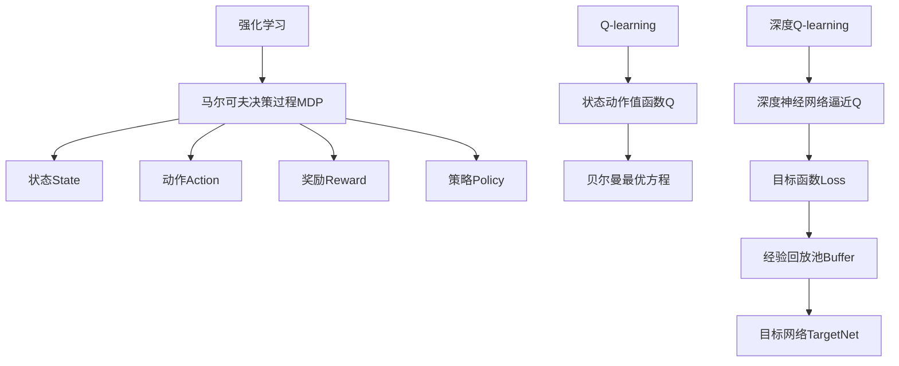

# 深度 Q-learning：在智慧农业中的应用

## 1. 背景介绍

### 1.1 问题的由来

随着人口的不断增长和城市化进程的加快,农业生产面临着前所未有的挑战。传统的农业生产方式已经难以满足日益增长的食品需求,因此亟需采用新的技术和方法来提高农业生产的效率和可持续性。智慧农业(Smart Agriculture)应运而生,它利用现代信息技术、物联网、大数据分析等技术,实现对农业生产全过程的精准管理和控制,从而提高农产品产量和质量,降低生产成本,减少对环境的影响。

在智慧农业中,决策过程是一个关键环节。由于农业生产系统的复杂性和不确定性,制定合理的决策策略并非易事。传统的基于经验或规则的决策方法往往难以适应动态变化的环境,无法充分利用海量的农业大数据。因此,需要一种智能化的决策方法,能够根据实时数据和环境变化自主学习并优化决策策略。

### 1.2 研究现状

近年来,强化学习(Reinforcement Learning)作为一种有前景的人工智能技术,在智能决策领域引起了广泛关注。强化学习算法能够通过与环境的交互,自主学习最优决策策略,无需事先构建复杂的数学模型或规则库。其中,Q-learning是一种经典的基于价值函数的强化学习算法,已被成功应用于机器人控制、游戏AI等领域。

然而,传统的Q-learning算法存在一些局限性,如状态空间维度灾难、收敛速度慢等,难以直接应用于智慧农业这种高维、连续的复杂决策问题。深度强化学习(Deep Reinforcement Learning)通过将深度神经网络引入强化学习框架,能够有效解决高维状态空间和连续动作空间的问题,显著提高了算法的性能和泛化能力。

深度Q-learning(Deep Q-learning)作为深度强化学习的代表性算法之一,已在智能控制、机器人导航等领域取得了卓越的成绩。但是,将深度Q-learning应用于智慧农业决策仍然面临着诸多挑战,如如何构建高效的神经网络模型、如何处理农业数据的时序性和不平衡性、如何将先验知识融入算法框架等,都有待进一步研究和探索。

### 1.3 研究意义

将深度Q-learning应用于智慧农业决策,具有重要的理论意义和应用价值:

- 理论意义:
  - 深入探索深度强化学习在农业领域的应用,推动强化学习算法在复杂决策问题中的创新发展。
  - 研究农业生产系统的建模方法,促进农业大数据的深度挖掘和利用。
  - 丰富深度学习在农业领域的应用案例,为相关领域的研究提供借鉴。

- 应用价值:
  - 为智慧农业提供智能化的决策支持,提高农业生产的效率和可持续性。
  - 优化农业生产管理,实现对资源的精准调配,降低生产成本和环境影响。
  - 促进农业现代化进程,提升农业生产的智能化水平。

### 1.4 本文结构

本文将系统地介绍将深度Q-learning应用于智慧农业决策的理论基础、算法细节和实践案例。具体内容安排如下:

- 第2部分阐述深度Q-learning的核心概念,并分析其与智慧农业决策问题的联系。
- 第3部分详细介绍深度Q-learning算法的原理和具体操作步骤。
- 第4部分构建深度Q-learning的数学模型,并推导相关公式,辅以案例分析。
- 第5部分提供一个智慧农业场景下的项目实践案例,包括代码实现和结果分析。
- 第6部分探讨深度Q-learning在智慧农业中的实际应用场景。
- 第7部分推荐相关的学习资源、开发工具和研究论文。
- 第8部分总结深度Q-learning在智慧农业中的应用前景,并分析存在的挑战。
- 第9部分列出常见问题并给出解答。

## 2. 核心概念与联系

在介绍深度Q-learning算法之前,我们先来了解一些核心概念,并分析它们与智慧农业决策问题的联系。

### 2.1 强化学习(Reinforcement Learning)

强化学习是机器学习的一个重要分支,它研究如何基于环境反馈,通过试错学习获取最优策略。强化学习系统通常被建模为一个马尔可夫决策过程(Markov Decision Process, MDP),包括以下几个要素:

- 状态(State)$s$:描述系统当前的状况。
- 动作(Action)$a$:智能体可以采取的操作。
- 奖励(Reward)$r$:环境对智能体当前动作的反馈,指导智能体朝着正确方向学习。
- 策略(Policy)$\pi$:智能体根据当前状态选择动作的策略函数。

强化学习算法的目标是学习一个最优策略$\pi^*$,使得在遵循该策略时,能够最大化预期的累积奖励。

在智慧农业中,我们可以将农场的状态(如土壤湿度、作物生长情况等)建模为MDP中的状态$s$,农业生产管理操作(如灌溉、施肥等)对应于动作$a$,农产品产量和质量等指标则对应于奖励$r$。智能体的目标是学习一个最优策略$\pi^*$,指导农场的精细化管理,以获得最大的农产品收益。

### 2.2 Q-learning

Q-learning是一种基于价值函数的强化学习算法,它不需要建立环境的精确模型,只需要通过与环境的交互,逐步更新状态-动作值函数$Q(s,a)$,最终收敛到最优策略。

$Q(s,a)$表示在状态$s$下采取动作$a$,之后能够获得的预期累积奖励。根据贝尔曼最优方程,最优的$Q^*(s,a)$满足:

$$Q^*(s,a)=\mathbb{E}_{s' \sim P}\left[r(s,a)+\gamma\max_{a'}Q^*(s',a')\right]$$

其中,$\gamma$是折现因子,用于权衡当前奖励和未来奖励的权重。$P$是状态转移概率。

Q-learning算法通过不断更新$Q(s,a)$,使其逼近最优的$Q^*(s,a)$,从而获得最优策略$\pi^*(s)=\arg\max_aQ^*(s,a)$。

在智慧农业决策中,我们可以将农场的状态$s$和管理操作$a$对应到Q-learning的状态-动作对$(s,a)$,农产品收益对应于即时奖励$r(s,a)$。通过不断与环境交互并更新$Q(s,a)$,智能体可以学习到一个最优策略$\pi^*$,指导农场的精细化管理。

然而,传统的Q-learning算法在处理高维、连续的状态和动作空间时,会遇到维数灾难和收敛慢等问题,难以直接应用于智慧农业这种复杂的决策场景。

### 2.3 深度Q-learning(Deep Q-learning)

深度Q-learning将深度神经网络引入Q-learning算法框架,用于逼近$Q(s,a)$函数。具体来说,我们使用一个深度神经网络$Q(s,a;\theta)$来拟合真实的$Q^*(s,a)$函数,其中$\theta$是网络的权重参数。在训练过程中,我们根据贝尔曼方程的损失函数不断调整$\theta$,使得$Q(s,a;\theta)$逐渐逼近$Q^*(s,a)$。

深度Q-learning的目标函数可以表示为:

$$L(\theta)=\mathbb{E}_{(s,a,r,s')\sim D}\left[\left(Q(s,a;\theta)-y\right)^2\right]$$

$$y=r+\gamma\max_{a'}Q(s',a';\theta^-)$$

其中,$D$是经验回放池(Experience Replay Buffer),用于存储智能体与环境交互的转换样本$(s,a,r,s')$。$\theta^-$是目标网络(Target Network)的权重,用于稳定训练过程。

通过使用深度神经网络逼近$Q(s,a)$函数,深度Q-learning能够有效处理高维、连续的状态和动作空间,显著提高了算法的性能和泛化能力。同时,神经网络还能够自动从数据中提取特征,减轻了人工特征工程的工作量。

在智慧农业决策中,我们可以将农场的状态$s$和管理操作$a$作为神经网络的输入,使用深度Q-learning算法学习最优的$Q(s,a;\theta)$函数,从而获得最优策略$\pi^*$,指导农场的精细化管理。

### 2.4 Mermaid流程图

上图使用Mermaid流程图描述了强化学习、Q-learning和深度Q-learning的核心概念及其相互关系。深度Q-learning通过将深度神经网络引入Q-learning框架,能够有效处理复杂的决策问题,为智慧农业决策提供了一种新的解决方案。

## 3. 核心算法原理 & 具体操作步骤

### 3.1 算法原理概述

深度Q-learning算法的核心思想是使用深度神经网络来逼近$Q(s,a)$函数,从而解决传统Q-learning在高维状态和动作空间下的困难。算法的训练过程可以概括为以下几个步骤:

1. 初始化一个评估网络$Q(s,a;\theta)$和一个目标网络$Q(s,a;\theta^-)$,两个网络的权重参数初始相同。
2. 初始化经验回放池$D$,用于存储智能体与环境交互的转换样本$(s,a,r,s')$。
3. 对于每一个时间步:
   a) 根据当前的评估网络$Q(s,a;\theta)$和探索策略(如$\epsilon$-贪婪策略)选择动作$a$。
   b) 执行动作$a$,观测到环境反馈的下一状态$s'$和即时奖励$r$,将转换样本$(s,a,r,s')$存入经验回放池$D$。
   c) 从经验回放池$D$中采样一个小批量的转换样本$(s_j,a_j,r_j,s_j')$。
   d) 计算目标值$y_j=r_j+\gamma\max_{a'}Q(s_j',a';\theta^-)$。
   e) 计算损失函数$L(\theta)=\frac{1}{N}\sum_j\left(Q(s_j,a_j;\theta)-y_j\right)^2$。
   f) 使用优化算法(如随机梯度下降)根据损失函数$L(\theta)$更新评估网络$Q(s,a;\theta)$的权重参数$\theta$。
   g) 每隔一定步数,将评估网络$Q(s,a;\theta)$的权重参数$\theta$复制到目标网络$Q(s,a;\theta^-)$,用于稳定训练过程。

4. 重复步骤3,直到评估网络$Q(s,a;\theta)$收敛。
5. 根据收敛后的$Q(s,a;\theta)$函数,得到最优策略$\pi^*(s)=\arg\max_aQ(s,a;\theta)$。

该算法的关键点在于:

- 使用深度神经网络逼近$Q(s,a)$函数,解决高维状态和动作空间的问题。
- 引入经验回放池$D$,打破样本之间的相关性,提高数据利用效率。
- 采用目标网络$Q(s,a;\theta^-)$,稳定训练过程,提高收敛速度。
- 通过与环境交互不断更新评估网络$Q(s,a;\theta)$,使其逼近最优的$Q^*(s,a)$函数。