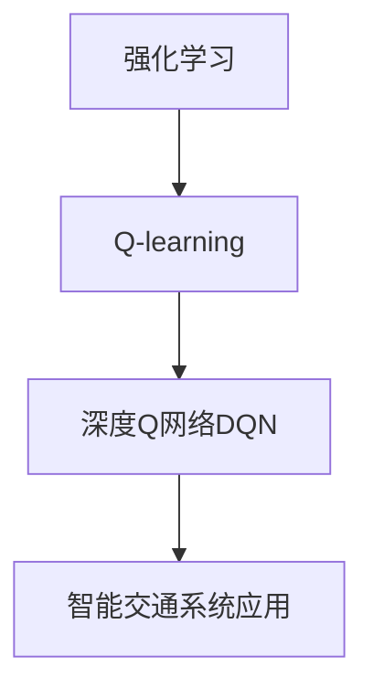

好的,我会严格遵循约束条件,以"深度 Q-learning:在智能交通系统中的应用"为主题,撰写一篇专业的技术博客文章。

# 深度 Q-learning:在智能交通系统中的应用

## 1. 背景介绍

### 1.1 问题的由来

随着城市化进程的不断加快,交通拥堵已经成为许多现代城市面临的一个严峻挑战。传统的交通控制系统往往依赖于预先设定的固定时间表和简单的反馈控制规则,难以充分适应复杂多变的实际交通状况。因此,需要一种更加智能化、自适应的交通控制方法来提高交通系统的效率和可靠性。

### 1.2 研究现状  

近年来,人工智能技术在交通领域的应用受到了广泛关注。其中,强化学习(Reinforcement Learning)作为一种有效的机器学习范式,展现出了巨大的应用潜力。强化学习系统通过与环境的互动,不断尝试不同的行为策略,并根据获得的反馈reward来调整策略,最终达到最优化目标。

Q-learning作为强化学习中的一种经典算法,已经在交通信号控制、车辆路径规划等领域取得了初步成功。然而,传统的Q-learning算法在处理大规模、高维度的复杂问题时,往往会遇到"维数灾难"(Curse of Dimensionality)等挑战,导致性能受限。

### 1.3 研究意义

深度强化学习(Deep Reinforcement Learning)将深度神经网络与强化学习相结合,利用神经网络的强大函数拟合能力来估计Q值函数,从而突破了传统Q-learning在高维状态空间下的局限性。深度Q-网络(Deep Q-Network, DQN)作为深度强化学习的一种重要算法,已经在多个领域展现出卓越的性能表现。

将深度Q-learning应用于智能交通系统,有望实现对复杂动态交通环境的精确建模和优化决策,从而提高交通系统的通行效率、减少拥堵和能耗,进一步促进城市的可持续发展。

### 1.4 本文结构

本文将首先介绍深度Q-learning的核心概念和基本原理,然后详细阐述其在智能交通系统中的应用,包括数学模型、算法流程、系统架构等方面的内容。此外,还将通过实际案例分析和代码实现,加深读者对该技术的理解和掌握。最后,探讨深度Q-learning在智能交通领域的未来发展趋势和面临的挑战。

## 2. 核心概念与联系



深度Q-learning是在传统Q-learning算法的基础上,引入深度神经网络作为Q值函数的逼近器,从而能够有效处理高维、连续的状态空间和动作空间。其核心思想可以概括为:

1. **强化学习(Reinforcement Learning)**: 一种基于环境交互的机器学习范式,智能体(Agent)通过试错并获得reward来学习最优策略。

2. **Q-learning**: 强化学习中的一种经典算法,通过更新Q值表来近似最优Q值函数,从而得到最优策略。传统Q-learning在高维状态空间下容易受到"维数灾难"的影响。

3. **深度神经网络(Deep Neural Network)**: 具有强大的函数逼近能力,能够从高维输入数据中提取有用的特征,用于拟合复杂的映射关系。

4. **深度Q网络(Deep Q-Network, DQN)**: 将深度神经网络应用于Q-learning,使用神经网络来逼近Q值函数,从而能够处理高维、连续的状态空间和动作空间。

5. **智能交通系统(Intelligent Transportation System, ITS)**: 利用先进的信息和通信技术,实现对整个交通运行系统的感知、分析、控制和服务,从而提高交通运行效率和安全性。

深度Q-learning作为一种先进的强化学习算法,与智能交通系统的需求高度契合。通过对复杂交通环境进行建模,并利用深度神经网络逼近最优Q值函数,智能体可以学习到最佳的交通控制策略,从而优化整个交通系统的运行效率。

## 3. 核心算法原理与具体操作步骤

### 3.1 算法原理概述

深度Q-learning算法的核心思想是利用深度神经网络来逼近Q值函数,从而能够处理高维、连续的状态空间和动作空间。算法的基本流程如下:

1. 初始化一个深度神经网络Q(s, a; θ),其中θ为网络参数。该网络将状态s和动作a作为输入,输出对应的Q值。

2. 初始化经验回放池(Experience Replay Buffer)D,用于存储智能体与环境交互的经验元组(s, a, r, s')。

3. 对于每一个时间步:
   a) 根据当前状态s,选择一个动作a(通常使用ε-贪婪策略)。
   b) 执行动作a,获得奖励r和下一个状态s'。
   c) 将经验元组(s, a, r, s')存入经验回放池D。
   d) 从经验回放池D中随机采样一个小批量数据。
   e) 计算目标Q值y = r + γ * max(Q(s', a'; θ-)),其中θ-为目标网络参数。
   f) 计算损失函数Loss = (y - Q(s, a; θ))^2。
   g) 使用优化算法(如梯度下降)更新网络参数θ,最小化损失函数。
   h) 每隔一定步骤,将网络参数θ复制到目标网络参数θ-。

4. 重复步骤3,直到算法收敛或达到停止条件。

通过不断地与环境交互、获取经验并更新网络参数,深度Q网络可以逐步学习到最优的Q值函数,从而得到最佳的动作策略。

### 3.2 算法步骤详解

1. **初始化深度Q网络和经验回放池**

```python
import torch
import torch.nn as nn

# 定义深度Q网络
class DQN(nn.Module):
    def __init__(self, state_dim, action_dim):
        super(DQN, self).__init__()
        self.fc1 = nn.Linear(state_dim, 128)
        self.fc2 = nn.Linear(128, 64)
        self.fc3 = nn.Linear(64, action_dim)

    def forward(self, x):
        x = torch.relu(self.fc1(x))
        x = torch.relu(self.fc2(x))
        return self.fc3(x)

# 初始化经验回放池
replay_buffer = ReplayBuffer(capacity=10000)

# 初始化深度Q网络和目标网络
policy_net = DQN(state_dim, action_dim)
target_net = DQN(state_dim, action_dim)
target_net.load_state_dict(policy_net.state_dict())
```

2. **与环境交互并存储经验**

```python
for episode in range(num_episodes):
    state = env.reset()
    done = False
    while not done:
        # 选择动作(ε-贪婪策略)
        action = epsilon_greedy(state, policy_net)
        
        # 执行动作并获取下一个状态和奖励
        next_state, reward, done, _ = env.step(action)
        
        # 存储经验元组
        replay_buffer.push(state, action, reward, next_state, done)
        
        # 更新状态
        state = next_state
```

3. **从经验回放池中采样数据并更新网络参数**

```python
if len(replay_buffer) > batch_size:
    # 从经验回放池中采样一个小批量数据
    transitions = replay_buffer.sample(batch_size)
    batch = Transition(*zip(*transitions))
    
    # 计算目标Q值
    next_state_batch = torch.cat(batch.next_state)
    state_action_values = policy_net(next_state_batch).max(1)[0].detach()
    expected_state_action_values = batch.reward + gamma * state_action_values
    
    # 计算损失函数
    state_batch = torch.cat(batch.state)
    action_batch = torch.cat(batch.action)
    state_action_values = policy_net(state_batch).gather(1, action_batch)
    loss = F.smooth_l1_loss(state_action_values, expected_state_action_values.unsqueeze(1))
    
    # 优化网络参数
    optimizer.zero_grad()
    loss.backward()
    optimizer.step()
    
# 更新目标网络参数
if step % target_update_freq == 0:
    target_net.load_state_dict(policy_net.state_dict())
```

4. **评估和使用训练好的策略**

```python
# 使用训练好的策略进行评估
policy_net.eval()
state = env.reset()
done = False
total_reward = 0
while not done:
    action = policy_net(torch.from_numpy(state).float()).max(0)[1].item()
    next_state, reward, done, _ = env.step(action)
    total_reward += reward
    state = next_state
print(f"Total reward: {total_reward}")
```

### 3.3 算法优缺点

**优点:**

1. **处理高维状态空间**: 深度Q网络利用深度神经网络的强大函数逼近能力,可以有效处理高维、连续的状态空间和动作空间,克服了传统Q-learning算法的"维数灾难"问题。

2. **端到端学习**: 深度Q网络可以直接从原始输入数据(如图像、传感器读数等)中学习最优策略,无需手工设计特征提取器,实现了端到端的学习过程。

3. **泛化能力强**: 由于深度神经网络具有良好的泛化能力,深度Q网络可以从有限的训练数据中学习出通用的策略,并应用于未见过的新环境中。

4. **持续改进**: 深度Q网络可以通过不断与环境交互获取新的经验,持续优化和改进策略,实现在线学习和自适应调整。

**缺点:**

1. **样本效率低**: 深度Q网络需要大量的环境交互数据来训练,样本效率较低,尤其在实际应用场景中获取足够的训练数据可能是一个挑战。

2. **超参数sensitiveness**: 深度Q网络的性能对于超参数(如学习率、折扣因子、网络结构等)非常敏感,需要进行大量的调参工作。

3. **不稳定性**: 由于深度神经网络的非线性和不可解释性,深度Q网络的训练过程可能出现不稳定或发散的情况,需要采取一些技巧(如经验回放、目标网络等)来提高训练稳定性。

4. **计算资源需求高**: 训练深度神经网络通常需要大量的计算资源(如GPU),对于资源受限的嵌入式系统或边缘设备可能不太适用。

### 3.4 算法应用领域

深度Q-learning算法由于其在处理高维、连续状态空间方面的优势,已经在多个领域取得了成功应用,包括但不限于:

1. **智能交通系统**: 用于交通信号控制、车辆路径规划、智能停车管理等场景,优化交通流量和效率。

2. **机器人控制**: 用于机器人运动规划、操作控制等任务,实现自主导航和操作。

3. **游戏AI**: 在棋类游戏(如国际象棋、围棋等)和视频游戏中,训练智能体学习最优策略。

4. **自动驾驶**: 用于自动驾驶决策系统,根据实时交通环境做出合理的驾驶决策。

5. **资源管理**: 应用于数据中心资源调度、能源系统优化等领域,提高资源利用效率。

6. **金融交易**: 用于自动化交易策略优化,实现算法交易。

7. **工业控制**: 用于工业过程控制、制造系统优化等场景。

总的来说,深度Q-learning算法展现出了广阔的应用前景,有望在各个领域发挥重要作用,促进智能系统的发展。

## 4. 数学模型和公式详细讲解与举例说明

### 4.1 数学模型构建

在深度Q-learning算法中,我们需要构建一个数学模型来描述智能体与环境之间的交互过程。这个过程可以用马尔可夫决策过程(Markov Decision Process, MDP)来刻画。

一个MDP可以用一个五元组(S, A, P, R, γ)来表示,其中:

- S是状态空间,表示环境可能的状态集合。
- A是动作空间,表示智能体可以执行的动作集合。
- P是