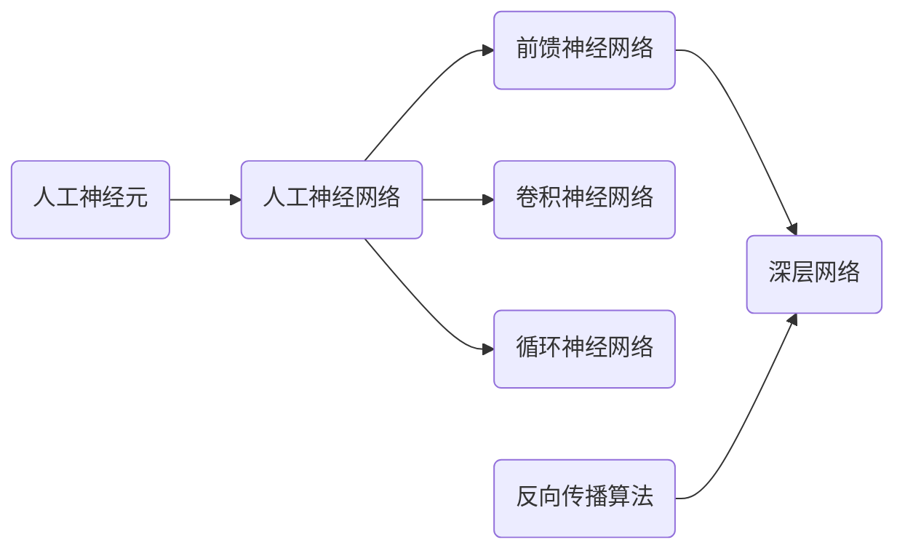

# 深度学习(Deep Learning) - 原理与代码实例讲解

关键词：深度学习、人工神经网络、反向传播、卷积神经网络、循环神经网络、Tensorflow、PyTorch

## 1. 背景介绍
### 1.1 问题的由来
深度学习作为人工智能领域的一个重要分支,其发展历史可以追溯到上世纪50年代。早期的人工神经网络模型如感知机,为后来深度学习的发展奠定了基础。然而,由于当时计算能力和数据量的限制,这些模型难以处理复杂的现实问题。

直到2006年,Geoffrey Hinton等人提出了深度信念网络(Deep Belief Network),并使用逐层预训练的方式有效地训练了多层网络,深度学习开始引起广泛关注。此后,随着算法的改进、计算能力的提升以及大数据时代的到来,深度学习在计算机视觉、自然语言处理等领域取得了突破性进展,成为当前人工智能的研究热点。

### 1.2 研究现状
近年来,深度学习的研究呈现出多样化、精细化的特点。一方面,研究者们针对不同的应用场景,设计出了各种不同的网络架构,如用于图像识别的卷积神经网络(CNN)、用于序列建模的循环神经网络(RNN)等。另一方面,深度学习与其他机器学习方法的结合也成为一大趋势,如将深度学习与迁移学习、强化学习、元学习等方法相结合,以提升模型的泛化能力和学习效率。

此外,如何让深度学习模型具备可解释性,如何降低模型的计算开销,如何利用少量样本进行学习等,也成为当前研究的重点问题。总的来说,深度学习正在向着更加智能化、高效化、人性化的方向不断发展。

### 1.3 研究意义
深度学习的研究具有重要的理论意义和应用价值。从理论上看,深度学习为我们理解人脑的信息处理机制提供了新的视角。深度神经网络通过逐层抽象,将原始数据转化为高层次的特征表示,这与人脑的信息处理过程有相似之处。深入研究深度学习的原理,有助于我们探索人工智能的奥秘。

从应用上看,深度学习已经在多个领域取得了重大突破,极大地推动了人工智能技术的发展。例如,在计算机视觉领域,基于深度学习的图像识别、目标检测、语义分割等技术,使得机器的视觉能力不断提升,在无人驾驶、医学影像分析等方面得到广泛应用。在自然语言处理领域,深度学习模型能够理解文本的语义,实现机器翻译、情感分析、问答系统等功能,极大地改善了人机交互的体验。可以说,深度学习正在推动人工智能走向生活的方方面面。

### 1.4 本文结构
本文将全面介绍深度学习的原理和代码实践。第2部分介绍深度学习的核心概念。第3部分讲解深度学习的主要算法。第4部分介绍相关的数学模型和公式。第5部分通过代码实例,演示如何使用主流的深度学习框架构建模型。第6部分讨论深度学习的典型应用场景。第7部分推荐相关的学习资源。第8部分对全文进行总结,并展望深度学习的未来发展趋势与面临的挑战。

## 2. 核心概念与联系

深度学习的核心概念是使用多层的人工神经网络,通过学习大量数据,自动提取有用的特征和表示。下面介绍几个最基本的概念:

- 人工神经元:模仿生物神经元,接收一组输入信号,通过非线性变换产生输出。常见的神经元有感知机、Sigmoid、tanh、ReLU等。
- 人工神经网络:由大量神经元按一定的连接方式组成。每个神经元接受前一层的输出,并输出给下一层。网络通过调整神经元间的连接权重,不断优化以完成特定任务。
- 前馈神经网络:最基本的一种网络结构,神经元分层排列,每层只接受前一层的输入。
- 反向传播算法:用于训练多层网络的优化算法。通过链式法则,将损失函数对权重的导数层层反向传播,并使用梯度下降法更新权重。
- 深层网络:具有多个隐藏层的前馈网络。相比浅层网络,深层网络能够学习更加复杂的函数,但也更难训练。
- 卷积神经网络:一种特殊的前馈网络,引入了卷积和池化等操作,擅长处理网格化数据如图像。
- 循环神经网络:一种用于处理序列数据的网络,神经元不仅接受前一层的输入,还接受自身上一时刻的状态。

下图展示了这些概念之间的联系:

可以看到,人工神经元是构成各类神经网络的基础单元。前馈神经网络、卷积神经网络、循环神经网络是几种常见的网络架构,其中前馈神经网络经过加深后形成深层网络。反向传播算法是训练深层网络的关键。理解这些概念之间的联系,有助于我们更好地掌握深度学习的原理。

## 3. 核心算法原理 & 具体操作步骤
### 3.1 算法原理概述
深度学习的核心算法是反向传播(Backpropagation)。它用于计算损失函数对每一层权重的梯度,使得我们能够用梯度下降法来训练多层网络。反向传播基于链式法则,将损失函数的梯度逐层向后传递。

具体来说,假设一个L层的网络,第 $l$ 层的权重为 $W^{(l)}$,偏置为 $b^{(l)}$,激活函数为 $\sigma^{(l)}$。定义 $z^{(l)}=W^{(l)}a^{(l-1)}+b^{(l)}$,$a^{(l)}=\sigma^{(l)}(z^{(l)})$。损失函数 $J$ 是网络输出 $a^{(L)}$ 的函数。反向传播的目标是计算梯度 $\frac{\partial J}{\partial W^{(l)}}$ 和 $\frac{\partial J}{\partial b^{(l)}}$。

### 3.2 算法步骤详解
反向传播算法可以分为以下四个步骤:

1. 前向传播:根据输入计算每一层的 $z^{(l)}$ 和 $a^{(l)}$,直到输出层。
2. 计算输出层的误差 $\delta^{(L)}$:
$$\delta^{(L)}=\nabla_{a^{(L)}}J\odot\sigma'^{(L)}(z^{(L)})$$
其中 $\nabla_{a^{(L)}}J$ 是损失函数对输出层激活值的梯度,$\odot$ 表示按元素相乘。
3. 反向传播误差:从第 $L-1$ 层到第 $1$ 层,计算每一层的误差 $\delta^{(l)}$:
$$\delta^{(l)}=((W^{(l+1)})^T\delta^{(l+1)})\odot\sigma'^{(l)}(z^{(l)})$$
4. 计算梯度:根据每一层的误差,计算损失函数对权重和偏置的梯度:
$$\frac{\partial J}{\partial W^{(l)}}=\delta^{(l)}(a^{(l-1)})^T$$
$$\frac{\partial J}{\partial b^{(l)}}=\delta^{(l)}$$

有了梯度后,就可以使用梯度下降法来更新权重和偏置:
$$W^{(l)}=W^{(l)}-\alpha\frac{\partial J}{\partial W^{(l)}}$$
$$b^{(l)}=b^{(l)}-\alpha\frac{\partial J}{\partial b^{(l)}}$$
其中 $\alpha$ 是学习率。

### 3.3 算法优缺点
反向传播算法的优点在于它使得训练多层网络成为可能,极大地推动了深度学习的发展。通过逐层计算梯度,反向传播能够有效地优化深层网络,使其在复杂任务上取得了远超传统机器学习方法的表现。

但是反向传播也存在一些缺点。首先,它需要较长的训练时间,尤其是在处理大规模数据时。其次,反向传播对参数的初始化和学习率很敏感,不当的选择可能导致训练失败。此外,反向传播还可能遇到梯度消失或梯度爆炸的问题,使得深层网络难以训练。

### 3.4 算法应用领域
尽管存在一些缺点,反向传播仍然是当前深度学习的主要训练算法。它广泛应用于计算机视觉、自然语言处理、语音识别等领域,在图像分类、目标检测、机器翻译、语音识别等任务上取得了state-of-the-art的结果。几乎所有主流的深度学习框架如Tensorflow、PyTorch、Caffe等,都以反向传播作为核心算法。可以说,反向传播推动了深度学习的繁荣发展。

## 4. 数学模型和公式 & 详细讲解 & 举例说明
### 4.1 数学模型构建
深度学习的数学模型可以用一个多层函数来表示。设输入为 $x$,输出为 $y$,则一个L层的网络可以表示为:
$$F(x)=f^{(L)}(f^{(L-1)}(\cdots f^{(2)}(f^{(1)}(x))\cdots))$$
其中 $f^{(l)}$ 表示第 $l$ 层的变换:
$$f^{(l)}(a)=\sigma^{(l)}(W^{(l)}a+b^{(l)})$$

网络的训练过程就是通过最小化损失函数 $J(W,b)$ 来求解最优的权重 $W$ 和偏置 $b$。常用的损失函数有均方误差(MSE)、交叉熵(Cross-entropy)等。以均方误差为例,单个样本的损失函数可以写为:
$$J(W,b;x,y)=\frac{1}{2}\lVert F(x)-y\rVert^2$$

### 4.2 公式推导过程
反向传播的核心公式是误差的反向传播公式和梯度计算公式。下面我们详细推导这两个公式。

首先是误差的反向传播公式。根据链式法则,第 $l$ 层的误差可以写为:
$$\delta^{(l)}=\frac{\partial J}{\partial z^{(l)}}=\frac{\partial J}{\partial a^{(l)}}\frac{\partial a^{(l)}}{\partial z^{(l)}}=\frac{\partial J}{\partial a^{(l)}}\odot\sigma'^{(l)}(z^{(l)})$$
其中 $\frac{\partial J}{\partial a^{(l)}}$ 可以根据 $\delta^{(l+1)}$ 计算:
$$\frac{\partial J}{\partial a^{(l)}}=\frac{\partial J}{\partial z^{(l+1)}}\frac{\partial z^{(l+1)}}{\partial a^{(l)}}=\delta^{(l+1)}W^{(l+1)}$$
将其代入,得到:
$$\delta^{(l)}=((W^{(l+1)})^T\delta^{(l+1)})\odot\sigma'^{(l)}(z^{(l)})$$

接下来是梯度计算公式。根据链式法则,损失函数对权重的梯度为:
$$\frac{\partial J}{\partial W^{(l)}}=\frac{\partial J}{\partial z^{(l)}}\frac{\partial z^{(l)}}{\partial W^{(l)}}=\delta^{(l)}(a^{(l-1)})^T$$
类似地,损失函数对偏置的梯度为:
$$\frac{\partial J}{\partial b^{(l)}}=\frac{\partial J}{\partial z^{(l)}}\frac{\partial z^{(l)}}{\partial b^{(l)}}=\delta^{(l)}$$

### 4.3 案例分析与讲解
下面我们以一个简单的三层网络为例,演示反向传播的计算过程。假设输入 $x\in\mathbb{R}^2$,输出 $y\in\mathbb{R}$。网络结构如下: