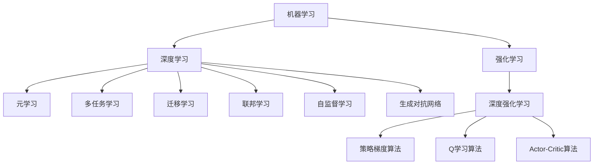

# 深度学习与强化学习的支撑

## 1. 背景介绍

### 1.1 问题的由来

在过去的几十年中，人工智能领域取得了长足的进步,尤其是深度学习和强化学习两大分支的兴起,为人工智能系统带来了革命性的变化。然而,这两种技术在实际应用中仍然面临着诸多挑战和局限性。

深度学习模型通过对大量数据的训练,能够自动学习特征表示并解决复杂的问题,但其高度依赖大量标注数据,且缺乏逻辑推理和因果推断能力。另一方面,强化学习则是一种基于奖惩机制的学习范式,能够通过与环境的交互来获取经验,并逐步优化策略以达到预期目标。但传统的强化学习算法往往需要大量的试错探索,效率低下,且难以处理高维连续状态空间。

### 1.2 研究现状

为了解决上述问题,研究人员提出了多种支撑深度学习和强化学习的新方法和技术,旨在提高这两种技术的性能、泛化能力和应用范围。这些研究主要集中在以下几个方面:

1. **元学习(Meta-Learning)**:通过学习如何快速适应新任务,提高模型的泛化能力和数据效率。
2. **多任务学习(Multi-Task Learning)**:同时学习多个相关任务,提高模型的泛化能力和鲁棒性。
3. **迁移学习(Transfer Learning)**:利用已有领域的知识来加速新领域任务的学习。
4. **联邦学习(Federated Learning)**:在保护隐私的前提下,利用分散的数据进行联合训练。
5. **自监督学习(Self-Supervised Learning)**:利用无标注数据进行预训练,减少对大量标注数据的依赖。
6. **生成对抗网络(Generative Adversarial Networks, GANs)**:通过生成式对抗训练,生成逼真的数据样本。
7. **强化学习与深度学习的结合**:利用深度神经网络作为强化学习的策略和价值函数近似器,处理高维连续状态空间。

这些新兴技术为深度学习和强化学习带来了新的动力和可能性,有望推动人工智能系统在更多领域的应用和发展。

### 1.3 研究意义

支撑深度学习和强化学习的新技术具有重要的理论和应用意义:

- **理论意义**:这些新技术为人工智能系统带来了新的学习范式和模型,拓展了机器学习的理论基础,为解决复杂问题提供了新的思路和方法。
- **应用意义**:通过提高模型的泛化能力、数据效率和鲁棒性,这些新技术有望推动人工智能系统在更多领域的实际应用,如计算机视觉、自然语言处理、机器人控制等。

### 1.4 本文结构  

本文将围绕支撑深度学习和强化学习的新技术展开讨论。第2节介绍相关的核心概念和技术之间的联系。第3节详细阐述核心算法原理和具体操作步骤。第4节探讨相关的数学模型和公式,并通过案例进行讲解和分析。第5节提供代码实例,并对实现细节进行解释说明。第6节探讨这些技术在实际应用中的场景。第7节推荐相关的工具和学习资源。第8节总结研究成果,展望未来发展趋势和面临的挑战。第9节列出常见问题并给出解答。

## 2. 核心概念与联系

在探讨支撑深度学习和强化学习的新技术之前,我们需要先理解一些核心概念及它们之间的联系。

1. **机器学习(Machine Learning)**是人工智能的一个重要分支,旨在使计算机能够从数据中自动学习和获取经验。
2. **深度学习(Deep Learning)**是机器学习中的一种基于人工神经网络的方法,通过对数据的表示学习,能够解决复杂的任务。
3. **强化学习(Reinforcement Learning)**是机器学习中的另一种范式,通过与环境交互获取反馈信号,逐步优化策略以达到预期目标。
4. **元学习(Meta-Learning)**旨在提高模型的泛化能力和数据效率,使模型能够快速适应新任务。
5. **多任务学习(Multi-Task Learning)**通过同时学习多个相关任务,提高模型的泛化能力和鲁棒性。
6. **迁移学习(Transfer Learning)**利用已有领域的知识来加速新领域任务的学习,提高数据效率。
7. **联邦学习(Federated Learning)**在保护隐私的前提下,利用分散的数据进行联合训练,扩大数据覆盖面。
8. **自监督学习(Self-Supervised Learning)**利用无标注数据进行预训练,减少对大量标注数据的依赖。
9. **生成对抗网络(Generative Adversarial Networks, GANs)**通过生成式对抗训练,生成逼真的数据样本,扩充训练数据。
10. **深度强化学习(Deep Reinforcement Learning)**将深度神经网络应用于强化学习,处理高维连续状态空间,提高策略和价值函数的近似能力。
11. **策略梯度算法(Policy Gradient Methods)**是深度强化学习中的一种算法,直接优化策略函数参数以最大化累积奖励。
12. **Q学习算法(Q-Learning)**是深度强化学习中的另一种算法,通过估计状态-行为对的价值函数来优化策略。
13. **Actor-Critic算法**将策略梯度和Q学习相结合,同时学习策略函数和价值函数,提高训练效率和稳定性。

这些概念相互关联,共同构成了支撑深度学习和强化学习的技术体系。下一节将详细阐述其中的核心算法原理和具体操作步骤。

## 3. 核心算法原理 & 具体操作步骤

### 3.1 算法原理概述

本节将重点介绍元学习、多任务学习、迁移学习、联邦学习、自监督学习、生成对抗网络以及深度强化学习中的核心算法原理。

1. **元学习(Meta-Learning)**:
   - **原理**: 通过在一系列相关任务上进行训练,学习一个能够快速适应新任务的初始模型参数或优化策略。
   - **代表算法**: 模型无关元学习(Model-Agnostic Meta-Learning, MAML)、元学习共享网络(Meta-Learning Shared Network, MLSN)等。

2. **多任务学习(Multi-Task Learning)**:
   - **原理**: 在同一个模型中共享部分参数或特征表示,同时学习多个相关任务,提高泛化能力和鲁棒性。
   - **代表算法**: 硬参数共享、软参数共享、多任务关系学习等。

3. **迁移学习(Transfer Learning)**:
   - **原理**: 利用源领域的知识(如模型参数、特征表示等)来加速目标领域任务的学习过程。
   - **代表算法**: 实例迁移、特征表示迁移、模型参数微调等。

4. **联邦学习(Federated Learning)**:
   - **原理**: 在保护隐私的前提下,利用分散在不同设备或机构中的数据进行联合训练,扩大数据覆盖面。
   - **代表算法**: 联邦平均算法(FedAvg)、联邦学习中的安全聚合等。

5. **自监督学习(Self-Supervised Learning)**:
   - **原理**: 利用无标注数据进行预训练,学习通用的特征表示,减少对大量标注数据的依赖。
   - **代表算法**: 蒸馏自监督学习、对比自监督学习等。

6. **生成对抗网络(Generative Adversarial Networks, GANs)**:
   - **原理**: 通过生成器和判别器之间的对抗训练,生成器学习生成逼真的数据样本,扩充训练数据。
   - **代表算法**: 原始GAN、条件GAN、循环GAN等。

7. **深度强化学习(Deep Reinforcement Learning)**:
   - **原理**: 利用深度神经网络作为策略函数和/或价值函数的近似器,处理高维连续状态空间。
   - **代表算法**: 策略梯度算法(如REINFORCE、PPO等)、Q学习算法(如DQN、DDQN等)、Actor-Critic算法(如A3C、DDPG等)。

### 3.2 算法步骤详解

接下来,我们将详细介绍上述算法中的代表性算法的具体操作步骤。

#### 3.2.1 模型无关元学习(MAML)

MAML是一种广为人知的元学习算法,它旨在学习一个能够快速适应新任务的初始模型参数。算法步骤如下:

1. 从任务分布 $p(\mathcal{T})$ 中采样一批任务 $\mathcal{T}_i$。
2. 对于每个任务 $\mathcal{T}_i$:
   - 从训练数据 $\mathcal{D}_i^{tr}$ 和测试数据 $\mathcal{D}_i^{val}$ 中采样批次。
   - 使用梯度下降在 $\mathcal{D}_i^{tr}$ 上更新模型参数 $\theta_i = \theta - \alpha \nabla_\theta \mathcal{L}_{\mathcal{T}_i}(\theta)$。
   - 计算在 $\mathcal{D}_i^{val}$ 上的损失 $\mathcal{L}_{\mathcal{T}_i}(\theta_i)$。
3. 更新初始参数 $\theta$ 以最小化所有任务的损失: $\theta \leftarrow \theta - \beta \nabla_\theta \sum_{\mathcal{T}_i \sim p(\mathcal{T})} \mathcal{L}_{\mathcal{T}_i}(\theta_i)$。
4. 重复步骤1-3,直到收敛。

通过这种方式,MAML能够学习到一个初始参数 $\theta$,使得在新任务上只需少量梯度更新步骤即可获得良好的性能。

#### 3.2.2 硬参数共享多任务学习

硬参数共享是多任务学习中最简单的方法之一,它在不同任务之间共享模型的全部或部分参数。算法步骤如下:

1. 定义一个共享参数 $\theta_s$ 和任务特定参数 $\{\theta_t^1, \theta_t^2, ..., \theta_t^N\}$,其中 $N$ 是任务数量。
2. 对于每个任务 $i$,定义损失函数 $\mathcal{L}_i(\theta_s, \theta_t^i)$。
3. 优化总损失函数 $\mathcal{L}_{total} = \sum_{i=1}^N \mathcal{L}_i(\theta_s, \theta_t^i)$,更新共享参数 $\theta_s$ 和任务特定参数 $\theta_t^i$。
4. 重复步骤3,直到收敛。

通过这种方式,不同任务之间共享部分参数,可以提高模型的泛化能力和鲁棒性。

#### 3.2.3 实例迁移

实例迁移是迁移学习中最直接的方法,它将源领域的数据直接用于目标领域任务的训练。算法步骤如下:

1. 收集源领域数据 $\mathcal{D}_s$ 和目标领域数据 $\mathcal{D}_t$。
2. 构建新的训练数据集 $\mathcal{D}_{new} = \mathcal{D}_s \cup \mathcal{D}_t$。
3. 在 $\mathcal{D}_{new}$ 上训练模型,获得目标领域任务的模型参数 $\theta_t$。

实例迁移的关键在于源领域和目标领域之间存在足够的相似性,否则直接迁移可能会导致负面影响。

#### 3.2.4 联邦平均算法(FedAvg)

FedAvg是联邦学习中广为人知的算法,它通过在多个客户端之间平均模型权重来进行联