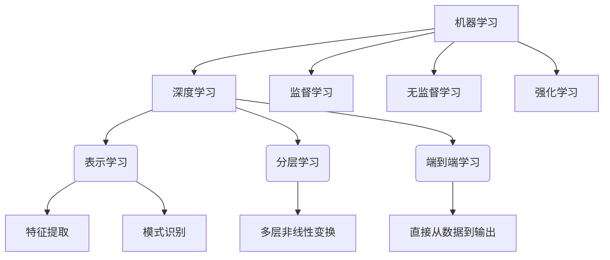

# 深度学习原理与代码实例讲解

## 1. 背景介绍

### 1.1 问题的由来

在过去几十年中，人工智能领域取得了长足的进步,尤其是深度学习技术的兴起,极大推动了人工智能的发展。深度学习是机器学习的一个新的研究热点领域,它源于对人脑神经网络工作原理的模拟,旨在构建可以对海量数据进行高效分析和处理的算法模型。

随着大数据时代的到来,各行各业产生了海量的数据,传统的人工分析和处理方式已无法满足实际需求。因此,如何从这些海量数据中发现隐藏的知识和规律,并将其应用于实际问题的解决,成为当前亟需解决的关键挑战。深度学习作为一种全新的数据分析和处理方法,凭借其强大的数据挖掘能力和自动化建模优势,为解决这一挑战提供了有力的技术支持。

### 1.2 研究现状

近年来,深度学习技术在计算机视觉、自然语言处理、语音识别等众多领域取得了突破性进展,在图像识别、语音识别、机器翻译等任务中,深度学习模型已经超越了人类水平。著名的深度学习模型包括卷积神经网络(CNN)、循环神经网络(RNN)、长短期记忆网络(LSTM)、生成对抗网络(GAN)等,这些模型展现出了深度学习在处理高维复杂数据方面的巨大潜力。

与此同时,深度学习理论研究也在不断推进,新的模型结构、优化算法、训练策略等层出不穷,为深度学习模型的性能提升和应用拓展提供了坚实的理论基础。

### 1.3 研究意义

深度学习技术在推动人工智能发展的同时,也为各行各业带来了革命性的变革。它可以应用于图像识别、语音识别、自然语言处理、推荐系统、医疗诊断、无人驾驶等众多领域,极大提高了数据处理的效率和准确性。

深入研究深度学习的原理和实践,不仅能够帮助我们更好地理解和掌握这一前沿技术,还可以为解决实际问题提供有力的技术支持。通过深度学习模型的构建和优化,我们可以从海量数据中发现隐藏的规律和知识,为决策提供依据,提高生产效率,优化资源配置,创造更大的社会价值。

### 1.4 本文结构

本文将全面介绍深度学习的核心概念、原理和实践。首先,我们将阐述深度学习的基本概念和核心思想,并探讨其与其他机器学习方法的联系和区别。接下来,我们将深入剖析深度学习中常用的算法原理,包括反向传播、梯度下降等,并详细讲解具体的操作步骤。

在理论部分之后,我们将着重介绍深度学习的数学模型和公式推导过程,并通过案例分析和常见问题解答,帮助读者更好地理解和掌握这些理论知识。

此外,我们还将提供一个完整的项目实践案例,包括开发环境搭建、源代码实现、代码解读和运行结果展示,让读者亲身体验深度学习模型的构建和应用过程。

最后,我们将探讨深度学习在实际应用中的场景,并对未来的发展趋势和面临的挑战进行展望,同时推荐一些有价值的学习资源、开发工具和相关论文,为读者的进一步学习和研究提供参考。

## 2. 核心概念与联系

深度学习(Deep Learning)是机器学习(Machine Learning)的一个重要分支,它借鉴了人类大脑神经网络的工作原理,通过构建多层神经网络模型,实现对复杂数据的高效表示和处理。

深度学习的核心思想包括以下几个方面:

1. **表示学习(Representation Learning)**: 深度学习模型能够自动从原始数据中学习出有用的特征表示,而无需人工设计特征,这是深度学习区别于传统机器学习的关键优势之一。

2. **分层学习(Hierarchical Learning)**: 深度学习模型通过多层非线性变换,将原始输入数据转换为更加抽象和高级的特征表示,从而捕捉数据的内在结构和规律。

3. **端到端学习(End-to-End Learning)**: 深度学习模型可以直接从原始数据到最终输出,无需人工设计中间步骤,实现了真正的端到端学习。

与传统的机器学习方法相比,深度学习具有以下优势:

- 自动化特征提取和模式识别能力强
- 能够处理高维复杂数据,如图像、语音、视频等
- 具有更强的泛化能力,可以应用于多种任务和领域
- 端到端学习,无需人工设计特征和中间步骤

然而,深度学习也存在一些挑战,如需要大量的训练数据、计算资源要求高、模型可解释性差等。

总的来说,深度学习作为机器学习的一个重要分支,与监督学习、无监督学习、强化学习等其他机器学习方法相辅相成,共同推动着人工智能技术的发展和应用。

## 3. 核心算法原理 & 具体操作步骤

### 3.1 算法原理概述

深度学习的核心算法是基于**人工神经网络**的**反向传播算法**。人工神经网络是一种模拟生物神经网络的数学模型,由多个神经元组成,每个神经元接收来自其他神经元的输入信号,经过加权求和和非线性激活函数的处理,产生输出信号。

反向传播算法是一种用于训练多层神经网络的监督学习算法,它通过计算损失函数对网络权重的梯度,并利用**梯度下降**优化算法不断调整网络权重,使得模型在训练数据上的损失函数值最小化,从而实现对输入数据的有效拟合和预测。

反向传播算法的基本思想是:

1. 前向传播(Forward Propagation): 将输入数据通过网络层层传递,计算出最终的输出结果。

2. 误差计算(Error Computation): 将模型输出与真实标签进行比较,计算损失函数值,即模型的预测误差。

3. 反向传播(Backward Propagation): 利用链式法则,从输出层开始,沿着网络反向传播误差梯度,计算每个权重对于损失函数的梯度。

4. 权重更新(Weight Update): 根据计算得到的梯度,使用梯度下降优化算法更新网络中的权重和偏置参数。

5. 迭代训练(Iterative Training): 重复上述过程,不断优化网络参数,直到模型在训练数据上的损失函数值收敛或达到预设的停止条件。

通过反向传播算法,神经网络可以自动学习输入数据与期望输出之间的复杂映射关系,从而实现对新数据的有效预测和分类。

### 3.2 算法步骤详解

反向传播算法的具体步骤如下:

1. **初始化网络权重**

   将神经网络中所有权重和偏置参数初始化为小的随机值。

2. **前向传播**

   - 输入数据 $\mathbf{x}$ 通过网络的第一层,计算第一层的加权输入 $z^{(1)} = \mathbf{W}^{(1)}\mathbf{x} + \mathbf{b}^{(1)}$。
   - 将加权输入 $z^{(1)}$ 通过激活函数 $\sigma$ 得到第一层的激活值 $\mathbf{a}^{(1)} = \sigma(z^{(1)})$。
   - 重复上述过程,将 $\mathbf{a}^{(1)}$ 作为输入传递到下一层,直到计算出最后一层的输出 $\hat{\mathbf{y}} = \mathbf{a}^{(L)}$。

3. **计算损失函数**

   将模型输出 $\hat{\mathbf{y}}$ 与真实标签 $\mathbf{y}$ 进行比较,计算损失函数值 $J(\hat{\mathbf{y}}, \mathbf{y})$,如均方误差或交叉熵损失等。

4. **反向传播**

   - 计算输出层的误差项 $\delta^{(L)} = \nabla_{\mathbf{a}^{(L)}} J(\hat{\mathbf{y}}, \mathbf{y}) \odot \sigma'(z^{(L)})$。
   - 从输出层开始,依次计算每一层的误差项:
     $\delta^{(l)} = ((\mathbf{W}^{(l+1)})^T \delta^{(l+1)}) \odot \sigma'(z^{(l)})$
   - 计算每层权重矩阵 $\mathbf{W}^{(l)}$ 和偏置向量 $\mathbf{b}^{(l)}$ 对于损失函数的梯度:
     $\nabla_{\mathbf{W}^{(l)}} J = \delta^{(l)} (\mathbf{a}^{(l-1)})^T$
     $\nabla_{\mathbf{b}^{(l)}} J = \delta^{(l)}$

5. **权重更新**

   使用梯度下降优化算法更新网络权重和偏置:
   $\mathbf{W}^{(l)} := \mathbf{W}^{(l)} - \alpha \nabla_{\mathbf{W}^{(l)}} J$
   $\mathbf{b}^{(l)} := \mathbf{b}^{(l)} - \alpha \nabla_{\mathbf{b}^{(l)}} J$
   其中 $\alpha$ 是学习率,控制更新步长的大小。

6. **迭代训练**

   重复步骤2-5,使用新的权重和偏置参数进行前向传播和反向传播,不断优化网络参数,直到模型收敛或达到预设的停止条件。

在实际应用中,还可以采用一些优化策略,如小批量梯度下降、动量优化、自适应学习率等,以提高训练效率和模型性能。

### 3.3 算法优缺点

**优点:**

1. **强大的拟合能力**: 深度神经网络具有强大的非线性拟合能力,可以近似任意连续函数,从而能够有效捕捉输入数据与输出之间的复杂映射关系。

2. **自动特征提取**: 深度学习模型可以自动从原始数据中学习出有用的特征表示,无需人工设计特征,大大降低了特征工程的工作量。

3. **端到端学习**: 深度学习模型可以直接从原始数据到最终输出,无需人工设计中间步骤,实现了真正的端到端学习。

4. **可并行计算**: 神经网络的前向传播和反向传播过程可以高度并行化,利用GPU等硬件加速,大幅提高了计算效率。

**缺点:**

1. **需要大量数据**: 深度神经网络具有大量可训练参数,需要大量的训练数据来避免过拟合,这对于一些数据缺乏的领域带来了挑战。

2. **黑盒性质**: 深度神经网络内部的计算过程往往难以解释,模型的可解释性较差,这在一些需要解释和理解的应用场景中可能会受到限制。

3. **训练困难**: 深度神经网络的训练过程容易陷入局部最优解,并且存在梯度消失、梯度爆炸等问题,需要采用一些优化策略来缓解。

4. **计算资源需求高**: 训练深度神经网络需要大量的计算资源,包括GPU、TPU等专用硬件,对于一些计算能力有限的场景可能会造成瓶颈。

### 3.4 算法应用领域

由于深度学习在处理高维复杂数据方面的优势,它已经被广泛应用于以下众多领域:

1. **计算机视觉**: 图像分类、目标检测、语义分割、人脸识别等。