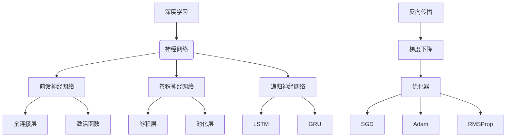

# 深度学习原理与代码实例讲解

## 1. 背景介绍

### 1.1 问题的由来

在过去几十年中，人工智能领域取得了长足的进步,尤其是机器学习和深度学习的兴起,极大推动了人工智能的发展。作为机器学习的一个重要分支,深度学习已经广泛应用于计算机视觉、自然语言处理、语音识别等诸多领域,并取得了令人瞩目的成就。

然而,深度学习的理论基础和实现细节对于很多初学者来说仍然是一个黑盒子。虽然深度学习框架和工具使得模型的训练和部署变得前所未有的简单,但对于深度学习背后的数学原理、算法细节以及实现技巧的理解仍然是一个挑战。

### 1.2 研究现状

目前,已经有大量的书籍、课程和在线资源致力于介绍深度学习的基础知识。然而,这些资源通常侧重于理论知识的传授,缺乏对实际代码实现的深入探讨。另一方面,虽然开源社区提供了大量的代码示例,但这些代码往往缺乏详细的注释和解释,难以帮助初学者理解其中的原理和细节。

### 1.3 研究意义

深入理解深度学习的原理和实现细节对于初学者和实践者都至关重要。对于初学者来说,掌握深度学习的核心概念和算法原理可以帮助他们更好地理解和应用这一强大的技术。对于实践者来说,深入了解深度学习模型的内部实现细节可以帮助他们优化模型性能、解决实际问题,并为未来的创新奠定基础。

### 1.4 本文结构

本文将从理论和实践两个角度全面深入地探讨深度学习的原理和实现细节。首先,我们将介绍深度学习的核心概念和算法原理,包括神经网络的基本结构、反向传播算法、优化器等。接下来,我们将详细讲解这些算法的数学模型和公式推导过程,并通过具体案例进行说明和分析。

在理论基础之上,我们将展示如何使用Python和流行的深度学习框架(如PyTorch和TensorFlow)实现这些算法。我们将从搭建开发环境开始,逐步讲解源代码的实现细节,并对关键代码片段进行解读和分析。最后,我们将介绍深度学习在实际应用场景中的使用,探讨其未来发展趋势和面临的挑战,并推荐相关的学习资源和开发工具。

## 2. 核心概念与联系

在深入探讨深度学习的算法原理和实现细节之前,我们需要先了解一些核心概念及它们之间的联系。这些概念构成了深度学习的理论基础,对于理解后续内容至关重要。

1. **神经网络**是深度学习的核心模型,它模仿生物神经系统的工作原理,通过层层传递和转换输入数据,最终得到所需的输出。根据结构和应用场景的不同,神经网络可以分为前馈神经网络、卷积神经网络和递归神经网络等。

2. **前馈神经网络**是最基本的神经网络形式,它由多个全连接层和激活函数组成。全连接层负责对输入数据进行线性转换,而激活函数则引入非线性,使得神经网络能够拟合更加复杂的函数。

3. **卷积神经网络**在计算机视觉领域取得了巨大成功,它通过卷积层和池化层来提取输入数据(如图像)的特征,从而实现对象检测、图像分类等任务。

4. **递归神经网络**擅长处理序列数据,如自然语言和时间序列。它通过循环结构来捕捉序列数据中的长期依赖关系,常见的变体包括长短期记忆网络(LSTM)和门控循环单元(GRU)。

5. **反向传播算法**是训练神经网络的核心算法,它通过计算损失函数对参数的梯度,并使用梯度下降法来优化参数,从而使神经网络逐步拟合训练数据。

6. **优化器**是梯度下降法的变体,它通过调整学习率、添加动量项等方式,来加速参数优化的过程,常见的优化器包括随机梯度下降(SGD)、自适应矩估计(Adam)和均方根传播(RMSProp)等。

上述概念相互关联、环环相扣,共同构成了深度学习的理论基础。掌握这些核心概念及其联系,对于理解后续的算法原理和实现细节至关重要。

## 3. 核心算法原理 & 具体操作步骤

### 3.1 算法原理概述

深度学习的核心算法是**反向传播算法**,它是一种用于训练人工神经网络的监督学习算法。反向传播算法的主要思想是:通过计算损失函数对网络参数的梯度,并使用梯度下降法来优化这些参数,从而使神经网络逐步拟合训练数据。

反向传播算法包括两个主要阶段:前向传播和反向传播。

1. **前向传播**:在这个阶段,输入数据通过神经网络的各个层进行传递和转换,最终得到输出结果。每一层的输出都是通过对上一层输出进行线性变换和非线性激活函数处理而得到的。

2. **反向传播**:在这个阶段,我们计算输出结果与期望输出之间的误差(损失函数),并通过链式法则计算这个误差相对于每一层参数的梯度。然后,我们使用梯度下降法来更新参数,使得损失函数值逐步减小,从而使神经网络逐渐拟合训练数据。

反向传播算法的关键在于能够高效地计算损失函数相对于每一层参数的梯度。这是通过动态规划的思想实现的,即在前向传播时保存中间结果,在反向传播时利用这些中间结果来计算梯度,从而避免了重复计算。

### 3.2 算法步骤详解

反向传播算法可以分为以下几个步骤:

1. **初始化参数**:我们需要为神经网络的每一层初始化权重和偏置参数,通常使用小的随机值。

2. **前向传播**:输入数据通过神经网络的各个层进行传递和转换,每一层的输出都是通过对上一层输出进行线性变换和非线性激活函数处理而得到的。在这个过程中,我们需要保存每一层的输入、输出和中间结果,以便后续计算梯度。

3. **计算损失函数**:在前向传播的最后一层,我们计算输出结果与期望输出之间的误差,通常使用均方误差或交叉熵等损失函数。

4. **反向传播**:从最后一层开始,我们利用链式法则计算损失函数相对于每一层参数的梯度。具体来说,我们首先计算最后一层的梯度,然后利用这个梯度和上一层的中间结果来计算上一层的梯度,以此类推,直到计算到第一层的梯度。

5. **更新参数**:利用计算得到的梯度,我们使用梯度下降法或其变体(如Adam优化器)来更新每一层的权重和偏置参数,使得损失函数值逐步减小。

6. **迭代训练**:重复步骤2-5,直到模型收敛或达到预设的迭代次数。在每一次迭代中,我们可以使用小批量数据(mini-batch)来加速训练过程。

上述步骤构成了反向传播算法的核心流程。通过不断地迭代训练,神经网络的参数会逐渐优化,从而使得模型能够很好地拟合训练数据。

### 3.3 算法优缺点

**优点**:

1. **强大的拟合能力**:反向传播算法能够训练出具有非常强大的拟合能力的神经网络模型,可以处理高维、非线性和复杂的数据。

2. **端到端学习**:反向传播算法实现了端到端的学习,无需手工设计特征,而是直接从原始数据中自动学习特征表示。

3. **可扩展性强**:反向传播算法可以应用于不同类型的神经网络结构,如前馈神经网络、卷积神经网络和递归神经网络等。

4. **易于并行化**:反向传播算法的计算过程可以很好地并行化,从而充分利用现代硬件(如GPU)的计算能力。

**缺点**:

1. **训练时间长**:对于大型神经网络和大规模数据集,反向传播算法的训练过程可能需要很长时间,尤其是在硬件资源有限的情况下。

2. **梯度消失/爆炸**:在训练深层神经网络时,反向传播算法可能会遇到梯度消失或梯度爆炸的问题,导致训练过程不稳定或无法收敛。

3. **需要大量数据**:反向传播算法通常需要大量的训练数据才能获得良好的性能,对于数据量有限的领域可能不太适用。

4. **黑盒模型**:神经网络模型通常被视为黑盒模型,其内部参数和决策过程难以解释,这可能会影响模型在一些关键领域(如医疗、金融等)的应用。

### 3.4 算法应用领域

反向传播算法及其训练出的神经网络模型已经在许多领域取得了巨大成功,包括但不限于:

1. **计算机视觉**:图像分类、目标检测、语义分割、图像生成等。

2. **自然语言处理**:机器翻译、文本生成、情感分析、问答系统等。

3. **语音识别**:自动语音识别、语音合成等。

4. **推荐系统**:个性化推荐、内容推荐等。

5. **金融**:股票预测、欺诈检测、风险管理等。

6. **医疗**:医学图像分析、疾病诊断、药物发现等。

7. **游戏**:游戏AI、人机对战等。

8. **机器人**:机器人控制、导航、视觉等。

9. **科学计算**:量子化学计算、天体物理模拟等。

总的来说,反向传播算法及其衍生的神经网络模型已经成为人工智能领域最重要和最广泛应用的技术之一,并在不断推动着各个领域的发展和创新。

## 4. 数学模型和公式 & 详细讲解 & 举例说明

### 4.1 数学模型构建

为了更好地理解反向传播算法的原理,我们需要构建其数学模型。我们将从最简单的单层神经网络开始,逐步推广到多层神经网络。

#### 单层神经网络模型

考虑一个单层神经网络,它接受一个 $d$ 维输入向量 $\mathbf{x} = (x_1, x_2, \ldots, x_d)$,并产生一个标量输出 $y$。该神经网络由一个权重向量 $\mathbf{w} = (w_1, w_2, \ldots, w_d)$ 和一个偏置项 $b$ 参数化。

输出 $y$ 可以表示为:

$$y = f\left(\sum_{i=1}^{d} w_i x_i + b\right)$$

其中 $f$ 是激活函数,通常使用sigmoid函数或ReLU函数等非线性函数。

对于给定的训练数据集 $\mathcal{D} = \{(\mathbf{x}^{(1)}, y^{(1)}), (\mathbf{x}^{(2)}, y^{(2)}), \ldots, (\mathbf{x}^{(n)}, y^{(n)})\}$,我们希望找到最优的权重向量 $\mathbf{w}$ 和偏置项 $b$,使得神