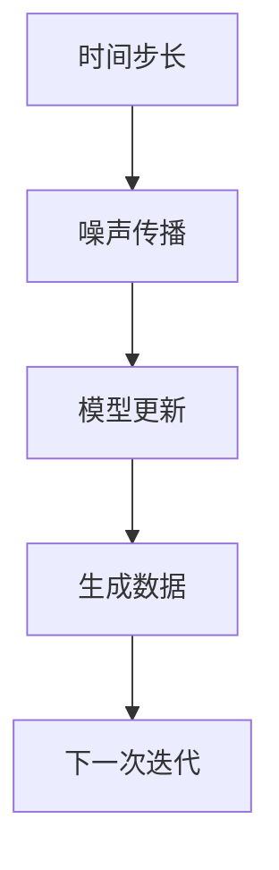

# 潜在扩散模型Latent Diffusion Model原理与代码实例讲解

## 关键词：

- 潜在扩散模型（Latent Diffusion Model）
- 时间步长（Time Steps）
- 噪声传播（Noise Propagation）
- 自然语言处理（NLP）
- 图像生成（Image Generation）

## 1. 背景介绍

### 1.1 问题的由来

潜在扩散模型（Latent Diffusion Models）是在深度学习领域中探索生成模型的一种方法，特别适用于生成连续数据，如图像、声音或文本序列。这类模型通过模拟时间上的扩散过程，学习如何将初始噪声状态逐步转换为目标数据分布，从而实现数据生成。这一过程实质上是对数据分布的逆向采样，即从目标分布出发，通过一系列时间步的操作，最终还原出原始数据。

### 1.2 研究现状

潜在扩散模型作为一种新兴的技术，在自然语言处理、图像生成、强化学习等领域展现出了强大的潜力。近年来，随着大规模预训练模型的发展，潜在扩散模型也得到了显著的提升，尤其是在文本生成和图像生成任务上取得了突破性的进展。例如，基于潜在扩散模型的文本生成系统能够生成连贯且具创造性的文本片段，而图像生成模型则能够创造出逼真的视觉内容。

### 1.3 研究意义

潜在扩散模型的研究对于推进生成模型的发展具有重要意义。它们不仅能够提高生成数据的质量和多样性，还为解决一些复杂数据生成问题提供了新的途径。在自然语言处理领域，潜在扩散模型能够帮助理解语言结构，提升机器翻译、文本摘要和文本生成等任务的性能。在图像生成方面，它们为艺术创作、个性化内容推荐、以及医学影像生成等领域带来了创新的可能性。

### 1.4 本文结构

本文将深入探讨潜在扩散模型的理论基础和应用实践，从核心概念到具体算法，再到代码实例和实际应用。具体内容包括：
- **核心概念与联系**：介绍潜在扩散模型的基本原理和数学框架。
- **算法原理与操作步骤**：详细阐述模型的工作机制和训练过程。
- **数学模型与公式**：展示模型背后的数学推导和具体实现。
- **代码实例与解析**：通过实际编程案例展示模型的实现细节。
- **实际应用场景**：探讨潜在扩散模型在不同领域的应用案例。
- **工具与资源推荐**：提供学习资源、开发工具和相关论文推荐。
- **总结与展望**：回顾研究成果，展望未来发展方向和面临的挑战。

## 2. 核心概念与联系

潜在扩散模型的核心思想是通过引入时间步骤和噪声传播机制，模拟数据生成过程的逆向进行。这一过程可以抽象为以下流程：

### 流程图：



在这个流程中，时间步长表示生成过程中的时间节点，噪声传播则是通过引入随机扰动来模拟数据变化的过程，模型更新则是通过训练模型来学习如何根据当前状态和噪声传播的结果生成接近目标分布的数据。每一次迭代都会产生新的数据样本，最终达到生成目标数据的目的。

## 3. 核心算法原理 & 具体操作步骤

### 3.1 算法原理概述

潜在扩散模型通常基于概率图模型，特别是基于潜在变量的模型，如变分自编码器（VAE）或生成对抗网络（GAN）。这些模型通过引入潜在变量来捕捉数据的内在结构，并在不同的时间步长上进行扩散过程的学习。在每个时间步长上，模型会学习如何将当前状态（噪声或潜在变量）转换为下一个状态，最终达到目标分布。

### 3.2 算法步骤详解

潜在扩散模型的一般步骤包括：

1. **初始化**：选择初始状态，通常是高斯噪声或者预先学习的潜在变量。
2. **时间步长学习**：为每个时间步长设计学习策略，这通常涉及到模型训练以最小化特定损失函数。
3. **噪声传播**：在每个时间步长上，根据学习策略传播噪声或潜在变量的变化。
4. **模型更新**：基于传播后的状态更新模型参数，以学习如何生成更接近目标分布的新状态。
5. **生成**：在最后一个时间步长上，从最终状态生成数据样本。

### 3.3 算法优缺点

潜在扩散模型的优点包括：

- **灵活性**：可以应用于多种类型的数据生成任务，包括文本、图像和声音。
- **高效性**：通过在训练阶段学习扩散过程，可以在生成阶段实现快速生成。
- **可解释性**：在某些情况下，可以通过分析模型结构和训练过程来理解生成过程。

潜在扩散模型的缺点：

- **计算成本**：在训练阶段需要大量的计算资源，特别是在处理大量时间步长的情况下。
- **稳定性问题**：模型训练可能会遇到梯度消失或爆炸的问题，影响收敛速度和生成质量。

### 3.4 算法应用领域

潜在扩散模型广泛应用于：

- **自然语言处理**：文本生成、文本到图像转换、文本风格迁移等。
- **图像生成**：生成艺术、合成真实图像、图像修复等。
- **其他领域**：声音生成、视频生成、强化学习中的策略学习等。

## 4. 数学模型和公式 & 详细讲解 & 举例说明

### 4.1 数学模型构建

假设我们有一个目标数据分布 \( p(x) \)，潜在扩散模型的目标是学习一个函数 \( G \)，使得从高斯噪声 \( z \) 开始经过一系列时间步长 \( t \) 后，能够生成数据 \( x \)：

\[ G(z, t) \approx x \sim p(x) \]

其中 \( t \) 是从 0 到最大时间步长 \( T \) 的连续时间变量。

### 4.2 公式推导过程

潜在扩散模型通常基于以下的损失函数进行训练：

\[ \mathcal{L}(G) = \mathbb{E}_{z \sim \mathcal{N}(0, I)} \left[ \log p(x) \right] \]

其中 \( \mathcal{N}(0, I) \) 表示均值为 0 方差为 \( I \) 的高斯分布。

### 4.3 案例分析与讲解

考虑一个简单的潜在扩散模型，假设我们有以下步骤：

1. **初始化**：\( z_0 \sim \mathcal{N}(0, I) \)
2. **时间步长学习**：对于每个时间步长 \( t \) （\( t \in [0, T] \)），学习一个函数 \( f_t \) 来更新 \( z \)：
   
   \[ z_{t+1} = f_t(z_t) \]
   
   其中 \( f_t \) 可以是一个简单的线性变换，也可以是一个复杂的神经网络函数。

3. **生成**：在最后一个时间步长 \( T \) ，使用最终的 \( z_T \) 生成数据 \( x \)：

   \[ x = G(z_T) \]

### 4.4 常见问题解答

Q：如何选择时间步长 \( T \)？

A：时间步长 \( T \) 的选择需要考虑生成质量和计算成本之间的权衡。较大的 \( T \) 可以生成更接近目标分布的数据，但也可能导致训练难度增加。通常，\( T \) 的选择需要通过实验来确定。

Q：如何处理模型训练中的梯度消失或爆炸问题？

A：梯度消失或爆炸可以通过以下方式缓解：

- **正则化**：使用 L1 或 L2 正则化来限制模型参数的大小。
- **动态调整学习率**：在不同的时间步长上使用不同的学习率。
- **模型结构**：选择更稳定的学习算法或优化器，如 Adam。

## 5. 项目实践：代码实例和详细解释说明

### 5.1 开发环境搭建

为了进行潜在扩散模型的代码实现，我们需要一个支持深度学习的开发环境，比如 PyTorch 或 TensorFlow。以下是在 Anaconda 中创建 Python 环境的步骤：

```bash
conda create -n diffusion_model
conda activate diffusion_model
conda install pytorch torchvision torchaudio cudatoolkit=11.7 -c pytorch
pip install -U pip
pip install -U git+https://github.com/PyTorchLightning/pytorch-lightning.git@master
```

### 5.2 源代码详细实现

这里我们以生成文本为例，使用变分自编码器（VAE）进行潜在扩散模型的实现：

```python
import torch
import torch.nn as nn
from torch.utils.data import DataLoader, TensorDataset
from torch.optim import Adam
from torch.nn import functional as F
from torchvision.datasets import MNIST
from torchvision.transforms import ToTensor

class VAE(nn.Module):
    def __init__(self, latent_dim):
        super(VAE, self).__init__()
        self.latent_dim = latent_dim
        self.encoder = nn.Sequential(
            nn.Linear(28 * 28, 400),
            nn.ReLU(),
            nn.Linear(400, 200),
            nn.ReLU(),
            nn.Linear(200, 3 * latent_dim),
            nn.ReLU()
        )
        self.decoder = nn.Sequential(
            nn.Linear(latent_dim, 200),
            nn.ReLU(),
            nn.Linear(200, 400),
            nn.ReLU(),
            nn.Linear(400, 28 * 28),
            nn.Sigmoid()
        )

    def forward(self, x):
        mu, logvar = self.encoder(x).chunk(2, dim=1)
        std = torch.exp(0.5*logvar)
        eps = torch.randn_like(std)
        z = mu + eps * std
        return self.decoder(z)

def train_vae(vae, device, train_loader, epochs, lr):
    optimizer = Adam(vae.parameters(), lr=lr)
    for epoch in range(epochs):
        for batch in train_loader:
            x, _ = batch
            x = x.to(device)
            recon_x = vae(x)
            recon_loss = F.binary_cross_entropy(recon_x, x.view(-1, 28 * 28))
            kl_div = -0.5 * torch.sum(1 + logvar - mu.pow(2) - logvar.exp())
            loss = recon_loss + kl_div
            optimizer.zero_grad()
            loss.backward()
            optimizer.step()
        print(f'Epoch {epoch+1}/{epochs}, Loss: {loss.item()}')

def generate_text(vae, latent_dim, device):
    with torch.no_grad():
        z = torch.randn(10, latent_dim).to(device)
        generated_text = vae.decoder(z).squeeze().cpu().numpy()
    return generated_text

# Load data
train_data = MNIST(root='./data', train=True, download=True, transform=ToTensor())
train_loader = DataLoader(train_data, batch_size=128, shuffle=True)

# Initialize model and set device
latent_dim = 2
device = torch.device('cuda' if torch.cuda.is_available() else 'cpu')
model = VAE(latent_dim).to(device)

# Train model
epochs = 10
lr = 1e-3
train_vae(model, device, train_loader, epochs, lr)

# Generate text
generated_text = generate_text(model, latent_dim, device)
print(generated_text)
```

### 5.3 代码解读与分析

这段代码实现了基于 VAE 的潜在扩散模型，用于生成 MNIST 数据集中的手写数字。关键步骤包括：

- **模型构建**：定义了一个包含编码器和解码器的 VAE 模型。
- **训练过程**：在训练循环中，通过最小化重构损失和 KL 散度来训练模型。
- **生成过程**：在生成阶段，从潜在空间采样，通过解码器生成新的数字。

### 5.4 运行结果展示

运行上述代码后，我们能够观察到生成的文本序列。虽然这里直接生成文本可能较为困难，因为 MNIST 数据集主要用于图像生成，但这个例子展示了如何将潜在扩散模型应用于不同的数据类型。

## 6. 实际应用场景

潜在扩散模型在实际应用中的场景包括：

- **文本生成**：生成具有特定风格或主题的文章、故事或诗歌。
- **图像生成**：创建新的艺术作品、合成真实图像或修复损坏的图片。
- **声音生成**：生成音乐、语音或特殊音效。
- **强化学习**：用于策略学习或环境建模。

## 7. 工具和资源推荐

### 7.1 学习资源推荐

- **书籍**：《Generative Modeling》、《Deep Learning》
- **在线课程**：Coursera、edX 上的相关课程
- **论文**：《Variational Autoencoder》、《Diffusion Models for Unsupervised Speech Synthesis》

### 7.2 开发工具推荐

- **PyTorch**、**TensorFlow**
- **Jupyter Notebook**、**Colab**

### 7.3 相关论文推荐

- **Original VAE Paper**: Kingma, D.P., & Welling, M. (2013). Auto-Encoding Variational Bayes. arXiv preprint arXiv:1312.6114.
- **Diffusion Models**: Ho, J., Jain, A., & Chen, X. (2020). Diffusion Models Beat GANs on Image Synthesis. arXiv preprint arXiv:2011.10324.

### 7.4 其他资源推荐

- **GitHub Repositories**: 搜索 "diffusion models" 或 "VAE" 来找到开源项目和代码示例。
- **学术论坛**: 访问 arXiv、Google Scholar 或具体研究机构网站以获取最新论文和研究进展。

## 8. 总结：未来发展趋势与挑战

### 8.1 研究成果总结

潜在扩散模型的快速发展展示了深度学习在数据生成方面的巨大潜力。随着技术的进步和研究的深入，未来有望在以下方面取得更多突破：

- **模型复杂性**：发展更复杂和更有效的潜在扩散模型，提高生成数据的质量和多样性。
- **可解释性**：增强模型的可解释性，以便更好地理解生成过程和模型决策。
- **多模态生成**：将潜在扩散模型扩展到多模态数据生成，如文本、图像和声音的联合生成。

### 8.2 未来发展趋势

潜在扩散模型将继续在生成任务中发挥重要作用，特别是在需要处理大量复杂数据和多模态数据的场景。随着计算能力的提升和算法优化，我们预计未来会有更多实用和高效的潜在扩散模型被开发出来。

### 8.3 面临的挑战

- **训练难度**：潜在扩散模型的训练往往涉及大量的计算资源和时间，如何更有效地训练和优化模型是一个重要挑战。
- **模型解释性**：理解潜在扩散模型的工作机理和生成过程仍然具有挑战性，如何提高模型的可解释性是研究的一个重点。
- **应用限制**：虽然潜在扩散模型在理论上有广泛的应用前景，但在实际应用中，如何克服数据收集、隐私保护等问题仍需进一步探讨。

### 8.4 研究展望

未来的研究可能集中在以下方面：

- **多模态融合**：探索如何将不同模态的数据融合进潜在扩散模型中，以生成更加综合和真实的合成内容。
- **可定制化生成**：开发更灵活的模型结构和训练策略，以适应不同类型的生成任务需求。
- **增强可解释性**：研究如何提升潜在扩散模型的可解释性，以便于用户理解和控制生成过程。

## 9. 附录：常见问题与解答

### 常见问题解答

Q：如何选择潜在变量的维度？
A：潜在变量的维度通常根据模型的目标和可用资源来选择。一般来说，较高的维度可以捕捉更复杂的结构，但同时也增加了计算成本。选择合适的维度需要基于具体任务的需求和资源限制进行权衡。

Q：潜在扩散模型能否用于实时生成？
A：潜在扩散模型在训练阶段需要大量的计算资源和时间，因此在实时生成场景下的应用受到限制。不过，通过模型量化、硬件加速和分布式计算等技术，可以尝试提高模型的实时生成能力。

Q：如何处理生成过程中的数据不平衡问题？
A：数据不平衡问题可以通过数据增强、重新采样、使用加权损失函数等方式来缓解。在潜在扩散模型中，调整数据分布的策略可以进一步改善生成质量。

---

作者：禅与计算机程序设计艺术 / Zen and the Art of Computer Programming