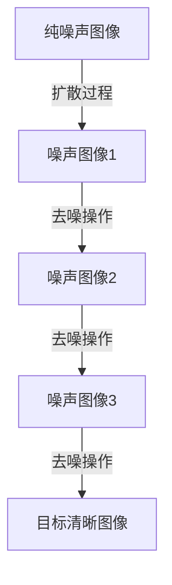

# 潜在扩散模型Latent Diffusion Model原理与代码实例讲解

## 1. 背景介绍

### 1.1 问题的由来

近年来,生成式人工智能模型在各个领域取得了令人瞩目的成就,尤其是在图像、语音和文本生成方面。然而,传统的生成模型如变分自编码器(VAE)和生成对抗网络(GAN)存在一些缺陷,如模型不稳定、训练困难、生成质量参差不齐等问题。为了解决这些问题,潜在扩散模型(Latent Diffusion Models,LDM)应运而生。

### 1.2 研究现状

潜在扩散模型是一种新兴的生成模型,它借鉴了非平衡热力学中的扩散过程,将图像生成过程建模为一个由纯噪声图像逐步去噪的过程。与传统生成模型相比,LDM具有训练稳定、生成质量高、可扩展性强等优势,近年来在计算机视觉、自然语言处理等领域取得了突破性进展。

### 1.3 研究意义

LDM作为一种全新的生成模型范式,不仅在理论上拓展了深度学习的研究领域,而且在实践中也展现出了广阔的应用前景。它可以用于图像生成、图像修复、图像超分辨率等多个领域,为人工智能赋能各行各业。同时,LDM的发展也推动了相关数学理论和算法的进步,对于推动人工智能技术的发展具有重要意义。

### 1.4 本文结构

本文将全面介绍潜在扩散模型的原理、算法、数学模型以及实现细节。首先阐述LDM的核心概念和基本思想;然后详细讲解其核心算法原理和数学模型推导过程;接着通过代码实例演示其具体实现方式;最后探讨LDM在实际应用中的场景,并对其未来发展趋势和面临的挑战进行展望。

## 2. 核心概念与联系

潜在扩散模型(LDM)的核心思想是将图像生成过程建模为一个由纯噪声图像逐步去噪的扩散过程。该过程可以用一个马尔可夫链来描述,其中每一步都是将当前的噪声图像经过一个小的去噪操作,最终得到干净的目标图像。

LDM借鉴了非平衡热力学中的扩散过程,将图像生成过程视为一个从高熵态(纯噪声)到低熵态(清晰图像)的过程。在这个过程中,模型需要学习如何逆向推演这个扩散过程,从而实现图像生成。

LDM与其他生成模型的主要区别在于,它直接对潜在空间(latent space)中的噪声进行建模,而不是像GAN那样直接生成图像空间中的像素值。这使得LDM能够更好地捕捉图像的语义信息,从而提高生成质量。

上图展示了LDM的核心思想,即将图像生成过程建模为一个由纯噪声图像逐步去噪的扩散过程。在训练阶段,模型需要学习如何逆向推演这个扩散过程,从而实现图像生成。

## 3. 核心算法原理与具体操作步骤

### 3.1 算法原理概述

潜在扩散模型(LDM)的核心算法可以分为两个阶段:扩散(diffusion)过程和逆扩散(reverse diffusion)过程。

1. **扩散过程**:该过程将一个干净的数据样本(如图像)逐步添加高斯噪声,直到完全变为纯噪声。这个过程可以用一个马尔可夫链来描述,每一步都是将当前的图像添加一个小的高斯噪声。经过足够多步骤后,最终得到的就是一个纯噪声图像。

2. **逆扩散过程**:该过程是扩散过程的逆过程,即从一个纯噪声图像出发,逐步去噪,最终得到一个干净的数据样本。这个过程需要由一个生成模型(通常是U-Net)来学习,模型的目标是预测每一步去噪所需的噪声分量。

在训练阶段,模型需要同时学习这两个过程。具体来说,对于每个训练样本,我们首先通过扩散过程得到一系列噪声图像,然后将这些噪声图像及其对应的去噪分量喂给生成模型进行训练。在推理阶段,我们从一个纯噪声图像出发,利用训练好的生成模型进行逆扩散过程,最终得到所需的数据样本。

### 3.2 算法步骤详解

以图像生成为例,LDM算法的具体步骤如下:

**扩散过程**:

1) 从训练数据中采样一个干净的图像 $x_0$。
2) 对于 $t=1,2,...,T$ (T是扩散步数):
    - 从正态分布 $\mathcal{N}(0,\sqrt{\beta_t})$ 中采样噪声 $\epsilon_t$。
    - 计算 $x_t = \sqrt{1-\beta_t}x_{t-1} + \sqrt{\beta_t}\epsilon_t$。
3) 最终得到纯噪声图像 $x_T$。

其中,扩散步数 $T$ 和方差schedual $\{\beta_1,...,\beta_T\}$ 是预先设定的超参数。

**逆扩散过程**:

1) 从纯噪声图像 $x_T$ 开始。
2) 对于 $t=T,T-1,...,1$:
    - 利用生成模型 $p_\theta(x_{t-1}|x_t)$ 预测去噪分量 $\epsilon_\theta(x_t,t)$。
    - 计算 $x_{t-1} = \frac{1}{\sqrt{1-\beta_t}}(x_t - \frac{\beta_t}{\sqrt{1-\bar{\alpha}_t}}\epsilon_\theta(x_t,t))$。
3) 最终得到生成图像 $x_0$。

其中,生成模型 $p_\theta(x_{t-1}|x_t)$ 是一个U-Net结构的神经网络,需要在训练阶段进行学习。训练目标是最小化生成模型预测的去噪分量 $\epsilon_\theta(x_t,t)$ 与实际去噪分量 $\epsilon_t$ 之间的均方差。

### 3.3 算法优缺点

**优点**:

1. **训练稳定**:与GAN不同,LDM的训练过程是通过最小化去噪分量的均方差来实现的,因此训练过程更加稳定,不存在模式崩溃的问题。

2. **生成质量高**:由于LDM直接对潜在空间中的噪声进行建模,因此能够更好地捕捉图像的语义信息,从而提高生成质量。

3. **可扩展性强**:LDM可以轻松地扩展到其他数据模态,如语音、视频等,只需要对扩散过程和逆扩散过程进行适当修改即可。

4. **理论基础扎实**:LDM借鉴了非平衡热力学中的扩散理论,因此具有坚实的理论基础。

**缺点**:

1. **计算开销大**:LDM需要进行大量的扩散步骤和逆扩散步骤,因此计算开销相对较大。

2. **生成速度慢**:由于需要进行逐步去噪,LDM的生成速度通常较慢,不适合实时应用场景。

3. **超参数选择敏感**:LDM的性能对扩散步数和方差schedual等超参数的选择比较敏感,需要进行大量的实验调优。

### 3.4 算法应用领域

潜在扩散模型(LDM)由于其优异的生成质量和良好的可扩展性,在多个领域展现出了广阔的应用前景:

1. **图像生成**:LDM可以用于生成高质量的图像,包括人物肖像、风景画、艺术创作等。

2. **图像修复**:LDM能够从损坏的图像中去除噪声和artifacts,实现图像修复和增强。

3. **图像超分辨率**:通过将低分辨率图像作为条件,LDM可以生成对应的高分辨率图像,实现图像超分辨率。

4. **图像插值**:LDM可以在两个给定图像之间生成平滑过渡的插值图像序列。

5. **语音合成**:将LDM扩展到语音领域,可以用于生成高质量的语音数据。

6. **视频生成**:LDM也可以应用于视频数据的生成和处理,如视频插值、修复等。

7. **医学图像分析**:在医学领域,LDM可以用于医学图像的去噪、增强和重建等任务。

总的来说,LDM作为一种通用的生成模型,在计算机视觉、自然语言处理、多媒体处理等多个领域都有广泛的应用前景。

## 4. 数学模型和公式详细讲解与举例说明

### 4.1 数学模型构建

为了构建潜在扩散模型(LDM)的数学模型,我们首先需要定义扩散过程和逆扩散过程。

**扩散过程**:

扩散过程可以用一个马尔可夫链来描述,其中每一步都是将当前的图像添加一个小的高斯噪声。具体来说,给定一个初始图像 $x_0$,扩散过程定义为:

$$
q(x_1,x_2,...,x_T|x_0) = \prod_{t=1}^T q(x_t|x_{t-1})
$$

其中,每一步的转移概率 $q(x_t|x_{t-1})$ 服从如下高斯分布:

$$
q(x_t|x_{t-1}) = \mathcal{N}(x_t;\sqrt{1-\beta_t}x_{t-1},\beta_tI)
$$

这里, $\{\beta_1,...,\beta_T\}$ 是一个预先设定的方差schedual,用于控制每一步添加的噪声量。经过 $T$ 步扩散后,我们得到一个纯噪声图像 $x_T$。

**逆扩散过程**:

逆扩散过程的目标是从纯噪声图像 $x_T$ 出发,逐步去噪,最终得到初始图像 $x_0$。这个过程由一个生成模型 $p_\theta(x_{t-1}|x_t)$ 来学习,其中 $\theta$ 表示模型参数。

根据贝叶斯公式,我们可以将逆扩散过程表示为:

$$
p_\theta(x_0|x_1,...,x_T) = p(x_T)\prod_{t=1}^T p_\theta(x_{t-1}|x_t)
$$

其中, $p(x_T)$ 是纯噪声图像的先验分布, $p_\theta(x_{t-1}|x_t)$ 是生成模型需要学习的条件概率分布。

为了简化计算,我们通常假设生成模型只需要预测每一步的去噪分量 $\epsilon_\theta(x_t,t)$,而不是直接预测 $x_{t-1}$。根据扩散过程的定义,我们可以得到:

$$
x_{t-1} = \frac{1}{\sqrt{1-\beta_t}}(x_t - \frac{\beta_t}{\sqrt{1-\bar{\alpha}_t}}\epsilon_\theta(x_t,t))
$$

其中, $\bar{\alpha}_t = \prod_{s=1}^t(1-\beta_s)$。

因此,生成模型的训练目标就是最小化预测的去噪分量 $\epsilon_\theta(x_t,t)$ 与实际去噪分量 $\epsilon_t$ 之间的均方差:

$$
\mathbb{E}_{x_0,\epsilon}\left[\|\epsilon_\theta(x_t,t) - \epsilon_t\|^2\right]
$$

### 4.2 公式推导过程

接下来,我们将详细推导LDM模型中的一些关键公式。

**1. 扩散过程的联合分布**

根据马尔可夫链的性质,扩散过程的联合分布可以表示为:

$$
\begin{aligned}
q(x_1,x_2,...,x_T|x_0) &= q(x_1|x_0)q