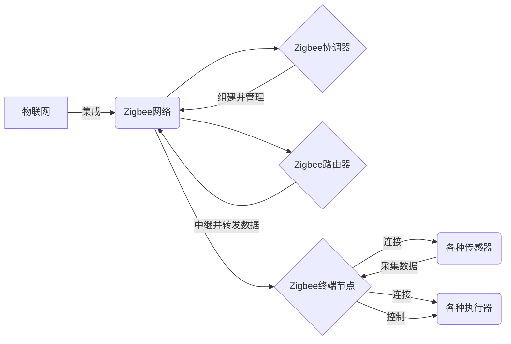
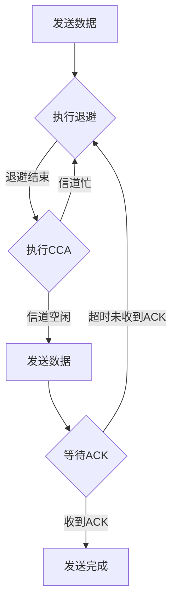

# 物联网(IoT)技术和各种传感器设备的集成：Zigbee传感器在物联网中的应用

关键词：物联网、Zigbee、传感器、无线通信、低功耗

## 1. 背景介绍
### 1.1  问题的由来
随着物联网(Internet of Things, IoT)技术的快速发展,越来越多的传感器设备需要接入物联网进行数据采集和传输。传统的有线连接方式存在布线困难、成本高、扩展性差等问题。因此,低功耗、低成本、组网灵活的无线通信技术成为物联网传感器接入的首选。
### 1.2  研究现状
目前,低功耗无线通信技术主要有Zigbee、Bluetooth Low Energy(BLE)、Wi-Fi、LoRa、NB-IoT等。其中,Zigbee凭借其低功耗、低成本、支持大规模组网等优势,在智能家居、工业控制、农业监测等领域得到广泛应用。越来越多的Zigbee传感器设备被开发出来,极大地推动了物联网的发展。
### 1.3  研究意义
深入研究Zigbee传感器在物联网中的应用,对于推动物联网技术的发展、解决实际应用中的问题具有重要意义。一方面,探索如何将各种传感器设备与Zigbee无线通信模块相结合,实现高效的数据采集与传输。另一方面,研究如何优化Zigbee网络的组建与管理,提高系统的可靠性、安全性和扩展性。这将为物联网应用提供更加成熟、完善的解决方案。
### 1.4  本文结构
本文将围绕Zigbee传感器在物联网中的应用展开深入探讨。第2部分介绍Zigbee与物联网的核心概念及二者之间的关系;第3部分重点阐述Zigbee无线通信的核心原理与具体实现步骤;第4部分建立Zigbee传感器节点的数学模型,推导相关参数的计算公式,并给出典型应用案例;第5部分通过代码实例,讲解如何基于Zigbee模块和传感器进行物联网应用开发;第6部分总结Zigbee传感器的实际应用场景;第7部分推荐相关的学习资源、开发工具和参考文献;第8部分对全文进行总结,并对Zigbee传感器未来的发展趋势与面临的挑战进行展望。

## 2. 核心概念与联系
物联网是一个动态的全球网络基础设施,它具有基于标准和互操作通信协议的自组织能力,其中物理的和虚拟的"物"具有身份标识、物理属性、虚拟的特性和智能的接口,并与信息网络无缝整合。它通过在计算机网络中集成各种传感器设备,实现人与物、物与物的互联互通。

Zigbee是一种低速率、低功耗、低成本的近距离无线通信技术。它基于IEEE 802.15.4标准,工作在2.4GHz、915MHz和868MHz频段,传输距离一般在100米以内。Zigbee采用CSMA/CA信道访问机制,支持星型、树型、网状等多种网络拓扑结构,最多可连接65536个节点。Zigbee设备分为协调器、路由器和终端节点三种类型,协调器负责网络的组建和管理,路由器负责数据的中继和转发,终端节点负责数据的采集和执行控制任务。

Zigbee与物联网的关系如下图所示:

在物联网应用中,Zigbee网络通过Zigbee协调器、路由器、终端节点等设备组成,并与各种传感器和执行器连接,实现对物理世界的感知和控制。Zigbee协议栈定义了物理层、MAC层、网络层和应用层,支持自组织组网、多跳路由、安全加密等功能,非常适合低速率、低功耗、大规模的物联网应用场景。

## 3. 核心算法原理 & 具体操作步骤
### 3.1  算法原理概述
Zigbee无线通信的核心是CSMA/CA(Carrier Sense Multiple Access with Collision Avoidance)算法,它是一种载波侦听多路访问/碰撞避免的信道访问机制。CSMA/CA分为信标模式和非信标模式两种,前者适用于低延迟场合,后者适用于低功耗场合。
### 3.2  算法步骤详解
以非信标模式为例,CSMA/CA的基本步骤如下:

1. 节点在发送数据前,先进行一次退避,随机等待一段时间。
2. 退避结束后,节点执行CCA(Clear Channel Assessment),即判断信道是否空闲。若信道忙,则再次退避;若信道空闲,则开始发送数据。  
3. 接收节点收到数据后,如果需要确认,则发送ACK帧。发送节点如果超时未收到ACK,则认为发送失败,需要重传。
4. 为提高信道利用率,防止碰撞,退避时间分为多个退避时隙,每个时隙是aUnitBackoffPeriod的整数倍。节点每次退避结束后,若信道忙,则退避指数加1,直至达到最大退避指数macMaxBE。

具体流程可参考下图:

### 3.3  算法优缺点
CSMA/CA算法的优点是简单易实现,信道利用率高,支持分布式组网。但在高负载情况下,退避时间和碰撞概率会增大,导致吞吐量下降。

此外,CSMA/CA还存在隐藏终端和暴露终端问题。隐藏终端是指两个节点虽然都在接收节点的通信范围内,但彼此间无法通信,从而在同时发送数据时产生碰撞。暴露终端是指一个正在发送数据的节点,会使其通信范围内的其他节点都无法发送数据,降低了空间复用度。

### 3.4  算法应用领域
CSMA/CA广泛应用于Zigbee、Wi-Fi、LoRa等无线通信领域,特别适合低功耗、低成本的物联网应用场景,如智能家居、工业控制、农业监测等。

## 4. 数学模型和公式 & 详细讲解 & 举例说明
### 4.1  数学模型构建
考虑一个Zigbee传感器节点,它周期性地采集传感器数据并通过Zigbee网络上传至协调器。假设传感器采样周期为$T_s$,数据包长度为$L$,节点发射功率为$P_t$,节点到协调器的距离为$d$,信道衰减指数为$\eta$,背景噪声功率为$P_n$。

根据无线通信的路径损耗模型,节点的接收信号功率$P_r$为:

$$P_r=\frac{P_tG_tG_r\lambda^2}{(4\pi d)^2}\cdot(\frac{d}{d_0})^{-\eta}$$

其中,$G_t$和$G_r$分别是发射和接收天线增益,$\lambda$是信号波长,$d_0$是参考距离。

信噪比SNR定义为接收信号功率与噪声功率之比,即:

$$SNR=\frac{P_r}{P_n}$$

假设调制方式为BPSK,信噪比与比特错误率BER的关系为: 

$$BER=Q(\sqrt{2\cdot SNR})$$

其中,$Q(x)$是高斯Q函数:

$$Q(x)=\frac{1}{\sqrt{2\pi}}\int_x^{\infty}e^{-\frac{u^2}{2}}du$$

### 4.2  公式推导过程
将路径损耗公式代入SNR公式,得:

$$SNR=\frac{P_tG_tG_r\lambda^2}{(4\pi d)^2P_n}\cdot(\frac{d}{d_0})^{-\eta}$$

由于$\lambda=\frac{c}{f}$,其中$c$是光速,$f$是信号频率,代入上式得:

$$SNR=\frac{P_tG_tG_rc^2}{(4\pi fd)^2P_n}\cdot(\frac{d}{d_0})^{-\eta}$$

这就是Zigbee节点在给定参数下的信噪比计算公式。

进一步地,将SNR代入BER公式,得:

$$BER=Q(\sqrt{\frac{2P_tG_tG_rc^2}{(4\pi fd)^2P_n}\cdot(\frac{d}{d_0})^{-\eta}})$$

这就是Zigbee节点的比特错误率计算公式。

### 4.3  案例分析与讲解
假设一个Zigbee节点的参数如下:
- 发射功率$P_t=10$ dBm
- 发射天线增益$G_t=2$ dBi  
- 接收天线增益$G_r=2$ dBi
- 信号频率$f=2.4$ GHz
- 节点到协调器距离$d=50$ m
- 信道衰减指数$\eta=2.5$
- 背景噪声功率$P_n=-95$ dBm
- 参考距离$d_0=1$ m

将这些参数代入SNR公式,并注意单位换算,可得:

$$SNR=\frac{10^{10/10}\cdot10^{2/10}\cdot10^{2/10}\cdot(3\times10^8)^2}{(4\pi\cdot2.4\times10^9\cdot50)^2\cdot10^{-95/10}}\cdot(\frac{50}{1})^{-2.5}=57.5$$

即节点的接收信噪比为57.5,约为17.6 dB。

再将SNR代入BER公式,得:

$$BER=Q(\sqrt{2\times57.5})=Q(10.7)=7.97\times10^{-28}$$

可见,在上述参数下,Zigbee节点的比特错误率非常低,通信质量很好。

### 4.4  常见问题解答
问:如何提高Zigbee节点的通信距离?
答:可以从以下几个方面入手:
1. 提高发射功率,如从10 dBm增大到20 dBm。
2. 使用高增益天线,如从2 dBi提高到5 dBi。
3. 降低数据速率,如从250 kbps降到20 kbps,这样可以在更低的信噪比下工作。
4. 优化节点布局,尽量减少节点间的距离,或使用多跳中继。
5. 选择开阔环境,减少障碍物遮挡,降低信道衰减。

问:影响Zigbee网络容量的因素有哪些?
答:主要有以下几点:
1. 节点数量:节点数量越多,网络容量越大,但也会增加冲突和延迟。
2. 数据速率:数据速率越高,单位时间内可传输的数据量越大,但抗干扰能力下降。
3. 节点分布:节点分布越均匀,网络容量越大,反之则可能产生瓶颈。
4. 网络拓扑:不同的网状拓扑结构,如星型、树型、网状等,其网络容量有所差异。
5. 路由策略:良好的路由策略可以均衡负载,提高网络吞吐量。

## 5. 项目实践：代码实例和详细解释说明
### 5.1  开发环境搭建
本项目使用TI的CC2530芯片和IAR Embedded Workbench集成开发环境进行Zigbee应用开发。

首先,需要安装IAR EW for 8051 IDE,并购买CC2530的开发工具包,包括CC2530 EB评估板、SmartRF05EB底板等。

然后,在IAR EW中建立工程项目,将CC2530 EB通过USB线连接到电脑,并在工程配置中选择CC2530芯片型号和对应的Flash Programmer。

最后,编写Zigbee应用程序,调用Zigbee协议栈API,完成编译、下载、调试等开发步骤。