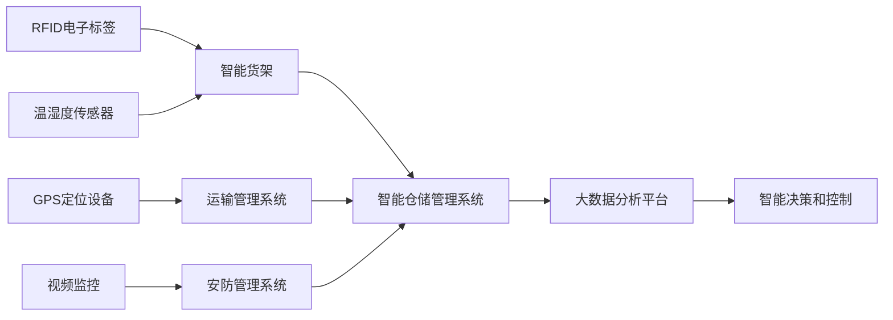

# 物联网(IoT)技术和各种传感器设备的集成：物联网在仓储物流中的应用

关键词：物联网、传感器、仓储物流、RFID、智能仓储、供应链管理

## 1. 背景介绍
### 1.1 问题的由来
随着全球化经济的快速发展,仓储物流行业面临着前所未有的机遇和挑战。传统的仓储物流管理模式已经无法满足现代供应链的需求,亟需引入新的技术手段来提升仓储物流的效率和精细化管理水平。物联网(Internet of Things, IoT)技术的出现为仓储物流行业带来了革命性的变革。

### 1.2 研究现状
目前,国内外学者对物联网技术在仓储物流领域的应用开展了广泛的研究。杨帆等人提出了一种基于RFID的智能仓储管理系统[1],通过RFID电子标签对货物进行精确定位和跟踪,实现了仓储作业的自动化和智能化。刘强等人研究了物联网技术在冷链物流中的应用[2],利用温度、湿度等传感器实时监测冷链货物的存储环境,保证了货物的品质和安全。国外学者Atzori等人对物联网的体系架构和关键技术进行了全面综述[3],为物联网在各行业的应用奠定了理论基础。

### 1.3 研究意义
将物联网技术与各种传感器设备集成应用于仓储物流领域,具有重要的理论意义和实践价值:

(1)提升仓储作业效率:通过物联网技术实现货物的实时定位、跟踪和盘点,大大提高了仓储作业的效率和准确性,降低了人工成本。

(2)优化库存管理:利用智能货架和RFID技术实现库存的实时监测和自动补货,减少缺货和积压,提高库存周转率。

(3)保障货物安全:利用温湿度、震动等传感器实时监测货物存储环境,及时预警和处置异常情况,减少货物损耗。 

(4)促进供应链协同:通过物联网平台实现供应链各环节的信息共享和业务协同,提高整个供应链的运作效率。

### 1.4 本文结构
本文将重点探讨物联网技术和各种传感器设备在仓储物流领域的集成应用。第2部分介绍物联网和传感器的核心概念;第3部分阐述智能仓储的核心架构和算法原理;第4部分建立智能仓储的数学模型并给出案例分析;第5部分提供智能仓储系统的代码实现;第6部分分析物联网在仓储物流中的典型应用场景;第7部分推荐相关的开发工具和学习资源;第8部分总结全文并展望未来的发展方向。

## 2. 核心概念与联系
物联网是一个动态的全球网络基础设施,它具有基于标准和互操作通信协议的自组织能力,其中物理的和虚拟的"物"具有身份标识、物理属性、虚拟的特性和智能的接口,并与信息网络无缝整合[4]。通过射频识别(RFID)、红外感应器、全球定位系统、激光扫描器等信息传感设备,按约定的协议,把任何物品与互联网相连接,进行信息交换和通信,以实现智能化识别、定位、跟踪、监控和管理的一种网络。

在物联网中,各种传感器设备扮演着重要的角色。RFID电子标签可以附着在货物上,实现对货物的自动识别和数据采集。GPS定位设备可以对运输车辆进行实时定位和监控。温度、湿度、气体浓度等传感器可以对仓储环境进行实时监测。振动、倾角传感器可以检测货物的完整性。视频监控系统可以对仓库进行可视化管理。

通过物联网将各种传感器设备进行集成互联,再将采集到的海量多源异构数据汇聚到智能仓储管理系统进行分析挖掘,就能实现对仓储物流各个环节的智能感知、智能分析、智能决策和智能控制,从而构建起智慧化的现代仓储物流体系。

下图展示了一个典型的智能仓储物流系统的物联网架构:

## 3. 核心算法原理 & 具体操作步骤
### 3.1 算法原理概述
智能仓储物流系统的核心是各种智能算法,主要包括以下几类:

(1)货位优化算法:对货物的存储位置进行动态规划,提高拣货效率和空间利用率。代表算法有遗传算法、蚁群算法等。

(2)库存预测算法:通过对历史销售数据进行时间序列分析,预测未来一段时间的库存需求。代表算法有ARIMA、指数平滑等。

(3)路径规划算法:对拣货路线进行优化,尽可能减少行走距离和避免拥堵。代表算法有TSP、A*等。

(4)设备调度算法:对AGV小车、输送线等设备进行任务分配和调度,提高设备利用率。代表算法有匈牙利算法、模拟退火等。

### 3.2 算法步骤详解
以遗传算法优化货位为例,详细介绍其步骤:

(1)染色体编码:将货位布局转化为染色体编码,每个货位对应染色体上的一个基因。

(2)初始化种群:随机生成一定数量的初始货位布局作为种群。

(3)适应度评估:根据拣货效率、空间利用率等指标,计算每个染色体的适应度。

(4)选择操作:按照适应度大小,以一定概率选择优秀染色体作为父代。

(5)交叉操作:对父代染色体进行随机交叉,生成新的子代染色体。

(6)变异操作:以一定概率对子代染色体的某些基因进行随机变异。

(7)终止条件判断:如果达到最大迭代次数或者找到满意解,则终止;否则回到步骤(3)。

### 3.3 算法优缺点
遗传算法的优点是通用性强,编码灵活,能在合理时间内搜索到接近最优的解。缺点是参数设置需要经验,且易早熟收敛。

其他智能算法也有各自的优缺点,需要根据具体问题选择合适的算法。总的来说,智能算法为智慧物流提供了有力的工具,但如何将算法与具体场景相结合,是需要认真研究的问题。

### 3.4 算法应用领域
智能算法在仓储物流的各个环节都有广泛应用,如入库上架、拣货路径、补货策略、库存优化、运输调度等。通过算法的合理应用,能显著提升仓储物流系统的运行效率和决策水平。

## 4. 数学模型和公式 & 详细讲解 & 举例说明
### 4.1 数学模型构建
以库存优化问题为例,介绍如何建立数学模型。假设一个仓库有$n$种商品,第$i$种商品的日需求量为$D_i$,订货提前期为$L_i$,单位持有成本为$h_i$,单位缺货成本为$b_i$,订货固定成本为$K$。决策变量$Q_i$表示第$i$种商品的订货量,$r_i$表示再订货点。目标是求解最优的$Q_i$和$r_i$,使得总成本最小。该问题可以表示为如下数学模型:

$$
\begin{align}
\min \quad & \sum_{i=1}^n \left[\frac{D_i}{Q_i}K + \frac{Q_i}{2}h_i + \frac{D_i}{Q_i}\int_{r_i}^{\infty}(x-r_i)f_i(x)dx \cdot b_i\right] \\
\text{s.t.} \quad & Q_i \geq 0, \quad i=1,2,\dots,n \\
& r_i \geq 0, \quad i=1,2,\dots,n
\end{align}
$$

其中$f_i(x)$是第$i$种商品需求量的概率密度函数。目标函数由订货成本、持有成本和缺货成本三部分组成。

### 4.2 公式推导过程
对于上述模型,可以通过求导的方法得到$Q_i$和$r_i$的最优解析解。首先求$Q_i$的最优解,令目标函数对$Q_i$的一阶导数等于0:

$$\frac{\partial TC}{\partial Q_i} = -\frac{D_i}{Q_i^2}K + \frac{1}{2}h_i - \frac{D_i}{Q_i^2}\int_{r_i}^{\infty}(x-r_i)f_i(x)dx \cdot b_i = 0$$

整理可得:

$$Q_i^* = \sqrt{\frac{2D_i\left[K+b_i\int_{r_i}^{\infty}(x-r_i)f_i(x)dx\right]}{h_i}}$$

再求$r_i$的最优解,令目标函数对$r_i$的一阶导数等于0:

$$\frac{\partial TC}{\partial r_i} = -\frac{D_i}{Q_i}f_i(r_i)b_i = 0$$

可得:

$$F_i(r_i^*) = \int_{-\infty}^{r_i^*}f_i(x)dx = 1$$

其中$F_i(x)$是需求量的累积分布函数。上式表明再订货点$r_i^*$是需求量的100%分位点,即再订货点设置为需求量最大值。

### 4.3 案例分析与讲解
下面以一个具体案例说明模型的应用。某仓库中有A、B两种商品,相关参数如下:

商品种类|日均需求量$D_i$|订货提前期$L_i$|单位持有成本$h_i$|单位缺货成本$b_i$|订货固定成本$K$
-|-|-|-|-|-
A|500|10天|2元/件/天|10元/件|200元/次
B|1000|5天|1元/件/天|5元/件|200元/次

假设两种商品的需求量都服从正态分布,且$\mu_A=500,\sigma_A=50;\mu_B=1000,\sigma_B=100$。将参数代入公式(4)和(6)中,可以计算出:

$$Q_A^* = 300, \quad r_A^*=650$$
$$Q_B^* = 894, \quad r_B^*=1200$$

这表明,对于商品A,每次订货300件,当库存下降到650件时再发出订货;对于商品B,每次订货894件,当库存下降到1200件时再发出订货。

### 4.4 常见问题解答
(1)能否考虑订货提前期内的需求量?

可以,只需将公式(4)中的$\int_{r_i}^{\infty}(x-r_i)f_i(x)dx$替换为$\int_{r_i}^{\infty}(x-r_i+D_iL_i)f_i(x)dx$即可。这相当于考虑了从发出订货到货物到达这段时间内的需求量。

(2)如何求解概率密度函数$f_i(x)$?

可以根据历史销售数据的统计分布拟合,常见的分布有正态分布、泊松分布、指数分布等。也可以使用数据驱动的方法,如核密度估计等。

(3)现实中的订货量如何取整?

由于公式(4)计算出的$Q_i^*$一般是实数,在下达订货时需要取整。可以四舍五入到最接近的整数,也可以向上取整以避免缺货。

## 5. 项目实践：代码实例和详细解释说明
### 5.1 开发环境搭建
智能仓储系统的开发涉及多种软硬件环境,主要包括:

(1)设备层:包括RFID读写器、传感器、AGV小车、输送线、提升机等,需要根据设备接口进行二次开发。

(2)数据层:包括数据采集、预处理、存储、管理等,常用的工具有Hadoop、