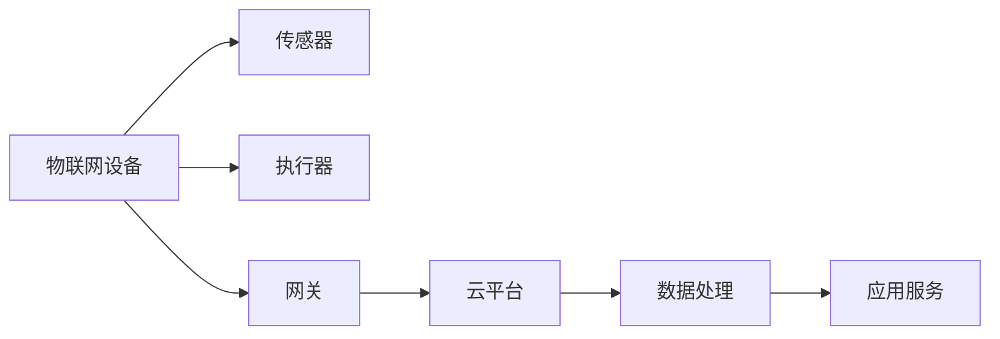

# 物联网(IoT)技术和各种传感器设备的集成：物联网在消费电子的创新

## 1. 背景介绍

### 1.1 问题的由来

随着科技的不断发展,物联网(IoT)技术已经深入到我们生活的方方面面。物联网将各种设备与互联网相连,使得数据可以被实时采集、传输和处理,为我们的生活带来了极大的便利。在消费电子领域,物联网技术的应用更是如火如荼。

传统的消费电子产品通常是独立运行的,缺乏互联互通的能力。而物联网技术将这些设备连接到互联网上,使它们能够实时交换数据、接收控制指令,从而实现智能化、自动化的操作。

随着5G通信技术的普及,物联网设备之间的通信变得更加高效和可靠。同时,各种新型传感器的出现,使得物联网系统能够采集更加丰富的环境数据,为智能决策提供了数据支持。

### 1.2 研究现状

目前,物联网技术在消费电子领域的应用已经取得了长足的进步。智能家居、可穿戴设备、智能电视等产品都已经与物联网技术深度融合。

以智能家居为例,用户可以通过手机APP或语音助手控制家中的照明、空调、安防系统等设备,实现了家居环境的智能化管理。可穿戴设备如智能手环、智能手表等,则通过集成的各种传感器采集用户的运动数据、心率等生理数据,为用户提供健康管理和运动辅助。

不过,现有的物联网系统还存在一些问题和挑战,比如设备之间的互操作性、数据安全和隐私保护、系统的可扩展性等,这些问题都需要进一步的研究和解决。

### 1.3 研究意义

物联网技术在消费电子领域的应用,将极大地改变我们的生活方式。通过物联网,消费电子产品将变得更加智能化、自动化,能够主动感知环境、做出智能决策,为用户带来无缝的体验。

同时,物联网技术也将推动消费电子产业的创新和发展。新型传感器、新的通信协议、边缘计算等技术的融合应用,将催生出全新的消费电子产品和应用场景。

因此,深入研究物联网技术在消费电子领域的集成和应用,对于促进消费电子产业的创新、提高人们的生活质量,都具有重要的意义。

### 1.4 本文结构

本文将从以下几个方面深入探讨物联网技术在消费电子领域的应用:

1. 介绍物联网的核心概念,以及与消费电子的联系。
2. 阐述物联网系统的核心算法原理和具体操作步骤。
3. 构建物联网系统的数学模型,并详细推导公式过程。
4. 通过实际项目案例,展示物联网系统的代码实现和运行效果。
5. 分析物联网技术在消费电子领域的实际应用场景。
6. 介绍相关的工具和学习资源。
7. 总结物联网技术的发展趋势和面临的挑战。
8. 解答常见的问题和疑虑。

## 2. 核心概念与联系

物联网(Internet of Things, IoT)是一种基于互联网的网络,它将各种物体与互联网相连,实现物与物、物与人之间的智能交互。

物联网系统主要由以下几个核心组件构成:

1. **物联网设备**: 指各种与物联网相连的智能硬件设备,如智能家电、可穿戴设备、车载设备等。这些设备通常集成了传感器和执行器。

2. **传感器**: 用于采集环境数据,如温度、湿度、光线、运动状态等,并将数据传输给物联网设备。

3. **执行器**: 根据物联网设备或云端下发的控制指令,执行相应的动作,如开关电器、调节设备状态等。

4. **网关**: 负责将物联网设备采集的数据传输到云端,同时将云端的控制指令下发到物联网设备。

5. **云平台**: 用于存储和管理物联网系统的海量数据,并提供数据处理、设备管理等服务。

6. **数据处理**: 对采集的数据进行清洗、分析和建模,为应用服务提供数据支持。

7. **应用服务**: 根据数据处理的结果,为用户提供智能化的应用服务,如智能家居控制、健康监测等。

物联网技术与消费电子产品的结合,正是建立在上述核心概念的基础之上。通过将各种传感器和执行器集成到消费电子产品中,并与云端相连,消费电子产品就获得了感知环境、智能决策和自动化操作的能力,为用户带来全新的体验。

## 3. 核心算法原理 & 具体操作步骤

### 3.1 算法原理概述

物联网系统的核心算法主要包括以下几个方面:

1. **数据采集算法**: 用于从各种传感器高效、准确地采集环境数据。
2. **数据传输算法**: 将采集的数据安全、可靠地传输到云端。
3. **数据处理算法**: 对采集的海量数据进行清洗、分析和建模,提取有价值的信息。
4. **决策算法**: 根据处理后的数据,做出智能化的决策,下发控制指令。
5. **设备管理算法**: 对物联网系统中的各种设备进行统一管理和控制。

其中,数据采集、传输和处理算法是物联网系统的基础,决策算法则是系统的核心,设备管理算法则保证了系统的高效运行。

### 3.2 算法步骤详解

以智能家居系统为例,其核心算法的具体步骤如下:

1. **数据采集**:
   - 环境传感器(温度、湿度、光线等)按照预设的时间间隔或触发条件,采集当前环境数据。
   - 用户可穿戴设备(手环、手表等)实时采集用户的运动数据、生理数据等。
   - 安防传感器(门磁、红外等)实时监测家中的安全状况。

2. **数据传输**:
   - 采集到的数据通过家庭网关(WiFi、蓝牙等)上传到云端服务器。
   - 采用加密和认证机制,保证数据传输的安全性和可靠性。

3. **数据处理**:
   - 云端对采集的数据进行清洗、去重、填补等预处理。
   - 使用机器学习算法(如决策树、神经网络等)对数据进行分析和建模。
   - 根据模型的输出结果,判断家中的环境状况和用户的活动模式。

4. **决策与控制**:
   - 根据分析结果,系统做出智能决策,如调节空调温度、开关照明等。
   - 将控制指令下发到家中的各种执行设备,实现自动化的家居管理。

5. **设备管理**:
   - 云端对家中的所有物联网设备进行统一管理和监控。
   - 设备状态异常时,发出报警并提示用户维修。
   - 对设备进行固件升级,保证系统的安全性和可用性。

### 3.3 算法优缺点

上述算法的优点包括:

- 实现了端到端的自动化流程,提高了系统的智能化水平。
- 通过机器学习算法对数据进行分析和建模,提高了决策的准确性。
- 采用加密和认证机制,保证了数据传输和系统运行的安全性。
- 集中式的设备管理,提高了系统的可维护性和可扩展性。

不过,这些算法也存在一些缺点和局限性:

- 对网络带宽和云端计算资源的需求较高,可能会增加系统的运行成本。
- 算法的复杂性较高,对开发人员的技术要求较高。
- 用户隐私数据的保护仍然是一个挑战。
- 系统的可靠性和容错性需要进一步加强。

### 3.4 算法应用领域

上述核心算法不仅适用于智能家居场景,在其他消费电子领域也有广泛的应用:

- **可穿戴设备**: 通过算法分析用户的运动数据、生理数据,为用户提供健康管理和运动辅助服务。
- **智能电视**: 通过算法分析用户的观看习惯,推荐个性化的节目内容。
- **智能音箱**: 通过语音识别和自然语言处理算法,实现与用户的语音交互。
- **智能汽车**: 通过计算机视觉和决策算法,实现辅助驾驶和自动驾驶功能。
- **工业物联网**: 通过算法对设备状态进行监测和预测,实现预防性维护,提高设备的运行效率。

总的来说,物联网核心算法为消费电子产品带来了智能化、自动化和个性化的能力,是实现创新应用的关键所在。

## 4. 数学模型和公式 & 详细讲解 & 举例说明

在物联网系统中,数学模型和公式扮演着重要的角色,它们为系统的设计、优化和决策提供了理论基础和量化依据。

### 4.1 数学模型构建

以智能家居系统为例,我们可以构建如下数学模型:

$$
\begin{aligned}
\min_{x} &\quad f(x) = \sum_{i=1}^{n} c_i(x_i) + \lambda \cdot g(x) \\
\text{s.t.} &\quad x_i \in \mathcal{X}_i, \quad i = 1, 2, \ldots, n \\
       &\quad g(x) \leq 0
\end{aligned}
$$

其中:

- $x = (x_1, x_2, \ldots, x_n)$ 表示系统的决策变量,如空调温度、照明亮度等。
- $c_i(x_i)$ 表示第 $i$ 个决策变量的代价函数,如能耗代价、舒适度代价等。
- $g(x)$ 表示系统的约束条件,如温度范围、能耗上限等。
- $\lambda$ 是约束条件的权重系数,用于平衡代价和约束的重要性。
- $\mathcal{X}_i$ 是第 $i$ 个决策变量的可行域。

该模型的目标是在满足约束条件的前提下,最小化系统的总代价。通过求解这个优化问题,我们可以得到系统的最优决策方案。

### 4.2 公式推导过程

在上述模型中,代价函数 $c_i(x_i)$ 和约束条件 $g(x)$ 的具体形式需要根据实际情况进行建模和推导。以空调温度控制为例,我们可以推导如下公式:

**舒适度代价函数**:

$$c_\text{comfort}(T) = \alpha \cdot (T - T_\text{ideal})^2$$

其中 $T$ 表示空调温度, $T_\text{ideal}$ 表示理想舒适温度, $\alpha$ 是权重系数。该函数表示温度与理想值的偏差越大,舒适度代价就越高。

**能耗代价函数**:

$$c_\text{energy}(T) = \beta \cdot \left\lvert T - T_\text{out} \right\rvert^\gamma$$

其中 $T_\text{out}$ 表示室外温度, $\beta$ 和 $\gamma$ 是经验系数。该函数表示空调温度与室外温度差异越大,能耗代价就越高。

**约束条件**:

$$
\begin{aligned}
&T_\text{min} \leq T \leq T_\text{max} \\
&P_\text{energy} \leq P_\text{max}
\end{aligned}
$$

其中 $T_\text{min}$ 和 $T_\text{max}$ 分别表示温度的下限和上限, $P_\text{energy}$ 表示空调的能耗, $P_\text{max}$ 表示能耗上限。

通过将上述公式代入优化模型,并设置合理的权重系数,我们就可以求解出在满足约束条件下,使舒适度代价和能耗代价达到平衡的最优空调温度。

### 4.3 案例分析与讲解