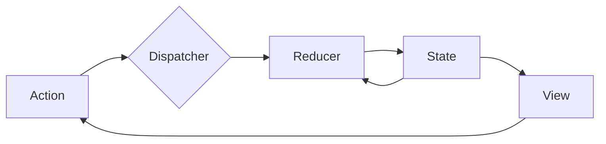
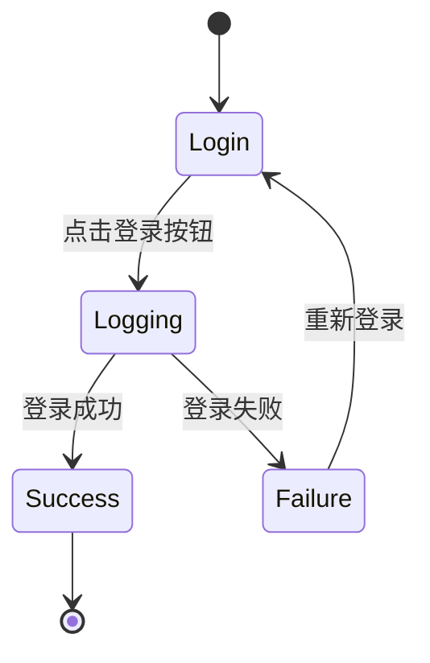

# 状态管理 原理与代码实例讲解

作者：禅与计算机程序设计艺术 / Zen and the Art of Computer Programming

## 1. 背景介绍
### 1.1 问题的由来
在现代Web应用开发中,随着应用复杂度的不断提升,管理应用状态成为了一个亟待解决的问题。传统的MVC架构在处理复杂应用状态时,往往会导致代码逻辑混乱,难以维护。因此,如何更好地管理应用状态,成为了Web开发领域的一个重要课题。
### 1.2 研究现状
目前,业界已经提出了多种状态管理解决方案,其中比较知名的有Flux、Redux、Mobx等。这些方案都试图通过某种模式或架构,来规范化和简化状态管理过程。然而,它们在具体实现和使用方式上各有特点,开发者需要根据实际项目需求进行选择。
### 1.3 研究意义
深入研究状态管理的原理和代码实现,对于提升Web应用的开发效率和代码质量具有重要意义。通过系统性地学习状态管理知识,开发者可以更好地应对复杂应用开发中的各种挑战,写出更加清晰、可维护、高性能的代码。同时,对状态管理的掌握也有助于开发者快速上手和使用各种前沿的Web开发框架和库。
### 1.4 本文结构
本文将重点围绕状态管理展开讨论。首先,我们会介绍状态管理的核心概念和基本原理。然后,以Redux为例,详细讲解其内部的工作机制和具体的代码实现。接下来,我们会通过一个完整的项目实例,演示如何在实战中运用Redux进行状态管理。最后,对状态管理的发展趋势和应用前景进行展望。

## 2. 核心概念与联系
在讨论状态管理之前,我们需要先明确几个核心概念：
- State(状态):指应用中需要管理的动态数据,它反映了应用的当前状况。
- Action(动作):是一个普通的JavaScript对象,用于描述应用中发生的事件。它是改变State的唯一途径。
- Reducer:是一个纯函数,用于根据当前State和发生的Action,计算并返回新的State。
- Store:是一个对象,它维护着应用的State,并提供了一些方法来访问State、派发Action。

下图展示了这几个概念之间的关系:



从图中可以看出,整个状态管理流程遵循"单向数据流"模式:
1. 在View中发生某个事件,触发Action的派发。 
2. Action被Dispatcher接收,然后转发给Reducer。
3. Reducer根据接收到的Action和当前State,计算出新的State。
4. State发生变化,通知View进行更新。
5. View更新,界面发生变化,完成一个状态管理循环。

## 3. 核心算法原理 & 具体操作步骤
### 3.1 算法原理概述
状态管理的核心算法,主要体现在Reducer的实现上。Reducer本质上是一个函数,其函数签名可以表示为:
$$(state, action) => newState$$
也就是说,Reducer接收当前的state和一个action,然后返回一个新的state。Reducer必须是一个"纯函数",即:
- 不能修改传入的参数
- 不能执行有副作用的操作,如API请求、路由跳转
- 相同的输入必须得到相同的输出

### 3.2 算法步骤详解
一个典型的Reducer实现如下:

```javascript
function todoReducer(state = [], action) {
  switch (action.type) {
    case 'ADD_TODO':
      return [...state, {text: action.text, completed: false}];
    case 'TOGGLE_TODO':
      return state.map((todo, index) => {
        if (index === action.index) {
          return {...todo, completed: !todo.completed};
        }
        return todo;
      });
    default:
      return state;
  }
}
```

可以看到,一个Reducer的基本结构包括:
1. 定义初始State,通过参数默认值的形式。
2. 使用switch语句,根据不同的action.type执行不同的逻辑。
3. 在每个case中,从当前State derive出一个新的State并返回。注意不能直接修改State。
4. 在default case中,返回当前State,表示State没有发生变化。

### 3.3 算法优缺点
Reducer的优点在于:
- 可预测性:Reducer是纯函数,相同的输入总是得到相同的输出,这使得应用状态变得可预测。
- 可测试性:纯函数天然易于编写单元测试。
- 可维护性:业务逻辑集中在Reducer中,代码逻辑清晰,易于理解和维护。

但Reducer也有一些局限性:
- 样板代码:每个action都需要在Reducer中添加对应的case,导致代码比较冗长。
- 嵌套的State:对于嵌套的State,需要手动进行深拷贝,否则容易产生意料之外的Bug。

### 3.4 算法应用领域
Reducer模式不仅适用于Web领域,在原生应用开发中也有广泛应用。比如在Flutter中,就提供了一个内置的Reducer库redux.dart。

## 4. 数学模型和公式 & 详细讲解 & 举例说明
### 4.1 数学模型构建
状态管理的数学模型,可以使用有向图来表示。将整个应用看作一个状态机,每个页面或组件是一个节点,节点之间的跳转是有向边。
例如下图表示了一个简单的状态机:


其中,圆圈表示状态节点,箭头表示状态转移。[*]表示初始状态或终止状态。

### 4.2 公式推导过程
假设一个状态机有n个状态节点,分别为 $S_1, S_2, ..., S_n$,则整个状态机可以表示为一个n*n的邻接矩阵A:

$$
A=
\begin{bmatrix} 
a_{11} & a_{12} & ... & a_{1n} \\
a_{21} & a_{22} & ... & a_{2n} \\
... & ... & ... & ... \\
a_{n1} & a_{n2} & ... & a_{nn}
\end{bmatrix}
$$

其中,$a_{ij}=1$ 表示从状态 $S_i$ 到 $S_j$ 有一条边,否则 $a_{ij}=0$。

例如,上图的状态机对应的邻接矩阵为:

$$
A=
\begin{bmatrix} 
0 & 1 & 0 \\
0 & 0 & 1 \\
0 & 0 & 0
\end{bmatrix}
$$

进一步地,我们可以定义状态转移概率矩阵P:

$$
P=
\begin{bmatrix} 
p_{11} & p_{12} & ... & p_{1n} \\
p_{21} & p_{22} & ... & p_{2n} \\
... & ... & ... & ... \\
p_{n1} & p_{n2} & ... & p_{nn}
\end{bmatrix}
$$

其中, $p_{ij}$ 表示从状态 $S_i$ 转移到状态 $S_j$ 的概率。显然有:

$$
\sum_{j=1}^n p_{ij} = 1, i=1,2,...,n
$$

### 4.3 案例分析与讲解
我们以一个简单的登录流程为例,看看如何使用状态机对其建模。

登录流程包含以下状态:
- 初始状态
- 登录页
- 登录中
- 登录成功
- 登录失败

状态之间的转移关系如下图所示:



对应的状态转移概率矩阵可以表示为:

$$
P=
\begin{bmatrix} 
0 & 1 & 0 & 0 & 0 \\
0 & 0 & 1 & 0 & 0 \\
0 & 0 & 0 & 0.8 & 0.2 \\
0 & 0 & 0 & 1 & 0 \\
0 & 1 & 0 & 0 & 0
\end{bmatrix}
$$

其中,第3行表示在"登录中"状态下,有80%的概率登录成功,20%的概率登录失败。

### 4.4 常见问题解答
Q: 对于复杂的业务逻辑,状态机的节点数会变得非常多,如何处理?
A: 可以考虑将一些状态合并,形成组合状态。例如"登录中"和"登录失败"可以合并为"登录异常"状态。

Q: 如果一个状态可以转移到多个其他状态,如何建模?
A: 可以为每个转移路径赋予一个概率,概率之和等于1。在状态转移矩阵中,对应位置的元素就是该转移路径的概率。

## 5. 项目实践：代码实例和详细解释说明
接下来,我们通过一个具体的代码实例,来演示状态管理的实现。
### 5.1 开发环境搭建
本例使用React + Redux进行开发,需要先安装以下依赖:

```bash
npm install redux react-redux
```

### 5.2 源代码详细实现
1. 定义Action类型

```javascript
export const ADD_TODO = 'ADD_TODO';
export const TOGGLE_TODO = 'TOGGLE_TODO';
export const SET_FILTER = 'SET_FILTER';
```

2. 定义Action Creator

```javascript
let nextTodoId = 0;
export const addTodo = text => ({
  type: ADD_TODO,
  id: nextTodoId++,
  text
});

export const toggleTodo = id => ({
  type: TOGGLE_TODO,
  id
});

export const setFilter = filter => ({
  type: SET_FILTER,
  filter
});
```

3. 定义Reducer

```javascript
import { combineReducers } from 'redux';
import {
  ADD_TODO,
  TOGGLE_TODO,
  SET_FILTER
} from './actions';

const todos = (state = [], action) => {
  switch (action.type) {
    case ADD_TODO:
      return [
        ...state,
        {
          id: action.id,
          text: action.text,
          completed: false
        }
      ];
    case TOGGLE_TODO:
      return state.map(todo =>
        todo.id === action.id ? { ...todo, completed: !todo.completed } : todo
      );
    default:
      return state;
  }
};

const filter = (state = 'SHOW_ALL', action) => {
  switch (action.type) {
    case SET_FILTER:
      return action.filter;
    default:
      return state;
  }
};

export default combineReducers({
  todos,
  filter
});
```

4. 创建Store

```javascript
import { createStore } from 'redux';
import rootReducer from './reducers';

export default createStore(rootReducer);
```

5. 连接React组件

```jsx
import React from 'react';
import { connect } from 'react-redux';
import { addTodo, toggleTodo, setFilter } from './actions';

// 省略组件代码

const mapStateToProps = state => ({
  todos: state.todos,
  filter: state.filter
});

const mapDispatchToProps = dispatch => ({
  addTodo: text => dispatch(addTodo(text)),
  toggleTodo: id => dispatch(toggleTodo(id)),
  setFilter: filter => dispatch(setFilter(filter))
});

export default connect(
  mapStateToProps,
  mapDispatchToProps
)(App);
```

### 5.3 代码解读与分析
上面的代码实现了一个简单的Todo应用,包含了状态管理的几个关键要素:
- 使用常量定义Action类型,使得代码更易维护。
- 使用Action Creator函数封装Action对象的创建逻辑。
- 使用Reducer纯函数处理状态的更新,并用combineReducers组合多个子Reducer。
- 使用createStore创建全局唯一的Store。
- 使用connect高阶组件将React组件与Redux结合,通过mapStateToProps将State映射到组件的props,通过mapDispatchToProps将Dispatch映射到props。

可以看到,通过Redux的几个API,就能够轻松地实现应用的状态管理,并与React组件无缝结合。

### 5.4 运行结果展示
运行上述代码,可以看到以下结果:


用户可以输入新的待办事