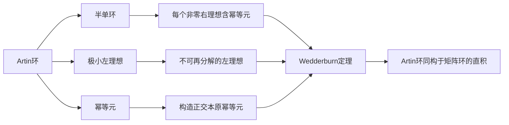

# 环与代数：Artin环的Wedderburn理论

关键词：Artin环、Wedderburn理论、半单环、幂等元、极小左理想、单环

## 1. 背景介绍
### 1.1 问题的由来
Artin环是以美国数学家Emil Artin命名的一类特殊的环,在现代代数学中有着重要地位。Artin环理论的核心是Wedderburn理论,它揭示了Artin环与矩阵环之间的内在联系。研究Artin环不仅有助于加深对环结构的理解,也为解决一些实际问题提供了新思路。
### 1.2 研究现状
自20世纪30年代以来,众多数学家对Artin环的研究取得了丰硕成果。Wedderburn、Artin、Jacobson等人的开创性工作奠定了Artin环理论的基础。近年来,随着计算机代数系统的发展,Artin环的研究又焕发新的活力。
### 1.3 研究意义
Artin环理论是现代代数学的重要分支,在编码理论、组合数学、量子计算等领域有广泛应用。深入研究Artin环,对揭示代数结构的本质特征、解决实际问题具有重要意义。同时,Artin环的思想方法也为其他数学分支提供了有益启示。
### 1.4 本文结构
本文将围绕Artin环的Wedderburn理论展开论述。首先介绍Artin环的基本概念,然后重点阐述Wedderburn理论的内容、证明思路和应用。同时给出相关概念的直观解释和算法实现。最后总结全文,并对Artin环理论的发展前景作出展望。

## 2. 核心概念与联系
- 环：集合R和两个二元运算(+,·)构成的代数结构,满足加法和乘法的封闭性、结合律、单位元、分配律等条件。
- 理想：环R的子集I,对加法封闭,且与R做乘法封闭。
- 商环：环R关于理想I的等价类构成的环结构R/I。
- 单环：只有平凡理想{0}和R自身的环。
- 半单环：每个非零右理想都含有非零幂等元的环。
- Artin环：满足下降链条件(DCC)的环,即不存在无限严格下降的右理想链。
- 极小左理想：不包含其他非零左理想的左理想。
- 幂等元：满足e²=e的元素e。

Artin环与半单环、极小左理想等概念紧密相关。Wedderburn理论从根本上揭示了Artin环的结构特征。

## 3. 核心算法原理 & 具体操作步骤
### 3.1 算法原理概述
Wedderburn理论的核心是将Artin环分解为极小左理想的直和,进而证明每个极小左理想都同构于某个矩阵环。其基本思路是:
1. 证明Artin环是半单环。
2. 在半单环中构造极小左理想。 
3. 证明极小左理想是单环,且彼此同构。
4. 利用极小左理想的正交性,得到Artin环的Wedderburn分解。

### 3.2 算法步骤详解
步骤1:证明Artin环是半单环。
- 设A是Artin环,a是A的非零元,构造集合I={xa|x∈A},可证I是右理想。
- 在由a生成的所有右理想中取极大元M,则M中必含非零幂等元。
- 由a的任意性,A是半单环。

步骤2:构造A的极小左理想。
- 取A的非零元a,令L=Aa,则L是A的左理想。
- 若L包含非零左理想L',重复上述过程,直至得到极小左理想。
- 由于A满足DCC,这一过程必然终止。

步骤3:证明极小左理想是单环。
- 设L是A的极小左理想,a∈L是非零元,则La=L。
- 任取x∈L,有x=ea,其中e是L的幂等元。
- 定义L到eAe的同构:x↦xe,得到L≌eAe。
- 可证eAe是除了{0}和自身外没有其他理想的单环。

步骤4:Wedderburn分解定理。
- 设{L₁,L₂,...,Lₙ}是A的极小左理想的完全集。
- 取Lᵢ中的幂等元eᵢ,可证{e₁,e₂,...,eₙ}是正交本原幂等元集。
- 令Dᵢ=eᵢAeᵢ,Mₙᵢ(Dᵢ)为Dᵢ上的n×n矩阵环。
- 定义映射:A → M_{n₁}(D₁)×M_{n₂}(D₂)×...×M_{nₖ}(Dₖ),可证是同构。

### 3.3 算法优缺点
优点:
- Wedderburn定理完整刻画了Artin环的结构,将其归结为矩阵环的直积。
- 极小左理想、本原幂等元的构造方法简单直观,易于计算机实现。
- 同构映射的构造揭示了Artin环与矩阵环的内在联系,将问题化繁为简。

缺点:  
- 定理的证明需要环论、模论等深厚的代数学基础。
- 对于具体的Artin环,计算极小左理想、幂等元等仍有一定难度。
- Wedderburn分解虽然简洁,但在实际应用中可能需要进一步的细化和分析。

### 3.4 算法应用领域
- 编码理论:Artin环可用于构造纠错码,如循环码、BCH码等。
- 组合矩阵论:Artin环与置换群、关联矩阵密切相关,在组合设计中应用广泛。
- 表示论:Artin环为研究群、李代数、Lie群的表示提供了代数模型。
- 量子信息:Artin环与量子纠错码、量子秘密共享等研究主题相关。

## 4. 数学模型和公式 & 详细讲解 & 举例说明
### 4.1 数学模型构建
定义(Artin环):若环R满足以下等价条件之一,则称R为Artin环:
(1) R满足DCC,即不存在无限严格下降链R>I₁>I₂>...的右理想链。
(2) 任意非空家族 $\{I_α\}$ 的右理想,其交 $⋂I_α$ 仍是右理想。
(3) R的每个右理想都是有限生成的。

定义(极小左理想):设R是环,L是R的非零左理想。若L不包含其他非零左理想,则称L为R的极小左理想。

定义(本原幂等元):设R是环,e∈R。若e²=e且eR是极小右理想,Re是极小左理想,则称e为R的本原幂等元。

Wedderburn定理:设A是Artin环,则存在A的极小左理想L₁,L₂,...,Lₙ,使得 $A≌L₁⊕L₂⊕...⊕Lₙ$,其中每个Lᵢ都同构于某个矩阵环。

### 4.2 公式推导过程
(1) 证明Artin环是半单环。
引理:设A是Artin环,a是A的非零元,则由a生成的右理想中含有非零幂等元。
证明:设 $I_1={xa|x∈A}$,则I₁是右理想。若I₁=A,取e=1;否则I₁是真右理想,取极大右理想I₂⊋I₁,重复此过程,得到链 $A⊃I₁⊃I₂⊃...$。由于A满足DCC,这一过程必有终止,设终止于Iₙ,则Iₙ中含非零幂等元e。

(2) 构造极小左理想。
引理:设A是Artin环,L是A的左理想,则L包含极小左理想。
证明:设a是L的非零元,令L₁=Aa,则L₁是L的左理想。若L₁中还有真左理想L₂,重复此过程,得到链 $L⊃L₁⊃L₂⊃...$。由于A满足DCC,这一过程必有终止,从而L包含极小左理想。

(3) 极小左理想是单环。
引理:设L是半单环A的极小左理想,e是L的幂等元,则L≌eAe,且eAe是除了{0}和自身外没有其他理想的单环。
证明:∵L是极小左理想,∴L=Ae。令 $φ:L→eAe,x↦xe$,则φ是A-模同构,于是L≌eAe。∵eAe≌EndA(Ae),而EndA(Ae)是除了{0}和自身外没有其他理想的单环,∴eAe是单环。

(4) Wedderburn分解。
定理:设A是Artin环,L₁,...,Lₙ是A的极小左理想的完全集,则 $A≌⊕M_nᵢ(Dᵢ)$,其中Dᵢ=eᵢAeᵢ,eᵢ是Lᵢ的幂等元。
证明:由引理,取Lᵢ的幂等元eᵢ,则eᵢ是本原幂等元,且{e₁,...,eₙ}是正交本原幂等元集,满足 $1=e₁+...+eₙ$。令 $Dᵢ=eᵢAeᵢ$,Mₙᵢ(Dᵢ)为Dᵢ上的nᵢ×nᵢ矩阵环,其中 $nᵢ=dimDᵢLᵢ$。定义映射 $φ:A→⊕M_nᵢ(Dᵢ),a↦(aᵢⱼ),aᵢⱼ=eᵢaeⱼ$。可验证φ是环同构,从而 $A≌⊕M_nᵢ(Dᵢ)$。

### 4.3 案例分析与讲解
例1:设F是域,F[x]是F上的一元多项式环,I是F[x]的理想,则F[x]/I是Artin环。
分析:F[x]作为F上的向量空间是无限维的,但它的任意理想I都是有限生成的,商环F[x]/I作为F-空间是有限维的,从而是Artin环。

例2:设p是素数,Fp是p元素的域,则 $R=\{(\begin{smallmatrix} a & b \\ 0 & c \end{smallmatrix})|a,b,c∈Fp\}$ 是Artin环。求R的Wedderburn分解。
解:取 $e₁=(\begin{smallmatrix} 1 & 0 \\ 0 & 0 \end{smallmatrix}),e₂=(\begin{smallmatrix} 0 & 0 \\ 0 & 1 \end{smallmatrix})$,则e₁,e₂是R的本原正交幂等元,且 $1=e₁+e₂$。令 $D₁=e₁Re₁≌Fp,D₂=e₂Re₂≌Fp$,则 $R≌M₁(Fp)⊕M₁(Fp)≌Fp⊕Fp$。

### 4.4 常见问题解答
Q1:Artin环一定是Noether环吗?
A1:是的。事实上,Artin环上升链条件成立,推出Noether环的有限生成条件,但反之不然。

Q2:Artin环的极小左理想一定是投射模吗?
A2:是的。事实上,每个极小左理想L都同构于幂等元e生成的主理想Re,而Re是内射的,从而也是投射的。

Q3:Wedderburn定理是否可推广到一般环?
A3:不能。Wedderburn定理的证明依赖于Artin环的DCC条件和极小理想的存在性,一般环未必满足。但对于半单Artinian环,有类似的Wedderburn-Artin定理。

Q4:Artin环与矩阵环有何本质联系?
A4:Wedderburn定理揭示了Artin环与矩阵环的同构关系,将Artin环的研究归结为对矩阵环的研究。同时也反映了Artin环