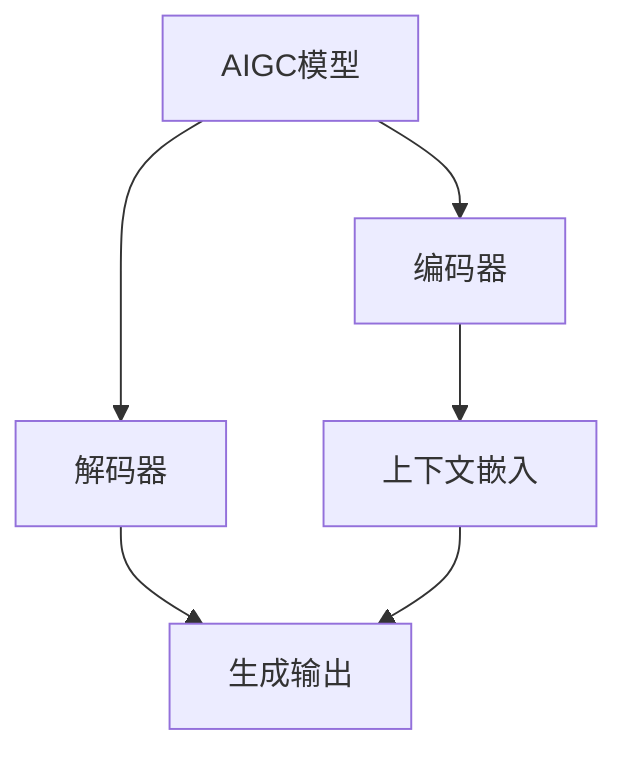

# 生成式AIGC是金矿还是泡沫：GPU卡多还不如数据多更有效，用更多数据反而能训练出更好的模型

## 1. 背景介绍

### 1.1 问题的由来

近年来,生成式人工智能(Generative AI)技术在各个领域掀起了一股热潮,尤其是大语言模型(LLM)和生成式对抗网络(GAN)等技术的兴起,引发了人们对AIGC(AI Generated Content,人工智能生成内容)的广泛关注和讨论。AIGC技术可以生成逼真的图像、视频、音频、文本等多种形式的内容,在内容创作、设计、娱乐等领域展现出巨大的潜力。

然而,训练这些AIGC模型需要消耗大量的计算资源,尤其是GPU资源。一些大型科技公司凭借其雄厚的资金实力,可以购置数以万计的GPU服务器用于模型训练。但对于普通企业和个人开发者来说,获取这么多GPU资源的成本高昂,似乎成为了AIGC技术发展的瓶颈。

### 1.2 研究现状

目前,主流的AIGC模型训练方法主要依赖于两种资源:计算资源(GPU)和数据资源。传统观点认为,GPU数量越多,模型训练的并行能力就越强,训练速度就越快。因此,不少研究都集中在如何提高GPU利用率、优化模型并行策略等方面,以期在有限的GPU资源下获得更高的训练效率。

但是,也有一些研究人员提出了"数据胜于算力"的观点。他们认为,相比于无限增加GPU数量,更多的数据资源对模型质量的提升更为关键。大规模、高质量的数据集能够为模型提供更丰富的知识,从而生成更准确、更多样化的内容。

### 1.3 研究意义

针对"GPU多还是数据多更重要"的争论,本文将深入探讨数据资源在AIGC模型训练中的重要性,并分析在有限GPU资源的情况下,如何通过数据增强等技术来提高模型质量。研究结果不仅能为AIGC模型训练提供新的思路,也将为普通开发者提供可行的解决方案,帮助他们在有限资源下获得良好的模型性能。

### 1.4 本文结构

本文将从以下几个方面展开讨论:

1. 介绍AIGC模型的核心概念和工作原理
2. 分析GPU资源和数据资源在模型训练中的作用
3. 探讨数据增强技术在AIGC模型训练中的应用
4. 介绍一些常用的数据增强方法及其优缺点
5. 通过实例项目,演示如何使用数据增强技术提高模型质量
6. 总结数据增强技术的发展趋势和面临的挑战

## 2. 核心概念与联系

在深入探讨数据增强技术之前,我们先了解一下AIGC模型的核心概念和工作原理。

AIGC模型通常由编码器(Encoder)和解码器(Decoder)两个主要部分组成。

- **编码器**的作用是将输入数据(如文本、图像等)编码为上下文嵌入(Context Embedding),捕捉输入数据的语义和结构信息。
- **解码器**则根据上下文嵌入和任务目标(如文本生成、图像生成等),生成相应的输出内容。

编码器和解码器的具体实现方式因模型架构而异,常见的有:

- **Transformer**架构: 使用自注意力(Self-Attention)机制捕捉输入和输出之间的长程依赖关系。
- **CNN**架构: 使用卷积神经网络(CNN)提取局部特征。
- **RNN**架构: 使用循环神经网络(RNN)捕捉序列数据的时序信息。

不同的模型架构对应不同的训练方式,但它们都需要大量的数据来学习输入和输出之间的映射关系。数据的质量和多样性直接决定了模型的泛化能力和生成质量。

## 3. 核心算法原理 & 具体操作步骤

### 3.1 算法原理概述

AIGC模型的训练过程可以概括为一种监督学习过程,即让模型从大量的输入-输出数据对中学习映射规则。以文本生成任务为例,模型需要从大量的文本语料中学习文本的语法、语义和风格特征,从而能够生成符合人类语言习惯的新文本。

这个过程可以形式化为一个最优化问题:

$$\underset{\theta}{min}\ L(D_{train};\theta)$$

其中:

- $\theta$表示模型的参数
- $D_{train}$表示训练数据集,包含输入$x$和期望输出$y$的数据对$(x, y)$
- $L$是一个损失函数(Loss Function),用于衡量模型输出$\hat{y}$与期望输出$y$之间的差异

通过优化算法(如梯度下降)不断调整模型参数$\theta$,使得损失函数$L$的值最小化,即模型输出$\hat{y}$尽可能逼近期望输出$y$。

### 3.2 算法步骤详解

AIGC模型的训练过程可以概括为以下几个步骤:

1. **数据预处理**: 根据任务目标,对原始数据进行必要的清洗、标注和格式转换,构建训练集和验证集。
2. **模型初始化**: 选择合适的模型架构,并用随机值初始化模型参数$\theta$。
3. **前向传播**: 将输入数据$x$传入模型,计算模型输出$\hat{y}=f(x;\theta)$。
4. **损失计算**: 根据损失函数$L$,计算模型输出$\hat{y}$与期望输出$y$之间的损失值$L(y,\hat{y})$。
5. **反向传播**: 计算损失值$L$关于模型参数$\theta$的梯度$\nabla_\theta L$。
6. **参数更新**: 使用优化算法(如梯度下降)根据梯度$\nabla_\theta L$更新模型参数$\theta$。
7. **重复训练**: 重复步骤3-6,直到模型在验证集上的性能不再提升为止。

在整个训练过程中,数据集$D_{train}$的质量和数量对模型的泛化能力至关重要。高质量、多样化的数据可以帮助模型学习到更丰富的知识,从而生成更准确、更多样化的输出内容。

### 3.3 算法优缺点

AIGC模型训练算法的主要优点是:

- **可扩展性强**: 只要有足够的数据和计算资源,理论上可以训练出处理任何任务的模型。
- **性能优异**: 在大数据集上训练的模型往往能够获得出色的泛化性能。
- **可解释性**: 通过分析模型参数和注意力机制,可以一定程度上解释模型的决策过程。

但它也存在一些缺点:

- **数据饥渴**: 需要大量高质量的数据才能获得良好的模型性能。
- **计算资源密集**: 训练过程通常需要消耗大量的GPU资源。
- **偏差风险**: 如果训练数据存在偏差,模型也可能学习到这些偏差,产生不公平或有害的输出。

### 3.4 算法应用领域

AIGC模型训练算法可以应用于多种任务,包括但不限于:

- **自然语言处理**: 文本生成、机器翻译、问答系统等。
- **计算机视觉**: 图像生成、图像描述、目标检测等。
- **语音处理**: 语音合成、语音识别等。
- **多模态任务**: 视频生成、虚拟现实内容生成等。

随着AIGC技术的不断发展,相信它的应用领域也将越来越广泛。

## 4. 数学模型和公式 & 详细讲解 & 举例说明

### 4.1 数学模型构建

在AIGC模型训练中,我们通常使用概率模型来描述输入$x$和输出$y$之间的条件概率分布$P(y|x)$。具体来说,我们希望找到一个模型$f_\theta$,使得:

$$P(y|x) \approx f_\theta(y|x)$$

其中$\theta$是模型的参数。

对于序列生成任务(如文本生成),我们通常将输出$y$分解为一系列标记$y_1, y_2, \ldots, y_T$,并factorize该条件概率为:

$$P(y|x) = \prod_{t=1}^T P(y_t|y_{<t}, x)$$

也就是说,生成每个标记$y_t$的概率,都条件于之前生成的部分序列$y_{<t}$和输入$x$。

我们的目标是找到一个模型$f_\theta$,使得:

$$P(y_t|y_{<t}, x) \approx f_\theta(y_t|y_{<t}, x; \theta)$$

这个模型就是我们所需要训练的AIGC模型。

### 4.2 公式推导过程

现在,我们来推导一下如何从训练数据中学习模型参数$\theta$。

假设我们有一个训练数据集$D = \{(x^{(i)}, y^{(i)})\}_{i=1}^N$,其中$x^{(i)}$是输入,$y^{(i)}$是对应的期望输出。我们的目标是最大化训练数据的联合概率(Log-Likelihood):

$$\begin{aligned}
\mathcal{L}(\theta) &= \log P(D|\theta) \\
                   &= \log \prod_{i=1}^N P(y^{(i)}|x^{(i)}; \theta) \\
                   &= \sum_{i=1}^N \log P(y^{(i)}|x^{(i)}; \theta)
\end{aligned}$$

对于序列生成任务,我们可以进一步展开:

$$\begin{aligned}
\mathcal{L}(\theta) &= \sum_{i=1}^N \log \prod_{t=1}^{T_i} P(y_t^{(i)}|y_{<t}^{(i)}, x^{(i)}; \theta) \\
                   &= \sum_{i=1}^N \sum_{t=1}^{T_i} \log P(y_t^{(i)}|y_{<t}^{(i)}, x^{(i)}; \theta)
\end{aligned}$$

其中$T_i$是第$i$个训练样本的序列长度。

在训练过程中,我们希望最大化对数似然$\mathcal{L}(\theta)$,也就是最小化其相反数,即交叉熵损失函数:

$$\mathcal{J}(\theta) = -\mathcal{L}(\theta) = -\sum_{i=1}^N \sum_{t=1}^{T_i} \log P(y_t^{(i)}|y_{<t}^{(i)}, x^{(i)}; \theta)$$

通过梯度下降等优化算法,我们可以不断调整模型参数$\theta$,使得损失函数$\mathcal{J}(\theta)$最小化,即模型输出的概率分布$P(y|x; \theta)$尽可能逼近真实的条件概率分布$P(y|x)$。

### 4.3 案例分析与讲解

为了更好地理解上述数学模型,我们来看一个具体的案例。假设我们要训练一个英文文本生成模型,给定一个种子文本$x$,模型需要生成一段连贯、符合语法和语义的英文文本$y$。

我们将文本$y$表示为一系列单词$y_1, y_2, \ldots, y_T$,其中$T$是文本长度。根据上述公式,我们的目标是最大化训练数据的对数似然:

$$\mathcal{L}(\theta) = \sum_{i=1}^N \sum_{t=1}^{T_i} \log P(y_t^{(i)}|y_{<t}^{(i)}, x^{(i)}; \theta)$$

也就是说,对于每个训练样本$(x^{(i)}, y^{(i)})$,我们需要最大化生成每个单词$y_t^{(i)}$的条件概率,给定之前生成的部分文本$y_{<t}^{(i)}$和种子文本$x^{(i)}$。

例如,假设我们有一个训练样本$(x, y) = ($"I went to the", "I went to the park to play basketball.")。在生成第5个单词"park"时,我们需要最大化:

$$\log