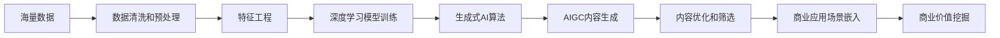

# 生成式AIGC：从数据到商业价值的挖掘

关键词：生成式AI、AIGC、深度学习、商业价值、数据挖掘

## 1. 背景介绍
### 1.1  问题的由来
近年来,随着人工智能技术的迅猛发展,生成式AI(Generative AI)开始受到学术界和工业界的广泛关注。生成式AI是一种能够生成全新内容的人工智能系统,其应用领域涵盖文本、图像、音频、视频等多个方面。尤其是AIGC(AI Generated Content)技术的出现,让机器能够像人类一样进行艺术创作,引发了人们对生成式AI商业价值的思考和探索。

### 1.2  研究现状
目前,学术界对生成式AI的研究主要集中在算法模型、训练方法等技术层面。而工业界则更关注如何将生成式AI技术应用到实际场景中,挖掘其商业价值。一些互联网巨头如谷歌、亚马逊、微软等纷纷布局AIGC领域,推出了一系列基于生成式AI的产品和服务。初创公司也在这一赛道中发力,不断涌现出新的创新应用。

### 1.3  研究意义
生成式AI代表了人工智能技术的新发展方向,对传统行业带来了巨大的颠覆性影响。深入研究生成式AI技术,探索其商业应用场景和价值挖掘路径,对于推动人工智能产业发展、促进传统行业升级转型具有重要意义。同时,这也有助于我们思考人工智能时代的伦理道德问题,推动人机协同、共生发展。

### 1.4  本文结构
本文将围绕生成式AIGC技术,从数据到商业价值挖掘的视角展开论述。首先介绍生成式AI的核心概念和关键技术,然后重点阐述其核心算法原理和数学模型。接着通过代码实例和应用场景分析,展示生成式AI的实践案例。最后总结生成式AI未来的发展趋势和挑战,并提供相关工具和资源推荐。

## 2. 核心概念与联系
生成式AI是一类能够生成全新内容的人工智能系统,其核心是利用深度学习算法,通过对海量数据的学习,掌握数据的内在规律和特征,从而实现内容的自动生成。与判别式模型相比,生成式模型能够捕捉数据的内在分布,生成与训练数据相似但又不完全相同的新样本。

AIGC是生成式AI在内容创作领域的具体应用,通过AI算法自动生成文本、图像、音频、视频等内容。其关键是利用生成对抗网络(GAN)、变分自编码器(VAE)等模型,从海量内容数据中学习创作知识和规律,再结合用户需求和创意灵感,生成富有创意、个性化的内容产出。

生成式AI和AIGC技术的发展,离不开深度学习算法的支撑。深度学习通过构建多层神经网络,模拟人脑的信息处理机制,实现了数据特征的自动提取和学习。常见的深度学习架构如卷积神经网络(CNN)、循环神经网络(RNN)、对抗生成网络(GAN)等,都被广泛应用于生成式AI任务中。

从数据到商业价值的挖掘,是生成式AIGC技术的重要应用路径。海量的文本、图像、音频、视频等数据,蕴含了丰富的知识、规律和价值。通过生成式AI对这些数据进行学习和再创作,可以衍生出更多样化的内容产品,创造新的商业模式和价值增长点。比如个性化内容推荐、智能设计生成、虚拟主播等,都是AIGC赋能传统行业的典型案例。

下图展示了生成式AIGC技术从数据到商业价值挖掘的关键路径和环节:

## 3. 核心算法原理 & 具体操作步骤
### 3.1  算法原理概述
生成式AI的核心算法主要包括生成对抗网络(GAN)、变分自编码器(VAE)、自回归模型(AR)等。其中GAN因其在图像、视频生成等任务上的出色表现而备受关注。

GAN由生成器(Generator)和判别器(Discriminator)两部分组成,两者通过不断的博弈学习,最终使生成器能够生成以假乱真的样本。生成器接收一个随机噪声作为输入,通过不断学习和优化,将其转化为目标样本。判别器则用于判断输入样本是真实样本还是生成样本,并将结果反馈给生成器,指导其进行优化。

VAE通过引入隐变量来刻画数据的内在分布,并通过最大化似然估计来优化模型参数。VAE由编码器和解码器两部分组成,编码器将输入数据映射到隐空间,解码器则根据隐变量重构出原始数据。通过最小化重构误差和KL散度,VAE可以学习到数据的内在表征,并实现新样本的生成。

AR模型通过对序列数据的建模,实现对未来数据的预测生成。常见的AR模型如LSTM、GRU等,通过引入门控机制和记忆单元,能够捕捉序列数据的长距离依赖关系。在文本生成、语音合成等任务中,AR模型通过不断预测下一个字符或音帧,最终生成连贯自然的语句或声音片段。

### 3.2  算法步骤详解
以GAN为例,其算法步骤可以概括为以下几点:

1. 随机初始化生成器和判别器的参数
2. 固定生成器G,训练判别器D:
   - 从真实数据集中采样一批真实样本
   - 从先验分布(如高斯分布)中采样一批随机噪声
   - 利用生成器G生成一批假样本
   - 将真实样本和生成样本分别输入判别器D
   - 计算判别器的损失函数(二元交叉熵),并利用梯度下降法更新判别器D的参数
3. 固定判别器D,训练生成器G:
   - 从先验分布采样一批随机噪声
   - 利用生成器G生成一批假样本
   - 将生成样本输入判别器D,计算生成器的损失函数
   - 利用梯度下降法更新生成器G的参数
4. 重复步骤2和3,直到模型收敛或达到预设的迭代次数

GAN的训练过程可以看作是一个minimax博弈问题:
$$\min_G \max_D V(D,G) = \mathbb{E}_{x \sim p_{data}(x)}[\log D(x)] + \mathbb{E}_{z \sim p_z(z)}[\log (1-D(G(z)))]$$

其中$x$表示真实样本,$z$表示随机噪声,$p_{data}$和$p_z$分别表示真实数据分布和噪声先验分布。生成器G和判别器D通过不断地优化上述目标函数,最终达到纳什均衡,即生成器生成的样本与真实样本无法区分。

### 3.3  算法优缺点
GAN的优点在于:
1. 生成效果逼真,能够生成高质量、细节丰富的样本
2. 无需显式定义数据分布,而是通过生成器和判别器的博弈学习来隐式地刻画数据分布
3. 可以应用于多种数据类型,如图像、文本、音频等

GAN的缺点包括:
1. 训练不稳定,容易出现模式崩溃、梯度消失等问题
2. 对超参数敏感,调参难度大
3. 生成多样性不足,容易出现模式塌陷现象
4. 缺乏可解释性,生成过程像一个黑盒子

### 3.4  算法应用领域
GAN在图像生成、风格迁移、超分辨率、图像编辑等领域取得了广泛应用。一些经典的GAN变体如DCGAN、CycleGAN、Pix2Pix、StyleGAN等,极大地推动了图像生成技术的发展。

在文本生成领域,基于GAN的对话生成、文本风格迁移、机器翻译等任务也取得了不错的效果。代表性的工作如SeqGAN、MaskGAN、TextGAN等。

此外,GAN在语音合成、视频生成、虚拟试衣等领域也有着广泛的应用前景。近年来还出现了将GAN与强化学习结合的方法,用于解决博弈问题、自动驾驶等任务。

## 4. 数学模型和公式 & 详细讲解 & 举例说明
### 4.1  数学模型构建
生成式对抗网络的数学模型可以表示为一个minimax博弈问题:

$$\min_G \max_D V(D,G) = \mathbb{E}_{x \sim p_{data}(x)}[\log D(x)] + \mathbb{E}_{z \sim p_z(z)}[\log (1-D(G(z)))]$$

其中,$G$表示生成器,$D$表示判别器,$x$表示真实样本,$z$表示随机噪声,$p_{data}$表示真实数据分布,$p_z$表示噪声先验分布。

判别器D的目标是最大化$V(D,G)$,即对于真实样本,其输出概率应该尽可能接近1;对于生成样本,其输出概率应该尽可能接近0。

生成器G的目标是最小化$V(D,G)$,即尽可能欺骗判别器,使得判别器无法分辨生成样本与真实样本。

### 4.2  公式推导过程
判别器D的优化目标可以写作:

$$\max_D V(D,G) = \max_D \mathbb{E}_{x \sim p_{data}(x)}[\log D(x)] + \mathbb{E}_{z \sim p_z(z)}[\log (1-D(G(z)))]$$

对于固定的生成器G,上式可以展开为:

$$\begin{aligned}
V(D,G) &= \int_x p_{data}(x) \log D(x) dx + \int_z p_z(z) \log (1-D(G(z))) dz \\
&= \int_x p_{data}(x) \log D(x) + p_g(x) \log (1-D(x)) dx
\end{aligned}$$

其中$p_g$表示生成数据分布。可以证明,当判别器D达到最优时,有:

$$D^*(x) = \frac{p_{data}(x)}{p_{data}(x) + p_g(x)}$$

此时判别器能够完美地区分真实样本和生成样本。

生成器G的优化目标可以写作:

$$\min_G V(D,G) = \min_G \mathbb{E}_{z \sim p_z(z)}[\log (1-D(G(z)))]$$

这里的目标是最小化判别器D对生成样本的判别概率。但在实践中,上式可能导致梯度消失问题。因此通常采用另一种等价形式:

$$\max_G \mathbb{E}_{z \sim p_z(z)}[\log D(G(z))]$$

即最大化判别器D对生成样本的判别概率。可以证明,当生成器G达到最优时,有:

$$p_g = p_{data}$$

此时生成数据分布与真实数据分布完全一致,判别器无法区分真实样本和生成样本。

### 4.3  案例分析与讲解
下面以图像生成任务为例,讲解GAN的实际应用。假设我们要训练一个GAN模型,使其能够生成逼真的人脸图像。

首先,我们需要准备一个包含大量真实人脸图像的数据集,如CelebA数据集。然后构建生成器G和判别器D的网络结构。生成器G通常采用转置卷积(Transposed Convolution)操作,将随机噪声逐步上采样为高分辨率图像。判别器D则采用普通的卷积操作,将输入图像映射为一个概率值,表示其为真实图像的置信度。

在训练过程中,我们交替地训练生成器G和判别器D:

1. 固定G,训练D:从真实图像数据集中采样一批图像,记为$\{x^{(i)}\}_{i=1}^m$;从