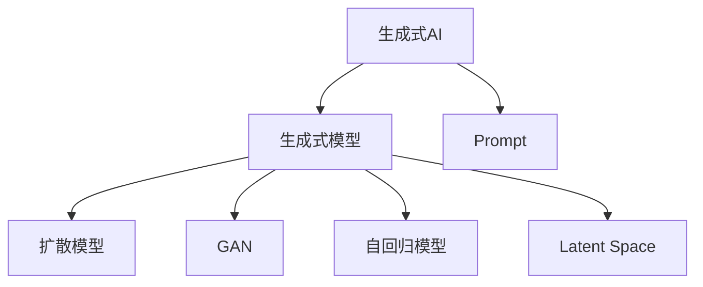

# 生成式AIGC：从理论到实践的突破

关键词：生成式AI、AIGC、深度学习、扩散模型、对抗生成网络、自回归模型、人工智能、机器学习

## 1. 背景介绍
### 1.1 问题的由来
人工智能生成内容(AIGC)是近年来人工智能领域的一个研究热点。随着深度学习技术的发展，特别是生成式模型的突破，AI已经可以生成越来越逼真、创意十足的图像、文本、音频、视频等多模态内容。这为内容创作行业带来了革命性的影响，同时也引发了诸多伦理和版权方面的讨论。

### 1.2 研究现状
目前AIGC主要采用三大类生成式模型：扩散模型(Diffusion Model)、对抗生成网络(GAN)和自回归模型(Autoregressive Model)。扩散模型通过迭代去噪过程生成高质量图像，代表工作如DALL-E、Stable Diffusion等。GAN通过生成器和判别器的对抗博弈生成逼真图像，如StyleGAN系列。自回归模型如GPT-3则擅长文本生成。近年来，AIGC在理论和实践上都取得了重大突破，生成效果惊艳。

### 1.3 研究意义
AIGC具有重要的理论意义和应用价值：

1. 推动人工智能基础理论研究。生成式模型揭示了数据的内在分布和生成机制，是探索AI智能本质的重要途径。

2. 提升内容生产力和创意。AIGC可辅助或自动完成图文音视频创作，大幅提升生产力，激发新奇创意，催生新的内容形式。

3. 赋能传统行业数字化转型。AIGC可应用于设计、媒体、游戏、元宇宙等行业，助力传统行业数字化升级，创造新的商业模式。

4. 引发伦理和法律思考。AIGC生成的逼真内容可能被滥用于假新闻、色情、诈骗等，引发版权归属问题，亟需伦理和法律的规范。

### 1.4 本文结构
本文将系统阐述AIGC的理论基础和关键技术，剖析其核心算法原理，分享代码实践，展望未来发展趋势和挑战，提出对策建议。全文分为9个章节：1.背景介绍，2.核心概念，3.算法原理，4.数学建模，5.代码实践，6.应用场景，7.工具推荐，8.未来展望，9.附录。

## 2. 核心概念与联系
生成式AI涉及的核心概念包括：

- 生成式模型：通过学习数据的内在分布，生成与训练数据相似的新样本的模型。与判别式模型相对。
- 扩散模型：通过迭代去噪过程逐步生成数据的一类生成式模型。
- GAN：生成器和判别器互相博弈，生成逼真图像的一类生成式模型。 
- 自回归模型：根据之前生成的内容序列，预测下一个内容的一类生成式模型，善于文本生成。
- Latent Space：高维隐空间，存储数据的高维抽象表征，生成模型通过探索和采样隐空间生成新内容。
- Prompt：提示，指导AI生成内容风格和主题的自然语言描述。

这些概念的关系如下图所示：

扩散模型、GAN、自回归模型是三类主流的生成式模型，它们通过学习数据分布，在Latent Space进行采样生成新内容。Prompt则作为上层接口，引导生成式模型生成用户想要的内容风格和主题。

## 3. 核心算法原理 & 具体操作步骤
### 3.1 算法原理概述
生成式AIGC的核心是生成式模型，其原理是通过学习海量数据的内在分布和映射关系，从随机噪声出发，生成与真实数据相似的新样本。以图像生成为例，其数学本质是学习图像数据x在高维隐空间z中的分布p(z)，以及隐空间到图像空间的映射函数f(z)→x，生成过程即在隐空间采样latent code z，再通过f(z)解码为图像。

### 3.2 算法步骤详解
以当前最先进的文图生成模型Stable Diffusion为例，详细介绍其工作流程：

1. 训练阶段：
    - 用CLIP模型将图像-文本对的图像编码为隐空间向量z，文本编码为条件向量c
    - 训练一个基于UNet的自回归模型，输入随机噪声z和条件向量c，迭代去噪生成图像
    - 用判别器评估生成图像与真实图像的相似度，引导生成器优化
    - 重复上述步骤，直到模型收敛，学习到图像的隐空间分布和条件映射关系

2. 推理阶段：
    - 用户输入文本提示prompt
    - 用CLIP的文本编码器将prompt编码为条件向量c
    - 从高斯分布随机采样隐向量z
    - 将z和c输入训练好的UNet模型，迭代去噪，逐步生成高质量图像
    
以上就是Stable Diffusion的核心工作原理。其本质是用CLIP把图文对齐到一个隐空间，学习文本到图像的映射，再用扩散模型进行图像生成。

### 3.3 算法优缺点
扩散模型相比GAN和自回归模型，有如下优点：

- 生成样本质量高、多样性好，更稳定，不易塌缩
- 支持端到端训练，训练过程平稳
- 适合将不同模态（如图像和文本）对齐到同一隐空间，实现跨模态生成
- 推理速度快，支持实时交互式生成

但扩散模型也有一些局限：

- 训练时间长，需要较大算力
- 生成分辨率受限，难以生成高清大图
- 面临生成内容的版权和伦理风险

### 3.4 算法应用领域
扩散模型已在多个领域得到应用，如：

- 图文生成：输入文本生成对应图像，如DALL-E、Stable Diffusion等
- 图像编辑：根据文本提示对图像进行编辑、风格迁移等
- 视频生成：生成短视频、动画等
- 3D重建：从图像重建3D模型
- 语音合成：输入文本生成逼真语音

未来有望在更多领域发挥重要作用，如虚拟人、数字人、元宇宙等。

## 4. 数学模型和公式 & 详细讲解 & 举例说明
### 4.1 数学模型构建
扩散模型的数学基础是马尔科夫链和变分推断。其核心思想是：将数据 $x_0$ 通过加入高斯噪声逐步扰动，得到一系列逐渐加噪的样本 $x_1,\dots,x_T$，形成一个马尔科夫链。然后训练一个神经网络，逆向学习从 $x_T$ 开始逐步去噪，恢复出干净的数据 $\hat{x}_0$。

正向加噪过程可表示为：

$$
q(x_t|x_{t-1}) = \mathcal{N}(x_t; \sqrt{1-\beta_t} x_{t-1}, \beta_t \mathbf{I})
$$

其中 $\beta_t$ 是噪声强度，递增。反向去噪过程可表示为：

$$
p_\theta(x_{t-1}|x_t) = \mathcal{N}(x_{t-1}; \mu_\theta(x_t, t), \sigma_\theta(x_t, t))
$$

其中 $\mu_\theta,\sigma_\theta$ 由神经网络拟合。目标是最小化正向加噪过程和反向去噪过程的KL散度：

$$
L_{diffusion} = \mathbb{E}_{x_0,\epsilon\sim\mathcal{N}(0,\mathbf{I}),t} \Big[ \| \epsilon - \epsilon_\theta(\sqrt{\bar{\alpha}_t} x_0 + \sqrt{1-\bar{\alpha}_t} \epsilon, t) \|^2 \Big]
$$

其中 $\epsilon_\theta$ 是神经网络预测的噪声。

### 4.2 公式推导过程
以下推导反向去噪过程中的均值项 $\mu_\theta(x_t,t)$。根据贝叶斯定理：

$$
\begin{aligned}
p_\theta(x_{t-1}|x_t) &= \frac{p_\theta(x_t|x_{t-1})p_\theta(x_{t-1})}{p_\theta(x_t)} \\
&= \frac{q(x_t|x_{t-1})p_\theta(x_{t-1})}{p_\theta(x_t)} \\
&= \mathcal{N}(x_{t-1}; \tilde{\mu}_t(x_t), \tilde{\beta}_t \mathbf{I})
\end{aligned}
$$

其中：

$$
\begin{aligned}
\tilde{\mu}_t(x_t) &= \frac{\sqrt{\bar{\alpha}_{t-1}} \beta_t}{1 - \bar{\alpha}_t} x_0 + \frac{\sqrt{\alpha_t}(1 - \bar{\alpha}_{t-1})}{1 - \bar{\alpha}_t} x_t \\
\tilde{\beta}_t &= \frac{1 - \bar{\alpha}_{t-1}}{1 - \bar{\alpha}_t} \beta_t
\end{aligned}
$$

$\bar{\alpha}_t = \prod_{s=1}^t (1-\beta_s)$。因此，均值项 $\mu_\theta(x_t,t)$ 可学习为：

$$
\mu_\theta(x_t, t) = \frac{1}{\sqrt{\alpha_t}} \Big( x_t - \frac{\beta_t}{\sqrt{1-\bar{\alpha}_t}} \epsilon_\theta(x_t, t) \Big)
$$

### 4.3 案例分析与讲解
下面以一个简单的1维高斯分布为例，直观展示扩散模型的生成过程。假设我们要生成服从均值为0、方差为1的标准正态分布的数据。

正向加噪过程为：从 $x_0 \sim \mathcal{N}(0,1)$ 出发，每一步加入方差为 $\beta_t$ 的高斯噪声，得到 $x_1,\dots,x_T$。

反向去噪过程为：从纯高斯噪声 $x_T \sim \mathcal{N}(0,1)$ 出发，训练一个神经网络，每一步去除部分噪声，最终恢复出干净数据 $\hat{x}_0$。神经网络学习的是每一步的均值 $\mu_\theta$ 和方差 $\sigma_\theta$。

下图展示了反向去噪过程，经过1000步迭代后，生成样本（蓝色）与真实数据分布（红色）基本重合，说明扩散模型成功学习了数据分布，可生成逼真样本。

### 4.4 常见问题解答
**Q**: 扩散模型和GAN有何区别？  
**A**: 扩散模型通过迭代去噪逐步生成数据，而GAN通过生成器和判别器博弈生成数据。扩散模型不易崩溃，生成质量更高，但训练时间更长。

**Q**: 扩散模型可应用于哪些数据类型？  
**A**: 扩散模型适用于图像、音频、视频、3D等连续型高维数据，不太适合离散型数据如文本。

**Q**: 扩散模型的潜在空间有何特点？  
**A**: 扩散模型的潜在空间通常是高斯分布，不同样本在潜空间距离与它们在数据空间的相似度对应。因此潜码可用于插值、编辑等操作。

**Q**: 如何控制扩散模型的生成过程？
**A**: 可通过注入条件信息（如类别、属性、文本描述等）来控制生成过程。改变文本提示可操控生成图像的内容和风格。

## 5. 项目实践：代码实例和详细解释说明
### 5.1 开发环境搭建
首先搭建扩散模型的开发环境。需要安装以下依赖库：

- PyTorch：深度学习框架
- PyTorch-Lightning：PyT