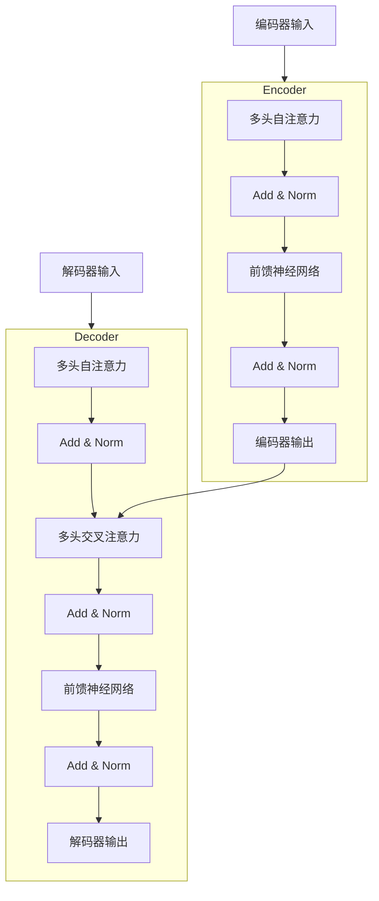

# 生生不息的循环：使用强大的GPT-4 API

## 1. 背景介绍

### 1.1 问题的由来

在当今时代，人工智能(AI)已经渗透到我们生活的方方面面。从智能助理到自动驾驶汽车,AI 正在彻底改变我们与技术的互动方式。然而,构建强大的 AI 系统需要大量的计算资源和数据,这对于大多数组织来说都是一个巨大的挑战。

幸运的是,近年来出现了一种新型的 AI 服务,即 API(应用程序编程接口)。通过 API,开发人员可以轻松访问预先训练好的大型语言模型,而无需自行构建和训练这些模型。其中,GPT(生成式预训练转换器)系列模型因其强大的自然语言处理能力而备受关注。

### 1.2 研究现状

GPT-3 的推出为 AI 应用程序开发带来了革命性的变化。它展示了大型语言模型在自然语言处理任务中的卓越表现,包括文本生成、机器翻译和问答系统等。然而,GPT-3 也存在一些局限性,例如对话一致性、事实准确性和知识更新等方面的不足。

为了解决这些问题,OpenAI 于 2022 年 11 月推出了 GPT-4,这是一个更加强大、更加通用的语言模型。GPT-4 不仅在自然语言处理方面有所提升,而且还具备了多模态能力,可以处理图像、视频和其他类型的数据。

### 1.3 研究意义

GPT-4 的推出为 AI 应用程序开发带来了无限的可能性。通过利用 GPT-4 API,开发人员可以快速构建各种智能系统,如聊天机器人、自动化写作助手、智能问答系统等。此外,GPT-4 的多模态能力还可以支持诸如图像描述、视频字幕生成等应用。

然而,要充分利用 GPT-4 的强大功能并非易事。开发人员需要深入理解 GPT-4 的工作原理、算法细节和数学模型,才能更好地利用这一强大工具。本文旨在为读者提供一个全面的指南,探讨 GPT-4 的核心概念、算法原理、数学模型,并通过实际案例和代码示例,帮助读者掌握使用 GPT-4 API 进行应用程序开发的技能。

### 1.4 本文结构

本文将分为以下几个部分:

1. **背景介绍**:介绍 GPT-4 的由来、研究现状和意义。
2. **核心概念与联系**:探讨 GPT-4 的核心概念,如自注意力机制、transformer 架构等,并阐述它们与其他 NLP 模型的联系。
3. **核心算法原理与具体操作步骤**:深入解释 GPT-4 的核心算法原理,包括自注意力计算、编码器-解码器架构等,并详细介绍算法的具体实现步骤。
4. **数学模型和公式详细讲解与举例说明**:阐述 GPT-4 背后的数学模型和公式,包括注意力分数计算、损失函数等,并通过具体案例进行讲解和说明。
5. **项目实践:代码实例和详细解释说明**:提供 GPT-4 API 的实际应用代码示例,包括环境搭建、代码实现和结果展示,并对关键代码进行详细解释。
6. **实际应用场景**:探讨 GPT-4 在聊天机器人、自动写作、问答系统等领域的实际应用场景,并展望未来的发展方向。
7. **工具和资源推荐**:推荐 GPT-4 相关的学习资源、开发工具、论文和其他有用资源。
8. **总结:未来发展趋势与挑战**:总结 GPT-4 的研究成果,展望未来的发展趋势,并讨论可能面临的挑战和解决方案。
9. **附录:常见问题与解答**:列出一些常见问题及其解答,帮助读者更好地理解和使用 GPT-4。

通过全面的介绍和深入的分析,本文旨在为读者提供一个完整的 GPT-4 学习和应用指南,帮助他们掌握这一强大的 AI 工具,并在实践中发挥其无限潜力。

## 2. 核心概念与联系

在深入探讨 GPT-4 的算法原理和数学模型之前,我们需要先了解一些核心概念,这些概念不仅构成了 GPT-4 的基础,也与其他自然语言处理(NLP)模型密切相关。

### 2.1 自注意力机制(Self-Attention Mechanism)

自注意力机制是 GPT-4 及其前身 GPT-3 等 transformer 模型的核心组成部分。它允许模型在处理序列数据(如文本)时,捕捉不同位置之间的依赖关系,从而更好地理解上下文信息。

在传统的序列模型(如循环神经网络)中,每个时间步骤只能关注前一个时间步骤的输出,这限制了模型捕捉长期依赖关系的能力。相比之下,自注意力机制可以同时关注整个输入序列的所有位置,从而更好地捕捉长期依赖关系。

自注意力机制的工作原理如下:首先,将输入序列映射到一个查询(Query)、键(Key)和值(Value)的表示空间。然后,通过计算查询和键之间的相似性得分(注意力分数),模型可以确定应该关注输入序列中的哪些位置。最后,将注意力分数与值进行加权求和,得到最终的输出表示。

自注意力机制不仅在 GPT-4 中发挥着关键作用,也被广泛应用于其他 transformer 模型,如 BERT、XLNet 等,成为当前 NLP 领域的主流技术。

### 2.2 Transformer 架构

Transformer 架构是一种全新的序列模型架构,它完全基于自注意力机制,不再依赖于循环神经网络或者卷积神经网络。Transformer 架构由编码器(Encoder)和解码器(Decoder)两部分组成,可以用于各种序列到序列(Sequence-to-Sequence)任务,如机器翻译、文本生成等。

在 Transformer 编码器中,输入序列首先被映射到嵌入空间,然后通过多个编码器层进行处理。每个编码器层都包含一个多头自注意力子层和一个前馈神经网络子层。自注意力子层捕捉输入序列中不同位置之间的依赖关系,而前馈神经网络子层则对每个位置的表示进行非线性转换。

解码器的结构与编码器类似,但增加了一个额外的注意力子层,用于关注编码器的输出。在每个解码器层中,首先计算自注意力,捕捉已生成序列中不同位置之间的依赖关系。然后,通过编码器-解码器注意力机制,解码器可以关注编码器的输出,获取输入序列的信息。最后,通过前馈神经网络子层进行非线性转换,得到最终的输出表示。

Transformer 架构在 GPT-4 中发挥着核心作用,同时也被广泛应用于其他 NLP 任务,如机器翻译、文本摘要等。它的出现彻底改变了序列模型的范式,推动了 NLP 领域的快速发展。

### 2.3 预训练与微调(Pre-training and Fine-tuning)

预训练和微调是当前 NLP 领域的一种常见范式,也是 GPT-4 等大型语言模型的关键训练策略。

**预训练**是指在大规模无标注数据(如网页、书籍等)上训练一个通用的语言模型,捕捉自然语言的一般规律和知识。预训练过程通常采用自监督学习的方式,例如掩码语言模型(Masked Language Modeling)和下一句预测(Next Sentence Prediction)等任务。

**微调**则是在预训练模型的基础上,使用特定任务的标注数据(如机器翻译数据、问答数据等)进行进一步的训练,使模型适应特定任务的需求。微调过程通常只需要调整模型的部分参数,而不需要从头开始训练,因此可以大大节省计算资源。

预训练和微调的范式在 GPT-4 及其前身 GPT-3 中得到了广泛应用。GPT-3 首先在大规模文本数据上进行了预训练,捕捉了丰富的自然语言知识。然后,通过在特定任务数据上进行微调,GPT-3 可以适应各种 NLP 任务,如文本生成、机器翻译、问答等。

GPT-4 在 GPT-3 的基础上进一步扩展,不仅支持文本数据的预训练和微调,还支持图像、视频等多模态数据的处理。这使得 GPT-4 可以应用于更广泛的领域,如视觉问答、图像描述等。

预训练和微调的范式已经成为当前 NLP 领域的主流方法,它不仅提高了模型的性能,还大大降低了训练成本,促进了 AI 技术的democratization化。

### 2.4 GPT-4 与其他 NLP 模型的联系

GPT-4 作为一种新型的大型语言模型,与其他 NLP 模型存在密切的联系。

首先,GPT-4 继承了 GPT-3 的核心架构和训练策略,如 transformer 编码器-解码器架构、自注意力机制、预训练和微调等。这些核心概念和技术也广泛应用于其他 transformer 模型,如 BERT、XLNet 等。

其次,GPT-4 在多模态处理方面具有独特的优势。它不仅可以处理文本数据,还能够处理图像、视频等其他模态数据。这使得 GPT-4 可以应用于诸如视觉问答、图像描述等任务,与计算机视觉领域的模型(如 CNN、R-CNN 等)形成互补。

此外,GPT-4 也可以与其他 NLP 任务的模型进行结合,发挥协同作用。例如,在机器翻译任务中,可以将 GPT-4 与专门的机器翻译模型(如 Transformer、ConvS2S 等)结合,利用 GPT-4 的强大语言理解能力,提高翻译质量。

总的来说,GPT-4 作为一种通用的大型语言模型,与其他 NLP 模型存在密切的联系。它吸收了前人的经验和成果,同时也为未来的 AI 模型发展提供了新的思路和可能性。只有充分理解 GPT-4 与其他模型的关系,才能更好地利用它们的优势,推动 AI 技术的发展。

## 3. 核心算法原理与具体操作步骤

在探讨 GPT-4 的核心算法原理之前,我们先来回顾一下 transformer 架构的基本结构。如下图所示,transformer 由编码器(Encoder)和解码器(Decoder)两部分组成,两者都采用了多头自注意力机制和前馈神经网络。

### 3.1 算法原理概述

GPT-4 的核心算法原理可以分为以下几个关键步骤:

1. **输入嵌入(Input Embedding)**: 将输入序列(文本、图像等)映射到一个连续的向量空间,作为模型的初始表示。

2. **位置编码(Positional Encoding)**: 为每个位置添加一个位置编码向量,使模型能够捕捉序列中元素的位置信息。

3. **多头自注意力(Multi-