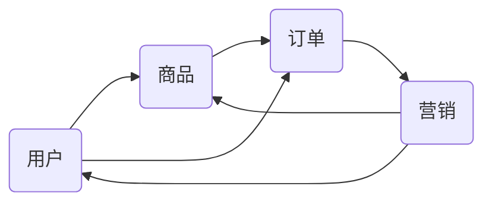
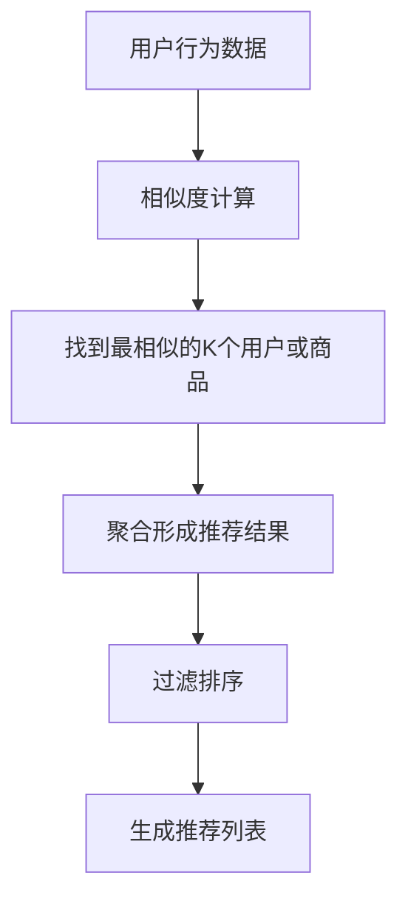

# 电商系统通用组件的设计和实现

作者：禅与计算机程序设计艺术 / Zen and the Art of Computer Programming

## 1. 背景介绍
### 1.1 问题的由来
随着电子商务的快速发展,电商系统已成为各大企业的核心业务系统之一。然而,电商系统的开发往往面临着诸多挑战,如业务逻辑复杂、需求变更频繁、开发效率低下等问题。为了应对这些挑战,设计和实现一套高质量、可复用、易扩展的电商系统通用组件显得尤为重要。

### 1.2 研究现状
目前,业界已经有不少优秀的电商系统通用组件解决方案。比如阿里巴巴开源的Dubbo分布式服务框架,为电商系统提供了服务注册、服务发现、负载均衡等基础组件。再如京东的JSF框架,提供了包括缓存、消息队列、分库分表等一系列中间件组件。这些解决方案在很大程度上提高了电商系统的开发效率和质量。

### 1.3 研究意义
尽管已有多种电商系统通用组件方案,但它们往往针对特定的技术栈,且学习成本较高。因此,设计一套轻量级、易用、可扩展的通用组件方案仍具有重要意义。一方面,它可以降低中小型电商企业的技术门槛,帮助其快速构建高质量的电商系统。另一方面,对于大型电商企业,引入新的通用组件方案,也有利于促进技术创新,提升系统灵活性。

### 1.4 本文结构
本文将重点探讨电商系统中几个关键通用组件的设计与实现,主要包括:

- 用户中心组件:实现用户注册、登录、用户信息管理等功能
- 商品中心组件:实现商品管理、商品搜索、商品推荐等功能  
- 订单中心组件:实现订单创建、支付、配送、售后等功能
- 营销中心组件:实现优惠券、促销活动、秒杀等常见营销方案

在详细阐述以上组件的设计思路和关键实现后,本文还将讨论这些组件的可扩展性设计,以及在实际电商系统中的应用案例和效果。

## 2. 核心概念与联系

在设计电商系统通用组件之前,我们需要先明确几个核心概念:

- 用户:电商系统的核心参与者,包括买家和卖家两种角色。组件需要提供用户的注册、登录、信息管理等功能。
- 商品:电商交易的核心实体,包含商品的各种属性信息。组件需要提供商品的管理、搜索、推荐等功能。
- 订单:电商交易的载体,记录交易双方的权利义务。组件需要提供订单的创建、支付、配送、售后等功能。
- 营销:提升电商交易量和用户粘性的重要手段。组件需要支持优惠券、促销活动、秒杀等常见营销模式。

这些概念之间存在着紧密的联系,构成了电商业务的基本逻辑:

可见,用户、商品、订单、营销这四个实体环环相扣,共同驱动着电商系统的运转。因此,电商系统通用组件的设计,就是要从这四个维度出发,抽象出稳定的数据模型和服务接口,并提供灵活的扩展机制,以支撑多变的业务需求。

## 3. 核心算法原理 & 具体操作步骤

### 3.1 算法原理概述

电商系统中会涉及到大量的算法,比如搜索算法、推荐算法、营销规则引擎等。本节将重点讨论商品搜索和推荐中常用的几种算法。

商品搜索一般基于倒排索引实现。倒排索引的核心思想是:对商品的各种属性如标题、类目、品牌等进行分词,建立关键词到商品ID的映射关系。查询时,对输入的关键词进行分词匹配,找到对应的商品ID即可。

商品推荐则更加复杂,常见的算法包括:

- 协同过滤:基于用户或商品的相似度,推荐用户可能感兴趣的商品。
- 基于内容:根据商品的属性特征,推荐同类商品。
- 关联规则:挖掘商品之间的关联性,常用于购物车推荐。
- 深度学习:利用神经网络学习用户和商品的隐式特征,进行个性化推荐。

### 3.2 算法步骤详解

以协同过滤算法为例,其基本步骤如下:

1. 收集用户行为数据,如浏览、收藏、购买等。
2. 计算用户或商品的相似度矩阵。常见的相似度算法有欧氏距离、皮尔逊相关系数等。
3. 根据用户的历史行为,找到与其最相似的K个用户或商品。
4. 对这K个用户或商品进行聚合,得到推荐结果。聚合算法可以是加权平均、排名等。
5. 对推荐结果进行过滤和排序,生成最终的推荐列表。

以下是一个简化版的协同过滤算法示意图:

### 3.3 算法优缺点

协同过滤算法的优点是:

- 原理简单,易于实现。
- 不需要对商品进行特征提取,适用于各种类型的商品。
- 可以发掘用户的潜在兴趣,实现个性化推荐。

但是它也存在一些局限性:

- 冷启动问题:对于新用户和新商品,由于缺乏足够的行为数据,难以给出准确的推荐。
- 稀疏性问题:实际场景中用户行为数据往往非常稀疏,导致算法的效果难以保证。
- 扩展性问题:当用户和商品数量较大时,计算相似度矩阵的开销会非常大。

### 3.4 算法应用领域

协同过滤广泛应用于各大电商网站和App的商品推荐场景,如:

- 亚马逊:"买了该商品的用户还买了"
- 京东:"为你推荐"
- 淘宝:"猜你喜欢"
- 抖音:"大家都在看"

此外,协同过滤还被用于社交网络的好友推荐、新闻App的文章推荐、音乐软件的歌曲推荐等领域。可以说,它是当前个性化推荐系统的主流算法之一。

## 4. 数学模型和公式 & 详细讲解 & 举例说明

### 4.1 数学模型构建

对于协同过滤算法,我们可以用矩阵分解的方法来构建其数学模型。假设有 $m$ 个用户和 $n$ 个商品,令 $R$ 为 $m \times n$ 的用户-商品评分矩阵。我们的目标是找到两个低秩矩阵 $U$ 和 $V$,使得:

$$R \approx U V^T$$

其中,$U$ 是 $m \times k$ 的用户隐因子矩阵,$V$ 是 $n \times k$ 的商品隐因子矩阵。$k$ 是隐因子的个数,一般远小于 $m$ 和 $n$。

直观地理解,矩阵 $U$ 和 $V$ 分别表示用户和商品在 $k$ 个隐因子上的得分。隐因子可以看作是用户兴趣和商品特征的抽象表示。两个矩阵相乘,就得到了用户对商品的预估评分。

### 4.2 公式推导过程

为了求解 $U$ 和 $V$,我们需要最小化估计评分与实际评分之间的误差。常用的损失函数是平方误差:

$$\min_{U,V} \sum_{(i,j) \in K} (R_{ij} - U_i V_j^T)^2 + \lambda (||U||^2 + ||V||^2)$$

其中,$K$ 是已知评分的索引集合。$\lambda$ 是正则化系数,用于防止过拟合。

这个优化问题可以用梯度下降法求解。令损失函数为 $J$,则 $U$ 和 $V$ 的更新公式为:

$$U_i \leftarrow U_i - \alpha \frac{\partial J}{\partial U_i}$$
$$V_j \leftarrow V_j - \alpha \frac{\partial J}{\partial V_j}$$

其中,$\alpha$ 是学习率。

经过多轮迭代,我们就可以得到最优的 $U$ 和 $V$,从而实现矩阵分解。

### 4.3 案例分析与讲解

下面我们以一个简单的例子来说明协同过滤的计算过程。假设有3个用户和4个商品,用户-商品评分矩阵如下:

$$R = \begin{bmatrix}
4 & ? & 3 & 5\\
3 & 1 & ? & ?\\
? & 2 & ? & 4
\end{bmatrix}$$

其中,问号表示未知评分。我们取隐因子个数 $k=2$,用梯度下降法进行矩阵分解。经过多次迭代,得到:

$$U = \begin{bmatrix}
0.82 & 1.12\\
0.45 & 0.31\\
1.33 & 0.85
\end{bmatrix}, 
V = \begin{bmatrix}
1.21 & 0.57\\
0.92 & 0.38\\
0.47 & 1.44\\
1.39 & 1.27
\end{bmatrix}$$

于是,我们可以估计出用户对未评分商品的评分:

$$\hat{R}_{12} = U_1 V_2^T = 0.82 \times 0.92 + 1.12 \times 0.38 = 1.18$$
$$\hat{R}_{23} = U_2 V_3^T = 0.45 \times 0.47 + 0.31 \times 1.44 = 0.66$$
$$\hat{R}_{24} = U_2 V_4^T = 0.45 \times 1.39 + 0.31 \times 1.27 = 1.02$$
$$\hat{R}_{31} = U_3 V_1^T = 1.33 \times 1.21 + 0.85 \times 0.57 = 2.09$$

可以看出,用户1可能更喜欢商品4,用户2可能更喜欢商品3,用户3可能更喜欢商品1。这就是协同过滤的基本原理。

### 4.4 常见问题解答

Q: 协同过滤算法适用于什么样的场景?
A: 协同过滤适用于用户行为数据比较丰富的场景,如电商、社交、内容等领域。它的核心思想是利用用户或商品的相似性,为用户推荐感兴趣的内容。

Q: 协同过滤算法如何解决冷启动问题?  
A: 冷启动是指新用户或新商品由于缺乏足够的行为数据,无法计算相似度,从而影响推荐效果。解决冷启动问题的常见方法有:
- 利用用户或商品的属性信息,如用户的年龄、性别,商品的类目、品牌等,进行推荐。
- 引入热门推荐,为新用户推荐一些普遍受欢迎的商品。
- 采用多算法融合,如将协同过滤与基于内容的推荐相结合。

Q: 矩阵分解的时间复杂度是多少?
A: 假设用户数为 $m$,商品数为 $n$,隐因子数为 $k$,迭代次数为 $t$。则矩阵分解的时间复杂度为 $O(t \cdot k \cdot (m+n))$。可见,当用户和商品数量较大时,计算开销会比较大。因此,实际应用中往往需要在离线进行矩阵分解,再将结果用于在线推荐。

## 5. 项目实践：代码实例和详细解释说明

下面我们用Python实现一个简单的协同过滤算法。

### 5.1 开发环境搭建

- 操作系统:Windows 10
- Python版本:3.7
- 依赖库:numpy、