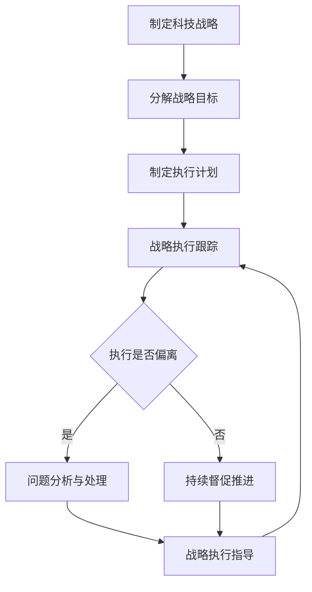

# 督促、跟踪和指导公司科技战略的执行，确保按照战略规划的方向前进，各项计划得到有效的落实

关键词：科技战略、战略执行、战略规划、计划落实、跟踪指导

## 1. 背景介绍
### 1.1  问题的由来
在当今瞬息万变的商业环境中，企业要想在激烈的市场竞争中立于不败之地，就必须制定清晰明确的科技战略，并确保战略得到有效执行。然而，许多公司在制定了宏伟的科技战略后，却在执行过程中遇到了重重阻碍，导致战略目标难以实现。这其中的原因有很多，如战略目标不明确、缺乏有效的跟踪和监督机制、各部门协调配合不足等。因此，如何督促、跟踪和指导公司科技战略的执行，确保战略规划的方向得以贯彻，各项计划得到有效落实，成为了摆在众多CTO面前的一道难题。

### 1.2  研究现状
目前，学术界和业界对于科技战略执行的研究已经取得了一定的进展。一些学者提出了战略执行的关键影响因素，如高层领导的重视程度、组织结构的合理性、资源配置的充分性等。也有研究关注到了战略执行过程中的动态管理，强调要根据内外部环境的变化适时调整战略目标和执行计划。在实践中，一些领先企业建立了完善的战略执行管理体系，将战略目标分解到各个部门和岗位，并通过定期审核、绩效考核等手段，确保战略执行不偏离轨道。

### 1.3  研究意义
深入研究科技战略执行的督促、跟踪和指导机制，对于提升企业战略管理水平具有重要意义。通过总结先进企业的实践经验，梳理影响战略执行的关键因素，构建科学有效的战略执行管理框架和流程，可以帮助更多企业打通从战略制定到战略落地的"最后一公里"，真正将宏伟蓝图转化为看得见、摸得着的成果，从而在激烈的市场竞争中赢得主动。

### 1.4  本文结构
本文将重点探讨CTO在科技战略执行中的督促、跟踪和指导职责。首先，介绍科技战略执行管理的核心概念和内在联系；其次，总结科技战略执行的关键影响因素和实施步骤；再次，给出科技战略执行的管理框架和数学模型；然后，分享一些优秀企业的实践案例；最后，展望科技战略执行管理的未来发展方向，并提出CTO应对挑战的策略建议。

## 2. 核心概念与联系
科技战略执行管理涉及三个核心概念：督促、跟踪和指导。
- 督促：推动和敦促，确保战略执行工作按计划有序开展，不出现严重偏差和停滞。
- 跟踪：持续关注和审视战略执行过程，收集执行情况信息，发现问题并及时处理。 
- 指导：运用专业知识和管理经验，为战略执行提供方向性指引，帮助下属单位解决实际困难。

这三个职能环环相扣、相辅相成。没有持续的督促，战略执行就可能半途而废；没有动态的跟踪，问题就难以及时发现和解决；没有有力的指导，执行过程就会陷入迷茫和混乱。只有将三者高度统一，形成闭环管理，才能确保科技战略落到实处、开花结果。



## 3. 核心算法原理 & 具体操作步骤
### 3.1  算法原理概述
科技战略执行管理可以借鉴PDCA循环的基本原理。PDCA循环又称戴明环，是计划(Plan)、执行(Do)、检查(Check)、处理(Act)四个环节不断循环的过程，是一种科学的工作方法，广泛应用于质量管理、项目管理等领域。将PDCA思想引入科技战略执行管理中，就是要以战略规划为起点，分解目标、制定计划并组织实施，同时通过持续跟踪识别偏差，运用专业指导予以纠正，周而复始，不断改进，直至目标达成。

### 3.2  算法步骤详解
1. 计划(Plan)：明确科技战略目标，分解成可执行的任务，制定详细的实施计划，包括时间表、责任人、资源需求等。
2. 执行(Do)：严格按照计划组织开展各项工作，落实到每个人、每个环节。同时做好执行过程的信息记录。
3. 检查(Check)：持续跟踪执行进度和效果，通过收集数据、走访调研、定期汇报等方式，及时发现执行偏差和潜在风险。
4. 处理(Act)：对检查发现的问题进行原因分析，形成解决方案，并予以实施。对于重大问题要及时上报，必要时调整计划。
5. 循环往复：从执行结果中总结经验教训，并运用到下一个PDCA循环中，持续改进战略执行管理。

### 3.3  算法优缺点
PDCA循环应用于科技战略执行管理的优点在于：
- 简单易行，操作性强，容易在企业中推广实施。
- 强调持续改进，能够促进战略执行管理水平不断提升。
- 重视执行过程管控，能够及时发现和解决问题，降低执行风险。

同时也存在一定局限性：
- PDCA循环是一种通用方法，缺乏针对科技战略执行的专门设计。
- 过于简化的循环可能忽视战略执行的复杂性，管理效果打折扣。
- 需要有经验的管理者操盘，否则容易流于形式。

### 3.4  算法应用领域
PDCA循环不仅适用于科技战略执行管理，也广泛应用于企业管理的其他领域，如质量管理、成本管理、安全管理等。同时还被一些政府部门、事业单位借鉴，用于推动重大决策、重点工程的贯彻落实。

## 4. 数学模型和公式 & 详细讲解 & 举例说明
### 4.1  数学模型构建
为了更加科学地评估科技战略执行效果，可以构建如下数学模型：

$$ SEI = \sum_{i=1}^{n} w_i \times \frac{A_i}{T_i} $$

其中，$SEI$表示战略执行指数(Strategy Execution Index)，$n$表示战略目标的个数，$w_i$表示第$i$个目标的权重，$A_i$表示第$i$个目标的实际完成值，$T_i$表示第$i$个目标的目标值。

### 4.2  公式推导过程
该公式的推导过程如下：
1. 将战略目标分解为$n$个可度量的指标，并确定各指标的目标值$T_i$。
2. 在战略执行过程中，跟踪收集各指标的实际完成值$A_i$。
3. 计算各指标的完成率$\frac{A_i}{T_i}$，得到一组比值。
4. 对各指标的重要程度进行评估，赋予权重$w_i$，且满足$\sum_{i=1}^{n} w_i = 1$。
5. 将各指标的完成率与权重相乘，再求和，得到综合的战略执行指数$SEI$。

### 4.3  案例分析与讲解
举例来说，某公司确定了3个科技战略目标：
1. 研发投入占比提升至8%，权重0.4
2. 新产品销售收入达到5000万元，权重0.4
3. 专利申请量达到50项，权重0.2

经过一年的努力，各目标完成情况如下：
1. 研发投入占比提升至7.5%
2. 新产品销售收入达到4800万元
3. 专利申请量达到55项

代入公式计算：

$$SEI = 0.4 \times \frac{7.5\%}{8\%} + 0.4 \times \frac{4800}{5000} + 0.2 \times \frac{55}{50} = 0.9575$$

可见，该公司的科技战略执行指数为0.9575，执行效果较好，但仍有提升空间。

### 4.4  常见问题解答
1. 问：如何确定各战略目标的权重？
答：可以从战略目标对公司发展的重要性、紧迫性等维度进行打分，再进行归一化处理。关键是要充分听取各方意见，形成共识。

2. 问：战略目标能否调整？
答：原则上战略目标一经确定不应随意更改。但如果内外部环境发生重大变化，影响了目标的合理性，则可以适当调整。调整时应重新对目标进行分解和权重赋值。

3. 问：战略执行指数多久计算一次？
答：可以根据战略目标的时间跨度，设置月度、季度、年度等不同频次。一般来说，时间跨度越长，计算频次可以越低。但最低频次不应少于一年一次。

## 5. 项目实践：代码实例和详细解释说明
### 5.1  开发环境搭建
科技战略执行管理系统可以使用主流的Web开发技术进行搭建，如Java、Python、JavaScript等。以Java为例，可以选择Spring Boot框架，搭配MySQL数据库和Vue.js前端，快速搭建一套完整的管理系统。

### 5.2  源代码详细实现
以下是战略执行指数计算模块的核心代码实现：

```java
@Service
public class StrategyExecutionService {
    
    @Autowired
    private StrategyGoalMapper strategyGoalMapper;
    
    public double calculateSEI() {
        // 查询所有战略目标
        List<StrategyGoal> goalList = strategyGoalMapper.selectAll();
        
        double sumValue = 0.0;
        for (StrategyGoal goal : goalList) {
            double actualValue = goal.getActualValue();
            double targetValue = goal.getTargetValue();
            double weight = goal.getWeight();
            
            sumValue += weight * (actualValue / targetValue);
        }
        
        return sumValue;
    }
}
```

### 5.3  代码解读与分析
以上代码实现了战略执行指数的计算逻辑：
1. 注入StrategyGoalMapper，用于查询战略目标数据。
2. 定义calculateSEI方法，用于计算战略执行指数。
3. 查询所有战略目标数据，逐个遍历计算。
4. 取出每个目标的实际值、目标值和权重，代入公式计算分值。
5. 对所有目标的分值进行加权求和，得到最终的战略执行指数。

可以看出，代码逻辑与数学公式是一一对应的，实现了战略执行指数的自动计算。

### 5.4  运行结果展示
将以上代码集成到管理系统中，就可以实现战略执行指数的自动计算和展示。通过可视化图表，直观呈现各项目标的完成情况和综合执行指数，为管理决策提供数据支持。

## 6. 实际应用场景
科技战略执行管理在企业的实际应用中大放异彩。比如，华为公司建立了完善的战略执行管理体系，将公司整体战略目标层层分解，落实到各业务单元和项目团队。每个层级都设有明确的KPI指标，定期开展达成度评估。一旦发现偏差，就及时采取纠偏措施，同时总结教训，优化管理流程。正是凭借严密的战略执行管控，华为才能在激烈的市场竞争中脱颖而出，成为全球通信设备的领导企业。

类似的案例还有很多，如海尔的"人单合一"模式，将战略目标细化到每个员工，形成"战略到人"的闭环管理；再如腾讯的"大中台、小前台"组织变革，通过中台赋能，加速战略目标在前台的落地生根。这些先进企业的实践都值得我们学习借鉴。

### 6.4  未来应用展望