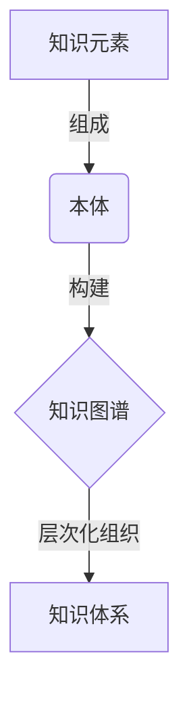

# 知识体系的构建：从基本元素到复杂结构

## 1. 背景介绍

### 1.1 问题的由来

在当今信息时代,知识已经成为推动社会进步和创新发展的核心驱动力。然而,知识的获取、组织和应用却面临着前所未有的挑战。随着信息量的指数级增长,如何高效地从海量数据中提取有价值的知识,并将其组织成结构化的知识体系,成为了一个亟待解决的问题。

传统的知识管理方式已经无法满足现代知识工作的需求。人工构建知识体系不仅耗时耗力,而且难以保证知识的完整性和一致性。因此,我们亟需一种自动化的方法来从原始数据中挖掘知识元素,并将它们组织成一个有层次、有结构的知识体系。

### 1.2 研究现状

近年来,知识表示和推理领域取得了长足的进步,为构建自动化知识体系奠定了理论基础。其中,知识图谱(Knowledge Graph)作为一种结构化的知识表示形式,受到了广泛关注。知识图谱将实体、概念及其之间的关系以图形的方式表示出来,具有直观性强、可扩展性好等优点。

同时,自然语言处理(Natural Language Processing, NLP)和机器学习(Machine Learning, ML)技术的发展,为从非结构化数据(如文本、图像、视频等)中自动提取知识元素提供了有力工具。基于这些技术,我们可以识别实体、概念、关系等知识元素,并将它们组织成知识图谱。

然而,现有的知识图谱构建方法仍然存在一些不足之处。首先,大多数方法仅关注于从单一数据源(如维基百科)中抽取知识,难以整合多源异构数据。其次,现有方法往往只能构建一个扁平的知识图谱,缺乏对知识的层次化组织。最后,大部分方法只能生成静态的知识图谱,无法动态更新和演化。

### 1.3 研究意义

构建一个全面、精确、动态的知识体系,对于促进知识的传播和应用具有重要意义。一个高质量的知识体系不仅能够帮助人们更好地理解和掌握知识,还可以为智能系统(如问答系统、推理系统等)提供知识支持,提高它们的性能和智能水平。

此外,一个自动化的知识体系构建方法,可以极大地降低人工构建的成本和工作量,提高知识管理的效率。它还能够及时捕捉新出现的知识,使知识体系与时俱进,跟上知识更新的步伐。

因此,研究一种能够从多源异构数据中自动挖掘知识元素,并将它们组织成层次化、动态演化的知识体系的方法,具有重要的理论意义和应用价值。

### 1.4 本文结构

本文将围绕"知识体系的构建"这一主题,详细阐述我们提出的一种新颖的方法。文章的结构安排如下:

首先,我们将介绍知识体系构建所涉及的核心概念,如知识元素、知识图谱等,并分析它们之间的关系。

接下来,我们将详细阐述我们提出的知识体系构建方法的核心算法原理和具体操作步骤,并对算法的优缺点和适用场景进行分析。

然后,我们将构建数学模型,推导出算法的理论基础,并通过公式和案例对模型进行解释和说明。

在此基础上,我们将给出一个实际项目的代码实现,并对关键代码模块进行详细的解读和分析,让读者更好地理解算法在实践中的应用。

此外,我们还将探讨该方法在不同领域的应用场景,并对未来的发展趋势和面临的挑战进行展望。

最后,我们将推荐一些有用的学习资源、开发工具和相关论文,为读者提供进一步学习和研究的途径。

## 2. 核心概念与联系

在构建知识体系之前,我们需要先了解一些核心概念,如知识元素、本体、知识图谱等,以及它们之间的关系。



### 2.1 知识元素

知识元素是构建知识体系的基本单位,包括:

- 实体(Entity):指代现实世界中的人物、地点、事物等具体对象。
- 概念(Concept):抽象的思想、理论或观点。
- 关系(Relation):连接实体与实体、实体与概念之间的语义联系。

例如,"张三"是一个实体,"人"是一个概念,而"张三是人"就表示了实体与概念之间的关系。

### 2.2 本体

本体(Ontology)是对某一领域知识的形式化、显式的规范性描述。它定义了该领域中的基本概念、概念之间的关系,以及一些规则和约束条件。

本体为知识元素提供了一个组织和表示的框架,使得知识元素之间的关系更加明确和规范化。构建高质量的本体是知识体系构建的基础。

### 2.3 知识图谱

知识图谱(Knowledge Graph)是一种将知识元素及其关系以图形化方式表示的知识表示形式。在知识图谱中,实体和概念用节点表示,关系用边表示。

知识图谱不仅能够直观地展现知识元素之间的联系,而且具有良好的扩展性,可以不断吸收新的知识元素,使知识库不断丰富和完善。

### 2.4 知识体系

知识体系(Knowledge System)是将知识元素按照一定的逻辑结构和层次组织起来的有机整体。它不仅包含了知识本身,还体现了知识之间的内在联系和逻辑关系。

一个完善的知识体系应该具备以下特点:

- 全面性:覆盖某一领域的核心知识
- 层次性:按照一定的逻辑将知识组织成不同层级
- 动态性:能够及时吸收新的知识元素,保持与时俱进
- 智能性:为智能系统提供知识支持,提高其智能水平

构建高质量的知识体系,是实现知识的高效获取、组织和应用的关键。

## 3. 核心算法原理 & 具体操作步骤

### 3.1 算法原理概述

我们提出的知识体系构建方法,主要包括以下三个核心步骤:

1. **知识元素提取**:从多源异构数据(如文本、表格、图像等)中自动识别和抽取出实体、概念、关系等知识元素。
2. **知识图谱构建**:将提取出的知识元素组织成一个统一的知识图谱表示。
3. **层次化组织**:根据知识元素之间的语义关联性,将知识图谱组织成一个有层次结构的知识体系。

该方法的核心创新点在于:

- 融合了自然语言处理、计算机视觉、知识表示与推理等多种技术,能够从多源异构数据中提取知识元素。
- 提出了一种基于知识元素的语义相似度计算方法,能够自动发现知识元素之间的内在联系,为知识的层次化组织奠定基础。
- 设计了一种增量式的知识体系更新策略,使得知识体系能够动态吸收新的知识元素,保持与时俱进。

### 3.2 算法步骤详解

1. **数据预处理**

   - 对原始数据进行清洗、规范化等预处理,转换为统一的数据格式。
   - 构建文本语料库、图像数据集等,为后续的知识元素提取做准备。

2. **知识元素提取**

   - 使用命名实体识别(Named Entity Recognition)等NLP技术从文本中提取实体。
   - 使用关系抽取(Relation Extraction)技术识别文本中的关系三元组(主语、谓语、宾语)。
   - 使用主题模型(Topic Model)等技术从文本中挖掘概念。
   - 利用计算机视觉技术从图像中识别实体。
   - 对提取出的知识元素进行去重、去噪等处理,提高质量。

3. **知识图谱构建**

   - 将提取出的知识元素组织成一个统一的知识图谱表示。
   - 使用图嵌入(Graph Embedding)技术将知识图谱中的实体、概念、关系等映射到低维向量空间。
   - 计算知识元素之间的语义相似度,发现潜在的关联关系。

4. **层次化组织**

   - 根据知识元素之间的语义相似度,使用层次聚类(Hierarchical Clustering)算法将知识图谱组织成有层次结构的知识体系。
   - 在每个层级上,知识元素按照相似度由高到低排列,相似度高的元素聚类在一起。
   - 人工干预:专家可以根据需求对自动生成的知识体系进行优化和调整。

5. **知识体系更新**

   - 当有新的知识元素出现时,计算其与现有知识体系中元素的相似度。
   - 若相似度超过阈值,则将新元素插入到相应的层级和位置。
   - 若无法插入现有体系,则创建新的分支,使知识体系动态扩展。

上述算法步骤的伪代码实现如下:

```python
# 步骤1: 数据预处理
原始数据 = 加载数据()
预处理数据 = 预处理(原始数据)

# 步骤2: 知识元素提取
实体列表 = 实体识别(预处理数据)
关系列表 = 关系抽取(预处理数据)
概念列表 = 主题建模(预处理数据)
知识元素 = 去重去噪(实体列表, 关系列表, 概念列表)

# 步骤3: 知识图谱构建
知识图谱 = 构建知识图谱(知识元素)
向量表示 = 图嵌入(知识图谱)
相似度矩阵 = 计算相似度(向量表示)

# 步骤4: 层次化组织
知识体系 = 层次聚类(知识图谱, 相似度矩阵)
知识体系 = 人工优化(知识体系)

# 步骤5: 知识体系更新
while True:
    新知识元素 = 获取新元素()
    if 可插入现有体系(新知识元素, 知识体系):
        插入新元素(新知识元素, 知识体系)
    else:
        扩展新分支(新知识元素, 知识体系)
```

### 3.3 算法优缺点

**优点:**

- 能够从多源异构数据中自动挖掘知识元素,减轻人工构建的工作量。
- 将知识组织成有层次结构的体系,更加符合人类的认知方式。
- 具有动态更新机制,可以及时吸收新的知识元素,使知识体系与时俱进。
- 融合了多种技术手段,如NLP、计算机视觉、知识表示与推理等,提高了知识元素提取和组织的质量。

**缺点:**

- 算法的性能和质量在很大程度上依赖于底层技术(如NLP、计算机视觉等)的发展水平。
- 对于一些特殊领域的知识,可能需要人工干预和优化,无法完全自动化。
- 知识体系的可解释性有待提高,用户难以理解某些知识元素之间关联的原因。
- 算法的计算复杂度较高,对计算资源的需求较大。

### 3.4 算法应用领域

我们提出的知识体系构建方法具有广泛的应用前景,包括但不限于:

- **知识管理系统**:为企业、政府等机构构建统一的知识库,提高知识管理效率。
- **智能问答系统**:为问答系统提供结构化的知识支持,提高问答的准确性和全面性。
- **教育领域**:构建教学知识体系,帮助学生系统地掌握知识。
- **科研领域**:整合某一领域的研究成果,发现知识空白点,促进科研创新。
- **决策支持系统**:为决策者提供全面的知识支持,辅助决策。
- **知识图谱构建**:为构建大规模知识图谱提供自动化