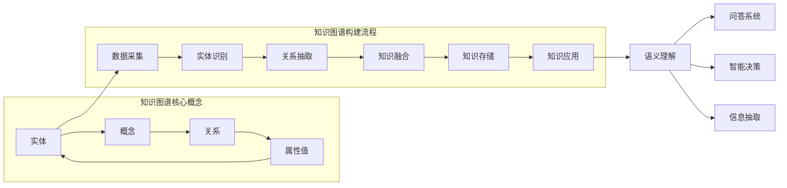

好的,我会严格遵循约束条件,尽最大努力为您撰写这篇高质量的技术博客文章。下面是正文部分:

# 知识图谱与语义理解原理与代码实战案例讲解

## 1. 背景介绍

### 1.1 问题的由来

在当今信息时代,海量的半结构化和非结构化数据如网页、电子邮件、社交媒体等数据源中蕴含着大量有价值的知识。然而,这些数据大多以自然语言文本的形式存在,难以被机器直接理解和利用。因此,如何从这些海量非结构化数据中自动抽取知识,并将其以机器可理解的形式表示和存储,成为了一个亟待解决的重要问题。

知识图谱(Knowledge Graph)作为一种新型知识表示和管理范式,为解决这一问题提供了有效途径。知识图谱将现实世界中的实体(如人物、地点、组织机构等)、概念以及它们之间的关系以结构化的形式表示,形成一个大规模的语义知识网络。借助知识图谱,机器可以更好地理解和推理自然语言数据,从而支持诸如问答、信息抽取、关系推理等多种智能应用。

### 1.2 研究现状  

近年来,知识图谱及其构建技术受到了学术界和工业界的广泛关注。一些著名的知识图谱系统已经应运而生,如谷歌的Knowledge Graph、微软的Satori、Facebook的实体图谱等。这些知识图谱通过整合多源异构数据,为搜索引擎、智能助理等应用提供了强大的语义支持。

然而,构建高质量的大规模知识图谱仍然面临诸多挑战,包括:

1. 实体链接 (Entity Linking):如何从非结构化文本中准确识别出实体并链接到知识库中的实体。
2. 关系抽取 (Relation Extraction):如何从文本中抽取出实体间的语义关系。
3. 知识融合 (Knowledge Fusion):如何有效地整合来自多源异构数据的知识,解决冲突和不一致问题。
4. 知识推理 (Knowledge Reasoning):如何基于已有的知识图谱进行推理,发现隐含的知识。

此外,如何在知识图谱的基础上实现自然语言理解,进而支持复杂的人机交互,也是一个具有重大挑战的研究方向。

### 1.3 研究意义

知识图谱及其构建和应用技术具有重要的理论意义和应用价值:

- 理论意义:知识图谱为人工智能、自然语言处理、数据挖掘等领域提供了一种统一的知识表示和管理范式,有助于推动这些领域的理论发展。
- 应用价值:知识图谱可广泛应用于搜索引擎、智能问答、关系抽取、推理决策等多种智能应用场景,为提升人机交互和决策支持能力提供了有力支撑。

因此,深入研究知识图谱构建及其在语义理解中的应用,对于推动人工智能和智能系统的发展具有重要意义。

### 1.4 本文结构

本文将全面介绍知识图谱及其在语义理解中的应用原理。主要内容包括:

1. 知识图谱的核心概念和构建过程。
2. 知识图谱构建的关键算法,如实体链接、关系抽取等。
3. 基于知识图谱的自然语言理解方法。
4. 知识图谱在实际应用中的案例分析。
5. 未来发展趋势和面临的挑战。

## 2. 核心概念与联系

知识图谱的核心概念包括:

- **实体 (Entity)**: 指现实世界中的具体事物,如人物、地点、组织机构等。
- **概念 (Concept)**: 指对实体的抽象概括,反映实体的类别和属性特征。
- **关系 (Relation)**: 指实体之间的语义联系,如"毕业于"、"工作于"等。
- **属性值 (Attribute Value)**: 指实体或关系的具体属性描述。

构建知识图谱的典型流程包括:

1. **数据采集**: 从各种结构化、半结构化和非结构化数据源中收集相关数据。
2. **实体识别**: 从文本数据中识别出实体并链接到知识库中的实体。
3. **关系抽取**: 从文本数据中抽取出实体之间的语义关系。
4. **知识融合**: 将来自多源异构数据的知识进行整合,解决冲突和不一致问题。
5. **知识存储**: 将构建好的知识图谱持久化存储,以支持后续查询和应用。
6. **知识应用**: 基于构建的知识图谱,支持语义理解、问答系统、智能决策等多种应用场景。

知识图谱为实现自然语言的语义理解奠定了基础。通过将自然语言映射到知识图谱的语义空间,机器可以更好地理解语言的深层含义,从而支持复杂的人机交互和智能决策任务。

## 3. 核心算法原理及具体操作步骤

### 3.1 算法原理概述

知识图谱构建涉及多个关键算法,包括实体识别、实体链接、关系抽取和知识融合等。这些算法的原理主要基于自然语言处理、机器学习和图数据管理等多个领域的理论和技术。

- **实体识别 (Named Entity Recognition, NER)**: 从非结构化文本中识别出实体mention,如人名、地名、组织机构名等。常用的方法包括基于规则的方法、统计机器学习方法(如HMM、CRF等)和深度学习方法(如Bi-LSTM+CRF等)。

- **实体链接 (Entity Linking, EL)**: 将识别出的实体mention链接到知识库中的实体。主要方法有基于字符串相似度的简单方法、基于语境相似度的无监督方法、基于监督学习的方法等。

- **关系抽取 (Relation Extraction, RE)**: 从文本中抽取出实体间的语义关系。常用的有基于模式匹配的方法、基于特征的统计学习方法(如SVM、MaxEnt等)、基于深度学习的方法(如CNN、LSTM等)等。

- **知识融合 (Knowledge Fusion)**: 将来自多源异构数据的知识进行整合,解决冲突和不一致问题。主要方法包括基于规则的方法、基于统计学习的方法、基于图模型的方法等。

### 3.2 算法步骤详解

以下以实体链接算法为例,详细阐述其具体操作步骤:

1. **候选实体生成**: 针对每个实体mention,基于字符串相似度或其他启发式规则,从知识库中检索出一组候选实体。

2. **实体上下文构建**: 构建实体mention在文本中的上下文语义信息,通常包括上下文词、上下文实体、上下文关系等。

3. **实体语义表示**: 将实体mention及其上下文语义信息映射到语义向量空间,得到实体语义表示向量。常用的方法包括基于统计的词袋模型(BOW)、基于神经网络的词向量/句向量等。

4. **候选实体语义表示**: 对于每个候选实体,通过知识库中的实体描述信息构建其语义表示向量。

5. **语义相似度计算**: 计算实体mention的语义表示向量与每个候选实体语义表示向量之间的相似度,常用的相似度度量有余弦相似度、Jaccard相似度等。

6. **候选实体排序**: 根据语义相似度对候选实体进行排序,选择最相似的实体作为最终链接目标。

7. **全局一致性约束(可选)**: 引入全局一致性约束,使得文本中所有实体链接结果在语义上是相互一致的。常用的方法包括基于图的集体链接、基于密度的聚类等。

### 3.3 算法优缺点

以实体链接算法为例,其优缺点如下:

**优点**:

- 能够准确地将文本中的实体mention链接到知识库中的实体,为知识图谱构建奠定基础。
- 通过考虑上下文语义信息,提高了链接的准确性。
- 基于深度学习的方法能够自动学习实体语义表示,无需人工设计复杂特征。

**缺点**:

- 对新出现的实体(如人名、组织名等)的链接效果较差,需要不断扩充知识库。
- 处理歧义实体时可能会出现错误链接。
- 基于深度学习的方法通常需要大量标注数据,且训练过程复杂。

### 3.4 算法应用领域

实体链接等知识图谱构建算法在多个领域具有广泛应用:

- **信息抽取**: 通过实体链接和关系抽取,可以从非结构化文本中抽取出结构化的三元组知识,支持知识库的自动构建和扩充。

- **问答系统**: 基于知识图谱,可以实现复杂的语义解析和查询,为问答系统提供强大的知识支持。

- **智能搜索**: 知识图谱可以增强搜索引擎的语义理解能力,提供更精准、智能的搜索服务。

- **智能助理**: 通过实体链接和关系抽取,智能助理可以更好地理解用户的自然语言查询,提供个性化的服务。

- **推荐系统**: 基于知识图谱挖掘用户和物品的语义关联,可以为推荐系统提供更精准的推荐结果。

## 4. 数学模型和公式及详细讲解与举例说明

### 4.1 数学模型构建

在实体链接算法中,常常需要构建实体mention和候选实体之间的相似度评分模型,以量化它们的语义相关程度。一种常用的无监督模型是基于向量空间模型(Vector Space Model)。

设实体mention $m$的语义向量表示为$\vec{v_m}$,候选实体$e$的语义向量表示为$\vec{v_e}$,则它们之间的语义相似度可以定义为:

$$sim(m, e) = \vec{v_m} \cdot \vec{v_e}$$

其中,$\cdot$表示向量点乘运算。

为了获得更好的相似度评分,我们可以进一步考虑上下文语义信息。假设实体mention $m$的上下文语义向量表示为$\vec{c_m}$,候选实体$e$的上下文语义向量表示为$\vec{c_e}$,则相似度评分函数可以扩展为:

$$sim(m, e) = \alpha (\vec{v_m} \cdot \vec{v_e}) + \beta (\vec{c_m} \cdot \vec{c_e})$$

其中,$\alpha$和$\beta$为权重系数,用于平衡实体本身语义和上下文语义的重要性。

### 4.2 公式推导过程

对于上述相似度评分函数,我们可以进一步推导出基于概率的无监督目标函数,以学习更优的语义表示。

首先,我们定义实体mention $m$链接到候选实体$e$的条件概率为:

$$P(e|m) = \frac{exp(sim(m, e))}{\sum_{e' \in \mathcal{E}} exp(sim(m, e'))}$$

其中,$\mathcal{E}$表示所有候选实体的集合。

为了使正确的实体链接获得更高的概率,我们可以最大化所有实体mention的链接概率之和,得到如下目标函数:

$$\mathcal{J} = \sum_{m \in \mathcal{M}} \log P(e^*|m)$$

其中,$\mathcal{M}$表示所有实体mention的集合,$e^*$表示$m$的正确链接目标实体。

通过对目标函数$\mathcal{J}$进行最优化,我们可以学习到最佳的语义向量表示$\vec{v_m