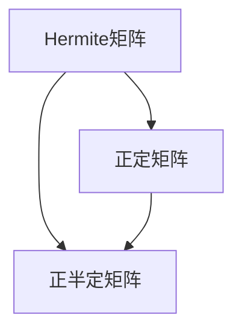

# 矩阵理论与应用：Hermite正定与正半定矩阵

关键词：Hermite矩阵、正定矩阵、正半定矩阵、特征值、特征向量、Cholesky分解、最优化

## 1. 背景介绍
### 1.1 问题的由来
矩阵理论是数学和计算机科学中一个重要的分支,在诸多领域都有广泛的应用。其中,Hermite矩阵、正定矩阵和正半定矩阵是矩阵理论中的重要概念,它们在优化理论、信号处理、控制论等领域扮演着关键角色。深入理解这些矩阵的性质和应用,对于解决实际问题具有重要意义。

### 1.2 研究现状
目前,关于Hermite矩阵、正定矩阵和正半定矩阵的研究已经取得了丰硕的成果。许多学者从不同角度对这些矩阵的性质、判定准则、分解方法等进行了深入探讨。特别是在凸优化、最小二乘问题、Lyapunov稳定性等领域,这些矩阵发挥着不可或缺的作用。然而,如何将这些理论成果与实际应用更好地结合,仍然是一个值得深入研究的课题。

### 1.3 研究意义
深入研究Hermite矩阵、正定矩阵和正半定矩阵,不仅有助于加深对矩阵理论的理解,而且对于解决实际问题具有重要的指导意义。通过掌握这些矩阵的性质和应用,我们可以更高效地解决优化问题、分析系统稳定性、设计滤波器等,从而推动相关领域的发展。同时,这些研究成果也为其他学科提供了有力的数学工具和思路。

### 1.4 本文结构
本文将围绕Hermite矩阵、正定矩阵和正半定矩阵展开讨论。首先,我们将介绍这些矩阵的基本概念和性质,并阐明它们之间的联系。然后,我们将重点探讨这些矩阵在优化理论中的应用,给出相关算法的原理和步骤。接着,我们将通过数学模型和案例分析,深入理解这些矩阵的作用。同时,我们还将提供代码实例,展示如何在实际项目中运用这些矩阵。最后,我们将总结全文,并展望这一领域的未来发展趋势和挑战。

## 2. 核心概念与联系
在正式讨论Hermite矩阵、正定矩阵和正半定矩阵之前,我们首先回顾一些基本概念。对于复矩阵 $A\in \mathbb{C}^{n\times n}$,其共轭转置矩阵记为 $A^H$,即 $A^H=\bar{A}^T$。若 $A$ 为实矩阵,则 $A^H=A^T$。

Hermite矩阵是一类特殊的复方阵,其定义如下：

> **定义1** 设 $A\in \mathbb{C}^{n\times n}$,若 $A^H=A$,则称 $A$ 为Hermite矩阵。

对于实矩阵,Hermite矩阵退化为对称矩阵。Hermite矩阵有许多优良性质,例如其特征值都是实数,且存在酉矩阵使其对角化。

正定矩阵和正半定矩阵则是Hermite矩阵的重要子类,它们的定义如下：

> **定义2** 设 $A\in \mathbb{C}^{n\times n}$ 为Hermite矩阵,若对任意非零向量 $x\in \mathbb{C}^n$,都有 $x^HAx>0$,则称 $A$ 为正定矩阵。

> **定义3** 设 $A\in \mathbb{C}^{n\times n}$ 为Hermite矩阵,若对任意向量 $x\in \mathbb{C}^n$,都有 $x^HAx\geq 0$,则称 $A$ 为正半定矩阵。

正定矩阵和正半定矩阵在优化理论中有着广泛的应用。许多优化问题可以转化为求解正定矩阵或正半定矩阵相关的子问题。

下图给出了Hermite矩阵、正定矩阵和正半定矩阵之间的关系：



## 3. 核心算法原理 & 具体操作步骤
### 3.1 算法原理概述
判断一个矩阵是否为正定矩阵或正半定矩阵,是优化算法中的一个基本问题。下面我们介绍几种常用的判定方法。

### 3.2 算法步骤详解
#### 3.2.1 特征值法
根据正定矩阵和正半定矩阵的性质,我们可以通过矩阵的特征值来判定。

> **定理1** 设 $A\in \mathbb{C}^{n\times n}$ 为Hermite矩阵,则以下条件等价：
> 1. $A$ 为正定矩阵；
> 2. $A$ 的特征值全为正数。

> **定理2** 设 $A\in \mathbb{C}^{n\times n}$ 为Hermite矩阵,则以下条件等价：
> 1. $A$ 为正半定矩阵；
> 2. $A$ 的特征值非负。

因此,我们可以通过计算矩阵的特征值,并判断其是否全为正数或非负,来确定矩阵是否为正定或正半定的。

#### 3.2.2 顺序主子式法
对于实对称矩阵,还可以使用顺序主子式法来判定正定性。

> **定理3** 设 $A\in \mathbb{R}^{n\times n}$ 为实对称矩阵,则以下条件等价：
> 1. $A$ 为正定矩阵；
> 2. $A$ 的所有顺序主子式均为正。

顺序主子式是指从矩阵的左上角开始,依次选取 $1\times 1$, $2\times 2$, $\cdots$, $n\times n$ 的子矩阵,并计算它们的行列式。若这些行列式均为正,则矩阵为正定的。

#### 3.2.3 Cholesky分解法
对于正定矩阵,我们还可以利用Cholesky分解来判定。

> **定理4** 设 $A\in \mathbb{C}^{n\times n}$ 为Hermite矩阵,则以下条件等价：
> 1. $A$ 为正定矩阵；
> 2. 存在唯一的下三角矩阵 $L$,使得 $A=LL^H$,且 $L$ 的对角元素均为正。

其中, $LL^H$ 称为矩阵 $A$ 的Cholesky分解。因此,我们可以尝试对矩阵进行Cholesky分解,若分解成功且满足定理4的条件,则矩阵为正定的。

### 3.3 算法优缺点
- 特征值法适用于一般的Hermite矩阵,但计算特征值的复杂度较高,对于大型矩阵可能不太高效。
- 顺序主子式法仅适用于实对称矩阵,但计算量相对较小,易于实现。
- Cholesky分解法适用于正定矩阵,可以同时判定正定性并得到分解结果,但对于非正定矩阵会失败。

### 3.4 算法应用领域 
判定矩阵的正定性在优化理论、控制论、信号处理等领域有着广泛的应用。例如,在凸优化中,许多算法如牛顿法、内点法等,都要求目标函数的Hessian矩阵为正定的。在系统理论中,Lyapunov稳定性判据也与正定矩阵密切相关。

## 4. 数学模型和公式 & 详细讲解 & 举例说明
### 4.1 数学模型构建
为了更好地理解正定矩阵和正半定矩阵的应用,我们以二次型优化问题为例,构建数学模型。考虑如下的优化问题：

$$
\begin{aligned}
\min_{x\in \mathbb{R}^n} \quad & \frac{1}{2}x^TAx-b^Tx+c \\
\mathrm{s.t.} \quad & x\in \mathbb{R}^n
\end{aligned}
$$

其中, $A\in \mathbb{R}^{n\times n}$ 为实对称矩阵, $b\in \mathbb{R}^n$, $c\in \mathbb{R}$。这是一个无约束的二次型优化问题,其最优解与矩阵 $A$ 的正定性密切相关。

### 4.2 公式推导过程
我们可以通过分析目标函数的梯度和Hessian矩阵,来推导最优解的条件。目标函数 $f(x)=\frac{1}{2}x^TAx-b^Tx+c$ 的梯度为：

$$\nabla f(x)=Ax-b$$

其Hessian矩阵为：

$$\nabla^2 f(x)=A$$

根据最优性条件,最优解 $x^*$ 应满足 $\nabla f(x^*)=0$,即：

$$Ax^*=b$$

这意味着,若矩阵 $A$ 可逆,则最优解为 $x^*=A^{-1}b$。

### 4.3 案例分析与讲解
下面我们通过一个具体的例子来说明矩阵的正定性对最优解的影响。

考虑如下的二次型优化问题：

$$
\begin{aligned}
\min_{x\in \mathbb{R}^2} \quad & x_1^2-x_1x_2+x_2^2-2x_1-4x_2 \\
\mathrm{s.t.} \quad & x\in \mathbb{R}^2
\end{aligned}
$$

其中,目标函数可以写成矩阵形式：

$$f(x)=\frac{1}{2}x^TAx-b^Tx+c$$

其中：

$$A=\begin{bmatrix}
2 & -1 \\ 
-1 & 2
\end{bmatrix}, \quad b=\begin{bmatrix}
2 \\ 
4
\end{bmatrix}, \quad c=0$$

我们可以验证,矩阵 $A$ 的特征值为 $\lambda_1=1$, $\lambda_2=3$,均为正数,因此 $A$ 是正定矩阵。根据前面的分析,最优解为：

$$x^*=A^{-1}b=\begin{bmatrix}
2 & -1 \\ 
-1 & 2
\end{bmatrix}^{-1}\begin{bmatrix}
2 \\ 
4
\end{bmatrix}=\begin{bmatrix}
2 \\ 
3
\end{bmatrix}$$

可以验证,该解确实是全局最优解。这说明,当矩阵 $A$ 正定时,二次型优化问题有唯一的全局最优解。

### 4.4 常见问题解答
**Q:** 如果矩阵 $A$ 不是正定的,二次型优化问题还有最优解吗？

**A:** 当矩阵 $A$ 不是正定的时候,情况会复杂一些。如果 $A$ 是正半定的,且方程 $Ax=b$ 有解,则优化问题仍然有最优解,但可能不唯一。如果 $A$ 既不是正定也不是正半定的,则优化问题可能无解,或者有无穷多个无界解。因此,矩阵的正定性对于优化问题的可解性和解的唯一性至关重要。

## 5. 项目实践：代码实例和详细解释说明
### 5.1 开发环境搭建
在这一节,我们将使用Python语言,通过NumPy和SciPy库来实现前面讨论的算法。读者需要安装以下库：

- NumPy：提供数组、矩阵等数据结构,以及线性代数运算功能。
- SciPy：提供优化、信号处理、特殊数学函数等科学计算功能。

可以通过以下命令安装这些库：

```bash
pip install numpy scipy
```

### 5.2 源代码详细实现
下面我们给出判定矩阵正定性的Python代码实现。

```python
import numpy as np
from scipy import linalg

def is_positive_definite(A):
    """判断矩阵A是否为正定矩阵"""
    try:
        # 尝试进行Cholesky分解
        linalg.cholesky(A)
        return True
    except np.linalg.LinAlgError:
        return False

def is_positive_semidefinite(A):
    """判断