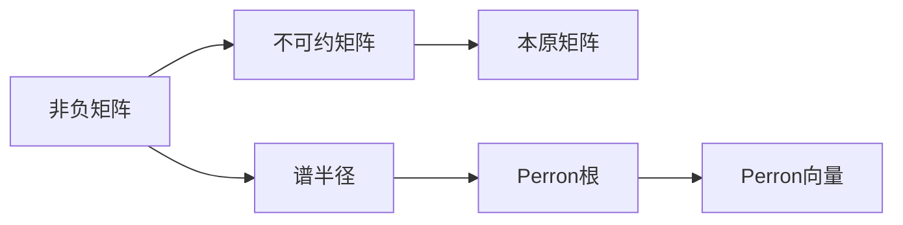

# 矩阵理论与应用：一般非负矩阵Perron-Frobenius理论的古典结果

关键词：非负矩阵，Perron-Frobenius理论，谱半径，Perron向量，Perron根，不可约矩阵，本原矩阵

## 1. 背景介绍
### 1.1  问题的由来
矩阵理论是数学和计算机科学等领域的重要基础，其中非负矩阵在经济学、生物学、图论等诸多学科中有着广泛的应用。非负矩阵的Perron-Frobenius理论是研究非负矩阵谱性质的重要工具，对于理解非负矩阵的特征值和特征向量有着重要意义。

### 1.2  研究现状
Perron-Frobenius理论最早由奥地利数学家Oskar Perron和德国数学家Ferdinand Georg Frobenius在19世纪末20世纪初提出和发展，经过一个多世纪的发展，已经成为矩阵理论的经典结果。目前Perron-Frobenius理论不仅在理论研究中得到了极大的发展，也在工程实践中得到了广泛应用。

### 1.3  研究意义
深入理解和掌握Perron-Frobenius理论，对于从事矩阵论、数值计算、算法设计、人工智能等领域研究的科研人员和工程技术人员具有重要意义。本文将从Perron-Frobenius理论的核心概念出发，系统阐述其基本原理和重要定理，并结合具体案例深入分析其应用，帮助读者全面理解和掌握这一理论及其应用。

### 1.4  本文结构
本文将从以下几个方面展开论述：

1. 介绍Perron-Frobenius理论的核心概念及其之间的关系；
2. 阐述Perron-Frobenius理论的主要定理、引理及其证明思路；
3. 通过具体的数值算例演示如何应用Perron-Frobenius理论进行矩阵的谱分析；
4. 介绍Perron-Frobenius理论在PageRank算法、马尔可夫链等领域的应用；
5. 总结Perron-Frobenius理论的重要意义，并对其未来的发展方向和应用前景进行展望。

## 2. 核心概念与联系
在展开论述Perron-Frobenius理论之前，我们先来了解几个核心概念：

1. 非负矩阵：所有元素都非负的矩阵。
2. 不可约矩阵：不能通过同时对行和列交换变成块上三角形矩阵的方阵。
3. 本原矩阵：不可约非负方阵的某个幂为正矩阵。
4. 谱半径：矩阵特征值的模的最大值。
5. Perron根：非负不可约矩阵的谱半径，也是其最大的实特征值。
6. Perron向量：对应于Perron根的特征向量。

下图展示了这些概念之间的关系：



## 3. 核心算法原理 & 具体操作步骤
### 3.1  算法原理概述
Perron-Frobenius理论的核心是研究非负不可约矩阵的谱性质，主要包括以下几个方面：

1. 非负不可约矩阵的谱半径是其特征值，对应唯一的正特征向量。
2. 谱半径是非负不可约矩阵特征值中模最大者，且是单根。
3. 矩阵的谱半径随着矩阵元素的增加而增大。
4. 若矩阵的特征多项式系数非负，则谱半径是其最大特征根。

### 3.2  算法步骤详解
下面我们通过一个具体的算例来演示如何应用Perron-Frobenius理论进行矩阵谱分析。

考虑矩阵：
$$A=\begin{bmatrix}
1 & 1 & 0\\ 
1 & 0 & 1\\
0 & 1 & 1
\end{bmatrix}$$

1. 判断矩阵A是否为非负不可约矩阵。
   
   矩阵A所有元素非负，且无法通过行列交换变成块上三角矩阵，因此是非负不可约矩阵。

2. 求矩阵A的特征值和特征向量。
   
   矩阵A的特征多项式为：
   $$det(\lambda I-A)=\begin{vmatrix}
   \lambda-1 & -1 & 0\\ 
   -1 & \lambda & -1\\
   0 & -1 & \lambda-1
   \end{vmatrix}=(\lambda-2)(\lambda^2-\lambda-1)$$
   
   解得特征值为：$\lambda_1=2,\lambda_{2,3}=\frac{1\pm\sqrt{5}}{2}$
   
   对应特征向量为：
   $v_1=(1,1,1)^T, v_2=(\frac{1-\sqrt{5}}{2},1,\frac{-1-\sqrt{5}}{2})^T, v_3=(\frac{1+\sqrt{5}}{2},1,\frac{-1+\sqrt{5}}{2})^T$

3. 求矩阵A的谱半径和Perron向量。
   
   由计算可知，矩阵A的谱半径$\rho(A)=2$，对应的特征向量$v_1=(1,1,1)^T$为Perron向量。

4. 验证Perron-Frobenius理论的结论。
   
   - 谱半径$\rho(A)=2$是矩阵A的最大特征值，且是单根；
   - Perron向量$v_1=(1,1,1)^T$为正向量；
   - 若令$B=\begin{bmatrix} 2 & 1 & 0\\ 1 & 0 & 1\\ 0 & 1 & 1 \end{bmatrix}$，则$B>A$，计算可得$\rho(B)>2=\rho(A)$，即谱半径随着矩阵元素的增大而增大。

### 3.3  算法优缺点
Perron-Frobenius理论的优点在于：

1. 理论内容丰富，包含多个重要定理，能较全面地刻画非负不可约矩阵的谱性质。
2. 与现实问题结合紧密，在经济学、博弈论、网页排名等领域有重要应用。
3. 为进一步的理论研究奠定了基础，如非线性Perron-Frobenius理论等。

同时也存在一些局限性：

1. 经典的Perron-Frobenius理论仅适用于非负不可约矩阵，对于更一般的矩阵尚不能完全刻画。
2. 部分定理的证明较为复杂，学习成本较高。

### 3.4  算法应用领域
Perron-Frobenius理论在以下领域有重要应用：

1. 搜索引擎中的PageRank算法，用于为网页重要性排序。
2. 马尔可夫链的平稳分布求解。
3. 生态学中的种群增长模型。
4. 经济学中的投入产出模型和均衡价格理论。
5. 博弈论中的策略评估和进化博弈分析。

## 4. 数学模型和公式 & 详细讲解 & 举例说明
### 4.1  数学模型构建
我们考虑一个非负不可约矩阵$A=(a_{ij})_{n\times n}$，其中$a_{ij}\geq0$，且$A$不能通过同时对行和列交换变成块上三角矩阵。我们的目标是研究矩阵$A$的谱性质，给出其谱半径、Perron根和Perron向量的刻画。

### 4.2  公式推导过程
下面给出Perron-Frobenius理论的主要定理及证明思路。

**定理1**：设$A$是非负不可约矩阵，则：

1. $A$的谱半径$\rho(A)$是$A$的特征值；
2. $\rho(A)$对应的特征向量可取为正向量；
3. $\rho(A)$是$A$的单根，其代数重数和几何重数均为1。

证明思路：对矩阵$A$的特征多项式进行分析，利用不可约矩阵的性质，证明$\rho(A)$是单根，并构造对应的正特征向量。

**定理2**：设$A$是非负不可约矩阵，$B$是非负矩阵，如果$B\geq A$且$B\neq A$，则$\rho(B)>\rho(A)$。

证明思路：利用反证法，假设$\rho(B)\leq\rho(A)$，构造矩阵$C=\rho(A)I-B$，证明$C$的某个主子式非正，从而导出矛盾。

### 4.3  案例分析与讲解
我们以PageRank算法为例，说明Perron-Frobenius理论的应用。

PageRank算法是Google搜索引擎用于对网页重要性进行排序的算法，其核心思想是通过网页之间的链接关系构建一个转移矩阵，该矩阵为非负不可约矩阵，其Perron向量即可用于刻画各网页的重要性。

具体地，设有$n$个网页，定义转移矩阵$P=(p_{ij})_{n\times n}$：
$$p_{ij}=\begin{cases}
\frac{1}{d_i}, & \text{如果网页$i$链接到网页$j$} \\
0, & \text{otherwise}
\end{cases}$$
其中$d_i$表示网页$i$的出链数。

则$P$为非负不可约矩阵，其Perron向量$\pi=(\pi_1,\cdots,\pi_n)^T$满足：
$$\pi=P\pi, \sum_{i=1}^n \pi_i=1, \pi_i>0, i=1,\cdots,n$$

向量$\pi$的第$i$个分量$\pi_i$即可表示网页$i$的PageRank值，用于衡量其重要性。

### 4.4  常见问题解答
**Q**：Perron-Frobenius理论是否适用于任意非负矩阵？

**A**：Perron-Frobenius理论的经典结论主要适用于非负不可约矩阵，对于可约的非负矩阵，部分结论可能不再成立。但是可以将矩阵约化为不可约矩阵的块上三角形，对角线上的不可约子矩阵仍然适用Perron-Frobenius理论。

**Q**：如何判断一个非负矩阵是否为不可约矩阵？

**A**：对于非负矩阵$A$，如果对应的有向图是强连通的，即从任意顶点出发均可达到其他所有顶点，则矩阵$A$是不可约的。也可以通过计算矩阵的某个幂$A^k$是否为正矩阵来判断。如果存在正整数$k$使得$A^k$为正矩阵，则$A$是不可约矩阵。

## 5. 项目实践：代码实例和详细解释说明
### 5.1  开发环境搭建
我们使用Python语言，通过NumPy和SciPy库来实现矩阵运算和特征值求解。读者可以通过以下命令安装所需库：
```
pip install numpy scipy
```

### 5.2  源代码详细实现
下面的Python代码展示了如何判断矩阵的不可约性，并求解矩阵的谱半径、Perron根和Perron向量。

```python
import numpy as np
from scipy.linalg import eig

def is_irreducible(A):
    """判断矩阵A是否不可约"""
    n = A.shape[0]
    for k in range(1, n):
        if np.any(np.linalg.matrix_power(A, k) > 0):
            return True
    return False

def perron_frobenius(A):
    """求解矩阵A的谱半径、Perron根和Perron向量"""
    if not is_irreducible(A):
        raise ValueError("Matrix A must be irreducible")
    
    eigvals, eigvecs = eig(A)
    eigvals = np.real(eigvals)
    ind = np.argmax(eigvals)
    rho = eigvals[ind]  # 谱半径
    v = eigvecs[:, ind]  # Perron向量
    v = np.real(v)
    v = v / v.sum()  # 归一化
    return rho, v

# 测试
A = np.array([[1, 1, 0], 
              [1, 0, 1],
              [0, 1, 1]])
rho, v = perron_frobenius(A)
print(f"谱半径: {