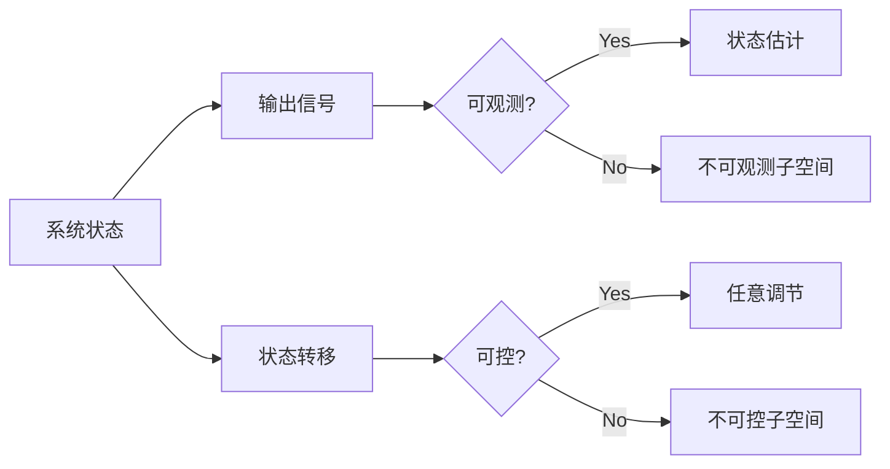

# 矩阵理论与应用：可观测与可控的定常线性系统

关键词：矩阵理论、线性系统、可观测性、可控性、状态空间模型、卡尔曼分解

## 1. 背景介绍
### 1.1  问题的由来
在现代控制理论中,线性系统的可观测性和可控性是两个基本而重要的概念。它们不仅是系统能否实现状态估计和状态反馈控制的前提条件,而且与系统的结构特性、稳定性、最优控制等许多问题密切相关。因此,对线性系统可观测性和可控性的研究一直是控制理论的重要课题之一。

### 1.2  研究现状
目前对线性系统可观测性和可控性的研究已经比较成熟,形成了完整的理论体系。国内外学者从不同角度对其进行了深入研究,取得了许多重要成果。如卡尔曼等人提出了著名的卡尔曼分解,揭示了系统的可观测子空间和可控子空间的内在联系;Wonham等人研究了线性系统的几何结构,给出了可观测性和可控性的几何判据;Willems从行为方程的角度研究了线性系统的可观测性和可控性,拓展了传统状态空间模型的理论。

### 1.3  研究意义 
深入研究线性系统的可观测性和可控性,对于理解系统的本质特性,揭示系统内在的数学结构,设计高性能的状态估计器和状态反馈控制器,以及解决系统的结构综合、故障诊断等问题,都具有重要意义。同时,可观测性和可控性理论也是现代控制理论的基础,对于非线性系统、随机系统、网络化系统等的可观测性和可控性研究具有重要的指导意义。

### 1.4  本文结构
本文将系统地介绍定常线性系统可观测性和可控性的基本概念、判定准则、代数和几何特征,重点讨论卡尔曼分解定理揭示的系统内在结构,并结合具体实例阐述其在控制系统设计中的应用。全文共分为9个部分,第1部分为背景介绍;第2部分介绍核心概念;第3部分讨论可观测性和可控性的判定算法;第4部分从代数角度刻画系统的可观测性和可控性特征;第5部分通过Matlab仿真例证相关概念;第6部分探讨在控制系统设计中的应用;第7部分推荐相关学习资源;第8部分对全文进行总结并展望后续研究方向;第9部分为附录,列举部分习题供读者练习。

## 2. 核心概念与联系
考虑如下定常线性系统:

$$
\begin{aligned}
\dot{x}(t) &= Ax(t) + Bu(t) \\
y(t) &= Cx(t)
\end{aligned}
$$

其中, $x(t) \in \mathbb{R}^n$ 为系统状态, $u(t) \in \mathbb{R}^m$ 为控制输入, $y(t) \in \mathbb{R}^p$ 为测量输出。$A \in \mathbb{R}^{n \times n}, B \in \mathbb{R}^{n \times m}, C \in \mathbb{R}^{p \times n}$ 为常数矩阵。

- 可观测性：系统的初始状态 $x(0)$ 能否由有限时间段内的输入 $u(t)$ 和输出 $y(t)$ 唯一确定。
- 可控性：系统的任意初始状态 $x(0)$ 能否在有限时间内,通过控制输入 $u(t)$ 转移到任意期望状态。

可观测性刻画了系统状态能否被准确重构,可控性刻画了系统状态能否被任意调节。二者互为对偶概念,揭示了系统的本质特性。下图展示了二者的内在联系:



## 3. 核心算法原理 & 具体操作步骤
### 3.1  算法原理概述
判断系统可观测性的核心是求解可观测矩阵的秩,判断系统可控性的核心是求解可控矩阵的秩。具体地,定义

- 可观测矩阵: $\mathcal{O} = \begin{bmatrix} C \\ CA \\ \vdots \\ CA^{n-1} \end{bmatrix}$
- 可控矩阵: $\mathcal{C} = \begin{bmatrix} B & AB & \cdots & A^{n-1}B \end{bmatrix}$

则线性系统可观测的充要条件是 $rank(\mathcal{O}) = n$,线性系统可控的充要条件是 $rank(\mathcal{C}) = n$。

### 3.2  算法步骤详解
1. 写出系统的状态空间表示 $(A,B,C)$。
2. 计算可观测矩阵 $\mathcal{O}$,判断其秩是否等于状态维数 $n$。 
3. 计算可控矩阵 $\mathcal{C}$,判断其秩是否等于状态维数 $n$。
4. 若 $rank(\mathcal{O}) = n$,则系统可观测;若 $rank(\mathcal{C}) = n$,则系统可控。

### 3.3  算法优缺点
- 优点：计算简单直观,易于编程实现。
- 缺点：对于高维系统,可观测矩阵和可控矩阵的维度很大,计算量大。

### 3.4  算法应用领域
可观测性和可控性判定算法是现代控制理论的基础,在线性系统的建模、分析与综合中广泛应用,如确定系统的最小实现、设计状态观测器和状态反馈控制器等。同时也是研究非线性系统、时变系统、随机系统等可观测性和可控性的基础。

## 4. 数学模型和公式 & 详细讲解 & 举例说明
### 4.1  数学模型构建
除了用可观测矩阵和可控矩阵的秩判断系统的可观测性和可控性外,我们还可以从代数角度刻画系统的可观测性和可控性。

定义系统 $(A,B,C)$ 的传递函数为:

$$
G(s) = C(sI-A)^{-1}B
$$

其中 $I$ 是单位矩阵,$s$ 为复变量。可以证明:

- 系统可观测 $\Leftrightarrow$ $\begin{bmatrix} sI-A \\ C \end{bmatrix}$ 列满秩,即在复平面上任意点处秩都为 $n$。
- 系统可控 $\Leftrightarrow$ $\begin{bmatrix} sI-A & B \end{bmatrix}$ 行满秩,即在复平面上任意点处秩都为 $n$。

进一步,系统的传递函数 $G(s)$ 与系统的可观测性、可控性有着密切联系:

- 系统可观测 $\Leftrightarrow$ $G(s)$ 的 Smith-McMillan 标准型中无 $\frac{0}{*}$ 型元素。
- 系统可控 $\Leftrightarrow$ $G(s)$ 的 Smith-McMillan 标准型中无 $\frac{*}{0}$ 型元素。

### 4.2  公式推导过程
以下给出系统可观测的代数判据推导过程,可控性判据可类似得到。

(1) 必要性:若系统可观测,则存在 $n \times n$ 阶多项式矩阵 $U(s),V(s)$,使得

$$
U(s) \begin{bmatrix} sI-A \\ C \end{bmatrix} V(s) = \begin{bmatrix} I_n \\ 0 \end{bmatrix}
$$

这表明 $\begin{bmatrix} sI-A \\ C \end{bmatrix}$ 列满秩。

(2) 充分性:若 $\begin{bmatrix} sI-A \\ C \end{bmatrix}$ 列满秩,则存在 $n \times n$ 阶多项式矩阵 $U(s),V(s)$ 使得上式成立。注意到

$$
U(s) \begin{bmatrix} sI-A \\ C \end{bmatrix} = \begin{bmatrix} U_1(s)(sI-A) \\ U_1(s)C \end{bmatrix} = \begin{bmatrix} I_n \\ 0 \end{bmatrix} V^{-1}(s)
$$

可知 $U_1(s)C = 0$,即 $C$ 可观测。

### 4.3  案例分析与讲解
考虑二阶系统:

$$
A = \begin{bmatrix} 0 & 1 \\ -1 & -1 \end{bmatrix}, B = \begin{bmatrix} 0 \\ 1 \end{bmatrix}, C = \begin{bmatrix} 1 & 0 \end{bmatrix}
$$

求系统的可观测性和可控性。

解:

(1) 计算可观测矩阵:

$$
\mathcal{O} = \begin{bmatrix} C \\ CA \end{bmatrix} = \begin{bmatrix} 1 & 0 \\ 0 & 1 \end{bmatrix}
$$

可知 $rank(\mathcal{O}) = 2 = n$,系统可观测。

(2) 计算可控矩阵:

$$
\mathcal{C} = \begin{bmatrix} B & AB \end{bmatrix} = \begin{bmatrix} 0 & 1 \\ 1 & -1 \end{bmatrix}
$$

可知 $rank(\mathcal{C}) = 2 = n$,系统可控。

(3) 进一步计算系统的传递函数:

$$
\begin{aligned}
G(s) &= C(sI-A)^{-1}B \\
     &= \begin{bmatrix} 1 & 0 \end{bmatrix} \begin{bmatrix} s & -1 \\ 1 & s+1 \end{bmatrix}^{-1} \begin{bmatrix} 0 \\ 1 \end{bmatrix} \\
     &= \frac{1}{s^2+s+1}
\end{aligned}
$$

可知 $G(s)$ 的 Smith-McMillan 标准型为 $\begin{bmatrix} \frac{1}{s^2+s+1} \end{bmatrix}$,不含 $\frac{0}{*}$ 和 $\frac{*}{0}$ 型元素,再次验证了系统可观测、可控。

### 4.4  常见问题解答
Q: 对偶系统的可观测性与原系统的可控性有何关系?

A: 考虑线性系统 $(A,B,C)$,其对偶系统定义为 $(A^T,C^T,B^T)$。可以证明,原系统可控当且仅当对偶系统可观测。这启示我们可将对偶系统的可观测性结果直接用于原系统的可控性分析,反之亦然。对偶性质在控制理论中有着广泛应用。

## 5. 项目实践：代码实例和详细解释说明
### 5.1  开发环境搭建
本节通过 Matlab 及其控制系统工具箱,演示可观测性和可控性的判定方法。读者需具备 Matlab 基础编程能力。

### 5.2  源代码详细实现
以下函数 `checkObsvCtrb` 判断线性系统 `sys` 的可观测性和可控性:

```matlab
function [isObservable, isControllable] = checkObsvCtrb(sys)
% 判断线性系统的可观测性和可控性
% 输入: sys - ss 对象,状态空间模型 
% 输出: isObservable - 标量logical值,表示系统是否可观测
%       isControllable - 标量logical值,表示系统是否可控

[A,B,C,~] = ssdata(sys);      % 提取系统矩阵
[~,n] = size(A);              % 系统阶数

% 计算可观测矩阵的秩
O = obsv(sys);                
rO = rank(O);
isObservable = (rO == n);

% 计算可控矩阵的秩 
C = ctrb(sys);
rC = rank(C);
isControllable = (rC == n);
end
```

此外,我们还可以调用 Matlab 控制工具箱提供的 `ctrb`、`obsv` 函数分别构造系统的可控、可观测矩阵,再调用 `rank` 函数计算矩阵的秩。

### 5.3  代码解读与分析
以下创建状态空间模型 `sys`,并调用 `checkOb