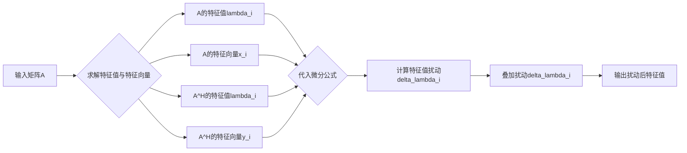

# 矩阵理论与应用：简单矩阵的特征值扰动

关键词：矩阵理论、特征值、扰动理论、数值计算、算法稳定性

## 1. 背景介绍
### 1.1  问题的由来
矩阵理论是数学和计算机科学中一个基础而重要的分支,在科学与工程领域有着广泛的应用。矩阵的特征值问题一直是矩阵理论研究的核心内容之一。然而,在实际应用中,由于数据的测量、舍入、截断等原因,输入矩阵往往会受到扰动的影响。这种扰动会导致矩阵特征值发生变化,进而影响到相关科学与工程问题的求解。因此,研究矩阵特征值对扰动的敏感性具有重要意义。

### 1.2  研究现状
关于矩阵特征值的扰动理论,数学家们做了大量卓有成效的工作。20世纪初,Weyl、Mirsky等学者率先研究了矩阵特征值的扰动界,取得了一系列重要结果。此后,Wilkinson、Kahan、Stewart等人将扰动理论引入到数值计算领域,极大地推动了扰动理论的发展。近年来,随着计算机性能的提升,矩阵特征值计算与扰动分析在信号处理、控制理论、量子力学等众多领域得到广泛应用,相关研究也日益深入。

### 1.3  研究意义  
深入研究矩阵特征值的扰动理论,对于理解矩阵计算的内在机理、改进算法的数值稳定性、拓展矩阵理论的应用范围都具有重要意义。本文将重点探讨简单矩阵特征值的扰动理论,系统阐述相关数学概念与计算方法,剖析算法的稳定性与适用性,并结合实际应用场景讨论其应用前景,以期为相关领域的研究人员和实践者提供参考。

### 1.4  本文结构
本文共分为九个部分。第一部分介绍研究背景及意义;第二部分概述矩阵特征值的基本概念;第三部分重点阐述简单矩阵特征值扰动的理论与算法;第四部分从数学角度对相关模型与公式进行推导与讲解;第五部分通过代码实例演示算法的具体实现;第六部分结合实际场景探讨其应用价值;第七部分推荐相关工具与资源;第八部分对全文进行总结并展望未来发展方向;第九部分以附录形式解答常见问题。

## 2. 核心概念与联系
在探讨简单矩阵特征值扰动之前,我们有必要回顾一些基本概念。对于一个$n$阶方阵$A$,如果存在数$\lambda$和非零向量$\boldsymbol{x}$使得:

$$
A\boldsymbol{x}=\lambda\boldsymbol{x}
$$

则称$\lambda$为矩阵$A$的一个特征值,$\boldsymbol{x}$为对应于特征值$\lambda$的特征向量。求解矩阵的特征值问题,本质上是一个线性代数方程组求解的过程。

若矩阵$A$的所有特征值互不相等,则称$A$为简单矩阵。简单矩阵具有良好的性质,其特征值和特征向量对矩阵元素的微小变化不敏感,数值计算较为稳定。因此,简单矩阵的特征值扰动理论在实际应用中备受关注。

对简单矩阵$A$施加扰动$\Delta A$,得到扰动后的矩阵$\widetilde{A}=A+\Delta A$。$\widetilde{A}$的特征值与$A$的特征值之间存在怎样的关系?扰动$\Delta A$会在多大程度上影响矩阵的特征值?这正是本文要重点探讨的问题。

## 3. 核心算法原理 & 具体操作步骤 
### 3.1  算法原理概述
简单矩阵特征值扰动的理论基础是矩阵微分方程。设$\lambda_i$和$\boldsymbol{x}_i$分别为矩阵$A$的第$i$个特征值和特征向量,则有:

$$
(A-\lambda_i I)\boldsymbol{x}_i=\boldsymbol{0}
$$

对上式两边求微分,经整理可得特征值扰动$\delta\lambda_i$与矩阵扰动$\delta A$之间满足如下关系:

$$
\delta\lambda_i=\frac{\boldsymbol{y}_i^H\delta A\boldsymbol{x}_i}{\boldsymbol{y}_i^H\boldsymbol{x}_i}
$$

其中$\boldsymbol{y}_i$为矩阵$A^H$关于$\overline{\lambda}_i$的特征向量,$H$表示共轭转置。上式给出了特征值扰动的一阶近似,为研究简单矩阵特征值对扰动的敏感性提供了理论依据。

### 3.2  算法步骤详解
基于矩阵微分方程,我们可以设计求解简单矩阵特征值扰动的算法。主要步骤如下:

1) 求解矩阵$A$的所有特征值$\lambda_i$及对应特征向量$\boldsymbol{x}_i$;
2) 求解矩阵$A^H$的所有特征值$\overline{\lambda}_i$及对应特征向量$\boldsymbol{y}_i$;
3) 根据扰动$\Delta A$,利用一阶微分公式计算特征值扰动量$\delta\lambda_i$;
4) 将扰动量$\delta\lambda_i$叠加到原特征值$\lambda_i$上,得到扰动后矩阵$\widetilde{A}$的特征值近似值。

### 3.3  算法优缺点
上述算法的主要优点在于:
- 数学原理简明,易于理解和实现;
- 计算过程稳定,对简单矩阵的特征值扰动估计精度较高;
- 为特征值的敏感性分析提供了有力工具。

但该算法也存在一些局限性:
- 仅适用于简单矩阵,对于重根特征值的情形尚难以处理;
- 只给出了特征值扰动的一阶近似,对于较大扰动,估计误差可能偏大;
- 算法涉及矩阵特征值和特征向量的求解,计算代价较高。

### 3.4  算法应用领域
简单矩阵特征值扰动算法在许多领域都有重要应用,例如:
- 结构动力学中的模态分析与损伤识别;
- 量子化学中的分子轨道能级计算;
- 信号处理中的子空间法谱估计;
- 控制理论中的系统辨识与鲁棒控制;
- 机器学习中的主成分分析与流形学习。

通过研究矩阵元素扰动对特征值的影响,可以深入理解算法的稳定性,改进计算精度,拓展应用范围。下面我们将从数学和编程的角度进一步探讨其原理与实现。

## 4. 数学模型和公式 & 详细讲解 & 举例说明
### 4.1  数学模型构建
为刻画简单矩阵特征值的扰动规律,我们引入如下数学模型。设$\lambda_1,\lambda_2,\cdots,\lambda_n$为$n$阶简单矩阵$A$的$n$个互异特征值,对应的特征向量为$\boldsymbol{x}_1,\boldsymbol{x}_2,\cdots,\boldsymbol{x}_n$,满足:

$$
\begin{cases}
A\boldsymbol{x}_1=\lambda_1 \boldsymbol{x}_1 \\
A\boldsymbol{x}_2=\lambda_2 \boldsymbol{x}_2 \\
\cdots \\
A\boldsymbol{x}_n=\lambda_n \boldsymbol{x}_n
\end{cases}
$$

同时,矩阵$A^H$关于$\overline{\lambda}_i$的特征向量$\boldsymbol{y}_i$满足:

$$
\begin{cases}
A^H\boldsymbol{y}_1=\overline{\lambda}_1 \boldsymbol{y}_1 \\
A^H\boldsymbol{y}_2=\overline{\lambda}_2 \boldsymbol{y}_2 \\
\cdots \\
A^H\boldsymbol{y}_n=\overline{\lambda}_n \boldsymbol{y}_n
\end{cases}
$$

假设矩阵$A$受到微小扰动$\Delta A$的影响,其特征值变为$\widetilde{\lambda}_i=\lambda_i+\delta\lambda_i$。我们的目标是求解特征值扰动量$\delta\lambda_i$,建立其与矩阵扰动$\Delta A$之间的定量关系。

### 4.2  公式推导过程
为求解特征值扰动量,我们对特征值方程进行微分运算。由于$\boldsymbol{x}_i$为$A$关于$\lambda_i$的特征向量,故有:

$$
(A-\lambda_i I)\boldsymbol{x}_i=\boldsymbol{0}
$$

对上式两端求微分,得:

$$
(\Delta A-\delta\lambda_i I)\boldsymbol{x}_i+(A-\lambda_i I)\delta\boldsymbol{x}_i=\boldsymbol{0}
$$

利用$\boldsymbol{y}_i^H(A-\lambda_i I)=\boldsymbol{0}$,上式两端同时左乘$\boldsymbol{y}_i^H$,可得:

$$
\boldsymbol{y}_i^H(\Delta A-\delta\lambda_i I)\boldsymbol{x}_i=0
$$

整理上式,即得特征值扰动量$\delta\lambda_i$的计算公式:

$$
\boxed{\delta\lambda_i=\frac{\boldsymbol{y}_i^H\Delta A\boldsymbol{x}_i}{\boldsymbol{y}_i^H\boldsymbol{x}_i}}
$$

需要注意的是,上式的推导基于特征向量$\boldsymbol{x}_i$和$\boldsymbol{y}_i$的双正交归一化条件,即$\boldsymbol{y}_i^H\boldsymbol{x}_j=\delta_{ij}$。因此,在应用该公式之前,需要对特征向量进行相应的正交化处理。

### 4.3  案例分析与讲解
下面我们通过一个具体的算例来说明简单矩阵特征值扰动的计算过程。考虑矩阵:

$$
A=\begin{bmatrix}
1 & 2 \\
3 & 4
\end{bmatrix}
$$

其特征值为$\lambda_1=-0.3723,\lambda_2=5.3723$,对应的特征向量为:

$$
\boldsymbol{x}_1=\begin{bmatrix}
-0.8246 \\ 0.5658
\end{bmatrix},
\boldsymbol{x}_2=\begin{bmatrix}
0.5658 \\ 0.8246
\end{bmatrix}
$$

矩阵$A^H$的特征向量为:

$$
\boldsymbol{y}_1=\begin{bmatrix}
-0.5658 \\ 0.8246  
\end{bmatrix},
\boldsymbol{y}_2=\begin{bmatrix}
0.8246 \\ 0.5658
\end{bmatrix}
$$

假设对矩阵$A$施加扰动:

$$
\Delta A=\begin{bmatrix}
0.01 & -0.02 \\
0.03 & 0.04
\end{bmatrix}
$$

则根据扰动公式,第一个特征值的扰动量为:

$$
\delta\lambda_1=\frac{\boldsymbol{y}_1^H\Delta A\boldsymbol{x}_1}{\boldsymbol{y}_1^H\boldsymbol{x}_1}=0.0165
$$

同理可得第二个特征值的扰动量为$\delta\lambda_2=0.0435$。因此,扰动后矩阵$\widetilde{A}$的特征值近似为:

$$
\widetilde{\lambda}_1=\lambda_1+\delta\lambda_1=-0.3558 \\
\widetilde{\lambda}_2=\lambda_2+\delta\lambda_2=5.4158
$$

利用MATLAB对扰