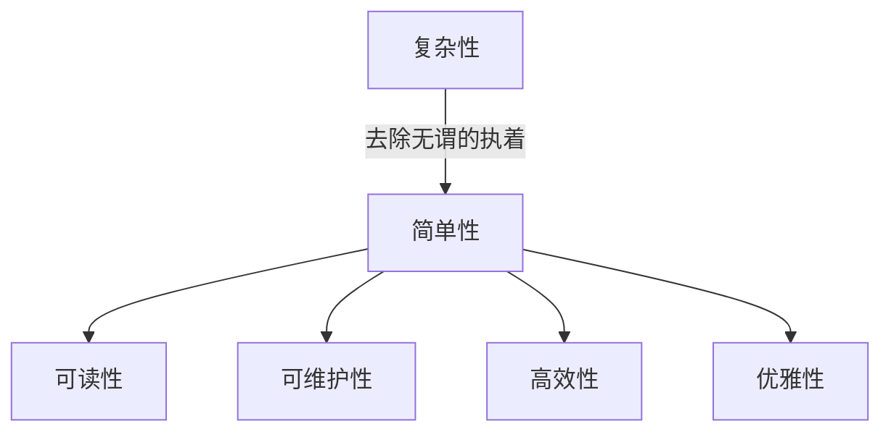
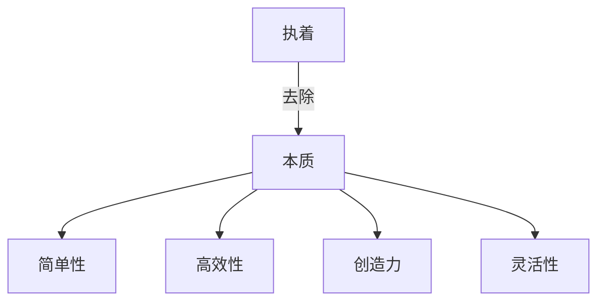
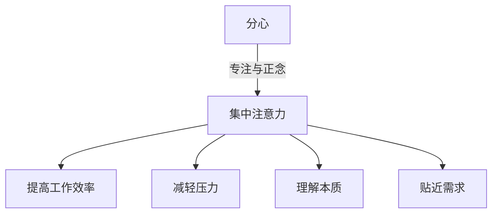
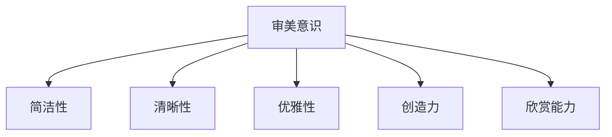

# 禅与计算机程序设计艺术

## 1. 背景介绍

### 1.1 问题的由来

在这个科技飞速发展的时代，计算机程序设计已经成为一门融合了艺术、科学和工程的综合学科。程序设计不仅需要扎实的理论基础和编码技能,更需要开发人员具备创造力、洞察力和审美意识。然而,很多程序员在日复一日的编码工作中,常常会陷入机械重复的状态,失去了对编程本质的思考和探索。

因此,如何在程序设计中注入艺术的元素,提高代码的可读性、可维护性和优雅性,成为了一个值得关注的话题。正如禅宗追求顿悟般,程序设计也需要开发人员时刻保持敏锐的洞察力和创新意识,以求在繁杂的代码中找到简单、高效和优雅的解决方案。

### 1.2 研究现状

近年来,一些知名的程序员和作家开始探索将禅宗思想与程序设计相结合的可能性。他们认为,禅宗强调内在本质、去除无谓的执着,与编写优雅、高效的代码有着内在的联系。一些著名的书籍和文章,如《编程的精髓》(The Pragmatic Programmer)、《代码大全》(Code Complete)等,都提出了类似的观点,倡导程序员应该追求代码的简洁性、可读性和可维护性。

然而,尽管有一些初步的探索,但将禅宗思想真正融入到程序设计实践中,仍然是一个充满挑战的领域。如何在繁杂的代码中找到简单的本质,如何培养程序员的审美意识和创造力,如何建立一种编程的心智模式,都需要进一步的研究和探索。

### 1.3 研究意义

将禅宗思想融入程序设计实践,不仅可以提高代码的质量和可维护性,更重要的是,它有助于培养程序员的创造力、洞察力和审美意识。通过学习禅宗的思维方式,程序员可以超越表面的代码,洞悉其中的本质,从而写出更加优雅、高效的代码。

此外,将禅宗思想应用于程序设计,也有助于缓解程序员的工作压力和精神疲劳。禅宗强调内心的宁静和专注,这对于程序员来说是至关重要的。通过练习冥想和其他禅修方式,程序员可以提高注意力集中,减轻工作压力,从而提高工作效率和创造力。

### 1.4 本文结构

本文将从多个角度探讨如何将禅宗思想融入程序设计实践。首先,我们将介绍一些核心概念,如简单性、去除无谓的执着等,并探讨它们与程序设计的联系。接下来,我们将深入探讨一些核心算法的原理和具体操作步骤,并讨论如何在编写这些算法时应用禅宗思想。

然后,我们将构建一些数学模型和公式,并详细讲解它们在程序设计中的应用,同时举例说明。接下来,我们将提供一些实际的代码示例,并对其进行详细的解释和分析,帮助读者更好地理解如何将禅宗思想应用于实际的编程实践中。

此外,我们还将探讨一些实际的应用场景,介绍相关的工具和资源,并对未来的发展趋势和挑战进行展望。最后,我们将总结本文的核心内容,并回答一些常见的问题。

## 2. 核心概念与联系

在探讨如何将禅宗思想融入程序设计实践之前,我们需要先了解一些核心概念,并探讨它们与程序设计的联系。

### 2.1 简单性

简单性是禅宗思想的核心理念之一。禅宗追求去除一切无谓的执着和复杂性,直指事物的本质。在程序设计中,简单性也是一个非常重要的原则。简单的代码不仅更容易理解和维护,而且通常也更加高效和优雅。

然而,简单性并不意味着简单粗暴。相反,它需要程序员具备深刻的洞察力和创造力,能够从繁杂的需求中抽象出简单的本质,并用最简洁的方式将其实现。正如禅宗大师所说:"简单不是初级,而是终极。"

为了追求简单性,程序员需要时刻保持对代码的反思和优化。我们应该尽量避免过度设计和不必要的复杂性,同时也要警惕简单粗暴的做法。只有通过不断的练习和思考,我们才能掌握简单性的真谛。



### 2.2 去除无谓的执着

禅宗强调去除一切无谓的执着,直指事物的本质。在程序设计中,这也是一个非常重要的原则。程序员常常会过度追求某些技术或框架,而忽视了实际问题的本质需求。

我们应该时刻保持开放的心态,不要过度依赖某一种技术或方法。相反,我们应该根据实际需求,选择最合适的解决方案。同时,我们也要警惕对某些编程范式或模式的执着,因为它们可能会限制我们的思维,阻碍我们找到更好的解决方案。

通过去除无谓的执着,我们可以更好地专注于问题的本质,从而写出更加简单、高效的代码。同时,这也有助于培养程序员的创造力和灵活性,使他们能够更好地应对不断变化的需求和技术环境。



### 2.3 专注与正念

禅宗强调专注于当下,保持正念。在程序设计中,这也是一个非常重要的原则。程序员常常会被各种干扰因素所分散注意力,如电子邮件、即时通讯等,这会严重影响他们的工作效率和代码质量。

通过练习正念冥想和其他禅修方式,程序员可以提高注意力集中,减轻工作压力,从而提高工作效率和创造力。同时,正念也有助于我们更好地理解代码的本质,避免被表面的细节所迷惑。

此外,专注与正念也能帮助我们更好地理解用户需求,从而写出更加贴近实际需求的代码。只有真正专注于当下,我们才能洞悉问题的本质,并找到最佳的解决方案。



### 2.4 审美意识

禅宗不仅强调简单性和去除无谓的执着,还强调审美意识。在程序设计中,审美意识同样至关重要。优雅的代码不仅更加简洁、高效,而且也更加易于理解和维护。

培养审美意识需要程序员具备一定的艺术修养和欣赏能力。我们应该时刻关注代码的结构、命名和注释,努力追求简洁、清晰和优雅。同时,我们也应该学会欣赏他人优秀的代码,从中汲取灵感和经验。

通过培养审美意识,我们可以写出更加优雅、高质量的代码,同时也能提高自己的创造力和审美水平。正如禅宗大师所说:"美是一种内在的品质,它来自于对事物本质的洞见。"



## 3. 核心算法原理与具体操作步骤

在探讨如何将禅宗思想应用于程序设计实践时,我们需要深入了解一些核心算法的原理和具体操作步骤。在这一部分,我们将以排序算法为例,探讨如何在编写这些算法时应用禅宗思想。

### 3.1 算法原理概述

排序算法是计算机科学中最基础和最重要的算法之一。它的目标是将一组无序的数据按照特定的顺序进行排列。排序算法有多种不同的实现方式,如冒泡排序、插入排序、快速排序等,每种算法都有自己的优缺点和适用场景。

在探讨具体的算法实现之前,我们需要先了解一些基本的排序概念和原理。例如,什么是稳定排序和不稳定排序?内部排序和外部排序有什么区别?时间复杂度和空间复杂度又是如何衡量算法的效率的?

通过掌握这些基本概念和原理,我们可以更好地理解不同排序算法的工作原理,并选择最适合特定场景的算法。同时,这也有助于我们在编写算法时应用禅宗思想,追求简单、高效和优雅的解决方案。

### 3.2 算法步骤详解

接下来,我们将以快速排序算法为例,详细讲解其具体的操作步骤。快速排序是一种基于分治思想的高效排序算法,它的平均时间复杂度为 O(n log n),是实际应用中最广泛使用的排序算法之一。

快速排序的基本思想是:首先选择一个基准元素,将待排序序列分成两个子序列,使得一个子序列中的元素都小于基准元素,另一个子序列中的元素都大于基准元素。然后,递归地对这两个子序列进行快速排序,直到整个序列有序为止。

具体的操作步骤如下:

1. 从待排序序列中选择一个基准元素,通常选择第一个或最后一个元素。
2. 将序列中小于基准元素的元素移动到基准元素的左边,大于基准元素的元素移动到基准元素的右边。
3. 对基准元素左边的子序列和右边的子序列递归执行步骤 1 和步骤 2,直到整个序列有序为止。

下面是快速排序算法的伪代码:

```
function quickSort(arr, left, right):
    if left < right:
        pivotIndex = partition(arr, left, right)
        quickSort(arr, left, pivotIndex - 1)
        quickSort(arr, pivotIndex + 1, right)

function partition(arr, left, right):
    pivot = arr[right]
    i = left - 1
    for j from left to right - 1:
        if arr[j] < pivot:
            i++
            swap(arr, i, j)
    swap(arr, i + 1, right)
    return i + 1
```

在编写这个算法时,我们可以应用禅宗思想,追求简单性和去除无谓的执着。例如,我们可以尝试优化代码的结构和命名,使其更加清晰和易于理解。同时,我们也可以探索一些更加优雅和高效的实现方式,如使用函数式编程或者并行计算等。

通过不断地反思和优化,我们可以写出更加简洁、高效和优雅的排序算法,同时也能培养自己的编程技巧和审美意识。

### 3.3 算法优缺点

每种算法都有自己的优缺点,快速排序算法也不例外。我们需要全面了解这些优缺点,才能更好地选择和应用这个算法。

优点:

1. **高效性**:快速排序的平均时间复杂度为 O(n log n),是一种高效的排序算法。
2. **原地排序**:快速排序是一种原地排序算法,不需要额外的存储空间,空间复杂度为 O(log n)。
3. **可扩展性**:快速排序可以很容易地并行化,从而提高排序效率。

缺点:

1. **不稳定性**:快速排序是一种不稳定的排序算法,相等的元素可能会被交换位置。
2. **递归调用**:快速排序使用递归调用,在处理大量数据时可能会导致栈溢出。
3. **最坏情况**