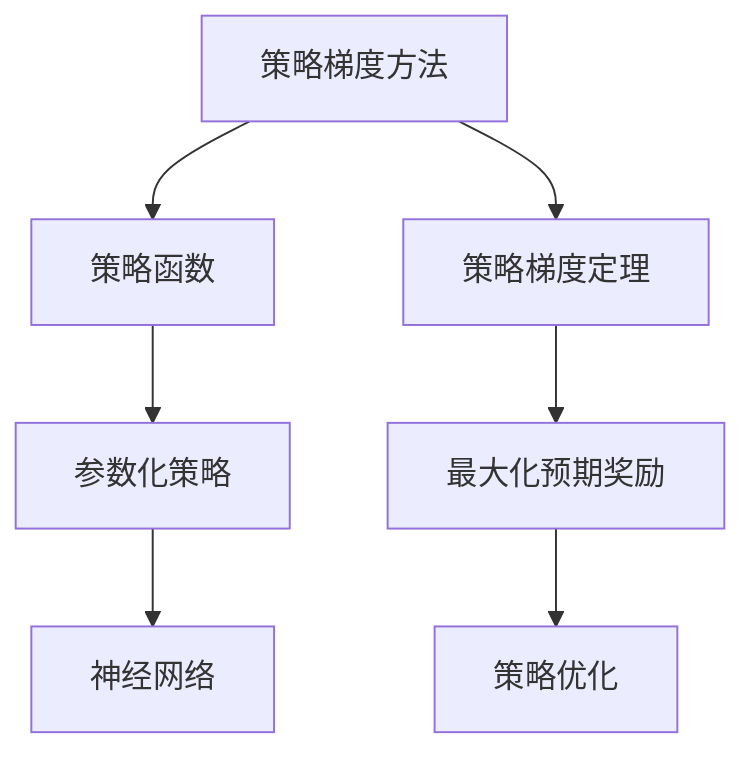

好的,我会严格遵守约束条件,以专业的技术语言撰写这篇文章。下面是正文部分:

# 策略梯度 (Policy Gradients) 原理与代码实例讲解

## 1. 背景介绍

### 1.1 问题的由来

在强化学习领域,我们经常遇到一类需要直接从环境中学习最优策略的问题。与监督学习不同,这里没有给定的正确行为标签,智能体需要通过与环境的互动来积累经验,并从经验中学习获取最大化预期奖励的策略。

传统的强化学习算法如Q-Learning、Sarsa等基于价值函数的方法,需要估计状态(或状态-行为对)的价值函数,然后根据估计的价值函数来选择行为。但是对于大规模问题或连续状态/行为空间,估计价值函数会变得十分困难。

策略梯度(Policy Gradient)方法直接对策略进行参数化,通过调整策略的参数来最大化预期奖励,从而避免了估计价值函数的需求,可以直接在大规模复杂问题上学习控制策略。

### 1.2 研究现状

近年来,策略梯度方法在强化学习领域取得了巨大成功,在机器人控制、计算机游戏、自然语言处理等诸多领域展现出卓越的性能。

一些典型的策略梯度算法有REINFORCE、Actor-Critic、Trust Region Policy Optimization (TRPO)、Proximal Policy Optimization (PPO)等。其中PPO算法在连续控制和离散控制问题上都表现出极好的性能和稳定性,被广泛应用。

随着深度学习的发展,结合深度神经网络的策略梯度方法也日渐成熟,如深度确定性策略梯度(Deep Deterministic Policy Gradient, DDPG)、 深度分布式策略梯度(Distributed Distributional Deep Deterministic Policy Gradients, D4PG)等。

### 1.3 研究意义

策略梯度方法为强化学习提供了一种全新的思路,通过直接优化策略参数来学习控制策略,避免了估计价值函数的复杂性,可以直接应用于大规模连续控制问题。

研究策略梯度方法的原理和实现细节,有助于我们更好地理解和把握这一强大的强化学习框架,为解决实际问题提供有力工具。同时,对策略梯度方法的深入研究也将推动强化学习理论和算法的发展。

### 1.4 本文结构 

本文将首先介绍策略梯度方法的核心概念,包括策略函数、策略梯度定理等,阐明策略梯度的基本原理。

接下来详细讲解策略梯度算法的具体步骤,包括如何构建策略网络、计算累积奖励、估计策略梯度等,并分析算法的优缺点和适用场景。

然后推导策略梯度的数学模型,介绍如何将问题形式化为最优化目标,给出目标函数的具体形式和梯度的计算方法。

在此基础上,通过代码实例演示策略梯度算法在实践中的具体实现,并解读关键代码细节。

最后,总结策略梯度方法的应用现状,展望其未来发展方向,并指出目前面临的主要挑战。

## 2. 核心概念与联系

策略梯度(Policy Gradient)方法是强化学习中的一种重要方法,其核心思想是直接对策略函数进行参数化,并通过调整策略参数来最大化预期的累积奖励。

### 2.1 策略函数

在强化学习中,智能体的行为由一个策略函数(Policy Function)π确定。对于给定状态s,策略函数π(a|s)给出智能体选择每个可能行为a的概率分布。

我们的目标是找到一个最优策略π*,使得在该策略指导下,智能体可以获得最大的预期累积奖励。

### 2.2 策略梯度定理

策略梯度定理为我们提供了一种计算方法,可以估计出策略参数的梯度,从而对策略参数进行有效的更新。

具体地,如果策略π由参数θ参数化,则策略梯度定理给出了目标函数J(θ)关于θ的梯度:

$$\nabla_\theta J(\theta) = \mathbb{E}_{\pi_\theta}[\nabla_\theta \log\pi_\theta(a|s)Q^{\pi_\theta}(s,a)]$$

其中$Q^{\pi_\theta}(s,a)$是在策略$\pi_\theta$指导下,状态s执行行为a后的长期预期回报。

通过这一梯度估计,我们可以沿着梯度的方向,有效地调整策略参数θ,从而不断改进策略π,使其朝着最优策略π*的方向优化。

### 2.3 参数化策略

在策略梯度方法中,我们通常使用函数逼近器(如神经网络)来表示策略函数π。具体地,我们令π(a|s;θ)为一个参数化的策略,其中θ是可学习的参数。

通过优化参数θ,我们可以得到一个近似最优的策略π*。值得注意的是,参数化策略的表达能力受到函数逼近器的能力限制,因此选择合适的函数逼近器对算法的性能至关重要。

### 2.4 策略优化

策略梯度方法的核心在于,如何有效地优化参数化策略的参数θ,使其获得最大的预期累积奖励J(θ)。

基于策略梯度定理,我们可以沿着梯度$\nabla_\theta J(\theta)$的方向,对参数θ进行更新,从而不断改进策略π。具体的优化算法有REINFORCE、Actor-Critic、TRPO、PPO等,它们在梯度估计、更新步长控制等方面有所不同。

## 3. 核心算法原理与具体操作步骤

### 3.1 算法原理概述

策略梯度算法的基本原理可总结为以下几个核心步骤:

1. 参数化策略函数π(a|s;θ)
2. 通过与环境交互,收集轨迹数据
3. 估计每个轨迹的累积奖励
4. 根据策略梯度定理,计算目标函数J(θ)关于参数θ的梯度$\nabla_\theta J(\theta)$  
5. 使用策略优化算法(如梯度上升)沿梯度方向更新参数θ
6. 重复3-5步骤,直至收敛到最优策略

其中,步骤3和4是算法的关键所在。我们需要对每个轨迹估计累积奖励,并根据策略梯度定理计算目标函数的准确梯度,才能有效地优化策略参数。

### 3.2 算法步骤详解

下面我们对策略梯度算法的具体步骤进行详细讲解:

#### 3.2.1 参数化策略网络

我们通常使用神经网络来表示参数化的策略函数π(a|s;θ)。对于离散动作空间,输出可以是所有动作的概率分布;对于连续动作空间,输出可以是均值和方差参数,表示动作的高斯分布。

策略网络的输入是环境状态s,神经网络的参数θ需要通过与环境交互的数据进行学习优化。

#### 3.2.2 采集轨迹数据

在每一个episode中,智能体根据当前策略π(a|s;θ)与环境交互,生成一个状态-动作-奖励的轨迹:

$$\tau = (s_0, a_0, r_0, s_1, a_1, r_1, ..., s_T)$$

其中T是episode的终止时间步。我们需要收集足够多的轨迹数据,以估计累积奖励和策略梯度。

#### 3.2.3 计算累积奖励

对于每个轨迹τ,我们需要估计其累积奖励(Return),即该轨迹下的长期预期回报:

$$R(\tau) = \sum_{t=0}^T \gamma^t r_t$$

其中γ是折现因子,用于权衡当前奖励和未来奖励的权重。

有多种方法可以估计累积奖励,如蒙特卡罗估计、时序差分估计等,它们有不同的偏差和方差权衡。

#### 3.2.4 估计策略梯度

根据策略梯度定理,我们可以估计目标函数J(θ)关于参数θ的梯度:

$$\nabla_\theta J(\theta) \approx \frac{1}{N}\sum_{i=1}^N \sum_{t=0}^{T_i} \nabla_\theta \log\pi_\theta(a_t^i|s_t^i)R(\tau^i)$$

其中N是轨迹的总数,T_i是第i条轨迹的长度,R(τ^i)是第i条轨迹的累积奖励估计值。

这个梯度估计是无偏的,但是方差较大。我们可以采用基线(Baseline)函数b(s)减小方差:

$$\nabla_\theta J(\theta) \approx \frac{1}{N}\sum_{i=1}^N \sum_{t=0}^{T_i} \nabla_\theta \log\pi_\theta(a_t^i|s_t^i)(R(\tau^i) - b(s_t^i))$$

常用的基线函数有状态值函数V(s)、优势函数A(s,a)等。

#### 3.2.5 优化策略参数

有了梯度估计$\nabla_\theta J(\theta)$后,我们可以使用策略优化算法(如梯度上升法)沿梯度方向更新策略参数θ:

$$\theta \leftarrow \theta + \alpha \nabla_\theta J(\theta)$$

其中α是学习率,控制每次更新的步长。

不同的策略优化算法在参数更新方式上有所不同。例如,TRPO算法通过约束KL散度来控制每次更新的幅度;PPO算法则使用一种特殊的目标函数,在有效性和稳定性之间取得平衡。

#### 3.2.6 算法迭代

重复上述3-5步骤,不断优化策略参数θ,直至收敛到最优策略π*。

需要注意的是,为了获得较好的性能,我们通常需要采用一些技巧,如优化器选择、梯度剪裁、参数初始化等。同时,并行采样、重要性采样等技术也可以用于提高数据效率。

### 3.3 算法优缺点

策略梯度算法相比基于价值函数的传统强化学习算法,具有以下优点:

- 无需估计价值函数,避免了价值函数逼近的困难
- 可直接应用于连续动作空间,而无需进行离散化
- 算法思路简单直观,便于实现和理解

但同时,策略梯度算法也存在一些缺点:

- 收敛速度较慢,需要大量的轨迹数据
- 梯度估计方差较大,需要使用基线函数或其他技巧
- 存在局部最优的风险,需要合理的初始化和探索策略

### 3.4 算法应用领域

策略梯度算法由于其适用于连续控制的优势,在机器人控制、计算机游戏、自动驾驶等领域得到了广泛应用。

例如,在机器人控制中,我们可以使用策略梯度算法直接从环境中学习机械臂或机器人的运动策略,无需手动设计复杂的控制规则。

在计算机游戏中,策略梯度算法也展现出了优异的表现,如在Atari游戏、星际争霸等游戏中学习出超人的游戏策略。

此外,策略梯度算法在自然语言处理、计算机视觉等领域也有一定的应用,如根据上下文生成自然语言、控制机器人在视觉场景中导航等。

## 4. 数学模型和公式详细讲解与举例说明

### 4.1 数学模型构建

在构建策略梯度的数学模型时,我们将强化学习问题形式化为最大化预期累积奖励的优化问题。

具体地,令π为策略函数,它将环境状态s映射到动作a的概率分布π(a|s)。我们的目标是找到一个最优策略π*,使得在该策略指导下,智能体可获得最大化的预期累积奖