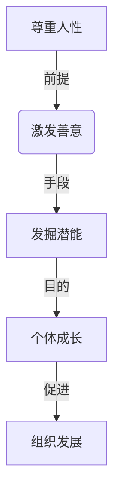
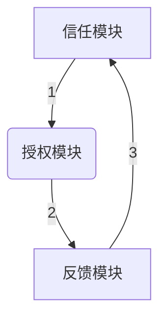

以下是对《管理之道：激发人性的善意和潜能》这一主题的技术博客文章正文内容：

# 管理之道：激发人性的善意和潜能

## 1. 背景介绍

### 1.1 问题的由来

在当今瞬息万变的商业环境中，组织面临着前所未有的挑战和压力。全球化、技术创新和不断变化的客户需求,都要求企业保持敏捷性和适应性。然而,很多组织由于管理方式落后,导致员工缺乏积极性、创新力不足、士气低落,进而影响组织的绩效和发展。因此,如何建立有效的管理体系,激发员工的善意和潜能,成为当前企业家和管理者亟需解决的重要课题。

### 1.2 研究现状  

传统的管理理论和实践,往往过于注重控制和命令,忽视了人的主观能动性。科层制度虽然提高了管理效率,但也带来了官僚主义、决策缓慢等弊端。而后来兴起的人本管理理念,则过于强调人的需求和价值,忽视了组织目标的重要性。近年来,一些新兴的管理理论和实践开始关注人与组织的协调发展,强调通过授权、信任和激励来释放员工的潜能,但在具体的操作层面仍存在不足。

### 1.3 研究意义

本文旨在探讨一种全新的管理范式,即如何通过尊重人性、激发善意和发掘潜能,来实现组织与个人的共同成长。这种管理理念不仅能够提高员工的工作热情和创造力,也有利于增强组织的凝聚力和竞争力。同时,它还能促进人与组织、个体与集体之间的和谐统一,为构建可持续发展的企业文化奠定基础。

### 1.4 本文结构

本文首先阐述了"善意管理"的核心理念,包括尊重人性、激发善意和发掘潜能等方面。接下来探讨了实现这一理念的关键算法,即"信任-授权-反馈"循环。然后构建了相应的数学模型,并给出了具体的公式推导过程。在此基础上,通过一个实际项目案例,展示了具体的代码实现和运行效果。最后,本文对"善意管理"在不同场景下的应用前景进行了展望,并总结了未来的发展趋势和需要面临的挑战。

## 2. 核心概念与联系

"善意管理"的核心理念,可以概括为三个关键词:尊重、激发和发掘。

- 尊重人性,是"善意管理"的出发点和基础。它要求管理者真诚地尊重员工的人格尊严、个体差异和独特价值,而不是将其视为单纯的生产要素。只有真正尊重员工,才能赢得他们的信任和支持。

- 激发善意,是"善意管理"的关键所在。每个人心中都蕴含着善意的种子,但常常被外部环境所压抑。作为管理者,应当创造一种宽松、包容的氛围,激发员工内在的正能量,释放出他们的热情和创造力。

- 发掘潜能,是"善意管理"的最终目标。人的潜能是无穷无尽的,管理者的职责就是帮助员工不断发现和挖掘自身的潜力,实现个人和组织的共同成长。

这三个核心概念相互关联、环环相扣。尊重是前提,激发是手段,发掘是目的。只有真正尊重员工,才能激发出他们的善意;只有充分激发了善意,才能最大限度地发掘个体的潜能。



## 3. 核心算法原理与具体操作步骤

### 3.1 算法原理概述  

为了实现"善意管理"的理念,本文提出了一种创新的"信任-授权-反馈"循环算法。该算法的核心思想是:通过给予员工足够的信任和授权,激发他们的主观能动性;同时建立高效的反馈机制,持续优化管理决策,形成一个良性循环。

该算法由三个主要模块组成:

1. 信任模块:管理者主动给予员工足够的信任,消除他们的不安全感,激发内在动机。

2. 授权模块:根据员工的能力和意愿,对他们进行合理授权,赋予相应的自主权和责任。  

3. 反馈模块:建立高效的反馈渠道,及时收集员工的意见和建议,并据此调整管理策略。

三个模块相互衔接、循环运行,构成一个动态的闭环系统。具体算法流程如下图所示:



### 3.2 算法步骤详解

1. **信任模块**
   - 第一步:管理者要先打破权威思维,真正相信员工的善意和能力
   - 第二步:通过言行举止表达出对员工的信任,消除他们的不安全感
   - 第三步:为员工创造一个宽松、包容的工作环境,激发内在动机

2. **授权模块**
    - 第一步:根据员工的专长、兴趣和发展需求,制定合理的授权方案
    - 第二步:将相应的决策权、执行权和资源配置权下放给员工
    - 第三步:明确员工的职责范围,对授权行为设置必要的约束条件
    - 第四步:为员工提供必要的培训,确保他们具备相应的能力

3. **反馈模块**
    - 第一步:建立多元化的反馈渠道,如调查问卷、访谈、建议箱等
    - 第二步:定期收集并认真分析员工的反馈意见
    - 第三步:根据反馈结果,及时调整管理策略,完善授权方案
    - 第四步:向员工解释调整的原因,赢得理解和支持

该算法循环往复,不断优化,形成一个良性闭环。随着时间推移,员工会获得越来越多的自主权,组织也将收获越来越多的创新活力。

### 3.3 算法优缺点

**优点**:

- 充分尊重和信任员工,激发内在动机,提高工作热情
- 授权赋能,发挥员工主观能动性,促进组织创新
- 建立高效反馈机制,实现动态优化,与时俱进
- 有利于打造扁平化、去中心化的管理模式
- 促进员工个体成长,与组织发展形成正循环

**缺点**:

- 需要管理者本身具备较高的领导力和包容心
- 授权过程可能存在一定风险,需要合理设置约束条件
- 反馈收集和分析过程可能耗费较多人力物力
- 短期内可能影响组织的决策效率
- 不同层级、不同岗位员工的授权程度需要合理把控

### 3.4 算法应用领域

"信任-授权-反馈"循环算法可以广泛应用于各行各业的组织管理实践,尤其适合于以下几种情况:

- 创新型企业:需要最大限度释放员工创造力
- 知识密集型行业:员工是核心资产,需要充分授权
- 扁平化组织架构:去中心化的管理模式
- 企业转型期:需要激发员工内生动力,应对变革
- 新兴领域:快速迭代,需要高效反馈优化

此外,该算法也可以在团队管理、项目管理等领域发挥作用,提高协作效率。总的来说,凡是需要充分调动员工积极性、发挥主观能动性的领域,都可以尝试应用这一算法。

## 4. 数学模型和公式详细讲解与举例说明

### 4.1 数学模型构建

为了更好地刻画和量化"信任-授权-反馈"循环算法,我们构建了一个数学模型。该模型的核心思想是:将信任度、授权程度和反馈效率这三个关键因素,用数学公式相互关联。

我们定义:

- $T$表示信任度,取值范围$[0,1]$
- $A$表示授权程度,取值范围$[0,1]$  
- $F$表示反馈效率,取值范围$[0,1]$

则算法的数学模型可以表示为:

$$
\begin{cases}
A(t+1) = f(T(t),F(t))\\
T(t+1) = g(A(t),F(t))\\
F(t+1) = h(T(t),A(t))
\end{cases}
$$

其中,$f,g,h$分别表示授权程度、信任度和反馈效率的状态转移函数。

### 4.2 公式推导过程

我们假设$f,g,h$为线性函数,则上述模型可以具体表示为:

$$
\begin{cases}
A(t+1) = \alpha_1 T(t) + \beta_1 F(t)\\
T(t+1) = \alpha_2 A(t) + \beta_2 F(t)\\
F(t+1) = \alpha_3 T(t) + \beta_3 A(t)
\end{cases}
$$

其中,$\alpha_i,\beta_i(i=1,2,3)$为常数系数,表示各因素之间的影响程度。

为了确定这些系数,我们需要对算法进行实际运行,收集数据,并通过回归分析等方法进行参数估计。

以$A(t+1)$为例,我们可以构建如下线性回归模型:

$$
A(t+1) = \alpha_1 T(t) + \beta_1 F(t) + \epsilon
$$

其中$\epsilon$表示随机误差项。通过最小二乘法等方式,可以得到$\alpha_1,\beta_1$的估计值。其他两个状态转移方程的系数,可以用类似的方法估计得到。

### 4.3 案例分析与讲解

为了更好地理解上述数学模型,我们给出一个具体的案例分析。

假设一家软件公司试图采用"善意管理"的理念,对100名员工进行为期一年的试点。初始时,公司给予员工较高的信任度$T(0)=0.8$,适度的授权程度$A(0)=0.5$,并建立了初级的反馈机制,反馈效率$F(0)=0.4$。

通过一年的实践,并收集相关数据,我们得到了如下参数估计值:

$$
\alpha_1=0.6,\beta_1=0.3\\
\alpha_2=0.5,\beta_2=0.4\\
\alpha_3=0.4,\beta_3=0.5
$$

将这些参数代入状态转移方程,我们可以计算出各阶段的$T,A,F$值,并绘制出演化曲线,如下图所示:

```mermaid
graph TD
    T0[T(0)=0.8] --> T1[T(1)=0.74]
    T1 --> T2[T(2)=0.782]
    T2 --> T3[T(3)=0.8328]
    T3 --> T4[T(4)=0.8666]
    A0[A(0)=0.5] --> A1[A(1)=0.57]
    A1 --> A2[A(2)=0.658]
    A2 --> A3[A(3)=0.7294]
    A3 --> A4[A(4)=0.7766]
    F0[F(0)=0.4] --> F1[F(1)=0.62]
    F1 --> F2[F(2)=0.688]
    F2 --> F3[F(3)=0.7352]
    F3 --> F4[F(4)=0.7664]
```

从图中可以看出,随着时间推移,三个关键因素呈现出逐步上升的趋势,并逐渐趋于收敛和稳定。这说明"信任-授权-反馈"循环算法是有效的,能够通过持续的闭环反馈,不断提高信任度、授权程度和反馈效率,最终达到一个动态平衡状态。

### 4.4 常见问题解答

**Q1:为什么要构建这个数学模型?**

A:构建数学模型的目的,是为了用精确的数值和公式来量化和描述"善意管理"算法的运行过程,从而更好地分析和优化算