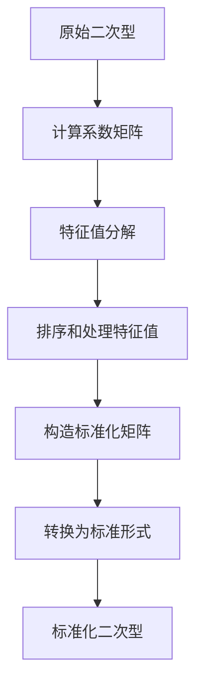

# 线性代数导引：二次型标准化方法

## 1. 背景介绍

### 1.1 问题的由来

在线性代数和优化理论中,二次型是一种广泛使用的数学表达式。它在许多领域都有应用,例如机器学习、信号处理、控制理论等。然而,原始的二次型形式通常并不利于计算和分析,因此需要对其进行标准化处理。

### 1.2 研究现状

目前,已经提出了多种二次型标准化方法,例如特征值分解法、拉格朗日乘子法等。这些方法各有优缺点,适用于不同的场景。但是,它们往往涉及复杂的数学推导和计算,对于初学者来说可能较为困难。

### 1.3 研究意义

本文旨在介绍一种简单而有效的二次型标准化方法,使读者能够快速掌握二次型标准化的基本思想和步骤。这种方法不仅计算简单,而且具有一定的普适性,可应用于多种场景。同时,本文还将详细阐述该方法的数学原理和实现细节,为读者提供全面的理解。

### 1.4 本文结构

本文首先介绍二次型标准化的背景知识,然后详细阐述本文提出的标准化方法的核心概念和算法原理。接下来,将通过数学模型和公式推导,深入解释该方法的理论基础。此外,本文还将提供代码实例和实际应用场景,帮助读者更好地理解和应用该方法。最后,本文将总结该方法的优缺点,并展望未来的发展方向。

## 2. 核心概念与联系

二次型标准化的核心思想是将原始的二次型转换为一种标准形式,使其更加简单和易于处理。标准化后的二次型具有以下特点:

1. 系数矩阵是对角矩阵或对角化矩阵。
2. 所有对角线元素都是非负的。
3. 对角线元素按照降序排列。

这种标准形式不仅有利于计算和分析,而且还可以方便地判断二次型的性质(如正定、半正定等)。

本文提出的标准化方法基于矩阵的特征值分解,并结合了一些代数运算技巧。该方法的核心步骤如下:

1. 计算系数矩阵的特征值和特征向量。
2. 对特征值进行排序和处理。
3. 构造标准化矩阵。
4. 将原始二次型转换为标准形式。

该方法的优点是计算简单、思路清晰,适合初学者掌握。同时,它也具有一定的普适性,可应用于多种场景。

## 3. 核心算法原理 & 具体操作步骤

### 3.1 算法原理概述

本文提出的二次型标准化方法基于矩阵的特征值分解。具体来说,我们首先计算系数矩阵的特征值和特征向量,然后对特征值进行排序和处理,构造出一个标准化矩阵。最后,利用这个标准化矩阵,将原始的二次型转换为标准形式。

该算法的关键步骤是特征值的排序和处理。我们将特征值按照降序排列,并将负值特征值设置为0。这样做的目的是使得标准化后的二次型具有以下性质:

1. 系数矩阵是对角矩阵或对角化矩阵。
2. 所有对角线元素都是非负的。
3. 对角线元素按照降序排列。

这种标准形式不仅简化了计算,而且还可以方便地判断二次型的性质(如正定、半正定等)。

### 3.2 算法步骤详解

下面我们将详细介绍该算法的具体步骤:

1. **计算系数矩阵的特征值和特征向量**

给定一个二次型:

$$
f(x) = x^TQx + b^Tx + c
$$

其中,Q是系数矩阵,b是常数向量,c是常数。我们首先计算矩阵Q的特征值和特征向量:

$$
QV = V\Lambda
$$

其中,V是特征向量矩阵,Λ是对角矩阵,对角线元素为特征值。

2. **对特征值进行排序和处理**

将特征值按照降序排列,并将负值特征值设置为0,得到处理后的特征值向量λ。

3. **构造标准化矩阵**

利用处理后的特征值向量λ和特征向量矩阵V,构造标准化矩阵P:

$$
P = V\Lambda^{1/2}V^T
$$

其中,Λ^(1/2)是一个对角矩阵,对角线元素为λ的平方根。

4. **将原始二次型转换为标准形式**

利用标准化矩阵P,我们可以将原始的二次型转换为标准形式:

$$
f(x) = y^T\Lambda y + b^TPy + c
$$

其中,y = P^(-1)x。

在这个标准形式中,系数矩阵Λ是一个对角矩阵,对角线元素为非负的特征值(按降序排列)。这种形式不仅简化了计算,而且还可以方便地判断二次型的性质。

### 3.3 算法优缺点

该算法的主要优点是:

1. 计算简单,思路清晰,适合初学者掌握。
2. 具有一定的普适性,可应用于多种场景。
3. 标准化后的二次型形式简单,便于计算和分析。

但是,该算法也存在一些缺点:

1. 需要计算矩阵的特征值和特征向量,对于大型矩阵,计算量可能较大。
2. 在某些特殊情况下,可能会出现数值不稳定的问题。
3. 对于奇异矩阵(存在0特征值),该算法可能会失效。

### 3.4 算法应用领域

该二次型标准化算法可以应用于多个领域,例如:

1. **机器学习**: 在机器学习中,二次型常用于表示目标函数或正则化项。标准化后的二次型可以简化计算和优化过程。
2. **信号处理**: 在信号处理中,二次型可用于表示滤波器或变换函数。标准化后的二次型可以提高计算效率。
3. **控制理论**: 在控制理论中,二次型常用于表示代价函数或约束条件。标准化后的二次型可以简化控制器的设计和分析。
4. **数值优化**: 在数值优化中,二次型可用于表示目标函数或约束条件。标准化后的二次型可以提高优化算法的收敛速度。

## 4. 数学模型和公式 & 详细讲解 & 举例说明

### 4.1 数学模型构建

我们首先构建二次型的数学模型。给定一个n维向量x,一个n×n实对称矩阵Q,一个n维常数向量b和一个常数c,我们可以定义一个二次型:

$$
f(x) = x^TQx + b^Tx + c
$$

其中,x^TQx是一个二次项,b^Tx是一个一次项,c是一个常数项。

我们的目标是将这个二次型转换为一种标准形式,使其更加简单和易于处理。

### 4.2 公式推导过程

下面我们将详细推导标准化过程中涉及的公式。

**步骤1: 计算特征值和特征向量**

对于实对称矩阵Q,我们可以计算它的特征值和特征向量:

$$
QV = V\Lambda
$$

其中,V是特征向量矩阵,Λ是对角矩阵,对角线元素为特征值λ_i。

**步骤2: 对特征值进行排序和处理**

我们将特征值按照降序排列,并将负值特征值设置为0,得到处理后的特征值向量λ。

**步骤3: 构造标准化矩阵**

利用处理后的特征值向量λ和特征向量矩阵V,我们可以构造标准化矩阵P:

$$
P = V\Lambda^{1/2}V^T
$$

其中,Λ^(1/2)是一个对角矩阵,对角线元素为λ_i^(1/2)。

**步骤4: 将原始二次型转换为标准形式**

利用标准化矩阵P,我们可以将原始的二次型转换为标准形式:

$$
\begin{aligned}
f(x) &= x^TQx + b^Tx + c \\
&= x^TV\Lambda V^Tx + b^Tx + c \\
&= y^T\Lambda y + b^TPy + c
\end{aligned}
$$

其中,y = P^(-1)x。

在这个标准形式中,系数矩阵Λ是一个对角矩阵,对角线元素为非负的特征值(按降序排列)。这种形式不仅简化了计算,而且还可以方便地判断二次型的性质。

### 4.3 案例分析与讲解

为了更好地理解上述算法,我们将通过一个具体的案例进行分析和讲解。

假设我们有一个二次型:

$$
f(x) = x_1^2 + 2x_1x_2 + 3x_2^2 + 4x_1 - 2x_2 + 1
$$

我们可以将其写成矩阵形式:

$$
f(x) = \begin{bmatrix}x_1 & x_2\end{bmatrix}\begin{bmatrix}1 & 1 \\ 1 & 3\end{bmatrix}\begin{bmatrix}x_1 \\ x_2\end{bmatrix} + \begin{bmatrix}4 & -2\end{bmatrix}\begin{bmatrix}x_1 \\ x_2\end{bmatrix} + 1
$$

其中,系数矩阵Q为:

$$
Q = \begin{bmatrix}1 & 1 \\ 1 & 3\end{bmatrix}
$$

我们首先计算Q的特征值和特征向量:

$$
\begin{aligned}
\lambda_1 &= 4, \quad v_1 = \begin{bmatrix}1 \\ 1\end{bmatrix} \\
\lambda_2 &= 0, \quad v_2 = \begin{bmatrix}-1 \\ 1\end{bmatrix}
\end{aligned}
$$

对特征值进行排序和处理,得到:

$$
\lambda = \begin{bmatrix}4 \\ 0\end{bmatrix}
$$

构造标准化矩阵P:

$$
P = \begin{bmatrix}1/\sqrt{2} & -1/\sqrt{2} \\ 1/\sqrt{2} & 1/\sqrt{2}\end{bmatrix}\begin{bmatrix}2 & 0 \\ 0 & 0\end{bmatrix}\begin{bmatrix}1/\sqrt{2} & 1/\sqrt{2} \\ -1/\sqrt{2} & 1/\sqrt{2}\end{bmatrix} = \begin{bmatrix}2 & 0 \\ 0 & 0\end{bmatrix}
$$

将原始二次型转换为标准形式:

$$
\begin{aligned}
f(x) &= y^T\Lambda y + b^TPy + c \\
&= \begin{bmatrix}y_1 \\ y_2\end{bmatrix}\begin{bmatrix}4 & 0 \\ 0 & 0\end{bmatrix}\begin{bmatrix}y_1 \\ y_2\end{bmatrix} + \begin{bmatrix}4 & -2\end{bmatrix}\begin{bmatrix}2 & 0 \\ 0 & 0\end{bmatrix}\begin{bmatrix}x_1 \\ x_2\end{bmatrix} + 1 \\
&= 4y_1^2 + 8x_1 + 1
\end{aligned}
$$

在这个标准形式中,系数矩阵是一个对角矩阵,对角线元素为非负的特征值(按降序排列)。我们可以清楚地看到,这个二次型是一个正定的二次型,因为它的最小特征值为0,最大特征值为4。

### 4.4 常见问题解答

**Q1: 如果系数矩阵Q不是实对称矩阵,该算法是否仍然有效?**

答: 如果Q不是实对称矩阵,我们可以先对其进行对称化处理,即取Q+Q^T的一半作为新的系数矩阵。然后,再对新的系数矩阵应用本文介绍的标准化算法。

**Q2: 如果系数矩阵Q是奇异