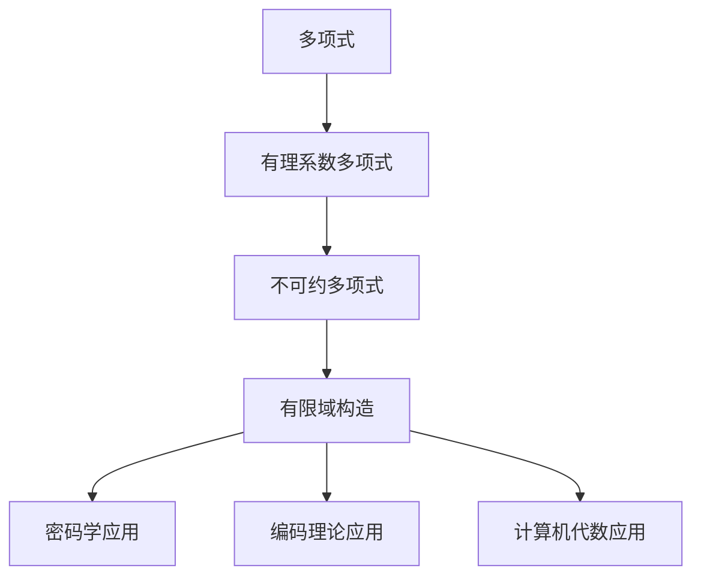

# 线性代数导引：有理系数不可约多项式

## 1. 背景介绍

### 1.1 问题的由来

在数学和计算机科学领域中,多项式的研究一直是一个重要的课题。多项式不仅在代数和数论等纯粹数学领域有着广泛的应用,同时也在计算机科学的诸多领域扮演着关键角色,例如密码学、编码理论、计算机代数等。其中,有理系数不可约多项式是一类特殊的多项式,具有独特的性质和重要的应用价值。

有理系数多项式是指其系数都是有理数的多项式。不可约多项式是指在有理数域上不能被分解为两个次数较低的有理系数多项式的乘积的多项式。这类多项式在构造有限域、设计错误检测和纠正码以及密码学等领域有着广泛的应用。

然而,有理系数不可约多项式的研究并非一蹴而就。它涉及了多项式的理论基础、计算复杂性分析、有限域构造等多个方面的内容。对于这一课题的深入探讨,不仅可以拓展我们对多项式理论的认识,也有助于推动相关应用领域的发展。

### 1.2 研究现状

有理系数不可约多项式的研究可以追溯到19世纪,当时数学家们对有限域的构造产生了浓厚的兴趣。随后,20世纪初,密码学家开始将有理系数不可约多项式应用于密码系统的设计。到了20世纪后期,错误检测和纠正码的发展进一步推动了这一领域的研究。

目前,有理系数不可约多项式的研究主要集中在以下几个方面:

1. **有限域构造**: 利用有理系数不可约多项式可以构造出特定阶数的有限域,这在密码学和编码理论中有着重要的应用。
2. **不可约性判定**: 判定一个给定的有理系数多项式是否为不可约多项式,是这一领域的核心问题之一。目前已有多种判定算法,但在高阶情况下,计算复杂度仍然很高。
3. **不可约多项式生成**: 针对特定的需求,生成具有特殊性质的有理系数不可约多项式,是一个重要的研究课题。
4. **计算复杂性分析**: 对于不可约性判定和不可约多项式生成等问题,分析其计算复杂性,并设计高效算法,是该领域的一个持续的挑战。

虽然有理系数不可约多项式的研究已取得了一定的进展,但仍存在一些亟待解决的问题和挑战,例如高阶情况下的计算效率、特殊性质的不可约多项式生成等,这将推动该领域的进一步发展。

### 1.3 研究意义

有理系数不可约多项式的研究不仅具有重要的理论价值,同时也有广泛的应用前景:

1. **密码学应用**: 在密码系统的设计中,有理系数不可约多项式可用于构造有限域,从而实现高强度的加密和解密操作。
2. **编码理论应用**: 有理系数不可约多项式在构造BCH码、Reed-Solomon码等重要的错误检测和纠正码中扮演着关键角色。
3. **计算机代数应用**: 有理系数不可约多项式在计算机代数系统的多项式因式分解、有限域运算等模块中有着广泛的应用。
4. **理论基础拓展**: 对有理系数不可约多项式的深入研究,有助于拓展多项式理论、有限域理论等数学基础理论的内涵。

可以预见,随着信息安全、通信技术和计算机代数系统等领域的不断发展,有理系数不可约多项式的应用前景将越来越广阔。因此,对这一课题的深入探讨,不仅具有重要的理论意义,也将为相关应用领域的发展做出重要贡献。

### 1.4 本文结构

本文将全面系统地介绍有理系数不可约多项式的相关理论和应用。文章的主要结构如下:

1. 背景介绍部分阐述了问题的由来、研究现状和研究意义,为读者建立起初步的认知基础。
2. 核心概念与联系部分将介绍有理系数不可约多项式的基本定义、性质,并与其他相关概念建立联系。
3. 核心算法原理与具体操作步骤部分将详细阐述不可约性判定、不可约多项式生成等核心算法的原理和具体实现步骤。
4. 数学模型和公式部分将构建有理系数不可约多项式的数学模型,并推导和讲解相关公式。
5. 项目实践部分将给出代码实例,并对代码进行详细的解释和分析。
6. 实际应用场景部分将介绍有理系数不可约多项式在密码学、编码理论和计算机代数等领域的具体应用。
7. 工具和资源推荐部分将为读者提供相关的学习资源、开发工具和论文推荐。
8. 总结部分将对本文的主要内容进行总结,并展望该领域的未来发展趋势和面临的挑战。
9. 附录部分将解答一些常见的问题,为读者提供进一步的帮助。

通过全面系统的介绍,读者将能够对有理系数不可约多项式的理论基础和应用实践有一个深入的理解,为相关领域的学习和研究打下坚实的基础。

## 2. 核心概念与联系

在深入探讨有理系数不可约多项式的理论和算法之前,我们需要先介绍一些核心概念,并将它们与其他相关概念建立联系,为后续内容的学习打下基础。

### 2.1 多项式和有理系数多项式

**多项式**是指由一个或多个项组成的代数式,其中每一项都是未知数的幂与系数的乘积。形式上,一个 $n$ 次多项式可以表示为:

$$
f(x) = a_nx^n + a_{n-1}x^{n-1} + \cdots + a_1x + a_0
$$

其中,$ a_n, a_{n-1}, \cdots, a_1, a_0 $ 是系数,$ x $ 是未知数。

**有理系数多项式**是指其系数都是有理数的多项式。有理数是指可以表示为两个整数的比值的数。形式上,一个有理系数 $n$ 次多项式可以表示为:

$$
f(x) = \frac{b_n}{c_n}x^n + \frac{b_{n-1}}{c_{n-1}}x^{n-1} + \cdots + \frac{b_1}{c_1}x + \frac{b_0}{c_0}
$$

其中,$ b_n, b_{n-1}, \cdots, b_1, b_0 $ 和 $ c_n, c_{n-1}, \cdots, c_1, c_0 $ 都是整数,且 $ c_n, c_{n-1}, \cdots, c_1, c_0 \neq 0 $。

有理系数多项式是一类特殊的多项式,它们在数学和计算机科学领域有着广泛的应用。例如,在密码学中,有理系数多项式可用于构造有限域;在编码理论中,它们在构造BCH码和Reed-Solomon码等重要的错误检测和纠正码中扮演着关键角色。

### 2.2 不可约多项式

**不可约多项式**是指在某一数域上不能被分解为两个次数较低的多项式的乘积的多项式。形式上,如果一个多项式 $f(x)$ 在数域 $F$ 上不存在两个次数较低的多项式 $g(x)$ 和 $h(x)$,使得 $f(x) = g(x)h(x)$,则称 $f(x)$ 在数域 $F$ 上是不可约的。

不可约多项式在数论和代数等纯粹数学领域有着重要的应用,同时也在密码学、编码理论和计算机代数等计算机科学领域扮演着关键角色。例如,在有限域的构造中,通常利用有理系数不可约多项式作为模多项式来生成有限域。

### 2.3 有限域

**有限域**是指具有有限个元素的代数系统,它不仅满足加法和乘法运算,而且还满足其他一些代数运算的封闭性。有限域在密码学、编码理论和计算机代数等领域有着广泛的应用。

构造有限域的一种常用方法是利用有理系数不可约多项式作为模多项式。具体来说,对于一个 $n$ 次有理系数不可约多项式 $f(x)$,我们可以在有理数域 $\mathbb{Q}$ 上构造一个剩余类环 $\mathbb{Q}[x]/(f(x))$,这个剩余类环就是一个 $n$ 次有限域,记作 $\operatorname{GF}(p^n)$,其中 $p$ 是 $f(x)$ 的首项系数。

有限域在密码学中被广泛应用于设计高强度的加密和解密算法;在编码理论中,它们是构造BCH码、Reed-Solomon码等重要错误检测和纠正码的基础;在计算机代数系统中,有限域上的运算是多项式因式分解、有限域运算等模块的核心。

### 2.4 概念之间的联系

有理系数不可约多项式、有限域和其他相关概念之间存在着密切的联系,如下图所示:

1. 有理系数多项式是多项式的一个特殊类型。
2. 有理系数不可约多项式是有理系数多项式的一个重要子集,具有不可约性质。
3. 利用有理系数不可约多项式作为模多项式,可以构造出有限域。
4. 有限域在密码学、编码理论和计算机代数等领域有着广泛的应用。

因此,有理系数不可约多项式是联系这些概念的纽带,对它的深入研究不仅有助于拓展多项式理论的内涵,也将为相关应用领域的发展做出重要贡献。

## 3. 核心算法原理与具体操作步骤

有理系数不可约多项式的研究涉及多个核心算法,包括不可约性判定算法和不可约多项式生成算法等。这些算法的原理和具体实现步骤是本领域研究的重点内容。

### 3.1 算法原理概述

#### 3.1.1 不可约性判定算法原理

不可约性判定算法的目标是判断一个给定的有理系数多项式在有理数域 $\mathbb{Q}$ 上是否为不可约的。这个问题的复杂性取决于多项式的次数和系数的大小。

一种常用的不可约性判定算法是基于Eisenstein判别法则的算法。Eisenstein判别法则给出了一个充分条件,用于判断一个整系数多项式在有理数域上是否不可约。对于一个有理系数多项式,我们可以先将它化为同次的整系数多项式,然后应用Eisenstein判别法则进行判定。

另一种常用的算法是基于有限域的算法。该算法的基本思路是:首先构造一个适当的有限域,然后在该有限域上对多项式进行因式分解,如果分解的结果是不可约的,那么原多项式在有理数域上也是不可约的。这种算法的优点是可以处理高阶多项式,但缺点是计算复杂度较高。

除了上述两种算法,还有一些其他的算法,如基于格的算法、基于p-adic方法的算法等,它们各有优缺点,适用于不同的场景。

#### 3.1.2 不可约多项式生成算法原理

不可约多项式生成算法的目标是生成具有特定性质的有理系数不可约多项式,例如生成一个给定次数的不可约多项式,或者生成一个具有特定系数范围的不可约多项式等。

一种常用的生成算法是基于随机构造的算法。该算法的基本思路是:首先随机构造一个候选多项式,然后使用不可约性判定算法判断它是否不可约,如果不可约则输出,否则重新随机构造。为了提高效率,通常会加入一些