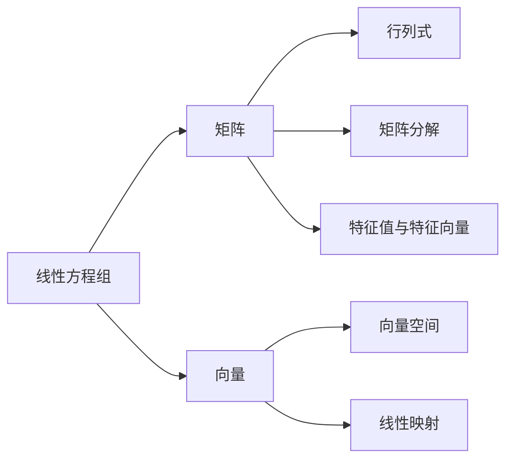

# 线性代数导引：线性方程组

作者：禅与计算机程序设计艺术 / Zen and the Art of Computer Programming

## 1. 背景介绍
### 1.1 问题的由来
线性代数是数学的一个重要分支,它研究线性方程组、向量空间、线性映射等内容。作为现代数学的基石之一,线性代数在科学、工程、经济等诸多领域有着广泛的应用。而线性方程组则是线性代数中最基本也是最重要的概念之一。

线性方程组问题最早可以追溯到古代。早在公元前1700年,古巴比伦人就已经开始研究一些简单的线性方程组问题。我国古代的《九章算术》中也有类似的问题。18世纪,欧拉和克莱姆等数学家开始系统地研究线性方程组的求解方法。19世纪,高斯、柯西等人进一步发展了线性代数理论。

### 1.2 研究现状
目前,线性方程组的研究已经相当成熟。人们发明了许多求解线性方程组的方法,如高斯消元法、克莱姆法则、矩阵分解法等。同时,线性方程组在计算机科学、信号处理、控制论、经济学等领域也有着广泛的应用。

近年来,随着大数据时代的到来,超大规模线性方程组的快速求解成为一个研究热点。人们发明了许多并行算法来加速求解过程。此外,基于随机梯度下降等优化方法的迭代算法也受到广泛关注。这些算法可以在损失一定精度的情况下大大加快求解速度。

### 1.3 研究意义
线性方程组的研究对于理论数学和应用数学都有重要意义。

从理论上讲,线性方程组是线性代数的基础。许多线性代数的概念和理论,如矩阵、行列式、向量空间等都是在研究线性方程组的过程中发展起来的。深入理解线性方程组,有助于我们更好地把握线性代数的本质。

从应用上讲,线性方程组在工程和科学计算中有着极其重要的地位。求解线性方程组是有限元分析、流体力学模拟等领域的核心问题。快速稳定的线性方程组求解算法,是大规模工程计算的基础。因此,线性方程组的研究对于工程应用具有重要价值。

### 1.4 本文结构
本文将从以下几个方面介绍线性方程组的相关知识:

- 第2节介绍线性方程组的基本概念。
- 第3节讨论几种经典的线性方程组求解算法。 
- 第4节介绍线性方程组的几何意义,并给出一些数学模型。
- 第5节通过具体的代码实例,演示如何编程求解线性方程组。
- 第6节总结线性方程组在科学和工程中的一些典型应用。
- 第7节推荐一些学习线性方程组的资源。
- 第8节总结全文,并对线性方程组的研究前景进行展望。

## 2. 核心概念与联系
线性方程组是由多个线性方程构成的方程组。其一般形式为:

$$
\begin{cases}
a_{11}x_1+a_{12}x_2+\cdots+a_{1n}x_n=b_1 \\
a_{21}x_1+a_{22}x_2+\cdots+a_{2n}x_n=b_2 \\
\cdots \\  
a_{m1}x_1+a_{m2}x_2+\cdots+a_{mn}x_n=b_m
\end{cases}
$$

其中$a_{ij},b_i$是已知数,称为方程组的系数;$x_1,x_2,\cdots,x_n$是未知数。如果$b_1=b_2=\cdots=b_m=0$,则称为齐次线性方程组,否则称为非齐次线性方程组。

线性方程组与矩阵密切相关。上述方程组可以写成矩阵形式:

$$
\mathbf{A}\mathbf{x}=\mathbf{b}
$$

其中

$$
\mathbf{A}=
\begin{pmatrix} 
a_{11} & a_{12} & \cdots & a_{1n} \\
a_{21} & a_{22} & \cdots & a_{2n} \\
\vdots & \vdots & \ddots & \vdots \\
a_{m1} & a_{m2} & \cdots & a_{mn} 
\end{pmatrix}
$$

称为系数矩阵,

$$
\mathbf{x}=
\begin{pmatrix}
x_1 \\ x_2 \\ \vdots \\ x_n
\end{pmatrix},
\quad
\mathbf{b}=
\begin{pmatrix}
b_1 \\ b_2 \\ \vdots \\ b_m  
\end{pmatrix}
$$

分别称为未知量向量和常数向量。

线性方程组的解与系数矩阵的性质密切相关。根据$\mathbf{A}$的行列式$|\mathbf{A}|$是否等于零,可以判断方程组的解的情况:
- 若$|\mathbf{A}|\neq0$,则方程组有唯一解。
- 若$|\mathbf{A}|=0$:
  - 若$\mathbf{b}=\mathbf{0}$,则方程组有无穷多解。
  - 若$\mathbf{b}\neq\mathbf{0}$,则方程组无解。

线性方程组的概念在线性代数中占据核心地位。它与矩阵、向量、线性映射、特征值等概念紧密相连。下图给出了这些概念之间的联系:

## 3. 核心算法原理 & 具体操作步骤
### 3.1 算法原理概述
求解线性方程组是线性代数的核心问题之一。根据方程组的类型和求解目的,人们发明了多种算法。下面介绍几种常见算法的基本原理。

**高斯消元法**是求解线性方程组的经典算法。其基本思想是通过初等行变换,将方程组的增广矩阵化为行阶梯形矩阵,然后通过回代求解。高斯消元法包含了线性代数的许多重要思想,如矩阵等价、主元素、自由未知量等。

**LU分解法**基于矩阵分解的思想。它将系数矩阵$\mathbf{A}$分解为一个下三角矩阵$\mathbf{L}$和一个上三角矩阵$\mathbf{U}$的乘积,然后通过求解两个三角方程组得到原方程组的解。LU分解法是高斯消元法的一种改进,它减少了运算量,提高了数值稳定性。

**雅可比迭代法**和**高斯-赛德尔迭代法**是两种重要的迭代算法。它们通过不断迭代逼近的方式求解方程组。与直接法相比,迭代法的优点是计算量小,适合求解大型稀疏方程组。但迭代法的收敛性依赖于方程组的性质,且难以准确控制误差。

**共轭梯度法**是求解对称正定矩阵方程组的重要算法。它利用了方程组的一些特殊性质,通过迭代构造一组共轭向量,使得迭代过程具有良好的收敛性。共轭梯度法的优点是计算量小,适合求解大型稀疏方程组。

### 3.2 算法步骤详解
以下详细介绍高斯消元法的步骤。设线性方程组为:

$$
\begin{cases}
a_{11}x_1+a_{12}x_2+\cdots+a_{1n}x_n=b_1 \\
a_{21}x_1+a_{22}x_2+\cdots+a_{2n}x_n=b_2 \\
\cdots \\  
a_{m1}x_1+a_{m2}x_2+\cdots+a_{mn}x_n=b_m
\end{cases}
$$

高斯消元法分为两个步骤:正向消元和回代求解。

**正向消元**:
1. 构造增广矩阵:
$$
\mathbf{A}=
\left(
\begin{array}{cccc|c}  
a_{11} & a_{12} & \cdots & a_{1n} & b_1 \\
a_{21} & a_{22} & \cdots & a_{2n} & b_2 \\
\vdots & \vdots & \ddots & \vdots & \vdots \\
a_{m1} & a_{m2} & \cdots & a_{mn} & b_m
\end{array}
\right)
$$

2. 对增广矩阵进行初等行变换,将其化为行阶梯形矩阵:
   - 选取主元素$a_{11}$,若$a_{11}=0$,则与下面的行交换。
   - 将第一行的$a_{11}$所在列下面的元素全部消为零。
   - 对剩下的$m-1$行构成的矩阵重复上述过程。
   
经过正向消元,增广矩阵变为:
$$
\mathbf{A}=
\left(
\begin{array}{cccc|c}  
c_{11} & c_{12} & \cdots & c_{1n} & d_1 \\
0 & c_{22} & \cdots & c_{2n} & d_2 \\
\vdots & \vdots & \ddots & \vdots & \vdots \\
0 & 0 & \cdots & c_{nn} & d_n
\end{array}
\right)
$$

**回代求解**:
1. 若$c_{nn}=0$:
   - 若$d_n\neq0$,则方程组无解。
   - 若$d_n=0$,则$x_n$为自由未知量,令$x_n=t$。
2. 若$c_{nn}\neq0$,则$x_n=d_n/c_{nn}$。
3. 将$x_n$的值代入倒数第二个方程,求出$x_{n-1}$。
4. 依次向上回代,求出所有未知量的值。

### 3.3 算法优缺点
高斯消元法的主要优点是:
- 计算过程简单直观,容易实现。
- 能够判断方程组的解的情况。
- 求解过程中可以同时求逆矩阵。

高斯消元法的缺点包括:
- 计算量大,对于$n$阶方程组需要$O(n^3)$次运算。
- 数值稳定性差,容易受舍入误差影响。
- 不适合求解病态方程组。

### 3.4 算法应用领域
高斯消元法是求解线性方程组的基本方法,在许多领域有重要应用:
- 在有限元分析中,高斯消元法用于求解大型稀疏线性方程组。
- 在计算流体力学中,高斯消元法用于求解压力泊松方程。
- 在数值优化中,牛顿法等二阶优化算法需要求解线性方程组。
- 在计算机图形学中,高斯消元法用于求解网格变形问题。

## 4. 数学模型和公式 & 详细讲解 & 举例说明
### 4.1 数学模型构建
许多实际问题都可以用线性方程组来建模。下面以均衡问题为例说明如何建立数学模型。

**问题描述**:某化工厂生产甲、乙两种化学品,每吨甲、乙两种化学品分别需要原料A、B、C如下表所示:

| 化学品 | A   | B   | C   |
|--------|-----|-----|-----|
| 甲     | 0.5 | 0.2 | 0.3 |
| 乙     | 0.2 | 0.3 | 0.5 |

现有原料A、B、C分别为9吨、6吨、10吨,问应生产多少吨甲、乙两种化学品,才能使原料用尽?

**建模过程**:
1. 确定未知量。设生产甲、乙两种化学品分别为$x$吨、$y$吨。

2. 列出方程组。根据原料用量列出方程组:
$$
\begin{cases}
0.5x+0.2y=9 \\
0.2x+0.3y=6 \\
0.3x+0.5y=10
\end{cases}
$$

3. 求解方程组。用高斯消元法或其他方法求解方程组,得到:
$$
\begin{cases}
x=12 \\
y=8
\end{cases}
$$

因此,应生产甲12吨