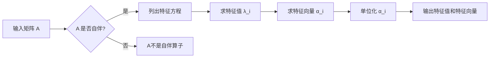

# 线性代数导引：自伴算子

关键词：自伴算子、线性代数、数学模型、算法原理、代码实现

## 1. 背景介绍
### 1.1  问题的由来
在线性代数和泛函分析中,自伴算子是一类非常重要且有趣的线性算子。它们在量子力学、信号处理、图像压缩等领域有着广泛的应用。深入理解自伴算子的性质和应用,对于学习和应用线性代数具有重要意义。
### 1.2  研究现状
目前,国内外学者对自伴算子的理论研究已经比较成熟和完善。许多经典教材如 Hoffman 的 Linear Algebra 都对自伴算子有详细介绍。近年来,随着机器学习和数据科学的发展,自伴算子在主成分分析(PCA)、谱聚类等算法中得到了新的应用。一些学者也提出了计算自伴算子特征值和特征向量的新方法。
### 1.3  研究意义
自伴算子是线性代数中的一个重要概念,深入理解它的性质和应用,可以帮助我们更好地掌握线性代数的理论体系,并将其应用到实际问题中。通过剖析自伴算子,我们可以领会线性代数的抽象之美,体会数学的魅力。同时,自伴算子在计算机科学、物理、工程等领域也有重要应用,学习自伴算子也有助于我们开拓视野,触类旁通。
### 1.4  本文结构
本文将从以下几个方面介绍自伴算子：首先给出自伴算子的定义和基本性质；然后讨论自伴算子的谱理论,并给出谱定理；接着介绍自伴算子的一些重要例子；然后讨论自伴算子的应用；最后总结全文,并展望自伴算子的研究方向。

## 2. 核心概念与联系
自伴算子是线性代数中的核心概念之一,它与线性空间、内积、正交性等概念密切相关。我们先回顾一下这些概念：

- 线性空间：对数域 $\mathbb{F}$ 上的一个非空集合 $V$,若 $V$ 对于加法和数乘运算封闭,且满足一些公理,则称 $V$ 为线性空间（或向量空间）。
- 内积：设 $V$ 是数域 $\mathbb{F}=\mathbb{R}$ 或 $\mathbb{C}$ 上的线性空间,若映射 $\langle \cdot, \cdot \rangle: V \times V \to \mathbb{F}$ 满足一些条件如共轭对称性,则称 $\langle \cdot, \cdot \rangle$ 为 $V$ 上的内积。 
- 正交性：设 $V$ 是内积空间,$ \forall \alpha,\beta \in V$,若 $\langle \alpha,\beta \rangle=0$,则称 $\alpha$ 与 $\beta$ 正交。

有了内积,我们就可以定义自伴算子：

**定义** 设 $V$ 是数域 $\mathbb{F}$ 上的有限维内积空间,$A \in \mathcal{L}(V)$ 是 $V$ 到 $V$ 的线性算子,若 $\forall \alpha,\beta \in V$,有
$$ \langle A\alpha,\beta \rangle = \langle \alpha,A\beta \rangle $$
则称 $A$ 为自伴算子（self-adjoint operator）。

自伴算子有许多良好的性质,如实特征值、特征向量相互正交等。这些性质在谱定理中得到完整刻画。

## 3. 核心算法原理 & 具体操作步骤
### 3.1  算法原理概述
计算自伴算子的特征值和特征向量是线性代数的重要问题。通常采用以下步骤：

1. 列出特征方程 $\det(A-\lambda I)=0$,求出特征值。
2. 对每个特征值 $\lambda_i$,求解方程 $(A-\lambda_i I)\alpha=0$ 得到对应的特征向量。
3. 将特征向量单位化,得到规范正交基。

### 3.2  算法步骤详解
以上算法可以用以下 Mermaid 流程图表示：

具体来说,对于 $n$ 阶实矩阵 $A$,求特征值的步骤为：

1. 列出特征方程 $\det(A-\lambda I_n)=0$。这是一个 $n$ 次多项式方程。
2. 求解该多项式方程,得到 $n$ 个特征值 $\lambda_1,\cdots,\lambda_n$（重根重复计算）。

然后对每个特征值 $\lambda_i$,求对应的特征向量的步骤为：

1. 列出方程 $(A-\lambda_i I_n)\alpha=0$。
2. 求出方程的基础解系 $\eta_1,\cdots,\eta_{d_i}$,这里 $d_i$ 是 $\lambda_i$ 的几何重数。
3. 特征值 $\lambda_i$ 对应的特征向量是基础解系的任意线性组合 $\alpha=c_1\eta_1+\cdots+c_{d_i}\eta_{d_i}$。

最后,我们需要将特征向量单位化,使其构成规范正交基。设 $\alpha_1,\cdots,\alpha_n$ 是上述过程求得的特征向量,单位化的步骤为：

$$\beta_i:=\frac{\alpha_i}{||\alpha_i||},\quad i=1,\cdots,n$$

其中 $||\alpha||=\sqrt{\langle \alpha,\alpha \rangle}$ 表示向量的模。

### 3.3  算法优缺点
上述算法的优点是：

- 计算步骤明确,易于实现。
- 能够完整求出所有特征值和特征向量。

但是该算法也有一些缺点：

- 对于高阶矩阵,列出和求解特征方程的代价比较高。
- 当特征值重数大于1时,算法需要求解基础解系,计算量大。
- 算法对矩阵的特殊结构（如稀疏性）没有利用。

因此,对于大规模矩阵,通常采用一些迭代算法如幂法、QR算法等来计算特征值。

### 3.4  算法应用领域
自伴算子的特征值和特征向量计算在许多领域都有应用,如：

- 量子力学：薛定谔方程的本征值问题就是求自伴算子的特征值和特征函数。
- 图像压缩：基于奇异值分解的图像压缩方法需要计算自伴算子的特征值。
- 主成分分析：PCA的本质是计算协方差矩阵（自伴阵）的特征值和特征向量。
- 谱聚类：将数据集的相似度矩阵视为自伴阵,对其特征值和特征向量进行分析,可以得到数据的聚类结果。

## 4. 数学模型和公式 & 详细讲解 & 举例说明
### 4.1  数学模型构建
自伴算子可以用矩阵语言描述。设 $V$ 是 $n$ 维内积空间,取一组基 $\alpha_1,\cdots,\alpha_n$,则线性算子 $A:V \to V$ 可以用矩阵 $\mathbf{A}=(a_{ij})_{n \times n}$ 表示：

$$A\alpha_j=\sum_{i=1}^n a_{ij}\alpha_i, \quad j=1,\cdots,n$$

若基 $\alpha_1,\cdots,\alpha_n$ 是规范正交基,则 $A$ 是自伴算子当且仅当矩阵 $\mathbf{A}$ 是 Hermite 矩阵,即满足:
$$\mathbf{A}^H=\mathbf{A}$$
其中 $\mathbf{A}^H$ 表示 $\mathbf{A}$ 的共轭转置。

### 4.2  公式推导过程
下面我们推导自伴算子的一些重要性质。

**性质1** 自伴算子的特征值都是实数。

**证明** 设 $\lambda$ 是自伴算子 $A$ 的特征值,$ \alpha $ 是对应的特征向量,则有 
$$A\alpha=\lambda \alpha \quad (1)$$
取共轭转置,得
$$\alpha^H A^H = \overline{\lambda} \alpha^H \quad (2)$$
由于 $A$ 自伴,所以 $A^H=A$,将 (1) 代入 (2) 得
$$\overline{\lambda} \alpha^H \alpha = \lambda \alpha^H \alpha$$
由于 $\alpha \ne 0$,所以 $\alpha^H \alpha \ne 0$,因此 $\overline{\lambda}=\lambda$,即 $\lambda$ 是实数。

**性质2** 自伴算子不同特征值对应的特征向量相互正交。

**证明** 设 $\lambda_1 \ne \lambda_2$ 是 $A$ 的两个特征值,$ \alpha,\beta $ 是对应的特征向量,则有
$$A\alpha=\lambda_1 \alpha, \quad A\beta=\lambda_2 \beta$$
由自伴性,有
$$\langle A\alpha,\beta \rangle = \langle \alpha,A\beta \rangle$$
代入上式,得
$$\lambda_1 \langle \alpha,\beta \rangle = \lambda_2 \langle \alpha,\beta \rangle$$
由于 $\lambda_1 \ne \lambda_2$,因此 $\langle \alpha,\beta \rangle=0$,即 $\alpha,\beta$ 正交。

### 4.3  案例分析与讲解
下面我们以一个具体的矩阵为例,演示如何求自伴算子的特征值和特征向量。

考虑矩阵
$$\mathbf{A}=\begin{pmatrix} 1 & 2 \\ 2 & 3 \end{pmatrix}$$
显然 $\mathbf{A}$ 是实对称矩阵,因此是自伴的。下面求它的特征值和特征向量。

**Step1** 列出特征方程 $\det(\mathbf{A}-\lambda \mathbf{I}_2)=0$,得
$$ \begin{vmatrix} 1-\lambda & 2 \\ 2 & 3-\lambda \end{vmatrix} = (1-\lambda)(3-\lambda)-4 = \lambda^2-4\lambda-1 = 0 $$

**Step2** 解方程 $\lambda^2-4\lambda-1 = 0$,得两个特征值
$$\lambda_1=2+\sqrt{5}, \quad \lambda_2=2-\sqrt{5}$$

**Step3** 对每个特征值 $\lambda_i$,求解方程 $(\mathbf{A}-\lambda_i \mathbf{I}_2)\alpha=0$ 得到对应的特征向量。

当 $\lambda=\lambda_1=2+\sqrt{5}$ 时,方程为
$$\begin{pmatrix} -1-\sqrt{5} & 2 \\ 2 & 1-\sqrt{5} \end{pmatrix} \begin{pmatrix} x \\ y \end{pmatrix} = \begin{pmatrix} 0 \\ 0 \end{pmatrix}$$
解得 $x=-\sqrt{5}y$,取 $y=1$,则特征向量为
$$\alpha_1=\begin{pmatrix} -\sqrt{5} \\ 1 \end{pmatrix}$$

同理,当 $\lambda=\lambda_2=2-\sqrt{5}$ 时,求得特征向量为
$$\alpha_2=\begin{pmatrix} \sqrt{5} \\ 1 \end{pmatrix}$$

**Step4** 将特征向量单位化,得到规范正交基
$$\beta_1=\frac{1}{\sqrt{6}} \begin{pmatrix} -\sqrt{5} \\ 1 \end{pmatrix}, \quad 
\beta_2=\frac{1}{\sqrt{6}} \begin{pmatrix} \sqrt{5} \\ 1 \end{pmatrix}$$

至此,我们求得了矩阵 $\mathbf{A}$ 的全部特征值和特征向量。

### 4.4  常见问题解答
**Q1** 实对称矩阵一定是自伴算子吗?

**A1** 是的。实对称矩阵就是实数域上的自伴算子。自伴算子的定义是 $\langle A\alpha,\beta \rangle = \langle \alpha,A\beta \rangle$,而实对称矩阵 $\mathbf{A}$ 满足 $\mathbf{A}^T=\mathbf{A}$,因此是自伴