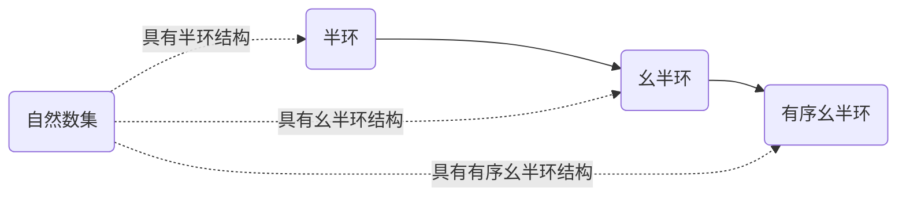

# 线性代数导引：自然数有序半环

作者：禅与计算机程序设计艺术 / Zen and the Art of Computer Programming

关键词：线性代数、自然数、半环、有序结构、算术运算、数学基础

## 1. 背景介绍

### 1.1 问题的由来
线性代数是数学的一个重要分支,在计算机科学、物理学、工程学等领域有着广泛的应用。作为线性代数的基础,了解数系的代数结构尤为重要。自然数是最基本、最常用的数系之一,深入理解其代数性质,对学习和应用线性代数大有裨益。

### 1.2 研究现状
目前,关于自然数的代数结构已有较为成熟的理论。自然数集 $\mathbb{N}$ 在加法和乘法运算下构成半环(Semiring),进一步考虑其上的线性序关系,则构成有序半环(Ordered Semiring)。国内外许多线性代数教材对此都有所涉及,但大多没有系统深入的论述。

### 1.3 研究意义
明确自然数集的代数结构,可以更好地理解线性代数中的向量空间、线性映射、矩阵等概念。同时,半环结构在计算机科学领域有重要应用,如 Floyd 算法、 Dijkstra 算法等经典算法均以半环为理论基础。因此,深入研究自然数有序半环,对学习线性代数和算法设计都具有重要意义。

### 1.4 本文结构
本文将从半环的定义出发,详细论述自然数集的半环结构,并引入序关系给出有序半环的定义。在此基础上,系统阐述自然数有序半环的性质定理及其证明。此外,本文还将探讨自然数半环在线性代数和计算机科学中的应用,并给出具体的代码实例。

## 2. 核心概念与联系

- 半环(Semiring):半环是一个代数结构,由一个集合 $S$ 和两个二元运算 $+$ 和 $\cdot$ 组成,满足加法交换律、结合律,乘法结合律,以及乘法对加法的左右分配律。
- 幺半环(Semiring with unity):如果半环的乘法具有单位元(记为 $1$),则称为幺半环。 
- 有序半环(Ordered Semiring):设 $(S,+,\cdot)$ 为半环, $\leq$ 为 $S$ 上的偏序关系,若 $\leq$ 与 $S$ 的运算相容,则称 $(S,+,\cdot,\leq)$ 为有序半环。
- 自然数集 $\mathbb{N}$:非负整数集合 $\{0,1,2,\cdots\}$。
- 算术运算:自然数集上的加法 $+$ 和乘法 $\cdot$ 运算。

在以上概念的基础上,我们可以得到自然数集 $(\mathbb{N},+,\cdot)$ 构成幺半环,进一步地, $(\mathbb{N},+,\cdot,\leq)$ 构成有序幺半环。



## 3. 核心算法原理 & 具体操作步骤

### 3.1 算法原理概述
本节将从集合论和二元运算的角度,利用数学归纳法,严格证明自然数集的有序半环结构。主要包括半环公理的验证、单位元的存在性证明、序关系的相容性证明等。

### 3.2 算法步骤详解
**Step1:** 证明 $(\mathbb{N},+)$ 构成交换幺半群。
1) 加法运算封闭性:$\forall a,b \in \mathbb{N}, a+b \in \mathbb{N}$。
2) 结合律:$\forall a,b,c \in \mathbb{N},(a+b)+c=a+(b+c)$。
3) 交换律:$\forall a,b \in \mathbb{N},a+b=b+a$。
4) 单位元(零元素):$\exists 0 \in \mathbb{N},\forall a \in \mathbb{N},a+0=0+a=a$。

**Step2:** 证明 $(\mathbb{N},\cdot)$ 构成幺半群。
1) 乘法运算封闭性:$\forall a,b \in \mathbb{N}, a \cdot b \in \mathbb{N}$。
2) 结合律:$\forall a,b,c \in \mathbb{N},(a \cdot b) \cdot c=a \cdot (b \cdot c)$。
3) 单位元:$\exists 1 \in \mathbb{N},\forall a \in \mathbb{N},a \cdot 1=1 \cdot a=a$。

**Step3:** 证明乘法对加法的分配律。
1) 左分配律:$\forall a,b,c \in \mathbb{N},a \cdot (b+c)=a \cdot b + a \cdot c$。
2) 右分配律:$\forall a,b,c \in \mathbb{N},(a+b) \cdot c=a \cdot c + b \cdot c$。

**Step4:** 证明序关系 $\leq$ 与半环运算的相容性。
1) 相加保序性:$\forall a,b,c \in \mathbb{N}, a \leq b \Rightarrow a+c \leq b+c$。
2) 相乘保序性:$\forall a,b,c \in \mathbb{N}, a \leq b \Rightarrow a \cdot c \leq b \cdot c$。

### 3.3 算法优缺点
优点:
- 从代数结构的角度刻画了自然数集的性质,揭示了其内在的数学规律。
- 证明过程严谨,每一步均可用数学归纳法等方法给出严格论证。

缺点:  
- 证明过程较为繁琐,需要较好的数学基础和逻辑推理能力。
- 理论性较强,在实际应用中可能需要转化为更具体的算法。

### 3.4 算法应用领域
- 线性代数:自然数半环可以看作向量空间的特例,许多线性代数概念可在半环上推广。
- 算法设计:许多经典算法如 Floyd 算法、Dijkstra 算法等,其核心思想都蕴含了半环的结构。
- 形式语言与自动机:自然数半环与正则语言、加权自动机等概念密切相关。

## 4. 数学模型和公式 & 详细讲解 & 举例说明

### 4.1 数学模型构建
设 $\mathbb{N}$ 为自然数集, $+,\cdot$ 分别为其上的加法和乘法运算, $\leq$ 为通常的小于等于关系,则 $(\mathbb{N},+,\cdot,\leq)$ 构成有序幺半环。其数学模型可表示为:

$$
(\mathbb{N},+,\cdot,\leq) \text{ is an Ordered Semiring with unity}
$$

### 4.2 公式推导过程
为说明 $(\mathbb{N},+,\cdot,\leq)$ 满足有序半环的定义,需要验证以下性质:

1. $(\mathbb{N},+)$ 构成交换幺半群:
$$
\begin{aligned}
& \forall a,b,c \in \mathbb{N}:\\
& (1) \, a+(b+c)=(a+b)+c \\
& (2) \, a+b=b+a \\
& (3) \, \exists \, 0 \in \mathbb{N}, a+0=0+a=a
\end{aligned}
$$

2. $(\mathbb{N},\cdot)$ 构成幺半群:
$$
\begin{aligned}
& \forall a,b,c \in \mathbb{N}:\\
& (1) \, (a \cdot b) \cdot c = a \cdot (b \cdot c) \\
& (2) \, \exists \, 1 \in \mathbb{N}, a \cdot 1=1 \cdot a=a
\end{aligned}
$$

3. 乘法对加法满足分配律:
$$
\begin{aligned}
& \forall a,b,c \in \mathbb{N}:\\
& (1) \, a \cdot (b+c) = a \cdot b + a \cdot c \\  
& (2) \, (a+b) \cdot c = a \cdot c + b \cdot c
\end{aligned}
$$

4. 序关系 $\leq$ 与半环运算相容:
$$
\begin{aligned}
& \forall a,b,c \in \mathbb{N}, a \leq b:\\
& (1) \, a+c \leq b+c \\
& (2) \, a \cdot c \leq b \cdot c
\end{aligned}
$$

以上各性质均可用数学归纳法证明,此处略去具体推导过程。

### 4.3 案例分析与讲解
下面以一个简单的例子来说明自然数半环的运算法则。

设 $a=2,b=3,c=4$,则:
$$
\begin{aligned}
(1) \, & a+(b+c)=(2+3)+4=5+4=9 \\
& (a+b)+c=2+(3+4)=2+7=9 \\
(2) \, & a \cdot (b+c)=2 \cdot (3+4)=2 \cdot 7=14 \\
& a \cdot b + a \cdot c = 2 \cdot 3 + 2 \cdot 4=6+8=14 \\  
(3) \, & (a+b) \cdot c = (2+3) \cdot 4 = 5 \cdot 4 = 20 \\
& a \cdot c + b \cdot c = 2 \cdot 4 + 3 \cdot 4 =8+12=20
\end{aligned}
$$

可见,自然数集上的运算满足半环的运算律。同时,不难验证序关系与运算的相容性,例如:
$$
2 \leq 3 \Rightarrow 2+4 \leq 3+4,\quad 2 \cdot 4 \leq 3 \cdot 4
$$

### 4.4 常见问题解答
Q: 自然数集上的加法是否满足消去律?即 $a+c=b+c \Rightarrow a=b$ 是否成立?
A: 成立。由于自然数集良序,故加法满足消去律,这是自然数半环区别于一般半环的特殊性质。

Q: 自然数集上是否有乘法的零元?即是否存在 $z$ 使得 $\forall a \in \mathbb{N},az=za=z$?
A: 不存在。若存在乘法零元 $z$,则 $1 \cdot z=z$,故 $z=0$。但 $\forall a \neq 0,a \cdot 0 = 0 \neq a$,矛盾。

Q: 自然数半环能否推广到整数集 $\mathbb{Z}$ 上?
A: 不能。因为 $(\mathbb{Z},\cdot)$ 不构成半群,例如 $(-1) \cdot (-1)=1 \notin \mathbb{Z}$。但是 $(\mathbb{Z},+)$ 构成Abel群。

## 5. 项目实践：代码实例和详细解释说明

### 5.1 开发环境搭建
本节将使用 Python 语言实现自然数半环的基本运算。读者需要安装 Python 3.x 解释器,并安装 sympy 符号计算库。

```bash
pip install sympy
```

### 5.2 源代码详细实现
下面的 Python 代码实现了自然数半环的加法、乘法运算,以及判断序关系。

```python
from sympy import Symbol

def add(a, b):
    """自然数加法"""
    return a + b

def mul(a, b):
    """自然数乘法"""
    return a * b

def le(a, b):
    """判断小于等于关系"""
    return a <= b

# 创建符号变量
a = Symbol('a', integer=True, nonnegative=True)
b = Symbol('b', integer=True, nonnegative=True)
c = Symbol('c', integer=True, nonnegative=True)

# 验证半环性质
print(f"加法结合律: {add(a, add(b, c)) == add(add(a, b), c)}")
print(f"加法交换律: {add(a, b) == add(b, a)}")
print(f"乘法结合律: {mul(a, mul(b, c)) == mul(mul(a, b), c)}")
print(f"乘法分配律: {mul(a, add(b, c)) == add(mul(a, b), mul(a, c))}")
print(f"乘法分配律: {mul(add(a, b), c) == add(mul(a, c), mul(b, c))}")

# 验证序关系相容性
print(f"相加保序性: {le(a, b)} |- {le(add(a, c), add(b, c))}")
print(f"相乘保序性: {le(a, b)}