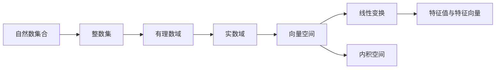

# 线性代数导引：自然数有序集合

作者：禅与计算机程序设计艺术 / Zen and the Art of Computer Programming

## 1. 背景介绍

### 1.1 问题的由来
线性代数是数学的一个重要分支,在科学、工程和计算机科学等领域有广泛的应用。它的基础是向量空间和线性变换,而这些概念都建立在实数域之上。然而,从更基本的角度来看,实数域本身就是建立在自然数集合这个更原始的数学对象之上的。因此,从自然数有序集合出发,逐步构建线性代数的基本概念和理论体系,不仅有助于深入理解线性代数的本质,也能够启发我们思考数学的逻辑结构和认识论基础。

### 1.2 研究现状
目前,大多数线性代数教材都是从向量空间、线性变换等较高层次的概念入手,较少从自然数集合这个更基础的数学对象出发来阐述线性代数的理论体系。虽然从公理化的角度来看,这种做法并无不妥,但对于初学者而言,从更直观、更基本的概念出发,有助于建立线性代数的整体认识框架。近年来,一些学者开始尝试从更基础的数学概念出发来重新审视线性代数,如从自然数集合、群论等角度切入,取得了一些有益的探索。

### 1.3 研究意义  
从自然数有序集合出发来导引线性代数的理论体系,有以下几点重要意义:

1. 有助于理解线性代数的逻辑结构和认识论基础。线性代数是建立在实数域基础上的理论,而实数域又是从自然数集合出发逐步构建起来的。梳理这个逻辑脉络,可以加深对线性代数的整体把握。

2. 为线性代数的教学提供新的思路。目前线性代数的教学大多从抽象的概念入手,对初学者理解上有一定难度。而从更基础、更直观的自然数集合出发,能够为学生提供一个新的学习路径。

3. 为线性代数的应用开辟新的领域。从自然数角度审视线性代数,可以将其应用到一些离散的问题领域,如组合数学、图论、密码学等,拓展了线性代数的应用范围。

### 1.4 本文结构
本文将从自然数有序集合出发,逐步构建线性代数的基本概念和理论体系。全文分为以下几个部分:

1. 自然数集合的基本性质
2. 从自然数集合到整数、有理数和实数
3. 线性空间的构建
4. 线性变换与矩阵
5. 特征值与特征向量
6. 二次型与内积空间
7. 线性代数的应用案例

## 2. 核心概念与联系

要从自然数有序集合出发构建线性代数理论,需要梳理几个核心概念之间的逻辑联系:

- 自然数集合:非负整数的集合,记为N。它是一个良序集,具有归纳性等重要性质。
- 整数集:由自然数集合出发,引入相反数的概念,构成整数集Z。
- 有理数域:在整数集的基础上,引入分数的概念,得到有理数域Q。它是一个域,具有加法和乘法运算。
- 实数域:有理数在序关系意义下不完备,通过德定切割或柯西列等方法可以得到实数域R。它也是一个域,且是一个完备的序域。
- 向量空间:在实数域上,引入向量的概念,通过封闭性公理得到向量空间。它刻画了一类重要的线性结构。
- 线性变换:在向量空间之间定义的映射,保持线性结构。线性变换与矩阵之间有着重要联系。
- 特征值与特征向量:刻画了线性变换的不变子空间,在矩阵对角化等问题中有重要作用。
- 内积空间:在向量空间上引入内积运算,得到内积空间。它是欧式几何的代数刻画。

下图给出了这些概念之间的逻辑联系:

从自然数集合出发,通过逐步扩充数系,引入向量结构和线性变换,最终得到了线性代数的基本概念体系。接下来,我们将沿着这个脉络,具体阐述各个环节的数学细节。

## 3. 核心算法原理 & 具体操作步骤

### 3.1 算法原理概述
从自然数集合出发构建线性代数理论,主要涉及以下几个核心算法和原理:

1. 自然数归纳法:它是自然数集合的重要性质,也是证明和构造的重要工具。
2. 整数和有理数的构造:通过等价类和商集的方式,从自然数集合出发构造整数集和有理数域。
3. 实数完备化:通过德定切割或柯西列等方法,将有理数域完备化为实数域。
4. 向量空间的构造:在实数域上定义向量加法和数量乘法运算,通过封闭性公理构造向量空间。
5. 线性变换与矩阵:将线性变换用矩阵表示,建立线性变换与矩阵之间的对应关系。
6. 特征值与特征向量的计算:求解特征方程,得到特征值和特征向量,刻画线性变换的不变子空间。
7. 施密特正交化:在内积空间中构造规范正交基,将内积空间化为欧式空间。

### 3.2 算法步骤详解
下面以向量空间的构造为例,详细介绍其中的算法步骤:

1. 在实数域R上定义向量加法运算:对任意两个实数向量x=(x1,x2,...,xn)和y=(y1,y2,...,yn),它们的和定义为(x1+y1,x2+y2,...,xn+yn)。
2. 验证向量加法运算满足交换律、结合律、零元、负元等性质,构成Abel群。
3. 在实数域R上定义数量乘法运算:对任意实数a和实数向量x=(x1,x2,...,xn),它们的数量乘法定义为(ax1,ax2,...,axn)。  
4. 验证数量乘法运算满足结合律、分配律、单位元等性质。
5. 验证向量加法和数量乘法运算之间满足相容性,即(a+b)x=ax+bx和a(x+y)=ax+ay。
6. 由此,实数向量集Rn在向量加法和数量乘法运算下构成向量空间,记为V(R)。

类似地,可以在复数域上构造复向量空间,以及在任意域F上构造线性空间。

### 3.3 算法优缺点
从自然数集合出发构建线性代数理论的优点在于:

1. 逻辑严密,概念清晰,能够深入理解线性代数的本质。
2. 有利于学生建立线性代数的整体认识框架,培养数学思维能力。
3. 为线性代数的应用开辟了新的领域,如离散数学、组合数学等。

但这种方法也存在一定局限性:

1. 从自然数集合出发构建线性代数理论需要较多的数学预备知识,对初学者来说有一定难度。
2. 这种方法偏重理论推导,与计算机和工程应用结合不够紧密。
3. 目前相关教材和参考资料较少,学习资源有限。

### 3.4 算法应用领域
从自然数集合出发构建的线性代数理论,在以下领域有重要应用:

1. 组合数学:向量空间的概念可以用于刻画组合结构,如格、拟阵等。
2. 图论:图的邻接矩阵、关联矩阵等蕴含了丰富的代数结构,与向量空间理论密切相关。
3. 密码学:有限域上的线性代数在密码学中有重要应用,如纠错码、椭圆曲线密码等。
4. 量子计算:量子态空间是一个复向量空间,线性代数是量子计算的数学基础。

总之,从自然数集合出发构建线性代数理论,不仅有助于深化对线性代数的理解,也为拓展其应用领域提供了新的视角和可能性。

## 4. 数学模型和公式 & 详细讲解 & 举例说明

### 4.1 数学模型构建
从自然数集合出发构建线性代数理论,需要用到以下几个重要的数学模型:

1. 自然数Peano公理系统:
   - 1是自然数
   - 每个自然数a都有唯一的后继数a+
   - 1不是任何自然数的后继数
   - 不同自然数有不同的后继数
   - (归纳公理)如果集合S满足:(1)1属于S;(2)若a属于S,则a+属于S,那么所有自然数都属于S

2. 整数环(Z,+,·):
   - 加法运算+:Z×Z→Z满足交换律、结合律、零元、负元等性质
   - 乘法运算·:Z×Z→Z满足结合律、分配律、单位元等性质
   - 整数集Z在加法和乘法运算下构成环

3. 有理数域(Q,+,·):
   - 加法运算+:Q×Q→Q满足交换律、结合律、零元、负元等性质
   - 乘法运算·:Q×Q→Q满足结合律、分配律、单位元、乘法逆元等性质  
   - 有理数集Q在加法和乘法运算下构成域

4. 实数完备化:
   - 德定切割定理:如果有理数集合Q的任意一个非空有上界子集都有上确界,则实数集R是完备的
   - 柯西列定理:收敛数列的柯西列等价于实数,由此可定义实数的算术运算

5. 向量空间(V,+,·):
   - 加法运算+:V×V→V满足交换律、结合律、零元、负元等性质
   - 数量乘法运算·:F×V→V满足结合律、分配律、单位元等性质
   - 向量空间V在加法和数量乘法运算下满足相容性,即(a+b)x=ax+bx和a(x+y)=ax+ay

6. 线性变换与矩阵:
   - 线性变换T:V→W是满足T(ax+by)=aT(x)+bT(y)的映射,其中x,y∈V,a,b∈F
   - 线性变换T:Fn→Fm可用m×n阶矩阵A表示,且T(x)=Ax
   - 线性变换的加法、数量乘法、乘法运算对应于矩阵的加法、数量乘法、乘法运算

7. 特征值与特征向量:
   - 对于线性变换T:V→V,如果存在非零向量x∈V和数λ∈F,使得T(x)=λx,则称λ是T的特征值,x是对应于特征值λ的特征向量
   - 特征值λ是特征方程det(λE-A)=0的根,其中A是线性变换T的矩阵,E是单位矩阵
   - 特征向量x是齐次线性方程组(λE-A)x=0的非零解

### 4.2 公式推导过程
下面以求解线性变换T:R2→R2的特征值和特征向量为例,介绍相关公式的推导过程。

设线性变换T的矩阵为A=$\begin{bmatrix} a & b \\ c & d \end{bmatrix}$,则特征方程为:

$$det(λE-A)=\begin{vmatrix} λ-a & -b \\ -c & λ-d \end{vmatrix}=(λ-a)(λ-d)-bc=0$$

解特征方程得到特征值:

$$λ_{1,2}=\frac{(a+d)±\sqrt{(a-d)^2+4bc}}{2}$$

对于特征值λ,求解齐次线性方程组$(λE-A)x=0$,得到对应的特征向量。例如,当$λ=λ_1$时,有:

$$(λ_1E-A)x=\begin{bmatrix} λ_1-a & -b \\ -c & λ_1-d \end{bmatrix}\begin{bmatrix} x_1 \\ x_2 \end{bmatrix